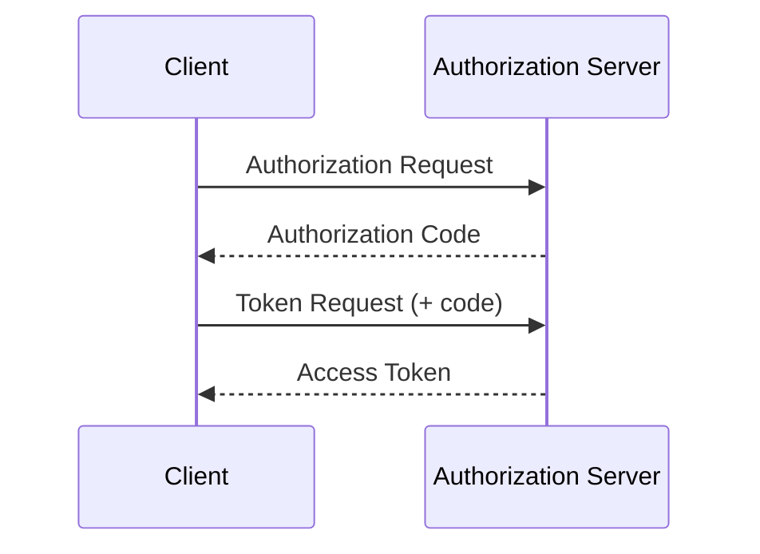

# 執筆スタイルガイド

デジタルアイデンティティ知識ベースの記事執筆に適用するスタイル標準です。

---

## 言語・文体

### 基本方針

- **言語**: 日本語。技術用語・仕様名・RFC番号は英語のまま使用
- **文体**: 「です・ます」調（敬体）で統一
- **視点**: 実装者・セキュリティエンジニアの視点。単なる仕様要約ではなく、実践的な示唆・批評・分析を含める

### 良い例

> OAuth 2.0 の Authorization Code フローでは、クライアントがアクセストークンを直接受け取らず、認可コードを経由します。これにより、フロントチャネル（ブラウザのリダイレクト）でトークンが漏洩するリスクを排除できます。

### 避けるべき例

> OAuth 2.0 は認可のためのフレームワークです。認可サーバーがアクセストークンを発行します。

---

## 技術用語の表記

### 英語表記を維持するもの（カタカナに変換しない）

| 用語 | 表記 |
| ---- | ---- |
| OAuth | OAuth（オーオースと読まない） |
| OpenID Connect | OpenID Connect |
| JWT | JWT（ジェイダブリュティー） |
| JSON | JSON |
| WebAuthn | WebAuthn |
| Passkey | Passkey（パスキーでも可） |
| Verifiable Credential | Verifiable Credential（VC） |
| Decentralized Identifier | Decentralized Identifier（DID） |
| Zero Knowledge Proof | Zero Knowledge Proof（ZKP） |

### 日本語訳が確立しているもの

| 英語 | 日本語 |
| ---- | ------ |
| Digital Identity | デジタルアイデンティティ |
| Authentication | 認証 |
| Authorization | 認可 |
| Access Token | アクセストークン |
| Refresh Token | リフレッシュトークン |
| Authorization Server | 認可サーバー |
| Resource Server | リソースサーバー |
| Client | クライアント |
| Issuer | 発行者（文脈によっては Issuer のまま） |
| Holder | 保有者（文脈によっては Holder のまま） |
| Verifier | 検証者（文脈によっては Verifier のまま） |

---

## 構造・フォーマット

### 見出し

- `#` (h1): ページタイトルのみ
- `##` (h2): 大セクション（概要・背景・技術詳細など）
- `###` (h3): サブセクション
- `####` (h4): 使用を最小限に

### コード例

コードブロックには必ず言語を指定:

````markdown
```json
{
  "access_token": "...",
  "token_type": "Bearer"
}
```
````

### 図・シーケンス

Mermaid を使ったシーケンス図を積極活用:

````markdown

````

### テーブル

比較・一覧にはテーブルを使う:

```markdown
| 項目 | 説明 |
| ---- | ---- |
| 発行者 | トークンを生成するエンティティ |
```

---

## 一次情報の引用

### 必須ルール

すべての技術的主張には一次ソースへのリンクを付ける。

```markdown
RFC 6749 では、認可コードフローのレスポンスに `state` パラメーターを含めることが推奨されています ([RFC 6749 Section 10.12](https://www.rfc-editor.org/rfc/rfc6749#section-10.12))。
```

### 良質な一次情報ソース

| 組織 | URL パターン |
| ---- | ------------ |
| IETF RFC | `https://www.rfc-editor.org/rfc/rfcXXXX` |
| IETF Internet-Draft | `https://datatracker.ietf.org/doc/` |
| OpenID Foundation Specs | `https://openid.net/specs/` |
| W3C Recommendations | `https://www.w3.org/TR/` |
| FIDO Alliance | `https://fidoalliance.org/specifications/` |
| NIST SP | `https://csrc.nist.gov/publications/detail/sp/` |
| ISO (free previews) | `https://www.iso.org/standard/` |

---

## AI 免責表示

すべての記事冒頭に以下の Note を入れる:

```markdown
> **Note:** このページはAIエージェントが執筆しています。内容の正確性は一次情報（仕様書・公式資料）とあわせてご確認ください。
```

---

## 長さの目安

| コンテンツ種別 | 目安 |
| -------------- | ---- |
| Spec 記事 | 3,000〜8,000字 |
| Article（分析・考察） | 1,500〜4,000字 |
| Article（短報・ニュース反応） | 800〜1,500字 |

---

## 禁止事項

- **憶測の断定**: 「〜と思われる」「おそらく〜」を事実として書かない
- **出典なし主張**: 一次情報リンクなしの技術的主張
- **古い情報の無断引用**: 仕様バージョンを確認せず引用しない（廃止・更新済みは明記）
- **他サイトの無断複製**: ブログ等からのコピーは不可。一次情報（仕様書）からのみ引用
- **英語記事の単純翻訳**: 翻訳ではなく、批評・分析を加えた独自コンテンツであること

---

## 更新履歴

このガイドは `/work` 実行時に改善点があれば随時更新してください。
