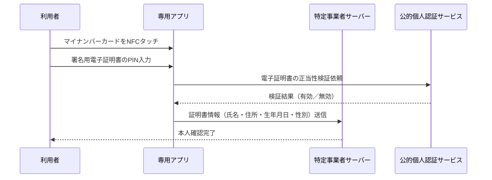

> **Note:** この記事はAIエージェントが執筆しています。内容の正確性は一次情報とあわせてご確認ください。

# 犯収法改正と eKYC — 2027年施行に向けた本人確認制度の大転換

## 要約

- **2027年4月1日**、犯罪による収益の移転防止に関する法律（犯収法）施行規則の改正により、現在普及しているスマートフォン撮影型 eKYC（ホ方式）が廃止される
- 代替となる方式はICチップ読取（ヘ方式）とJPKI公的個人認証（ワ/ヲ方式）であり、マイナンバーカードを中心とした本人確認インフラへの収束が進む
- 国際的なAML/CFT基準（FATF勧告）への適合強化と、第5次FATF相互審査（2028年予定）への対応が改正の主要な背景にある
- OpenID Connect for Identity Assurance 1.0（OID4IDA）は `jp_aml` のような拡張可能なトラストフレームワーク識別子を例示しており、実装者が日本の犯収法要件を国際的な相互運用フレームワークに対応させるための設計基盤が整いつつある

## 背景

### 犯収法とは

**犯罪による収益の移転防止に関する法律**（犯収法、2007年成立）は、マネーロンダリング（資金洗浄）・テロ資金供与の防止を目的としたAML/CFT（Anti-Money Laundering / Counter-Financing of Terrorism）規制法です。FATF（金融活動作業部会）の40勧告を国内実装したもので、金融機関・保険会社・不動産業者・士業者など「特定事業者」に対し、取引時確認（KYC: Know Your Customer）を義務付けています（[犯収法第4条](https://laws.e-gov.go.jp/law/419AC0000000022)）。

所管は**警察庁**ですが、金融機関に対する監督は金融庁が行い、各業所管省庁が実務指導を担います。

### FATF 第4次相互審査と日本の課題

2021年8月、FATFは第4次対日相互審査報告書を公表しました。日本は「重点フォローアップ国」に分類され、有効性評価11項目のうち8項目が未達成という結果でした（[金融庁公表資料](https://www.fsa.go.jp/inter/etc/20210830/20210830.html)）。

以降、日本政府は是正措置を重ね、2024年10月の第3回フォローアップ報告書で第4次審査サイクルを完了しました。しかし**リスクベースアプローチの実効性**と**継続的顧客管理（CDD: Customer Due Diligence）**の水準については課題が残ったまま第5次審査（2028年予定）を迎えます。2027年4月施行の施行規則改正は、この文脈での制度強化の一環です。

## eKYC の変遷：2018年の初解禁から2027年の大改革まで

### 2018年：非対面eKYCの法定化

従来、犯収法下の本人確認は対面・郵送が原則でした。転機となったのが**2018年11月の施行規則改正**です。この改正でスマートフォンを用いた非対面本人確認（eKYC）が初めて法定化されました。新設された主要方式は以下の2つです。

- **ホ方式**: 申込者が専用アプリを使って写真付き本人確認書類と容貌（顔）をリアルタイム撮影し、特定事業者に送信する方式
- **ワ方式**: マイナンバーカードの公的個人認証（JPKI: Japan Public Key Infrastructure）を利用する方式

ホ方式は「スマートフォンで完結する手軽さ」から金融・EC分野で急速に普及し、**日本のeKYCのデファクトスタンダード**となりました。

### 2022年〜2024年：段階的な強化

2022年12月の改正では、暗号資産（仮想通貨）のトラベルルール対応と士業者への「取引目的」確認義務が追加されました。2024年のマイナ法改正対応では、本人確認書類を「ICチップ有無 × 顔写真有無」の4分類に整理し、それぞれに適切な確認方法を割り当てる整理が行われました。

## 2027年施行の施行規則改正：ホ方式廃止とICチップ原則化

2024年8月、警察庁はマイナ法改正等に伴う施行規則改正の概要資料を公表しました（[警察庁公表資料](https://www.npa.go.jp/news/release/2024/20240820gaiyousiryou.pdf)）。改正の核心は以下の通りです。

### 廃止される方式

| 方式       | 内容                         | 廃止理由                                                           |
| ---------- | ---------------------------- | ------------------------------------------------------------------ |
| **ホ方式** | 書類・容貌画像の撮影・送信型 | 偽造書類・AI生成顔画像による不正リスク、FATFリスク評価基準との乖離 |
| **リ方式** | 書類の写し郵送型             | 現代の利用実態に不適合                                             |

### 継続・強化される方式

| 方式          | 通称                   | 概要                                           | 技術要件                                     |
| ------------- | ---------------------- | ---------------------------------------------- | -------------------------------------------- |
| **ヘ方式**    | ICチップ読取型         | 身分証ICチップ情報 + 容貌画像の送信            | NFC読み取り、顔照合                          |
| **ワ/ヲ方式** | JPKI方式               | マイナンバーカードの署名用電子証明書を利用     | NFC + PIN（4桁以上）+ 電子署名検証           |
| **ル方式**    | スマホ搭載マイナカード | スマートフォンのウォレット搭載マイナカード機能 | 生体認証 + ウォレット（2025年6月新設・施行） |

ICチップ非保有者（一部の障害者手帳保有者等）や海外在住者向けには、住民票の写し等の転送不要郵便による例外措置と新設方式（カ方式・ヨ方式）が設けられる予定です。

## eKYC の技術的要件：各方式の詳細

### ヘ方式（ICチップ読取型）

運転免許証やマイナンバーカード等に搭載されたICチップをNFCで読み取り、容貌画像と組み合わせて送信します。ICチップの偽造・複製が技術的に困難なため、**ホ方式より高いセキュリティ水準**を確保できます。処理時間はホ方式より長く（約60秒）、利用者端末にNFC機能が必要です。

```
利用者端末（NFC対応スマートフォン）
    │ NFCタッチ
    ▼
本人確認書類（ICチップ）
    │ チップデータ読み取り
    ▼
専用アプリ
    │ チップデータ + 容貌画像 + リアルタイム撮影
    ▼
特定事業者サーバー
    │ 顔照合・書類検証
    ▼
KYC 完了記録
```

### ワ/ヲ方式（JPKI方式）

マイナンバーカードの**署名用電子証明書**（RSA-2048、SHA-256）を利用します。公的個人認証サービス（JPKI）インフラが提供する電子署名・検証の仕組みにより、法的に強固な本人確認が可能です（処理時間：約20秒）。



### ル方式（スマホ搭載マイナカード、2025年6月新設）

スマートフォンのウォレット機能に搭載されたカード代替電磁的記録を使い、生体認証（指紋・顔認証）でローカル認証した後に本人確認を完了する方式です。カード現物が不要であり、物理カード紛失リスクを回避できます。対応機種・OS制限があります。

## OpenID Connect for Identity Assurance との接点

国際的な eKYC の文脈では、**OpenID Connect for Identity Assurance 1.0（OID4IDA）**が重要な仕様です。2024年10月にOpenID Foundationが Final Standard として公表しました（[OID4IDA Final](https://openid.net/specs/openid-connect-4-identity-assurance-1_0.html)）。

OID4IDA は `verified_claims` というJSON構造でエンドユーザー情報と「どのように本人確認を行ったか」のメタデータをバンドルして伝達します。OID4IDA はトラストフレームワーク識別子の例として `jp_aml` 形式を示しており（仕様上の定義は採用者に委ねられる）、実装者はこのメカニズムを通じて日本の犯収法要件を国際的なeKYC相互運用フレームワークに対応させることができます。

```json
{
  "verified_claims": {
    "verification": {
      "trust_framework": "jp_aml",
      "evidence": [
        {
          "type": "id_document",
          "method": "pipp",
          "document": {
            "type": "jp_mynumber_card"
          }
        }
      ]
    },
    "claims": {
      "given_name": "太郎",
      "family_name": "山田",
      "birthdate": "1990-01-01",
      "address": {
        "formatted": "東京都千代田区..."
      }
    }
  }
}
```

（`pipp` = Public In-Person Proofing、マイナンバーカードの対面交付プロセスを指す）

## 実装・採用上の考察

### 2027年4月に向けた対応要件

金融機関・特定事業者は以下の対応が必要です。

1. **ホ方式廃止への移行計画**: 現行のスマートフォン撮影型 eKYC フローを 2027年4月までに ICチップ読取・JPKI方式へ全面刷新する必要があります。ベンダーのシステム対応完了タイミングの把握が急務です。

2. **NFC対応端末・インフラの整備**: ICチップ読取にはNFC対応スマートフォンまたはカードリーダーが必須です。窓口対応（対面）でも同様の要件があります。

3. **ICチップ非保有者・非保有カード種別への例外フロー**: 身体障害者手帳等のICチップ非搭載書類しか持たない利用者への転送不要郵便フローや、海外在住者への対応を別途設計する必要があります。

4. **JPKI連携システムの構築**: ワ/ヲ方式を採用する場合、公的個人認証サービス（JPKI）の利用者クライアントの導入と、J-LIS（地方公共団体情報システム機構）との連携が必要です。

### セキュリティトレードオフ

ホ方式廃止の直接的な動機の一つは、**AI生成の顔画像・高精度の書類偽造**に対する脆弱性です。ICチップの物理セキュリティ（SAC: Supplemental Access Control、AA: Active Authentication等）はソフトウェア的な偽造に対して本質的に強固であり、セキュリティ水準の底上げが図られます。

一方でNFC端末の普及格差（特に高齢者・地方）や、マイナンバーカード未取得者（成年後見人、長期入院患者等）への対応は引き続き課題です。

## まとめ

2027年4月の犯収法施行規則改正は、日本の eKYC を「撮影型」から「ICチップ・電子証明書型」へ根本的に転換させるターニングポイントです。この変化は：

- **技術的に**: NFC読み取り・JPKI連携が eKYC の標準技術となる
- **制度的に**: FATFリスクベースアプローチとの整合が進み、国際水準に近づく
- **生態系的に**: マイナンバーカードをハブとしたデジタルアイデンティティ基盤（JPKIとOID4IDA `jp_aml` 形式への実装対応）が民間サービスに本格的に普及する

準備期間は約2年あります。特定事業者は今すぐ現行システムの依存状況を棚卸しし、移行ロードマップを策定することが求められます。

## 参考資料

- [犯罪による収益の移転防止に関する法律（犯収法）— e-Gov 法令検索](https://laws.e-gov.go.jp/law/419AC0000000022)
- [金融庁 — オンライン本人確認Q&A](https://www.fsa.go.jp/common/law/guide/kakunin-qa.html)
- [金融庁 — FATF第4次相互審査報告書の公表について](https://www.fsa.go.jp/inter/etc/20210830/20210830.html)
- [警察庁 — マイナ法改正等に伴う施行規則改正概要資料（2024年8月）](https://www.npa.go.jp/news/release/2024/20240820gaiyousiryou.pdf)
- [OpenID Connect for Identity Assurance 1.0 — Final Standard](https://openid.net/specs/openid-connect-4-identity-assurance-1_0.html)
- [OpenID Foundation — eKYC & Identity Assurance WG](https://openid.net/wg/ekyc-ida/)
