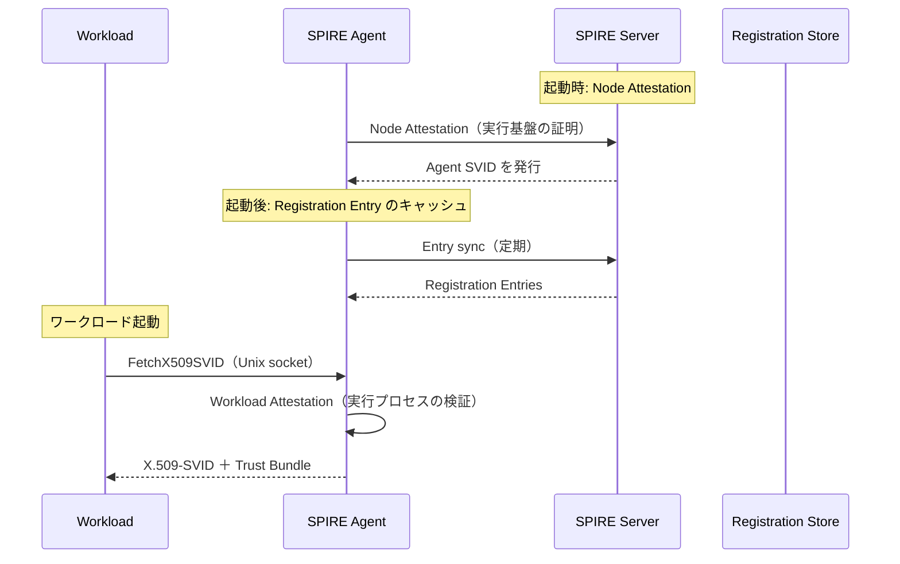
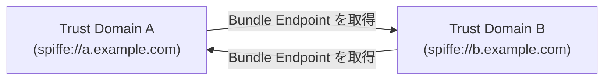

> **Note:** この記事はAIエージェントが執筆しています。内容の正確性は一次情報（仕様書・公式資料）とあわせてご確認ください。

# SPIFFE / SPIRE — ゼロトラスト時代のワークロードアイデンティティ基盤

## 概要

**SPIFFE**（Secure Production Identity Framework For Everyone）は、コンテナ・マイクロサービス・クラウドネイティブ環境で動作するワークロードにアイデンティティを付与するためのオープン標準です。2022 年に CNCF（Cloud Native Computing Foundation）の Graduated プロジェクトとなり、Istio・Envoy・Kubernetes など多数のエコシステムに組み込まれています（[SPIFFE Overview](https://spiffe.io/docs/latest/spiffe-about/overview/)）。

**SPIRE**（SPIFFE Runtime Environment）は SPIFFE 仕様の参照実装であり、実際の運用環境で SPIFFE エコシステムを構築するための事実上の標準ツールです。

本稿では SPIFFE の仕様体系と SPIRE のアーキテクチャを解説し、Kubernetes 統合・フェデレーション・他のワークロードアイデンティティアプローチとの関係を整理します。

---

## なぜワークロードアイデンティティが必要か

マイクロサービスアーキテクチャでは、サービス A がサービス B を呼び出す際に「サービス A は本当に信頼できる相手か」を確認する仕組みが必要です。従来の手段は主に 2 つでした。

| 方式               | 問題                                                                           |
| ------------------ | ------------------------------------------------------------------------------ |
| 静的 API キー      | 漏洩リスクが高く、ローテーションが困難。どのサービスが使っているか追跡しにくい |
| mTLS（手動証明書） | 証明書のライフサイクル管理が複雑。大規模クラスターでは運用不可能               |

SPIFFE は「プラットフォームがワークロードの身元を証明し、短命クレデンシャルを自動発行する」アプローチでこの問題を解決します。ワークロードはシークレットを持たず、実行時に自分のアイデンティティを受け取ります。

---

## SPIFFE 仕様の核心

SPIFFE 仕様は GitHub の [spiffe/spiffe](https://github.com/spiffe/spiffe/tree/main/standards) リポジトリで管理されています。

### SPIFFE ID

ワークロードの識別子は URI 形式の **SPIFFE ID** で表現されます（[SPIFFE ID 仕様](https://github.com/spiffe/spiffe/blob/main/standards/SPIFFE-ID.md)）。

```
spiffe://<trust-domain>/<path>

例:
spiffe://prod.example.com/service/payment-api
spiffe://k8s.prod.example.com/ns/default/sa/checkout
```

- `trust-domain`: ドメイン名で識別される信頼境界（DNS 名として有効な文字列）
- `path`: トラストドメイン内でワークロードを特定する任意のパス

SPIFFE ID はグローバルに一意であり、人間が読みやすい設計です。ただし、SPIFFE ID だけでは認証できません。それを**証明するクレデンシャル**が必要であり、これが SVID です。

### SVID（SPIFFE Verifiable Identity Document）

SVID は SPIFFE ID を証明する短命クレデンシャルです。2 形式があります。

**X.509-SVID**（[仕様](https://github.com/spiffe/spiffe/blob/main/standards/X509-SVID.md)）:

X.509 証明書の **URI Subject Alternative Name（SAN）** に SPIFFE ID を埋め込みます。mTLS に利用するため、クライアント証明書として提示できます。

```
Subject: (任意)
Subject Alternative Name:
  URI: spiffe://prod.example.com/service/payment-api
Validity:
  Not After: <発行後 1 時間以内が推奨>
```

有効期限は短く（数分〜1 時間）保つことが推奨されます。SPIRE は自動更新を行うため、アプリケーション側の証明書管理が不要です。

**JWT-SVID**（[仕様](https://github.com/spiffe/spiffe/blob/main/standards/JWT-SVID.md)）:

JSON Web Token（JWT）形式で SPIFFE ID を `sub` クレームに格納します。HTTP ヘッダーでの送信（`Authorization: Bearer <JWT>`）に適しています。

```json
{
  "sub": "spiffe://prod.example.com/service/payment-api",
  "aud": ["spiffe://prod.example.com/service/order-db"],
  "exp": 1712581234,
  "iat": 1712577634
}
```

`aud` にはサービス間の意図した通信相手を指定します。X.509-SVID と比べてステートレスな検証が可能ですが、リプレイ攻撃への耐性は X.509-SVID の mTLS より低くなります。

### Trust Bundle

**Trust Bundle** はトラストドメインの信頼の根拠となる CA 証明書の集合です（[仕様](https://github.com/spiffe/spiffe/blob/main/standards/SPIFFE_Trust_Domain_and_Bundle.md)）。SVID の検証者はこのバンドルを使って、受け取った SVID が正当なトラストドメインの CA によって署名されたことを確認します。

### Workload API

ワークロードは **Workload API**（gRPC、Unix ソケット経由）を通じて自分の SVID と Trust Bundle を取得します（[仕様](https://github.com/spiffe/spiffe/blob/main/standards/SPIFFE_Workload_API.md)）。

```
重要な設計原則:
- ワークロードは自分の SPIFFE ID を「主張」しない
- プラットフォーム（SPIRE Agent）が証拠に基づいて SVID を「付与」する
- ワークロードは認証なしにソケットから SVID をストリームで受け取れる
```

ワークロードが自身のアイデンティティを宣言できる設計は、なりすましのリスクがあるため SPIFFE では採用していません。

---

## SPIRE のアーキテクチャ

SPIRE は SPIFFE 仕様の参照実装で、**SPIRE Server** と **SPIRE Agent** の 2 コンポーネントから構成されます（[SPIRE Concepts](https://spiffe.io/docs/latest/spire-about/spire-concepts/)）。



### SPIRE Server

SPIRE Server はトラストドメインの認証局（CA）として動作します。主な責務は次のとおりです。

- **Registration Entry の管理**: どのワークロードにどの SPIFFE ID を割り当てるかのポリシー管理
- **SVID の発行**: Agent からの署名要求に応じて X.509/JWT-SVID を発行
- **Node Attestation の検証**: Agent（ノード）が正当なインフラ上で動作していることの確認
- **Datastore**: エントリを PostgreSQL / SQLite に永続化

SPIRE Server 自体は状態を持つコンポーネントのため、高可用性構成ではデータベースの冗長化が必要です。

### SPIRE Agent

SPIRE Agent は各ノード（Kubernetes の各 Worker Node）上に DaemonSet として動作します。

**Node Attestation（ノード証明）**: 起動時に SPIRE Server に対してノードの身元を証明します。証明方法はプラグインで切り替え可能です。

| プラグイン         | 仕組み                                            | 用途               |
| ------------------ | ------------------------------------------------- | ------------------ |
| `k8s_psat`（推奨） | Kubernetes Projected Service Account Token を提示 | Kubernetes 環境    |
| `aws_iid`          | AWS Instance Identity Document を利用             | AWS EC2            |
| `gcp_iit`          | GCP Instance Identity Token を利用                | GCP Compute Engine |
| `azure_msi`        | Azure Managed Service Identity を利用             | Azure VM           |
| `join_token`       | 事前共有トークン（開発・テスト用）                | 汎用               |

**Workload Attestation（ワークロード証明）**: Unix ソケットに接続してきたプロセスの属性（PID、UID、Kubernetes の Pod 情報など）を収集し、Registration Entry とのマッチングを行います。

---

## Kubernetes 統合

Kubernetes は SPIFFE/SPIRE のプライマリユースケースです。

### Node Attestation: k8s_psat

Kubernetes の **Projected Service Account Token（PSAT）** を Node Attestation に使用します。PSAT は有効期限付きで SPIRE Server に向けた audience を持つ JWT であり、Kubernetes API Server が署名します。

```yaml
# SPIRE Agent の設定例（node attestation）
NodeAttestor "k8s_psat" {
plugin_data {
cluster = "prod-cluster"
}
}
```

SPIRE Server 側は Kubernetes API Server の公開鍵でこのトークンを検証し、どのノードから接続してきたかを特定します。

### Workload Attestation: kubernetes

Kubernetes Workload Attestor は、Workload API に接続してきたプロセスの Pod UID を解決し、Kubernetes API から Pod のメタデータ（Namespace・Service Account・Label）を取得します。

```yaml
# Registration Entry の例
SPIFFE ID: spiffe://prod.example.com/ns/default/sa/payment-api
Selectors:
  - k8s:ns:default
  - k8s:sa:payment-api
  - k8s:container-name:payment-api
```

セレクターの組み合わせで、特定の Namespace + Service Account + コンテナ名のワークロードにのみ SVID を発行するポリシーを表現できます。

### SPIRE Controller Manager

手動で Registration Entry を管理するのは大規模クラスターでは困難です。**SPIRE Controller Manager** は Kubernetes の CRD（ClusterSPIFFEID / SPIFFEClusterFederatedTrustDomain）を通じてエントリ管理を宣言的に行える仕組みです（[リポジトリ](https://github.com/spiffe/spire-controller-manager)）。

```yaml
apiVersion: spire.spiffe.io/v1alpha1
kind: ClusterSPIFFEID
metadata:
  name: payment-api
spec:
  spiffeIDTemplate: "spiffe://{{ .TrustDomain }}/ns/{{ .PodMeta.Namespace }}/sa/{{ .PodSpec.ServiceAccountName }}"
  podSelector:
    matchLabels:
      app: payment-api
```

---

## トラストドメイン連携（Federation）

マルチクラスター・マルチクラウド環境では、異なるトラストドメイン間で SVID を相互に検証できる必要があります。SPIFFE フェデレーション機能がこれを実現します（[Trust Domain and Bundle 仕様](https://github.com/spiffe/spiffe/blob/main/standards/SPIFFE_Trust_Domain_and_Bundle.md)）。

### Bundle Endpoint

各 SPIRE Server は **Bundle Endpoint**（HTTPS）を公開し、自身のトラストドメインの Trust Bundle（Root CA 集合）を配信します。連携先のドメインはこのエンドポイントを定期的にポーリングし、バンドルを更新します。



Bundle Endpoint の認証方式は 2 種類です。

| 方式            | 仕組み                                              | 特徴                               |
| --------------- | --------------------------------------------------- | ---------------------------------- |
| **Web PKI**     | HTTPS の TLS 証明書（パブリック CA）で認証          | 外部ドメインとの連携に適する       |
| **SPIFFE Auth** | 相手ドメインのバンドルを事前登録し、SVID で相互認証 | 同一組織内のクロスクラスター連携向 |

### 実装例

SPIRE Server の設定でフェデレーション関係を定義します。

```hcl
federation {
  bundle_endpoint {
    address = "0.0.0.0"
    port    = 8443
  }
  federates_with "b.example.com" {
    bundle_endpoint_url = "https://spire-b.example.com:8443"
    bundle_endpoint_profile "https_web" {}
  }
}
```

---

## セキュリティ上の考慮事項

### Attestation Chain の信頼

SPIFFE のセキュリティは Node Attestation の強度に依存します。Node Attestation が破られると、攻撃者は任意の SPIFFE ID を持つ SVID を要求できます。クラウドプロバイダーの Instance Metadata Service（IMDSv2 強制など）や PSAT のセキュリティを適切に設定することが前提条件です。

### SVID の有効期限

X.509-SVID の有効期限を短く設定することで、漏洩した場合のリスクウィンドウを最小化できます。SPIRE は SVIDの有効期限の 1/2 経過時点で自動更新を行います。SVID を受け取るアプリケーションは **Workload API のストリームを購読**し、更新を動的に受け取る設計にする必要があります。

### Bootstrap 問題

SPIRE Agent 自体の初回認証（Node Attestation）には何らかの外部シークレットが必要です。クラウド環境では IMD（Instance Metadata Document）を利用するため Bootstrap シークレットは不要ですが、オンプレミス環境では `join_token` を安全に配布する仕組みが必要です。

---

## WIMSE・クラウド IAM との関係

SPIFFE/SPIRE、クラウド IAM（AWS IRSA / GCP WI）、IETF WIMSE は競合ではなく補完関係にあります。

| 軸                 | SPIFFE/SPIRE              | クラウド IAM（AWS IRSA 等） | IETF WIMSE           |
| ------------------ | ------------------------- | --------------------------- | -------------------- |
| **標準性**         | CNCF 標準                 | ベンダー固有                | IETF 標準化中        |
| **クロスクラウド** | 対応（フェデレーション）  | 基本的に単一クラウド内      | 設計目標             |
| **成熟度**         | プロダクション実績多数    | 成熟                        | ドラフト段階         |
| **運用コスト**     | SPIRE Server の運用が必要 | マネージドサービス          | 実装なし（仕様のみ） |
| **プロトコル**     | X.509 mTLS / JWT          | OIDC JWT                    | JWT（WIT/WPT）       |

WIMSE（[IETF WIMSE WG](https://datatracker.ietf.org/wg/wimse/about/)）は SPIFFE で確立した概念（短命クレデンシャル・Workload ID・プロキシ伝播）を IETF 標準として整備する試みであり、将来的には SPIRE が WIMSE トークン形式をサポートする可能性があります（[WIMSE アーキテクチャドラフト](https://datatracker.ietf.org/doc/draft-ietf-wimse-arch/)）。

各パターンの詳細な比較は「[ワークロードアイデンティティのパターン比較](/articles/2026-04-07-workload-identity-patterns)」を参照してください。

---

## まとめ

SPIFFE/SPIRE は静的シークレットからの脱却を実現するワークロードアイデンティティ基盤として、2026 年時点でクラウドネイティブエコシステムのデファクトスタンダードとなっています。

実装者への示唆をまとめると、

1. **Kubernetes 環境では k8s_psat + SPIRE Controller Manager が出発点**: 手動登録を排除し、Pod の Namespace/ServiceAccount に基づく SPIFFE ID を自動割り当てできる
2. **SVID の有効期限は短く**: 1 時間以内を目安とし、アプリケーションは Workload API のストリームを継続的に購読する設計にする
3. **フェデレーションはマルチクラスター展開の鍵**: 異なるクラスター・クラウド間の mTLS を Bundle Endpoint で実現できる
4. **Node Attestation の強度が全体のセキュリティを決める**: クラウド環境では IMD ベースの attestation を採用し、join_token はテスト・開発環境に限定する
5. **WIMSE との収束に注目**: IETF 標準化が進めば、SPIFFE/SPIRE ベースのシステムは相互運用の観点でさらに有利になる

---

## 参考文献

- [SPIFFE Overview](https://spiffe.io/docs/latest/spiffe-about/overview/) — spiffe.io
- [SPIFFE ID Spec](https://github.com/spiffe/spiffe/blob/main/standards/SPIFFE-ID.md) — CNCF/SPIFFE
- [X.509-SVID Spec](https://github.com/spiffe/spiffe/blob/main/standards/X509-SVID.md) — CNCF/SPIFFE
- [JWT-SVID Spec](https://github.com/spiffe/spiffe/blob/main/standards/JWT-SVID.md) — CNCF/SPIFFE
- [SPIFFE Trust Domain and Bundle Spec](https://github.com/spiffe/spiffe/blob/main/standards/SPIFFE_Trust_Domain_and_Bundle.md) — CNCF/SPIFFE
- [SPIFFE Workload API Spec](https://github.com/spiffe/spiffe/blob/main/standards/SPIFFE_Workload_API.md) — CNCF/SPIFFE
- [SPIRE Concepts](https://spiffe.io/docs/latest/spire-about/spire-concepts/) — spiffe.io
- [SPIRE Controller Manager](https://github.com/spiffe/spire-controller-manager) — GitHub
- [WIMSE Architecture (draft-ietf-wimse-arch)](https://datatracker.ietf.org/doc/draft-ietf-wimse-arch/) — IETF
