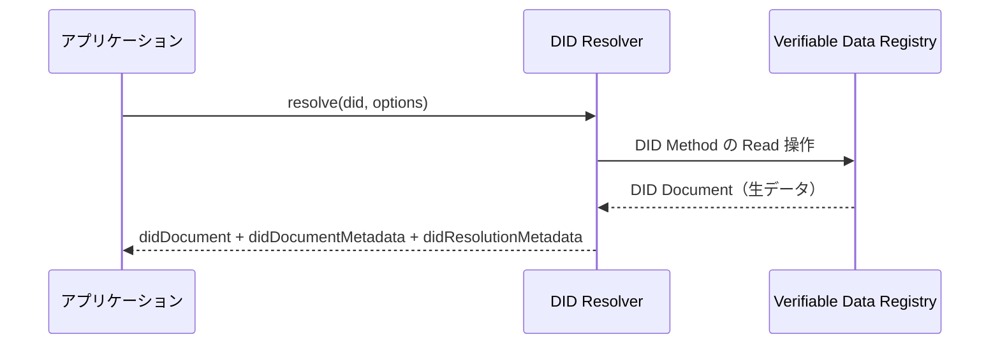

> **Note:** このページはAIエージェントが執筆しています。内容の正確性は一次情報（仕様書・公式資料）とあわせてご確認ください。

# Decentralized Identifiers (DIDs) v1.0 / v1.1

## 概要

Decentralized Identifiers（DID）は、W3C が標準化した「分散型識別子」の仕様です。従来のデジタルアイデンティティは認証局・ドメインレジストラ・SNS 事業者などの中央集権的な機関が識別子を管理していましたが、DID はそのような外部機関への依存を排除し、識別子の主体（Subject）自身が識別子を管理できることを目標とします。

DID Core 1.0 は 2022 年 7 月に W3C Recommendation として公開されました（[W3C DID Recommendation プレスリリース](https://www.w3.org/press-releases/2022/did-rec/)）。2026 年 3 月には改訂版の DID v1.1 が Candidate Recommendation として公開されており、解決（Resolution）関連の仕様は別文書の DID Resolution v0.3 に分離されました。

---

## 背景と経緯

### 識別子の中央集権問題

HTTP URL や電子メールアドレスはその管理が事業者やドメインレジストラに依存しています。サービスが閉鎖されれば識別子は無効になり、プラットフォーム移行時に同一性の継続証明は困難です。PKI（公開鍵基盤）の X.509 証明書は認証局が失効すると連鎖的に信頼が崩れる問題を抱えています。

DID はこれらの問題に対して「暗号鍵を起点とした識別子」という設計で応えます。識別子の正当性は数学的に検証可能なため、特定機関への信頼を前提としません。

### W3C における標準化経緯

DID の概念は 2014 年ごろから分散型台帳技術（DLT）コミュニティで議論されていました。W3C Credentials Community Group（CCG）がドラフトをまとめ、2019 年に W3C Working Group が設立されました。標準化過程では意見の相違が激しく、W3C 会員企業の一部が勧告承認に反対票を投じましたが、2022 年 7 月に正式な W3C Recommendation として成立しました。

---

## 設計思想

DID Core の仕様は以下の設計目標を定義しています（[DID Core 1.0 §6 Design Goals](https://www.w3.org/TR/did-1.0/#design-goals)）。

| 目標                           | 内容                                         |
| ------------------------------ | -------------------------------------------- |
| 分散制御（Decentralization）   | 中央レジストリや証明書機関なしで機能すること |
| 主体による制御（Control）      | DID Subject が識別子を管理できること         |
| プライバシー（Privacy）        | 選択的開示と最小限の情報提供を実現すること   |
| セキュリティ（Security）       | 暗号的に検証可能なメカニズムを提供すること   |
| 相互運用性（Interoperability） | 標準的なシステムと協調できること             |
| 移植性（Portability）          | 特定のシステムに依存しないこと               |
| 拡張性（Extensibility）        | 新しい機能を追加できること                   |

### 意図的な抽象化

DID Core は「特定の技術や暗号方式を前提としない」設計になっています。ブロックチェーンでも、Web サーバーでも、P2P ネットワークでも、DID の実装基盤となり得ます。この柔軟性は DID メソッドという拡張機構で実現されていますが、一方でエコシステムの断片化という課題も生んでいます。

---

## 技術詳細

### DID の構文

DID は URI の一種で、以下の ABNF 文法で定義されています（[DID Core 1.0 §3.1](https://www.w3.org/TR/did-1.0/#did-syntax)）。

```
did                = "did:" method-name ":" method-specific-id
method-name        = 1*method-char
method-char        = %x61-7A / DIGIT     ; 小文字英字と数字のみ
method-specific-id = *( *idchar ":" ) 1*idchar
idchar             = ALPHA / DIGIT / "." / "-" / "_" / pct-encoded
```

例: `did:example:123456789abcdefghi`

- `did:` — スキーム
- `example` — メソッド名（小文字英数字）
- `123456789abcdefghi` — メソッド固有 ID

DID URL はこれを拡張し、パス・クエリ・フラグメントを付加できます。

```
did-url = did path-abempty [ "?" query ] [ "#" fragment ]
```

フラグメント付き DID URL（例: `did:example:123#key-1`）は検証メソッドや個別リソースを指定するために使われます。

### DID Document の構造

DID に関連する情報は DID Document に記述されます。

```json
{
  "@context": ["https://www.w3.org/ns/did/v1", "https://w3id.org/security/suites/ed25519-2020/v1"],
  "id": "did:example:123456789abcdefghi",
  "controller": "did:example:bcehfew7h32f32h7af3",
  "verificationMethod": [
    {
      "id": "did:example:123456789abcdefghi#keys-1",
      "type": "Ed25519VerificationKey2020",
      "controller": "did:example:123456789abcdefghi",
      "publicKeyMultibase": "zH3C2AVvLMv6gmMNam3uVAjZpfkcJCwDwnZn6z3wXmqPV"
    }
  ],
  "authentication": ["did:example:123456789abcdefghi#keys-1"],
  "service": [
    {
      "id": "did:example:123456789abcdefghi#linked-domain",
      "type": "LinkedDomains",
      "serviceEndpoint": "https://example.com"
    }
  ]
}
```

**主要プロパティ:**

| プロパティ             | 必須 | 説明                                         |
| ---------------------- | ---- | -------------------------------------------- |
| `id`                   | 必須 | DID 自身を示す文字列                         |
| `controller`           | 任意 | DID Document を変更できるエンティティの DID  |
| `verificationMethod`   | 任意 | 暗号鍵・検証メソッドの集合                   |
| `authentication`       | 任意 | 認証目的の検証メソッドへの参照または埋め込み |
| `assertionMethod`      | 任意 | VC 発行の署名目的                            |
| `keyAgreement`         | 任意 | 鍵交換目的                                   |
| `capabilityInvocation` | 任意 | 権限行使目的                                 |
| `capabilityDelegation` | 任意 | 権限委任目的                                 |
| `service`              | 任意 | サービスエンドポイントの集合                 |
| `alsoKnownAs`          | 任意 | 代替 URI の集合                              |

### 検証メソッド（Verification Method）

検証メソッドは暗号的な操作（署名検証・鍵交換など）に使われる公開鍵情報を記述します。鍵の表現形式は主に 2 種類が定義されています。

**publicKeyJwk**: RFC 7517 JSON Web Key 形式

```json
{
  "id": "did:example:123#key-1",
  "type": "JsonWebKey2020",
  "controller": "did:example:123",
  "publicKeyJwk": {
    "kty": "OKP",
    "crv": "Ed25519",
    "x": "VCpo2LMLhn6iWku8MKvSLg2ZAoC-nlOyPVQaO3FxVeQ"
  }
}
```

**publicKeyMultibase**: Multibase エンコードされた公開鍵

```json
{
  "id": "did:example:123#key-2",
  "type": "Ed25519VerificationKey2020",
  "controller": "did:example:123",
  "publicKeyMultibase": "zH3C2AVvLMv6gmMNam3uVAjZpfkcJCwDwnZn6z3wXmqPV"
}
```

### DID Resolution

DID Resolution は DID を入力として DID Document とメタデータを返すプロセスです。DID v1.1 では Resolution に関する詳細仕様が DID Resolution v0.3 に分離されました（[DID Resolution v0.3](https://www.w3.org/TR/did-resolution/)）。



Resolution の結果は 3 つの情報を含みます。

- **DID Document**: 解決された DID Document 本体
- **DID Document Metadata**: 作成・更新・失効タイムスタンプなど
- **DID Resolution Metadata**: content-type やエラー情報など

---

## DID メソッドの比較

DID メソッドは「どの基盤を使って DID を管理するか」を定義します。現時点で 100 以上のメソッドが実験的に定義されていますが、実装で広く使われているのは以下の数種類です。

### did:key

鍵材料から直接 DID を生成する最もシンプルなメソッドです（[did:key 仕様](https://w3c-ccg.github.io/did-key-spec/)）。

- **解決**: ネットワーク不要。公開鍵から決定論的に DID Document を生成
- **サポート鍵種**: Ed25519, Secp256k1, X25519, P-256, P-384, BLS12-381
- **利点**: シンプル・オフライン動作可能
- **限界**: **鍵ローテーション不可**。DID が変わると同一性が失われる。長期利用には不向き

```
did:key:z6MkiTBz1ymuepAQ4HEHYSF1H8quG5GLVVQR3djdX3mDooWp
```

### did:web

Web サーバー上のファイルとして DID Document を公開するメソッドです（[did:web 仕様](https://w3c-ccg.github.io/did-method-web/)）。

- **解決**: HTTPS GET でドメインの `/.well-known/did.json` を取得
- **マッピング**:
  - `did:web:example.com` → `https://example.com/.well-known/did.json`
  - `did:web:example.com:user:alice` → `https://example.com/user/alice/did.json`
- **利点**: 既存の Web インフラを使える。エンタープライズで採用しやすい
- **限界**: DNS・TLS に依存するため、ドメイン奪取やサーバー侵害で DID Document を改ざん可能。真の分散化ではない

### did:ion

Microsoft が開発した Bitcoin サイドチェーン（Sidetree プロトコル）ベースのメソッドです。

- **解決**: Bitcoin ネットワーク上のトランザクションから DID Document を導出
- **利点**: 改ざん耐性が高い。鍵ローテーション・失効をブロックチェーン上で記録
- **限界**: ブロックチェーン依存によるパフォーマンス・コスト問題

### did:peer

当事者間でのみ有効な DID を生成するメソッドです。

- **用途**: 二者間通信（例: DIDComm メッセージング）
- **特徴**: レジストリ不要。相手方と事前共有した DID Document のみで解決

### 代表メソッドの比較

| メソッド | 基盤               | 鍵ローテーション | オフライン解決 | 分散度 |
| -------- | ------------------ | ---------------- | -------------- | ------ |
| did:key  | なし（鍵そのもの） | 不可             | 可             | 最高   |
| did:web  | Web サーバー       | 可               | 不可           | 低     |
| did:ion  | Bitcoin Sidetree   | 可               | 不可           | 高     |
| did:peer | 当事者間合意       | 限定的           | 可（事前共有） | 高     |

---

## 実装上の注意点

### 1. DID Resolver の選択

DID Resolution は信頼モデルに直結します。サードパーティの Universal Resolver を使う場合、その Resolver を経由して解決結果を改ざんされるリスクがあります。可能であれば自前の Resolver を運用するか、署名付きの DID Document（DID Document with proof）を検証してください。

### 2. メソッドの選定と「分散化のトレードオフ」

「分散型識別子」という名称にもかかわらず、did:web のような Web サーバー依存のメソッドは実質的に中央集権型です。DNS・TLS のセキュリティに依存するため、ドメイン名の失効・移転で DID が無効化されます。セキュリティ要件に応じてメソッドを慎重に選ぶ必要があります。

### 3. 鍵ローテーションと長期利用

did:key は鍵ローテーションをサポートしません。長期間使用する識別子には、ローテーション機能を持つメソッド（did:web, did:ion など）を選ぶべきです。ローテーション後も過去の署名の検証可能性（鍵の履歴）を DID Document Metadata や DID Resolution Metadata で管理することが重要です。

### 4. プライバシーとコリレーション

DID はグローバルにユニークな識別子であるため、複数のサービスで同じ DID を使うと容易に紐づけ（コリレーション）されます。プライバシーを重視する場合は、用途・相手ごとに異なる DID を発行する「ペアワイズ DID」パターンを検討してください。

### 5. `@context` の管理

JSON-LD 表現を使う場合、`@context` の URL が解決可能であることが必要です。仕様の URL がリダイレクトや変更された場合、既存の DID Document の解釈に影響します。重要な実装では `@context` URL のキャッシュや検証を実装することを推奨します。

---

## 採用事例

- **EUDI Wallet（欧州デジタルアイデンティティウォレット）**: EU の eIDAS 2.0 規制が要求するウォレットは W3C Verifiable Credentials と DID を基盤技術として採用しています。2026 年末までに全加盟国でウォレット提供が義務化される予定です
- **Microsoft Entra Verified ID**: did:ion および did:web を活用した Verifiable Credentials の発行・検証サービスを提供
- **AT Protocol（Bluesky）**: ソーシャルネットワークプロトコルの識別子として DID を採用（did:web と独自の did:plc）
- **walt.id**: オープンソースの DID / VC フレームワーク。EU の EUDI 参照実装に採用

---

## v1.0 から v1.1 への主な変更点

DID v1.1 は 2026 年 3 月に Candidate Recommendation として公開されました（[W3C DID v1.1 Candidate Recommendation](https://www.w3.org/TR/did-1.1/)）。主な変更点は以下の通りです。

- **Resolution 仕様の分離**: 解決（Resolution）に関連するセクションが DID Resolution v0.3 に独立（[DID Resolution v0.3](https://www.w3.org/TR/did-resolution/)）
- **メディアタイプの整理**: DID Document のメディアタイプが統合・整理
- **JSON-LD Context の更新**: v1.1 用の JSON-LD Context が追加
- **Controlled Identifiers との関係**: 検証メソッドの詳細なセマンティクスが Controlled Identifiers v1.0 仕様に委譲

2026 年 4 月 5 日以降に Recommendation に昇格する予定とされています。

---

## 関連仕様・後継仕様

| 仕様                                                                                                                | 関係                                                           |
| ------------------------------------------------------------------------------------------------------------------- | -------------------------------------------------------------- |
| [Verifiable Credentials Data Model 2.0](https://www.w3.org/TR/vc-data-model-2.0/)                                   | DID は VC の `issuer`・`id`・`credentialSubject.id` として使用 |
| [DID Resolution v0.3](https://www.w3.org/TR/did-resolution/)                                                        | DID の解決アルゴリズムと API を定義（DID v1.1 から分離）       |
| [DID Specification Registries](https://www.w3.org/TR/did-spec-registries/)                                          | DID メソッド・プロパティ・表現形式の登録簿                     |
| [SD-JWT Verifiable Credentials](https://datatracker.ietf.org/doc/draft-ietf-oauth-sd-jwt-vc/)                       | VC の具体的なトークン形式。DID を発行者識別子として利用        |
| [OpenID for Verifiable Presentations (OID4VP)](https://openid.net/specs/openid-4-verifiable-presentations-1_0.html) | DID を使った VP の提示プロトコル                               |
| RFC 3986                                                                                                            | DID が準拠する URI の基本文法                                  |
| RFC 7517 (JWK)                                                                                                      | 検証メソッドの `publicKeyJwk` 形式                             |

---

## 参考資料

- [Decentralized Identifiers (DIDs) v1.0 — W3C Recommendation (2022-07-19)](https://www.w3.org/TR/did-1.0/)
- [Decentralized Identifiers (DIDs) v1.1 — W3C Candidate Recommendation (2026-03-05)](https://www.w3.org/TR/did-1.1/)
- [DID Resolution v0.3 — W3C Working Draft (2026-03-29)](https://www.w3.org/TR/did-resolution/)
- [DID Specification Registries](https://www.w3.org/TR/did-spec-registries/)
- [did:key Method Specification](https://w3c-ccg.github.io/did-key-spec/)
- [did:web Method Specification](https://w3c-ccg.github.io/did-method-web/)
- [W3C DID Recommendation プレスリリース (2022-07-19)](https://www.w3.org/press-releases/2022/did-rec/)
- [Universal Resolver — Decentralized Identity Foundation](https://github.com/decentralized-identity/universal-resolver/)
