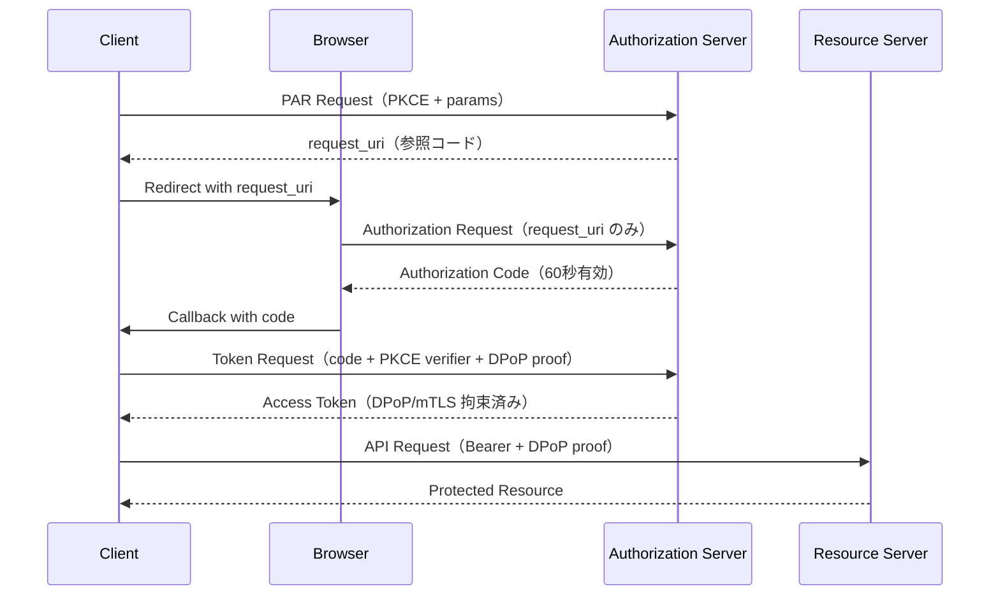

> **Note:** このページはAIエージェントが執筆しています。内容の正確性は一次情報（仕様書・公式資料）とあわせてご確認ください。

# FAPI 2.0 Security Profile

## 概要

FAPI 2.0（Financial-grade API Security Profile 2.0）は、OAuth 2.0 をベースに金融グレードの高セキュリティ要件を定めた OpenID Foundation の仕様です。2025年2月19日に Final として正式承認され、Open Banking・決済・オープンファイナンスなどの高リスク環境での API アクセス制御標準として国際的に採用が進んでいます。

従来の FAPI 1.0 と比較した最大の特徴は、**形式的セキュリティ分析（Formal Security Analysis）** に基づいている点です。学術研究者との協力により、定義された攻撃者タイプ（A1、A1a、A2、A3a、A4、A5）に対するセキュリティ特性が数学的に証明されており、"セキュリティを主張するだけでなく証明する" 仕様として設計されています ([ACM Transactions on Privacy and Security](https://dl.acm.org/doi/10.1145/3699716))。

仕様は大きく 2 層に分かれます:

- **FAPI 2.0 Baseline Profile**: 認証のみなど比較的リスクの低いユースケース
- **FAPI 2.0 Advanced Profile**: 決済・強い認可など高リスクのユースケース（メッセージ署名を追加）

本記事では主に Security Profile（Baseline + Advanced に共通する基盤仕様）を解説します。

## 背景と経緯

FAPI 1.0 は 2018 年頃に登場し、UK Open Banking や Brazil Open Banking など各国の Open Banking 規制に採用されました。しかし、その後のセキュリティ研究により以下の課題が顕在化します:

- **フロントチャネル経由の情報漏洩**: ハイブリッドフロー (`response_type=code id_token`) でフロントチャネルに ID Token が流れる設計は、リダイレクト先での漏洩リスクを内包していた
- **リクエストパラメータの整合性保護の欠如**: 認可リクエストのパラメータが改ざんされるリスクへの対応が不十分
- **形式的セキュリティ証明の欠如**: FAPI 1.0 は実装者の経験則に依存しており、数学的証明がなかった

これらの課題に対応するため、FAPI WG は 2020 年頃から FAPI 2.0 の策定を開始。複数の Implementer's Draft を経て、2025年2月に Final 承認に至りました。

## 設計思想

### 攻撃者モデル駆動設計

FAPI 2.0 の設計の根幹は、[FAPI 2.0 Attacker Model](https://openid.net/specs/fapi-attacker-model-2_0-final.html) に定義された攻撃者モデルです。A1、A1a、A2、A3a、A4、A5 の攻撃者タイプを定義し、各メカニズムがどの攻撃者から保護するかを明示しています。これにより「なんとなく安全」ではなく「どの脅威に対して何が有効か」が仕様レベルで明確になっています。

### バックチャネル中心主義

FAPI 2.0 は認可レスポンスを `response_type=code` のみに限定し、すべてのトークン取得をバックチャネル（Token エンドポイント）経由に集約します。フロントチャネル（ブラウザのリダイレクト URL）に流れる情報は認可コードのみに最小化され、ID Token・アクセストークンがフロントチャネルに露出するリスクを排除しています。

### 送信者制約（Sender-Constrained Tokens）の必須化

アクセストークンを盗まれても悪用できないよう、すべてのアクセストークンに**送信者制約**を課します。トークンを取得したクライアントのみが使用できることを暗号学的に保証する仕組みです。

## 技術詳細

### 必須要件一覧

FAPI 2.0 Security Profile が機密クライアント（Confidential Client）に課す主な要件は以下の通りです ([仕様書 Section 5](https://openid.net/specs/fapi-security-profile-2_0-final.html)):

| カテゴリ           | 要件                                                 |
| ------------------ | ---------------------------------------------------- |
| 認可リクエスト     | PAR（Pushed Authorization Requests, RFC 9126）必須   |
| CSRF 対策          | PKCE（S256 ハッシュ）必須                            |
| 応答形式           | `response_type=code` のみ                            |
| 認可コード有効期限 | 最大 60 秒                                           |
| クライアント認証   | `private_key_jwt` または mTLS                        |
| 送信者制約         | mTLS または DPoP（RFC 9449）のいずれか               |
| 署名アルゴリズム   | PS256 / ES256 / EdDSA（HS256 等は禁止）              |
| TLS                | TLS 1.2 以上（TLS 1.3 推奨）、強力な暗号スイートのみ |

### Pushed Authorization Requests（PAR）

PAR は認可リクエストのパラメータを事前に認可サーバーへ登録し、参照コード（`request_uri`）のみをフロントチャネルで使用する仕組みです ([RFC 9126](https://www.rfc-editor.org/rfc/rfc9126))。

```http
POST /as/par HTTP/1.1
Host: authserver.example.com
Content-Type: application/x-www-form-urlencoded

client_id=client123
&response_type=code
&code_challenge=E9Melhoa2OwvFrEMTJguCHaoeK1t8URWbuGJSstw-cM
&code_challenge_method=S256
&scope=openid payments:write
&redirect_uri=https://app.example.com/callback

→ 201 Created
{
  "request_uri": "urn:ietf:params:oauth:request_uri:xyz123",
  "expires_in": 90
}
```

続いてブラウザリダイレクトには `request_uri` のみを含めます:

```
GET /authorize?client_id=client123&request_uri=urn:ietf:params:oauth:request_uri:xyz123
```

これにより、センシティブなパラメータ（スコープ・PKCE 値など）がブラウザの履歴・ログ・リファラーヘッダーに残るリスクを排除できます。

### 送信者制約の実装: mTLS と DPoP

**mTLS（Mutual TLS）** は、クライアント証明書のサムプリントをトークンに紐付けます。TLS レイヤーで双方向認証を行うため、PKI インフラが整備されたエンタープライズ環境で強力に機能します。

**DPoP（RFC 9449）** は、クライアントが生成した鍵ペアを使って各リクエストに署名したプルーフトークンを付与します。mTLS と異なりブラウザベースのクライアントでも使用可能なため、より幅広い環境に対応できます:

```http
POST /token HTTP/1.1
DPoP: eyJhbGciOiJFUzI1NiIsInR5cCI6ImRwb3Arand...
Content-Type: application/x-www-form-urlencoded

grant_type=authorization_code
&code=SplxlOBeZQQYbYS6WxSbIA
&code_verifier=dBjftJeZ4CVP-mB92K27uhbUJU1p1r_wW1gFWFOEjXk
```

DPoP プルーフは各リクエストごとに生成され、`htm`（HTTPメソッド）・`htu`（URL）・`iat`（発行時刻）を含むため、リプレイ攻撃に対して耐性があります。

### クライアント認証: private_key_jwt

`private_key_jwt` ではクライアントが秘密鍵で署名した JWT をアサーションとして Token エンドポイントに送付します:

```json
{
  "iss": "client123",
  "sub": "client123",
  "aud": "https://authserver.example.com/token",
  "jti": "unique-id-12345",
  "exp": 1735000000,
  "iat": 1734999940
}
```

`client_secret_basic` や `client_secret_post` は使用禁止です。クライアントシークレットは漏洩した場合に全アクセスの危機に直結するためです。

### メッセージ署名（Advanced Profile）

高リスクな決済ユースケースでは [FAPI 2.0 Message Signing](https://openid.net/specs/fapi-message-signing-2_0.html) を追加して**非否認性（Non-repudiation）** を実現します。JAR（JWT-Secured Authorization Request）で認可リクエストに、JARM（JWT-Secured Authorization Response）で認可レスポンスに署名を施し、取引の否認を防ぎます。

### フロー全体像



## FAPI 1.0 との主な違い

| 要素                               | FAPI 1.0                    | FAPI 2.0               |
| ---------------------------------- | --------------------------- | ---------------------- |
| 認可リクエスト保護                 | JAR（オプション）           | PAR（**必須**）        |
| 応答形式                           | `code` + ハイブリッドフロー | `code` のみ            |
| CSRF 対策                          | `state` パラメータ          | PKCE（S256）**必須**   |
| フロントチャネルの ID Token        | あり（ハイブリッドフロー）  | **なし**               |
| セキュリティ体系                   | 経験則ベース                | **形式的証明**あり     |
| 認可コード有効期限                 | 規定なし                    | **最大 60 秒**         |
| リフレッシュトークンローテーション | 推奨                        | 基本的に不要（非推奨） |

移行時の最大の注意点は **PAR エンドポイントの実装** です。多くの FAPI 1.0 実装では PAR がオプションだったため、認可サーバー・クライアント双方での実装が必要になります。

## 実装上の注意点

### DPoP ライブラリの成熟度

DPoP は mTLS と比較してライブラリサポートがまだ発展途上です。プロダクション環境で使用する前に、採用予定の言語・フレームワークでの DPoP ライブラリのメンテナンス状況を確認することを推奨します ([FAPI 2.0 Implementation Advice](https://openid.bitbucket.io/fapi/fapi-2_0-implementation_advice.html))。

### トークンサイズの肥大化

PAR・DPoP・署名の組み合わせにより、ヘッダーサイズが 8KB を超えることがあります。Nginx・Apache などのデフォルト設定ではリクエストヘッダーの上限が低いため、本番環境に向けて `large_client_header_buffers`（Nginx）などの設定調整が必要です。

### 時刻同期の重要性

JWT の `nbf` / `exp` 検証が厳格なため、クライアントとサーバー間のクロックスキューが問題になりやすいです。NTP 同期を徹底し、許容誤差（通常 30〜60 秒）を適切に設定してください。

### DPoP の nonce によるリプレイ対策

DPoP プルーフのリプレイ攻撃を防ぐため、リソースサーバーが提供する nonce の使用をオプションで組み込めます。高セキュリティが求められるシステムでは nonce の使用を強く推奨します ([RFC 9449 Section 8](https://www.rfc-editor.org/rfc/rfc9449#section-8))。

### 公開クライアントは対象外

FAPI 2.0 Security Profile は**機密クライアントのみを対象**とすることを明示しています。SPA（Single Page Application）やネイティブアプリのような公開クライアントに対して同等のセキュリティを保証できる仕組みは、仕様策定時点では存在しないとされています。公開クライアント向けには別途検討が必要です。

## 採用事例

| 地域・組織                 | 採用状況                                                             |
| -------------------------- | -------------------------------------------------------------------- |
| **英国 Open Banking**      | FAPI 2.0 への段階的移行進行中。15の銀行が FAPI 認定取得済み          |
| **オーストラリア CDR**     | ConnectID が FAPI 2.0 採用決定。移行ワークショップ実施中             |
| **ブラジル Open Banking**  | FAPI 採用済み。FAPI 2.0 への移行ロードマップ策定中                   |
| **米国 CFPB（PFDR）**      | Tier 1 金融機関に 2026 年 4 月対応を求めるルールを提案（2025年時点） |
| **コロンビア・チリ**       | 国内 Open Banking 規制に FAPI 2.0 を採用                             |
| **Authlete 3.0**           | 2025 年 7 月に FAPI 2.0 Final の OpenID 認定取得（業界初）           |
| **Curity Identity Server** | FAPI 2.0 準拠認定取得                                                |

## 関連仕様・後継仕様

FAPI 2.0 は以下の仕様を組み合わせて構成されています:

- [OAuth 2.0（RFC 6749）](./rfc6749.md) — 基盤の認可フレームワーク
- [PKCE（RFC 7636）](./rfc7636.md) — 認可コード横取り防止
- [PAR（RFC 9126）](./rfc9126.md) — 認可リクエストのバックチャネル登録
- [DPoP（RFC 9449）](./rfc9449.md) — 送信者制約付きアクセストークン
- [FAPI 2.0 Attacker Model](https://openid.net/specs/fapi-attacker-model-2_0-final.html) — 攻撃者モデルの定義
- [FAPI 2.0 Message Signing](https://openid.net/specs/fapi-message-signing-2_0.html) — 非否認性のためのメッセージ署名

FAPI 1.0 との共存期は当面続く見込みですが、新規システム設計では FAPI 2.0 をベースラインとするのが推奨されています。

## 参考資料

- [FAPI 2.0 Security Profile — Final (2025-02-19)](https://openid.net/specs/fapi-security-profile-2_0-final.html)
- [FAPI 2.0 Attacker Model — Final](https://openid.net/specs/fapi-attacker-model-2_0-final.html)
- [FAPI 2.0 Message Signing — Final](https://openid.net/specs/fapi-message-signing-2_0.html)
- [FAPI 2.0 Implementation Advice](https://openid.bitbucket.io/fapi/fapi-2_0-implementation_advice.html)
- [OpenID Foundation FAPI Working Group](https://openid.net/wg/fapi/)
- [Formal Security Analysis of FAPI 2.0 (ACM TOPS)](https://dl.acm.org/doi/10.1145/3699716)
- [RFC 9126 — Pushed Authorization Requests](https://www.rfc-editor.org/rfc/rfc9126)
- [RFC 9449 — DPoP](https://www.rfc-editor.org/rfc/rfc9449)
