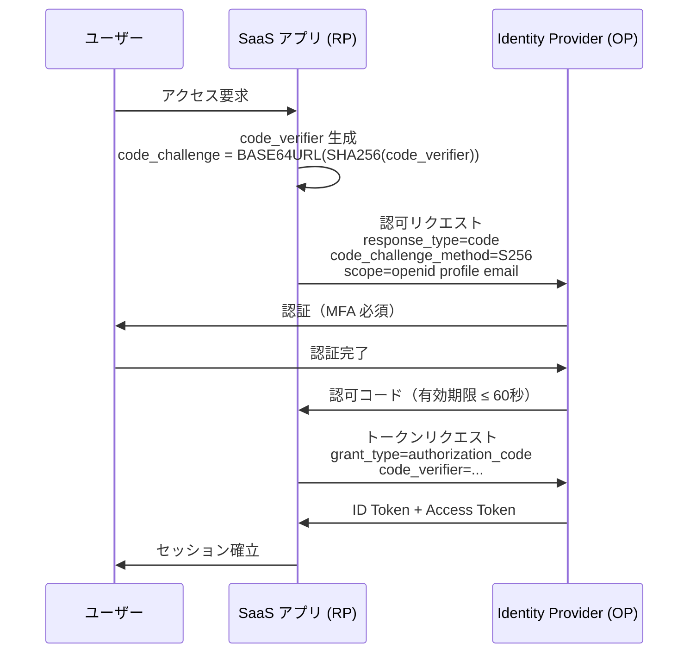
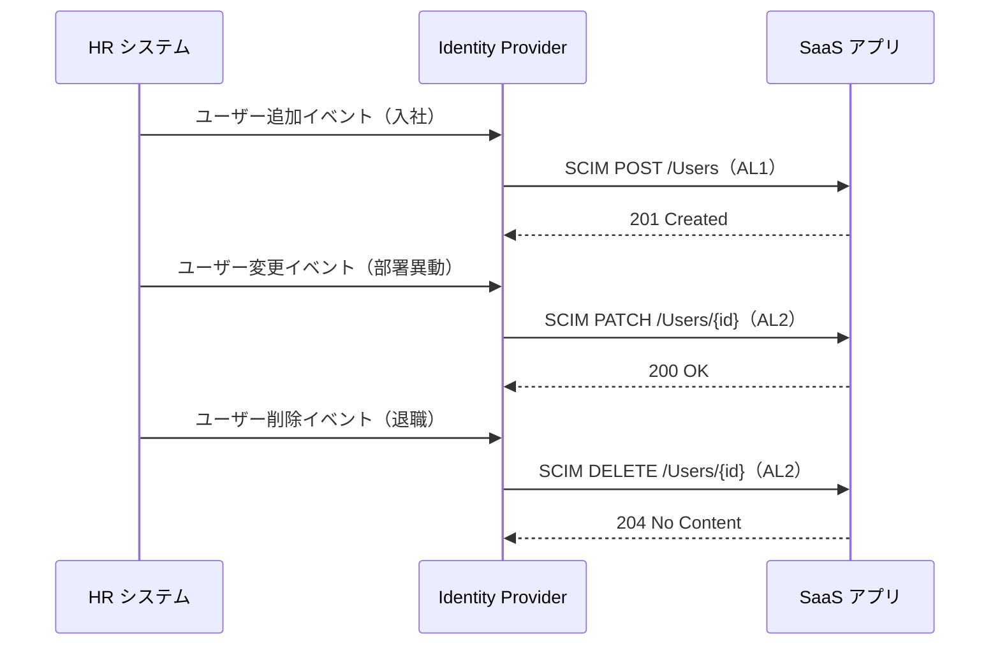
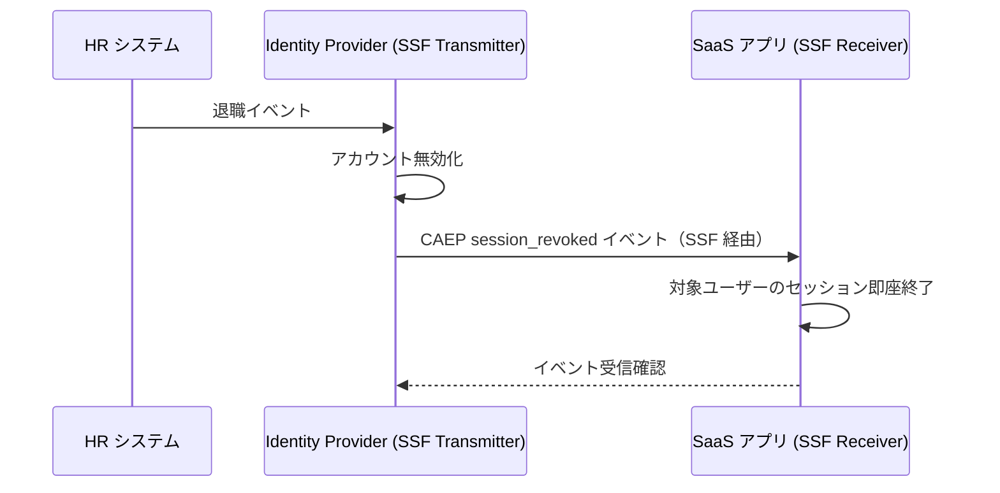

> **Note:** このページはAIエージェントが執筆しています。内容の正確性は一次情報（仕様書・公式資料）とあわせてご確認ください。

# IPSIE — Interoperability Profile for Secure Identity in the Enterprise

## 概要

IPSIE（Interoperability Profile for Secure Identity in the Enterprise）は、OpenID Foundation が 2024 年 10 月に設立した Working Group で策定中のエンタープライズ向けアイデンティティ統合プロファイルです（[公式 Working Group ページ](https://openid.net/wg/ipsie/)）。

企業が SaaS アプリケーションを従業員のアイデンティティと統合する際、SSO（シングルサインオン）・ユーザーライフサイクル管理・セッション管理・リスク信号共有という 4 つの基本ニーズが生じます。これらは OAuth 2.0、OpenID Connect、SCIM、Shared Signals Framework / CAEP という既存仕様で個別には実現できますが、各仕様のオプション機能が多様すぎるため、製品間の相互運用性が実際には確保されていません。

IPSIE は **新しい仕様を作るのではなく、既存仕様のオプションを削減して「セキュアなデフォルト」を定義する**プロファイルです。Okta・Microsoft・Ping Identity・SGNL・Beyond Identity などの主要 IdP / SaaS ベンダーが founding member として参画しており、Google など多くのベンダーも採用に向けて動いています。

## 背景と経緯

### エンタープライズ SaaS 統合の課題

2020 年代に入り、企業が利用する SaaS アプリケーションは爆発的に増加しました。各 SaaS は OAuth 2.0 / OIDC ベースの SSO をサポートしていますが、以下の課題が顕在化しています。

**相互運用性の欠如**: OAuth 2.0 のオプション機能（PKCE アルゴリズム、クライアント認証方式、トークン形式）は実装依存で、製品間の設定作業が毎回発生します。

**ライフサイクル管理の断絶**: 従業員が退職した際、IdP のアカウントを無効化しても、個別 SaaS のセッションが継続してしまう「オルファンセッション」問題があります。SCIM を使った自動プロビジョニング / デプロビジョニングはオプション扱いのため、未対応の製品が多く存在します。

**セキュリティ基準の不統一**: PKCE の code_challenge_method（plain vs S256）、MFA 要件、TLS バージョン要件が製品ごとに異なるため、最小公倍数的な（つまり弱い）設定に落ち着きがちです。

### IPSIE WG の設立

2024 年 10 月、Okta の Todd McKinnon と OpenID Foundation が協力して IPSIE Working Group を設立しました（[設立発表](https://openid.net/announcing-ipsie-working-group/)）。Charter では以下の目標が明示されています。

- 既存の標準仕様を組み合わせた相互運用可能なプロファイルの策定
- 最小限のセキュリティ要件を定義（「セキュアなデフォルト」の強制）
- 独立した実装間でのテスト・認定の仕組み整備
- OpenID Foundation のコンセンサスベースプロセスに従った標準化

2024 年 11 月に Draft 00 が公開され、現在も改訂が続いています（[IPSIE SL1 OpenID Connect Profile 1.0](https://openid.net/specs/ipsie-openid-connect-sl1-profile-1_0.html)）。

## 設計思想

### プロファイルという戦略

IPSIE の最も重要な設計判断は「プロファイル」として実装したことです。OAuth 2.0 / OIDC のエコシステムはすでに確立しており、ゼロから新規仕様を策定してもベンダー採用が遅れます。既存仕様のオプションを削減して「この組み合わせで使えば相互運用できる」というガイドラインを定義する方が、実際の相互運用性を早期に向上できます。

同様のアプローチは [FAPI 2.0 Security Profile](https://openid.net/wg/fapi/) が金融業界で先行しています。IPSIE はそれをエンタープライズ全般に適用したと見なせます。

### Security Level（SL）フレームワーク

セキュリティ要件を一律に強制すると既存システムとの互換性が失われます。IPSIE は **Security Level（SL）** という段階的な成熟度フレームワークを採用し、最小限から最大限のセキュリティまで選択可能にしています。

| Level | 概要                                                                                                   |
| ----- | ------------------------------------------------------------------------------------------------------ |
| SL1   | エンタープライズ OIDC 統合の最小要件。TLS 1.2+、PKCE S256 必須、MFA 対応（NIST SP 800-63-4 FAL2 相当） |
| SL2   | 計画中（DPoP 必須化、PAR 導入等が検討対象）                                                            |

現在公開されている仕様は SL1 のみです。

### Account Lifecycle Level（AL）フレームワーク

ユーザープロビジョニングにも段階的なレベルを定義しています。

| Level | 概要                                                                 |
| ----- | -------------------------------------------------------------------- |
| AL1   | 基本プロビジョニング（SCIM User Create のみ）                        |
| AL2   | 更新・削除を含む完全なライフサイクル管理                             |
| AL3   | ロール・権限同期による最小権限アクセス制御（Entitlement Management） |

### セキュアなデフォルト

IPSIE SL1 が「必須」とする項目のほとんどは、既存仕様では「推奨」または「オプション」として扱われていたものです。

- **PKCE S256 必須**: `plain` は禁止。ダウングレード攻撃を封じます
- **TLS 1.2 以上必須**: TLS 1.0/1.1 を排除し、[BCP 195](https://www.rfc-editor.org/rfc/rfc7525) 推奨スイートのみ
- **MFA 対応必須**: NIST SP 800-63-4 FAL2（Federation Assurance Level 2）に準拠
- **`none` アルゴリズム禁止**: 署名なし JWT による認証バイパスを防止
- **リダイレクト URI の完全一致**: プレフィックスマッチ禁止、事前登録必須

## 技術詳細

### 認証フロー（SL1 OpenID Connect Profile）

IPSIE SL1 は OAuth 2.0 Authorization Code Flow with PKCE を基本フローとして定義しています。



ID Token には以下のクレームが必須です（[SL1 Profile Section 3.2](https://openid.net/specs/ipsie-openid-connect-sl1-profile-1_0.html)）。

```json
{
  "iss": "https://idp.example.com",
  "sub": "user123",
  "aud": "client_id_of_saas_app",
  "iat": 1712345678,
  "exp": 1712349278,
  "auth_time": 1712345678,
  "acr": "urn:mace:incommon:iap:silver",
  "amr": ["pwd", "otp"],
  "session_lifetime": 1712349278
}
```

- `acr`（Authentication Context Class Reference）: 実際に使用した認証強度
- `amr`（Authentication Method References）: 認証方法の列挙（パスワード、TOTP、生体認証など）
- `session_lifetime`: UNIX タイムスタンプ形式のセッション有効期限。SaaS アプリはこの時刻を超えたセッションを強制終了する必要があります

### DPoP による Sender-Constrained Token（推奨）

SL1 では [DPoP（RFC 9449）](https://www.rfc-editor.org/rfc/rfc9449) によるトークン盗難対策が推奨されています（SL2 では必須化が検討中）。

DPoP を使用すると、アクセストークンがクライアントの公開鍵に紐付けられます。攻撃者がトークンを盗んでも、対応する秘密鍵がなければリソースサーバーへのアクセスができません。

```
POST /token HTTP/1.1
DPoP: eyJhbGciOiJFUzI1NiIsImp3ayI6eyJrdHkiOiJFQyIsImNydiI6IlAtMjU2IiwieCI6Ii4uLiIsInkiOiIuLi4ifX0.eyJodG0iOiJQT1NUIiwiaHR1IjoiaHR0cHM6Ly9hdXRoLmV4YW1wbGUuY29tL3Rva2VuIiwiaWF0IjoxNzEyMzQ1Njc4fQ.<sig>
```

### ユーザーライフサイクル管理（SCIM 2.0）

IPSIE の AL フレームワークは SCIM 2.0（[RFC 7643](https://www.rfc-editor.org/rfc/rfc7643) / [RFC 7644](https://www.rfc-editor.org/rfc/rfc7644)）を使ったプロビジョニングを標準化します。



AL3 では、ユーザーのロールやエンタイトルメント（権限セット）も同期されます。これにより HR システムの変更がリアルタイムで SaaS 上のアクセス制御に反映され、最小権限の原則（Least Privilege）を維持できます。

### セッション管理とリアルタイム取消（SSF/CAEP）

IPSIE の最も重要な機能の一つが、[Shared Signals Framework（SSF）](https://openid.net/specs/openid-sharedsignals-framework-1_0-final.html) と [Continuous Access Evaluation Profile（CAEP）](https://openid.net/specs/openid-caep-1_0-final.html) を使ったリアルタイムセッション取消です。



従来の「アクセストークンの有効期限切れを待つ」アプローチと異なり、CAEP を使うと退職後数秒以内に全 SaaS のセッションを終了できます。これはインサイダー脅威対策として極めて重要です。

SSF / CAEP は Final 版が確定済みであり（Shared Signals Framework 1.0 Final、CAEP 1.0 Final）、実装成熟度は向上しています。

### 暗号要件

IPSIE SL1 では以下の暗号アルゴリズムを規定しています。

| 種別                 | 必須 / 推奨 | 内容                                     |
| -------------------- | ----------- | ---------------------------------------- |
| 署名アルゴリズム     | 必須        | PS256、ES256、EdDSA（Ed25519）のいずれか |
| RSA キー長           | 必須        | 最小 2048 ビット                         |
| EC キー長            | 必須        | 最小 224 ビット                          |
| `none` アルゴリズム  | 禁止        | 署名なし JWT の使用禁止                  |
| 認証情報エントロピー | 必須        | 最低 128 ビット                          |
| TLS バージョン       | 必須        | TLS 1.2 以上（BCP 195 推奨スイート）     |

## 実装上の注意点

### 1. CAEP のイベント配信信頼性

SSF / CAEP はイベント配信の保証（guaranteed delivery）を提供しません。ネットワーク障害などでイベントが届かなかった場合の補完策（ポーリング、セッション有効期限の短縮など）を設計しておく必要があります。

### 2. SCIM デプロビジョニングの抜け穴

全 SaaS が SCIM DELETE をサポートしているわけではありません。未対応の SaaS では、アカウントが「オルファン状態」（IdP では無効だが SaaS では有効）になるリスクが残ります。IPSIE の AL フレームワークに準拠しているかどうかを製品選定時に確認することが重要です。

### 3. レガシークライアントとの非互換性

PKCE S256 の強制や DPoP の使用は、古いクライアントライブラリでは動作しません。IPSIE 対応への移行期間中は、古い設定と新しい設定が混在するリスクがあります。移行戦略として、まず新規統合に IPSIE を適用し、既存統合は計画的にアップグレードするアプローチが現実的です。

### 4. `session_lifetime` クレームの解釈

`session_lifetime` は OpenID Connect Core で定義された標準クレームではなく、IPSIE SL1 が独自に定義した拡張クレームです。OpenID Connect の標準仕様への組み込みは将来の独立仕様として提案される予定であり、現時点では IPSIE 固有の拡張として扱う必要があります。

SaaS 側は `session_lifetime` を参照してセッションを強制終了する必要がありますが、これには ID Token の検証ロジックとは別のセッション管理コードが必要です。単純な OIDC 実装に `session_lifetime` のチェックを追加し忘れると、IdP が指定した有効期限を超えたセッションが継続してしまいます。

### 5. 現在の Draft ステータス

2026 年 4 月時点で IPSIE は Draft 段階にあります。本番環境への実装は仕様確定後が推奨されますが、IPSIE に依存する主要仕様（SCIM、SSF/CAEP）は既に安定しているため、それらに先行して対応することは有意義です。

## 採用事例

IPSIE は 2024 年 10 月設立の新しい Working Group であり、仕様確定前の 2026 年 4 月時点では商用製品の正式な IPSIE 認定はありません。ただし以下のベンダーが Founding Member として実装を推進しています。

| ベンダー / 製品     | 対応内容                                                                                                                                                                  |
| ------------------- | ------------------------------------------------------------------------------------------------------------------------------------------------------------------------- |
| **Okta**            | 125+ Secure Identity Integrations の整備、SCIM Inbound サービスの拡充（[Okta ブログ](https://www.okta.com/blog/2024/10/oktas-mission-to-standardize-identity-security/)） |
| **Microsoft**       | Azure Entra ID での OIDC・CAEP 強化（Founding Member）                                                                                                                    |
| **Google**          | IPSIE への関心を表明（Founding Member ではないが業界全体の取り組みとして注目）                                                                                            |
| **Ping Identity**   | Founding Member として仕様策定に参加                                                                                                                                      |
| **SGNL**            | CAEP 実装のリーダーとして参画                                                                                                                                             |
| **Beyond Identity** | パスワードレス + IPSIE の組み合わせでゼロトラストを推進                                                                                                                   |

## 関連仕様・後継仕様

### 依存する仕様

IPSIE は新規プロトコルではなく、以下の既存仕様を組み合わせたプロファイルです。

| 仕様                                                                                                         | 役割                                     |
| ------------------------------------------------------------------------------------------------------------ | ---------------------------------------- |
| [OpenID Connect Core 1.0](https://openid.net/specs/openid-connect-core-1_0.html)                             | 認証・ID Token 発行の基盤                |
| [OAuth 2.0（RFC 6749）](https://www.rfc-editor.org/rfc/rfc6749)                                              | 認可フレームワーク                       |
| [PKCE（RFC 7636）](https://www.rfc-editor.org/rfc/rfc7636)                                                   | 認可コード横取り攻撃対策                 |
| [DPoP（RFC 9449）](https://www.rfc-editor.org/rfc/rfc9449)                                                   | Sender-Constrained Token による盗難対策  |
| [SCIM 2.0（RFC 7643 / 7644）](https://www.rfc-editor.org/rfc/rfc7643)                                        | ユーザーライフサイクル管理               |
| [Shared Signals Framework 1.0 Final](https://openid.net/specs/openid-sharedsignals-framework-1_0-final.html) | リスク信号伝達フレームワーク             |
| [CAEP 1.0 Final](https://openid.net/specs/openid-caep-1_0-final.html)                                        | セッション取消・継続的アクセス評価       |
| [NIST SP 800-63-4](https://pages.nist.gov/800-63-4/)                                                         | 認証・フェデレーション保証レベル（FAL2） |
| [OpenID Connect Discovery 1.0](https://openid.net/specs/openid-connect-discovery-1_0.html)                   | IdP メタデータ配布                       |

### 競合・代替

- **FAPI 2.0 Security Profile**: 金融業界向けの高セキュリティ OIDC プロファイル。IPSIE よりも厳格で、エンタープライズ全般より金融取引に特化しています
- **SAML 2.0**: 従来型のエンタープライズ SSO 標準。IPSIE は OIDC / OAuth ベースの次世代標準として位置付けられます
- **WS-Federation**: Microsoft エコシステム向けのフェデレーションプロトコル。IPSIE は業界横断的なオープン標準を目指します

## 参考資料

- [IPSIE Working Group — OpenID Foundation](https://openid.net/wg/ipsie/)
- [IPSIE Working Group Charter](https://openid.net/wg/ipsie/ipsie-charter/)
- [IPSIE SL1 OpenID Connect Profile 1.0 — Draft 00](https://openid.net/specs/ipsie-openid-connect-sl1-profile-1_0.html)
- [GitHub — openid/ipsie](https://github.com/openid/ipsie)
- [Announcing the IPSIE Working Group — OpenID Foundation](https://openid.net/announcing-ipsie-working-group/)
- [Okta's Mission to Standardize Identity Security](https://www.okta.com/blog/2024/10/oktas-mission-to-standardize-identity-security/)
- [Business Wire: Okta, OpenID Foundation & Tech Firms — Press Release](https://www.businesswire.com/news/home/20241016143671/en/)
- [Shared Signals Framework 1.0 Final](https://openid.net/specs/openid-sharedsignals-framework-1_0-final.html)
- [Continuous Access Evaluation Profile 1.0 Final](https://openid.net/specs/openid-caep-1_0-final.html)
- [oauth.net: IPSIE](https://oauth.net/ipsie/)
