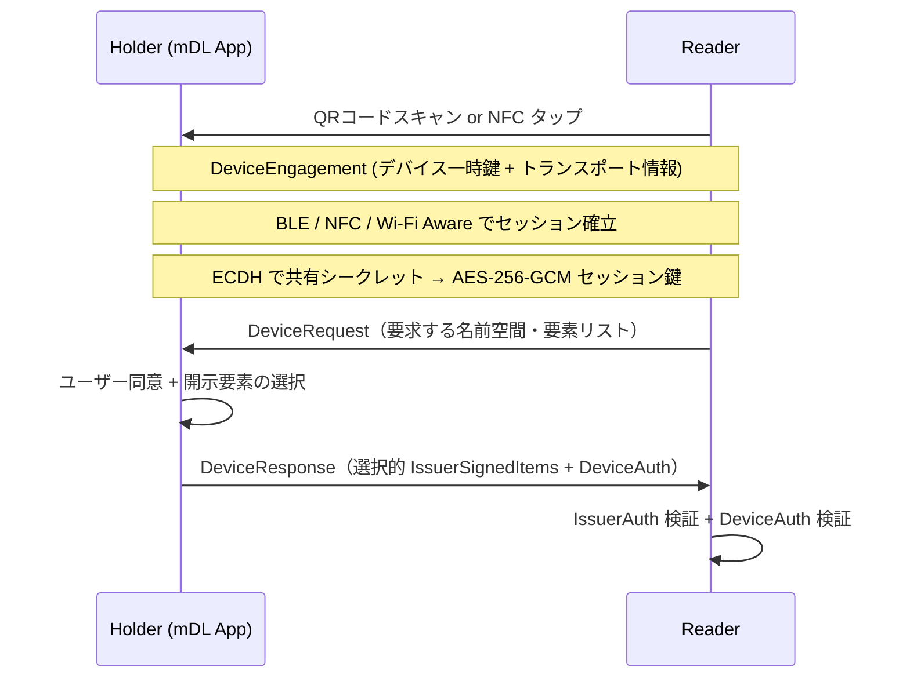

> **Note:** このページはAIエージェントが執筆しています。内容の正確性は一次情報（仕様書・公式資料）とあわせてご確認ください。

# ISO/IEC 18013-5 — Mobile Driving Licence (mDL)

## 概要

ISO/IEC 18013-5:2021 は、スマートフォン上の **Mobile Driving Licence（mDL）** の実装仕様を定める国際標準です。ISO/IEC JTC 1/SC 17（カード及び個人識別）が策定し、2021年9月に第1版が発行されました。

この仕様が規定する内容は大きく4つです。第一に、**mdoc（mobile document）フォーマット**——CBOR/COSEベースのバイナリデータモデル。第二に、mDLと読み取り機（mDL Reader）間の**近接通信プロトコル**（QR・NFC・BLE）。第三に、発行局署名と保有者バインディングによる**セキュリティモデル**。第四に、データ要素単位での**選択的開示メカニズム**。

名称に「Driving Licence」とありますが、mdocフォーマットとプロトコルは汎用的であり、EU市民IDカード（PID）や車両登録証など任意の政府発行モバイル文書に適用できます。EUの EUDI Wallet は ISO/IEC 18013-5 を中核技術の一つとして採用しており、Apple Wallet・Google Wallet でも同仕様に準拠したデジタルIDが実装されています。

## 背景と経緯

物理的な運転免許証のデジタル化は各国で独自に進んでいましたが、相互運用性のない実装が乱立するリスクがありました。ISO/IEC 18013 シリーズはもともと物理免許証の規格（Part 1〜4）でしたが、スマートフォンの普及に対応して Part 5 としてmDLが追加されました。

仕様策定にあたっての主な設計判断は、エンコーディングに **CBOR（RFC 8949）** と **COSE（RFC 9052/9053）** を採用したことです。これは近接通信のBLE/NFC環境でのメッセージサイズ効率を重視したためです。WebやAPIの世界で主流のJSON/JWTではなく、IoT分野で実績のあるCBOR/COSEを選択した点がSD-JWT VCとの最大の差異であり、開発者エコシステムの面でのトレードオフでもあります。

なお、オンライン提示機能（インターネット経由での提示）は ISO/IEC TS 18013-7:2024 として別途仕様化されており、OpenID4VP（OID4VP）との統合を規定しています。ISO/IEC 18013-5 第2版（DIS段階、2026年中の発行が目標とされています）ではこれらが統合される予定です。

## データモデル（mdocフォーマット）

### CBOR/COSEベースの構造

mdocは **CBOR（Concise Binary Object Representation）** でエンコードされたバイナリドキュメントです。JSONと比較してメッセージサイズが大幅に小さく、IoTや制約環境に向いた特性をそのまま活用しています。

トップレベルの構造は以下のとおりです。

```
MobileDocument {
  docType: "org.iso.18013.5.1.mDL"
  issuerSigned: IssuerSigned      // 発行局署名データ
  deviceSigned: DeviceSigned      // 保有者自己申告データ（省略可）
  errors: Errors                  // オプション
}
```

### 名前空間（Namespace）

データ要素は**名前空間（namespace）** で階層的に管理されます。

- **`org.iso.18013.5.1`** — ISO標準データ要素（姓名、生年月日、免許種別、顔写真など）
- **`org.iso.18013.5.1.aamva`** — 米国AAMVA独自拡張（EDL、HAZMAT等）
- **カスタム名前空間** — 国・地域固有の拡張に使用

### IssuerSigned と MSO

選択的開示の核となる構造が **IssuerSigned** です。各データ要素は `IssuerSignedItem` として個別に管理されます。

```
IssuerSigned {
  nameSpaces: {
    "org.iso.18013.5.1": [
      IssuerSignedItem {
        digestID: 0,
        random: <ランダムバイト>,
        elementIdentifier: "family_name",
        elementValue: "Yamada"
      },
      // ...
    ]
  }
  issuerAuth: COSE_Sign1  // MSO署名
}
```

**MSO（Mobile Security Object）** は COSE_Sign1 のペイロードであり、各要素の SHA-256 ダイジェスト、docType、有効期限、そして **DeviceKey**（保有者デバイスの公開鍵）を格納します。発行局はすべての要素のダイジェストをMSOに含めた上で署名するため、任意のサブセットを開示しても検証可能性が保たれます。

### PKIトラストモデル

```
IACA（Issuing Authority CA）← 自己署名ルートCA（最大20年有効）
  └── DSC（Document Signer Certificate）
        └── MSO署名（IssuerAuth）
```

- **IACA** は各国・州の発行機関が管理するルートCA
- **VICAL（Verified Issuer Certificate Authority List）** で各国IACを一元配布する仕組みも規定
- 読み取り機はIACA証明書を保持し、DSC → MSO の検証チェーンを構成

## プレゼンテーションフロー

### Device Retrieval（近接通信）

ISO/IEC 18013-5 のメインフロー。ネットワーク接続なしでオフライン動作可能な点が特徴です。



**SessionTranscript** はリプレイ攻撃防止のため、両者の一時鍵やQRコードハッシュ等を含む重要な構造体です。DeviceAuth の署名対象に SessionTranscript を含めることで、セッションに文脈バインドされます。

### Online Presentation（OID4VP経由）

ISO/IEC TS 18013-7:2024 では OpenID4VP との統合が規定されています。

- フォーマット識別子: **`mso_mdoc`**
- DocType 指定例: `org.iso.18013.5.1.mDL`
- DCQL（Digital Credentials Query Language）で名前空間・要素を指定
- **OID4VPHandover** を SessionTranscript に組み込み、DeviceAuth をオンライン文脈にバインド

W3C Digital Credentials API（ブラウザ経由）経由での提示もサポートされており、Web アプリケーションから直接 mdoc を要求できます。

## セキュリティ設計

### IssuerAuth（発行者認証）

`COSE_Sign1` でMSOに署名。DSC（Document Signer Certificate）の秘密鍵を使用し、アルゴリズムは ECDSA-P256（COSE alg: -7）または ECDSA-P384（-35）等です。読み取り機はこれにより「mdocが正規発行局から発行されたか」を検証します。

### DeviceAuth（保有者バインディング）

DeviceAuth は**ホルダーバインディング**の核心です。MSO に埋め込まれた DeviceKey（Secure Enclave / StrongBox 等のハードウェア保護）に対応する秘密鍵で証明します。

| 方式       | 特性                                                            |
| ---------- | --------------------------------------------------------------- |
| COSE_Mac0  | 対称MAC（HMAC）。否認可能（repudiable）。低コスト               |
| COSE_Sign1 | デバイス秘密鍵による非対称署名。強い否認不可（non-repudiation） |

強い否認不可が必要なユースケースでは COSE_Sign1 を使うべきですが、仕様上どちらも許容しているため実装間の差異が生じる点に注意が必要です。

### 選択的開示

選択的開示は IssuerSignedItem 単位で実現します。提示時に必要な要素のみを実際の値と共に開示し、読み取り機はそのダイジェストとMSO内の値を照合して真正性を確認します。

**`age_over_NN`** という真偽値要素（例: `age_over_18: true`）を使えば、生年月日を開示せずに年齢確認が可能です。ただし、どの要素を開示したかのパターン自体はVerifierに見えるため、**完全な無リンカビリティ（unlinkability）はZKPなしには実現できません**。ISO/IEC TS 18013-7:2024 では ZKP を用いた年齢証明もサポートされています。

## mdoc vs SD-JWT VC — 設計上のトレードオフ

| 観点             | mdoc（CBOR/COSE）        | SD-JWT VC（JSON/JOSE）       |
| ---------------- | ------------------------ | ---------------------------- |
| エンコーディング | バイナリ（CBOR）         | テキスト（JSON + base64url） |
| メッセージサイズ | 小さい（BLE/NFC向き）    | 大きい（Web向き）            |
| 可読性           | 低い（専用ツール必要）   | 高い（デバッグ容易）         |
| 暗号スタック     | COSE（RFC 9052/9053）    | JOSE（JWT/JWS）              |
| Web開発者親和性  | 低い                     | 高い（JWT資産活用）          |
| 近接通信サポート | ネイティブ               | 非対応                       |
| オフライン検証   | 対応                     | 基本はオンライン前提         |
| 標準化主体       | ISO/IEC（政府主導）      | IETF（オープンコミュニティ） |
| 採用領域         | 政府発行証明書、近接提示 | Web/API、リモート提示        |

eIDAS 2.0（EUDI Wallet）は**両フォーマットでの発行を義務化**するという実用主義的解決策を採用しました。近接提示には mdoc、リモート提示には SD-JWT VC という役割分担です ([ARF v1.1](https://eudi.dev/1.1.0/arf/))。

## 実装上の注意点

### 1. CBOR エンコーディングの落とし穴

CBOR は JSON より複雑な仕様を持ちます。特に **CBOR-in-CBOR の bstr（バイト文字列）ラッパー**パターン（外側のCBORに埋め込まれたバイト列がさらに別のCBORとして解釈されるパターン）でバグが多発します。デバッグには [cbor.me](https://cbor.me/) 等の専用ツールが必要です。

### 2. Server Retrieval 時のトラッキング

オンラインサーバ取得では発行局サーバが「いつ、どのデータが開示されたか」を把握できます。Device Retrieval のトランザクション不可観測性（unobservability）が Server Retrieval では成立しない点を設計に組み込む必要があります。

### 3. IACA/DSC 配布の複雑性

読み取り機が多数の国・州のIACA証明書を管理する必要があります。VICAL が解決策として定義されていますが、グローバルな信頼配布の仕組みは標準化途上です。

### 4. デバイス紛失・失効

mdocはデバイスにバインドされているため、デバイス紛失時の迅速な失効が重要です。失効メカニズム（CRL/OCSP相当）の標準化は18013-7等で補完されていますが、実装時には失効確認のオンライン要件がオフライン設計と矛盾しないよう注意が必要です。

### 5. SessionTranscript の実装ミス

SessionTranscript の構築ミスはリプレイ攻撃を可能にします。オンライン提示では OID4VPHandover に verifier の nonce を正しく組み込まないと、過去の DeviceResponse が別のセッションで再利用されるリスクがあります。

## 採用事例

### Apple Wallet（iOS 17+）

iOS 17 から ISO/IEC 18013-5 準拠の mDL をネイティブサポート。Secure Enclave にデバイス鍵を格納し、Apple も発行局も使用状況をトラッキングできない設計を採用しています ([Apple Security Guide](https://support.apple.com/guide/security/security-of-ids-in-apple-wallet-secb569bf393/web))。QR + BLE のDevice Retrievalフローを実装。

### Google Wallet

ISO/IEC 18013-5 準拠。NFC・BLE・QRコードに対応。ISO/IEC TS 18013-7 の ZKP を用いた age over 証明もサポート ([Google for Developers](https://developers.google.com/wallet/identity/verify))。

### 米国各州

AAMVA（米国自動車管理者協会）が名前空間 `org.iso.18013.5.1.aamva` を定義。Arizona、Colorado、Georgia、Hawaii、Iowa、Maryland、Missouri、Ohio 等の複数州が実運用中。

### EUDI Wallet（EU）

ARF v1.1 が mdoc と SD-JWT VC のデュアルフォーマット対応を義務化。PID は mdoc 形式（近接）と SD-JWT VC 形式（オンライン）の両方での発行が必須です。公式 iOS ライブラリ `eudi-lib-ios-iso18013-security` が GitHub で公開されています。

### 日本

2026年4月時点では、ISO/IEC 18013-5 を採用した公的サービスはまだ実運用に至っていません。マイナンバーカードのスマートフォン搭載（2023年5月開始）は ISO/IEC 23220 + W3C VC ベースです。運転免許証のデジタル化ロードマップは進行中ですが、ISO/IEC 18013-5 採用の正式決定は未確認です。

## 関連仕様・後継仕様

| 仕様                                                                                 | 関係                                               |
| ------------------------------------------------------------------------------------ | -------------------------------------------------- |
| [ISO/IEC TS 18013-7:2024](https://www.iso.org/standard/82772.html)                   | オンライン提示（OID4VP統合）を規定する補完仕様     |
| [RFC 8949（CBOR）](https://www.rfc-editor.org/rfc/rfc8949)                           | mdocのエンコーディング基盤                         |
| [RFC 9052（COSE）](https://www.rfc-editor.org/rfc/rfc9052)                           | mdocの暗号基盤（IssuerAuth / DeviceAuth）          |
| [OpenID4VP 1.0](https://openid.net/specs/openid-4-verifiable-presentations-1_0.html) | オンライン提示プロトコル（`mso_mdoc`フォーマット） |
| [SD-JWT VC](https://datatracker.ietf.org/doc/draft-ietf-oauth-sd-jwt-vc/)            | 相互補完的なVC形式（JSON/JOSEベース）              |
| ISO/IEC 23220                                                                        | 汎用モバイルID仕様（日本のマイナカードが参照）     |
| ISO/IEC 18013-5 第2版（DIS）                                                         | 第1版の後継。2026年発行見込み                      |

## 参考資料

- [ISO/IEC 18013-5:2021 (iso.org)](https://www.iso.org/standard/69084.html) — 公式仕様ページ
- [ISO/IEC DIS 18013-5 第2版 (iso.org)](https://www.iso.org/standard/91081.html) — 策定中の第2版
- [ISO/IEC TS 18013-7:2024 (iso.org)](https://www.iso.org/standard/82772.html) — オンライン提示補完仕様
- [RFC 8949 — CBOR (rfc-editor.org)](https://www.rfc-editor.org/rfc/rfc8949) — エンコーディング基盤
- [RFC 9052 — COSE (rfc-editor.org)](https://www.rfc-editor.org/rfc/rfc9052) — 暗号基盤
- [OpenID for Verifiable Presentations 1.0 (openid.net)](https://openid.net/specs/openid-4-verifiable-presentations-1_0.html) — OID4VP仕様
- [Security of IDs in Apple Wallet (Apple Support)](https://support.apple.com/guide/security/security-of-ids-in-apple-wallet-secb569bf393/web) — AppleのmDL実装
- [Verify with Google Wallet (Google for Developers)](https://developers.google.com/wallet/identity/verify) — GoogleのmDL実装
- [EUDI Wallet ARF (eudi.dev)](https://eudi.dev/1.1.0/arf/) — EUのmDL採用アーキテクチャ
- [Overview of ISO/IEC 18013-5 — Pomcor](https://pomcor.com/2023/10/27/overview-of-iso-iec-18013-5-innovations-and-vulnerabilities-in-the-mdl-standard/) — 詳細解説と脆弱性分析
- [AAMVA mDL Implementation Guidelines v1.3](https://www.aamva.org/getmedia/261ed16b-3f5c-4678-a2db-cc3016934234/MobileDLImplementationGuidelines-Version1-3.pdf) — 米国AAMVA実装ガイド
