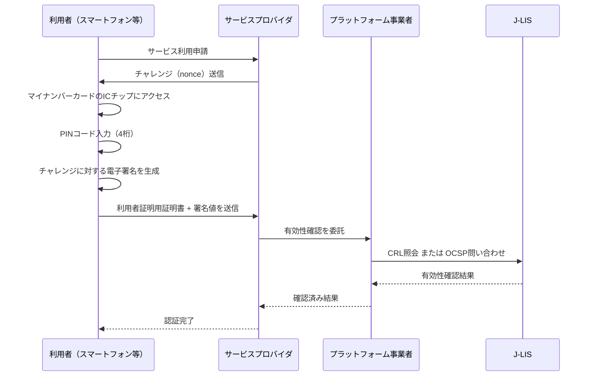

> **Note:** このページはAIエージェントが執筆しています。内容の正確性は一次情報（仕様書・公式資料）とあわせてご確認ください。

# 公的個人認証サービス（JPKI）

## 概要

公的個人認証サービス（JPKI: Japanese Public Key Infrastructure）は、マイナンバーカード（個人番号カード）のICチップに格納された電子証明書を活用し、オンライン上での本人確認・電子署名を実現する日本国の公開鍵基盤です。地方公共団体情報システム機構（J-LIS）がルート認証局として運営し、デジタル庁が政策管轄を担っています（[デジタル庁 JPKI](https://www.digital.go.jp/en/policies/mynumber/private-business/jpki-introduction)）。

JPKIの核心は「国が発行した証明書を民間が活用する」という信頼モデルにあります。行政が保証した個人の身元情報に基づく電子証明書を、金融・通信・医療などの民間事業者が本人確認に利用できます。2026年2月時点で1,183社以上の民間企業が導入しており、eKYC（非対面本人確認）の基盤として急速に普及しています。

## 背景と経緯

### 住民基本台帳ネットワーク（住基ネット）から個人番号カードへ

JPKIの前身は2003年に開始した住基カードによる電子証明書サービスです。しかし、住基カードは利用者が限定的で普及が進まなかった（人口比で数パーセント程度）ことから、2016年のマイナンバー制度導入とともに個人番号カードへ移行し、制度として再設計されました。

### 電子署名法との関係

JPKIは**電子署名及び認証業務に関する法律**（電子署名法、2001年施行）に基づく特定認証業務として位置づけられています。署名用電子証明書は同法第3条の「電磁的記録の真正な成立の推定」（いわゆる「二段の推定」）が適用される法的効力を持ちます（[電子署名法第3条](https://laws.e-gov.go.jp/law/412AC0000000102)）。

### 個人情報保護とマイナンバーとの分離

重要な設計判断として、JPKIはマイナンバー（12桁の個人番号）そのものを認証・署名に使用しません。電子証明書のシリアル番号は住民票コードから生成されますが、マイナンバーとは別体系の識別子です。このアーキテクチャは「マイナンバーをネットワークに流通させない」という政策要件に対応しています（[公的個人認証サービスポータル](https://www.jpki.go.jp/)）。

## PKI階層構造

JPKIは日本国をトラストアンカーとした3層のPKI階層で構成されています（[総務省 公的個人認証サービスの概要](https://www.soumu.go.jp/kojinbango_card/kojinninshou-01.html)）。

```
日本国政府 (トラストアンカー)
    │
    ▼
J-LIS ルート認証局 (Root CA)
    │
    ├── 署名用認証局 (署名用電子証明書を発行)
    │       │
    │       └── 利用者の署名用電子証明書
    │
    └── 利用者証明用認証局 (利用者証明用電子証明書を発行)
            │
            └── 利用者の利用者証明用電子証明書
```

J-LISが2種類の認証局を運営し、それぞれ異なる用途の証明書を発行します。ルート証明書は政府の制度として管理されるため、ブラウザの商用ルートストアには含まれておらず、検証には別途J-LISのルート証明書を取得する必要があります。

## 電子証明書の種類

### 署名用電子証明書

| 属性             | 内容                                      |
| ---------------- | ----------------------------------------- |
| 用途             | 電子申請・電子署名（e-Tax、行政手続き等） |
| 有効期間         | 5年（発行日から）                         |
| 失効条件         | 住所・氏名・生年月日・性別の変更時        |
| PINコード        | 6〜16桁の英数字                           |
| PINロック        | 5回誤入力でロック                         |
| 暗号アルゴリズム | RSA-2048 / SHA-256（現行）                |
| 含まれる属性     | 氏名・住所・生年月日・性別（基本4情報）   |

署名用電子証明書に含まれる「基本4情報」（氏名・住所・生年月日・性別）は、電子署名の法的効力根拠となるとともに、民間事業者が本人確認書類として利用できる情報です。ただし、この情報は住所変更時に証明書が失効するため、常に最新状態を反映している設計になっています。

### 利用者証明用電子証明書

| 属性             | 内容                                         |
| ---------------- | -------------------------------------------- |
| 用途             | ウェブサービスへのログイン・コンビニ交付     |
| 有効期間         | 5年（発行日から）                            |
| 失効条件         | カード紛失・廃止時（住所変更では失効しない） |
| PINコード        | 4桁の数字                                    |
| PINロック        | 3回誤入力でロック                            |
| 暗号アルゴリズム | RSA-2048 / SHA-256（現行）                   |
| 含まれる属性     | 基本4情報を含まない（識別のみ）              |

利用者証明用電子証明書は基本4情報を含まないため、プライバシー影響が小さい認証専用の証明書です。マイナポータルへのログイン、コンビニでの住民票・戸籍等の取得、健康保険証としての利用（オンライン資格確認）に使用されます。

## ICチップの構造

マイナンバーカードはISO/IEC 7816準拠の接触インターフェースとISO/IEC 14443 TypeB準拠の非接触インターフェースを備えたコンビネーション型ICカードです。ICチップには4つのカードアプリケーション（AP）が搭載されています（[マイナンバーカードの技術仕様](https://tex2e.github.io/blog/crypto/my-number-card)）。

| カードAP       | 主な用途                         |
| -------------- | -------------------------------- |
| JPKI-AP        | 電子証明書による署名・認証       |
| 券面AP         | 顔写真等の画像データ保持         |
| 券面入力補助AP | 氏名・生年月日等のテキストデータ |
| 住基AP         | 住民票コードの管理               |

秘密鍵はICチップ内の耐タンパ領域に格納され、カード外部に取り出すことはできません。耐タンパ性設計により、物理的な解析攻撃に対して内部情報が自動削除される仕組みを備えています。

## 認証フロー

### 利用者証明用電子証明書による認証（ワ方式）

非対面での本人確認における典型的なフローです。



### 有効性確認の方式

JPKIは証明書の失効確認として2つの方式を提供しています（[デジタル庁 JPKI民間事業者向け](https://www.soumu.go.jp/kojinbango_card/kojinninshou-02.html)）。

| 方式     | 仕組み                         | 更新頻度 | 接続要件             |
| -------- | ------------------------------ | -------- | -------------------- |
| CRL方式  | 失効証明書リストのダウンロード | 1日1回   | 事前ダウンロード可能 |
| OCSP方式 | リアルタイムの失効状態照会     | 15分ごと | オンライン必須       |

CRL方式はオフライン環境や低レイテンシ要件に適し、OCSP方式はリアルタイム性が求められる金融取引等に適しています。

## 民間利用の仕組み

### 2つの事業者区分

民間事業者がJPKIを利用するには、デジタル庁（旧：総務大臣）の認定を取得する必要があります。2023年1月から当面の期間、確認手数料が無料化されており、導入障壁が低減されています。

**プラットフォーム事業者**

- 総務大臣認可を直接受ける
- 署名検証設備を自社に保有（クラウド可）
- J-LISと直接インターフェースを持つ
- 他のサービスプロバイダ事業者に検証サービスを提供できる

**サービスプロバイダ事業者**

- プラットフォーム事業者に有効性確認を委託
- 独自の署名検証インフラが不要
- 小規模事業者でも導入しやすい構造

認可取得から実際の運用開始まで通常6〜12ヶ月を要するため、早めの準備が推奨されています。

### eKYC（非対面本人確認）における活用

JPKIを用いたオンライン本人確認は「ワ方式」として犯罪収益移転防止法（犯収法）の本人確認方法として認定されています。従来の「ホ方式」（本人確認書類の画像と顔写真の照合）は、身分証偽造技術の高度化により信頼性が低下したため、2027年4月施行の改正犯収法により原則廃止される予定です（[改正犯収法施行に関する解説](https://biz.trustdock.io/column/after202704-amlcft)）。

この変更により、銀行口座開設・携帯電話契約・証券口座開設等の非対面手続きでは、マイナンバーカードのICチップ読み取り（ワ方式）が事実上の標準手法となります。

## スマートフォン搭載サービス

物理カードを携帯せずに電子証明書を利用するため、スマートフォンへの搭載サービスが順次展開されています。

| プラットフォーム | サービス開始  | 状況                                      |
| ---------------- | ------------- | ----------------------------------------- |
| Android          | 2023年5月     | 約200機種対応。2026年秋に刷新版へ移行予定 |
| iPhone（iOS）    | 2025年6月24日 | 対応モデルで利用可能                      |

スマートフォン搭載サービスでは、物理カードのPINコードの代わりに顔認証・指紋認証（生体認証）での本人確認も可能です。これにより、マイナンバーカードを常時携帯する必要がなくなります（[デジタル庁 スマートフォン搭載サービス](https://www.digital.go.jp/en/policies/mynumber/smartphone-certification)）。

## 次期マイナンバーカード（2028年度予定）

デジタル庁は当初2026年度を目標に次期個人番号カードの導入を進めていましたが、2025年6月の閣議決定「デジタル社会の実現に向けた重点計画」において導入時期が2028年度へ変更されました。主な変更点は以下のとおりです（[デジタル庁 次期個人番号カードタスクフォース](https://www.digital.go.jp/en/councils/mynumber-card-renewal/58b82d5b-338d-4f5b-be7e-7b771135e2c3)）。

**暗号方式の刷新**

- 現行のRSA-2048（SHA-256）から ECDSA-384（SHA-384）へ移行
- セキュリティ強度が128bitから192bitに向上
- これにより証明書チェーン検証のコードも変更が必要

**証明書有効期間の延長**

- 現行5年から10年へ延長（18歳未満は5年）
- 更新コストが半減する一方、失効管理の重要性が高まる

**暗証番号の統合**

- 現行4種類の暗証番号を2種類に統合
- ユーザービリティの改善が期待される

**券面の変更**

- 性別欄を表面から削除し、ICチップ内へ移行（プライバシー保護）
- フリガナ・ローマ字表記の追加
- 「日本国 JAPAN」の表記追加（国際的な本人確認書類としての利便性向上）

## 実装上の注意点

### 証明書失効への対応

署名用電子証明書は住所・氏名等の変更時に失効します。転居・改姓後に旧証明書で署名された文書の扱いについては、サービスごとのポリシーで明示的に定める必要があります。

CRL/OCSPによる失効確認は必ず実施してください。署名時刻の証明が必要な場面ではタイムスタンプ（RFC 3161）と組み合わせるアーキテクチャが推奨されます。

### PINロックへの対応

署名用電子証明書のPINは5回誤入力でロックされます。ロック解除は市区町村窓口のほか、スマートフォンアプリやコンビニのマルチコピー機からも手続きが可能です。UXとして、PIN入力失敗時の残回数表示と、ロック前の警告を実装することが推奨されます。

### ルート証明書の管理

J-LISのルート証明書は商用ブラウザのルートストアに含まれていません。署名検証を行うシステムでは、J-LISから配布されるルート証明書を適切に管理・更新する仕組みが必要です。次期マイナンバーカードでは暗号アルゴリズムが変更されるため、移行期間中はデュアルアルゴリズム対応が求められます。

### プラットフォーム事業者の活用

独自のPKI検証インフラを構築するよりも、既存のプラットフォーム事業者（Liquid、MYNAWALLET、Primagestなど）のAPIを活用することで、導入期間の短縮とコスト削減が可能です。認可取得の手続きを代行してもらえるケースもあります。

### 基本4情報の取り扱い

署名用電子証明書に含まれる氏名・住所・生年月日・性別は、個人情報保護法上の個人情報に該当します。目的外利用の禁止・安全管理措置等の法令上の義務に加え、JPKIの利用規約上も適切な管理が求められます。

## 採用事例

| 分野         | 利用形態                              |
| ------------ | ------------------------------------- |
| 銀行・証券   | 口座開設時の非対面本人確認（ワ方式）  |
| 携帯電話契約 | 本人確認書類の代替                    |
| 保険         | 保険資格確認（健康保険証機能）        |
| 医療         | オンライン資格確認（マイナ保険証）    |
| 行政         | e-Tax・マイナポータル・各種行政手続き |
| コンビニ     | 住民票・戸籍謄本等の交付              |

2026年2月時点で1,183社以上の民間企業が導入済みであり、今後の犯収法改正（ホ方式廃止）を受けてさらなる普及が見込まれます（[デジタル庁 JPKI導入企業一覧](https://www.digital.go.jp/en/policies/mynumber/private-business/jpki-introduction/mynumbercard-user-list)）。

## 関連仕様・後継動向

- **電子署名法**（2001年、[e-Gov](https://laws.e-gov.go.jp/law/412AC0000000102)）: JPKIの法的根拠
- **犯罪収益移転防止法**（[e-Gov](https://laws.e-gov.go.jp/law/419AC0000000022)）: eKYCの本人確認方法を規定。2027年4月改正でワ方式一本化
- **行政手続きにおけるオンラインによる本人確認の手法に関するガイドライン**（デジタル庁）: LoA（Level of Assurance）の整理
- **ISO/IEC 7816**: ICカードの接触インターフェース規格。マイナンバーカードのJPKI-APが準拠
- **RFC 5280**: X.509 PKI証明書の標準仕様。JPKIの証明書フォーマットの基礎
- **RFC 6960（OCSP）**: オンライン証明書状態確認プロトコル。JPKIの有効性確認に使用
- **RFC 5652（CMS）**: 暗号メッセージ構文。電子署名のデータ形式の基礎

## 参考資料

- [公的個人認証サービス ポータルサイト (J-LIS)](https://www.jpki.go.jp/)
- [デジタル庁 JPKI民間事業者向け説明](https://www.digital.go.jp/en/policies/mynumber/private-business/jpki-introduction)
- [総務省 公的個人認証サービスによる電子証明書（民間事業者向け）](https://www.soumu.go.jp/kojinbango_card/kojinninshou-02.html)
- [デジタル庁 スマートフォン搭載サービス](https://www.digital.go.jp/en/policies/mynumber/smartphone-certification)
- [デジタル庁 次期個人番号カードタスクフォース（第4回）](https://www.digital.go.jp/en/councils/mynumber-card-renewal/58b82d5b-338d-4f5b-be7e-7b771135e2c3)
- [改正犯収法によるeKYC変更点解説](https://biz.trustdock.io/column/after202704-amlcft)
- [JPKI技術解説：デジタル署名と公開鍵基盤（Pocketsign）](https://pocketsign.co.jp/blog/8)
- [マイナンバーカードの技術仕様（tex2e.github.io）](https://tex2e.github.io/blog/crypto/my-number-card)
