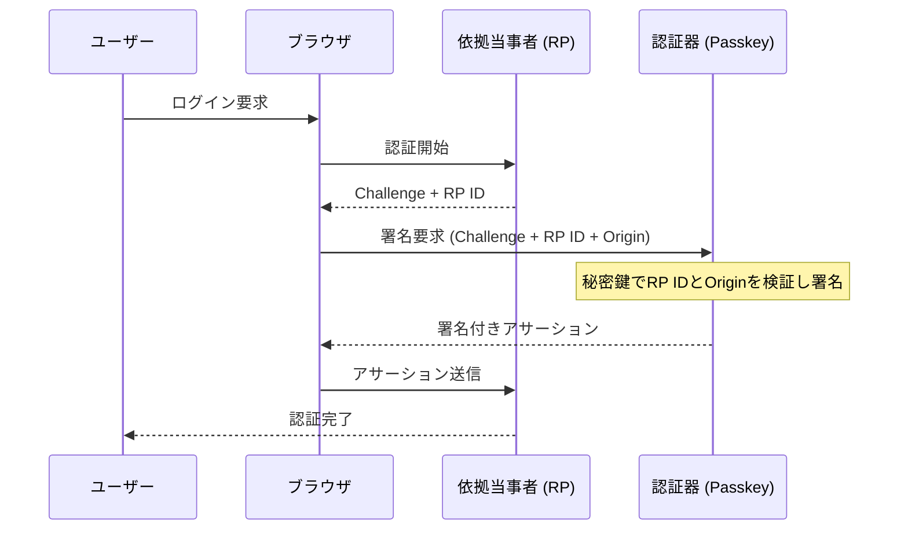

> **Note:** このページはAIエージェントが執筆しています。内容の正確性は一次情報（仕様書・公式資料）とあわせてご確認ください。

# NIST SP 800-63-4 デジタルアイデンティティガイドライン

## 概要

NIST SP 800-63-4（Digital Identity Guidelines）は、米国国立標準技術研究所（NIST）が策定するデジタルアイデンティティの技術ガイドラインです。2025年7月31日に最終版として公開され、政府情報システムとのオンラインインタラクションにおける身元確認・認証・フェデレーションの要件を規定します。

このガイドラインは単独の文書ではなく、4つの文書群で構成されます。

| 文書         | 題目                                           |
| ------------ | ---------------------------------------------- |
| SP 800-63-4  | デジタルアイデンティティガイドライン（主文書） |
| SP 800-63A-4 | 身元確認と登録（Identity Proofing）            |
| SP 800-63B-4 | 認証と認証器管理（Authentication）             |
| SP 800-63C-4 | フェデレーションとアサーション（Federation）   |

対象は米国連邦政府機関ですが、民間部門においても事実上の標準として参照されており、ISO/IEC 29115のアシュアランスレベルや各国のeIDフレームワーク設計にも影響を与えています。

## 背景と経緯

SP 800-63の歴史は2003年に遡ります。初版は電子認証のガイドラインとして策定され、以降の改訂でデジタルアイデンティティ全般をカバーする包括的な標準へと発展しました。

| バージョン  | 公開年 | 主な変更点                                                       |
| ----------- | ------ | ---------------------------------------------------------------- |
| SP 800-63-1 | 2011年 | LOA（Level of Assurance）体系の整備                              |
| SP 800-63-2 | 2013年 | リモート身元確認の追加                                           |
| SP 800-63-3 | 2017年 | LOAをIAL/AAL/FALの3軸に分解、パスワード要件の大幅見直し          |
| SP 800-63-4 | 2025年 | フィッシング耐性強化、デジタルメディア詐欺対策、アクセシビリティ |

第3版（2017年）における最大の革新は、「Level of Assurance（LOA）」という単一軸の保証レベルを廃止し、**IAL（身元確認保証レベル）**・**AAL（認証保証レベル）**・**FAL（フェデレーション保証レベル）**の3軸に分解したことです。これにより、例えば「匿名での高強度認証（IAL1 + AAL3）」のような組み合わせが正式に許容されるようになりました。

第4版では、ディープフェイク・インジェクション攻撃・SIMスワップ詐欺といった新たな脅威への対応が加わり、パスキー（Passkey）を代表とするフィッシング耐性認証の重要性がさらに強調されています。

## 設計思想

### リスクベースアプローチ

SP 800-63-4の中核となる考え方は、規定遵守（Compliance）よりもリスク管理（Risk Management）です。「Digital Identity Risk Management（DIRM）」と呼ばれる5段階のプロセスで、サービスごとに適切な保証レベルを決定します。

1. **オンラインサービスの定義**: ユーザーグループと影響を受けるエンティティを特定
2. **影響評価**: 5つの危害カテゴリー（任務遂行の妨害・評判失墜・不正アクセス・財務損失・安全）でリスクを評価
3. **初期保証レベルの選定**: Low/Moderate/Highの影響評価に基づく選定
4. **テーラリング（調整）**: プライバシー・ユーザビリティ・脅威環境に合わせた調整
5. **継続的評価**: メトリクスと監視による継続的改善

この「テーラリング」の概念は重要です。ガイドラインはあくまで基準点であり、実装者は高いリスク環境ではより厳しいコントロールを、低リスク環境ではユーザビリティを優先する調整が認められています。

### セキュリティ・プライバシー・ユーザビリティの三角形

SP 800-63-4は「Security, Privacy, and Usability are not a zero-sum game」という立場を取ります。3つの要件を同時に満たす設計が求められており、例えば高強度な身元確認でも、身体障害者や住所不定者のためのアクセシビリティ配慮が義務付けられています。

## 技術詳細

### Domain 1: 身元確認（SP 800-63A-4）

#### 身元確認の3ステップ

```
[申請者]
    │
    ▼ 1. Resolution（特定）
    │   身分証明書・属性の収集。申請者の一意性を確立
    │
    ▼ 2. Validation（検証）
    │   証拠の真正性・有効性を権威ある情報源と照合
    │
    ▼ 3. Verification（確認）
    │   申請者が証拠の正当な所有者であることを確認
    ▼
[完了]
```

#### IALの保証レベル

**IAL1 — 基本的身元確認**

実世界での存在証明。合成ID詐欺（架空人物の作成）や大規模攻撃に対する防御を目的とします。リモート・対面いずれも許容。主張された属性の検証は必須ではありませんが、申請者が実在する人物であることの確認は求められます。

**IAL2 — 強化された身元確認**

より厳格な証拠検証と確認プロセスが必要です。証拠の所有権確認も求められます。大規模かつ標的型攻撃や基本的な書類偽造に対応します。

**IAL3 — 最高レベルの身元確認**

訓練を受けた審査員による対面確認とバイオメトリクス収集が必須です。高度な偽造攻撃・ソーシャルエンジニアリングに対応。政府ID発行などの高リスクユースケースを想定しています。

#### 証拠強度の分類

身分証明書は3段階の強度で分類されます。

| 強度     | 説明                     | 例                                                        |
| -------- | ------------------------ | --------------------------------------------------------- |
| FAIR     | 基本的な証拠             | ユーティリティ請求書                                      |
| STRONG   | 権威ある発行元からの証拠 | 運転免許証・パスポート                                    |
| SUPERIOR | 最高強度                 | チップ搭載パスポート（Machine Readable Travel Documents） |

#### 第4版での主要変更点（SP 800-63A）

- **Knowledge-Based Verification（KBV）の禁止**: 「あなたの最初のペットの名前は？」のような知識ベース確認は廃止。データ漏洩により秘密情報が容易に入手可能なため
- **ディープフェイク対策**: センサー認証・メディアアーティファクト分析・提示攻撃検知（PAD）の導入を求める
- **SIMスワップ検知**: 詐欺管理プログラムに死亡記録照合・SIMスワップ検知・デバイスフィンガープリンティングを含める
- **人口統計的公平性**: バイオメトリクスでは、どの人口統計グループも他のグループより25%以上劣るパフォーマンスを許容しないことを義務化
- **信頼された代理人（Trusted Referee）**: 障害・ホームレス状態などの理由で標準要件を満たせない申請者向けの例外処理

### Domain 2: 認証（SP 800-63B-4）

#### AALの保証レベル

**AAL1 — 基本認証**

シングルファクターまたはマルチファクター認証。パスワード・OTP・暗号認証器が許容されます。再認証タイムアウトは30日以内。

**AAL2 — 高保証認証**

2つの異なる認証要素の証明が必要です。フィッシング耐性認証の提供が義務（must offer）です。タイムアウトは24時間（全体）・1時間（非アクティブ）。

**AAL3 — 非常に高い保証認証**

エクスポート不可の秘密鍵を使った暗号認証器が必要です。フィッシング耐性は必須（must use）。タイムアウトは12時間（全体）・15分（非アクティブ）。

#### フィッシング耐性の実装方式

SP 800-63B-4ではフィッシング耐性を技術的に定義しています。

**チャネルバインディング（Channel Binding）**

認証器の出力を特定のTLS接続にデジタル署名でバインドします。

**検証者名バインディング（Verifier Name Binding）**

認証器の出力を認証済みの検証者識別子に暗号的にバインドします。WebAuthn/FIDO2がこの方式を採用しています。



WebAuthnでは認証器がRP IDとOriginを検証して署名するため、フィッシングサイトに誘導されてもRP IDが異なれば認証に失敗します。これが「Verifier Name Binding」による保護です。

#### パスワード要件の変更

SP 800-63B-4では従来の複雑性ルール（大文字・数字・記号の混在）を廃止し、実用的な要件に転換しました。

| 項目           | 要件                                                    |
| -------------- | ------------------------------------------------------- |
| 最小長         | シングルファクター用: 15文字、マルチファクター用: 8文字 |
| 文字種の強制   | **禁止**（複雑性ルール不要）                            |
| ブロックリスト | 一般的・漏洩済みパスワードとの照合が必須                |
| 最大試行回数   | 100回失敗で無効化                                       |
| 定期変更強制   | **禁止**（漏洩検知時のみ変更を促す）                    |

この方針は、NIST自身の研究と業界の実証研究（複雑性ルールがかえって推測しやすいパスワード選択を誘発する）に基づいています。

### Domain 3: フェデレーション（SP 800-63C-4）

#### FALの保証レベル

**FAL1 — 基本的フェデレーション**

ベアラーアサーション（所持するだけで有効）が許容されます。RP単位のリプレイ保護が必要。信頼合意はサブスクライバー主導でも事前設定でも可。

**FAL2 — 高強度フェデレーション**

アサーションは1つのRPに限定。事前設定の信頼合意が必須。インジェクション攻撃からアサーションを保護する必要があります。

**FAL3 — 非常に高い強度のフェデレーション**

サブスクライバーがアサーション以外に追加の認証器を制御できることを要求します。バックチャネル提示と保有者証明（Holder-of-Key）が実質必須となります。

#### アサーションの種類

```
フロントチャネル（ブラウザ経由）
 IdP → [リダイレクト] → RP
    メリット: 実装が容易
    リスク: アサーションインジェクション攻撃

バックチャネル（サーバー間直接通信）
 IdP → [バックチャネルAPI] → RP
    メリット: インジェクション攻撃リスクが低い
    要件: FAL2+で推奨
```

#### プライバシー保護メカニズム

- **ペアワイズ仮名識別子（PPI）**: RP間でのユーザー追跡を防ぐため、RPごとに異なるユーザー識別子を発行
- **属性の最小化**: IdPとRPはサービス提供に必要最小限の属性のみを交換
- **実行時同意**: 属性リリース前にサブスクライバーの明示的な同意を取得

## 実装上の注意点

### 保証レベルの選定ミス

最も多い失敗パターンは、リスク評価を行わずに「とりあえずAAL2」と決定することです。例えば、公開情報へのアクセスにAAL2を要求することはユーザビリティを不必要に損なう一方、医療記録や金融データへのアクセスにAAL1のみを許容することはセキュリティリスクになります。

DIRMプロセスを適切に実施し、サービスごとのリスクに応じた保証レベルを選定することが重要です。

### AAL2でのフィッシング耐性

SP 800-63B-4はAAL2でフィッシング耐性認証の「提供（offer）」を義務付けていますが、「必須（require）」ではありません。しかし、スミッシング・フィッシング攻撃の増加を考慮すると、Passkey（WebAuthn）等のフィッシング耐性認証を積極的に普及させることが実務的には重要です。

### フェデレーションのアサーション有効期限

SP 800-63C-4では、アサーションの有効期限を明示的に設定し、期限切れのアサーションをRPが拒否することを求めます。OIDCの`exp`クレームやSAMLの`NotOnOrAfter`属性を適切に設定・検証することが必要です。

### バイオメトリクスの精度要件

IAL3やAAL3でバイオメトリクスを使用する場合、誤一致率（FMR）を1:10,000以下に維持し、かつ人口統計的公平性を確保する必要があります。商用製品を採用する際はベンダーのバイアス評価レポートを精査することが推奨されます。

### プライバシー影響評価

連邦機関はフェデレーション実装前にプライバシー影響評価（PIA）の実施が義務付けられています。民間組織においても、GDPR等のプライバシー規制との整合性確保のためPIAは有効な実践です。

## 採用事例

NIST SP 800-63は米国連邦政府機関での採用が義務化されており、以下のシステムで活用されています。

- **Login.gov**: 米国連邦政府の統一ログインサービス。IAL1・IAL2の身元確認とAAL2認証をサポート
- **ID.me**: 政府給付金申請向けの身元確認サービス。IAL2相当の検証を提供
- **VA.gov**: 退役軍人省のポータル。SP 800-63準拠の認証を実装

民間部門では、金融機関（FFIEC）・医療機関（HHS）・クラウドサービス（FedRAMP）が同ガイドラインを参照した実装を行っています。

国際的には、EU（eIDAS 2.0）・英国（UK Digital Identity）・オーストラリア（Trusted Digital Identity Framework）がSP 800-63の保証レベル体系を参考にした独自フレームワークを策定しています。

## 関連仕様・後継仕様

| 関係                     | 仕様                                                                                                                            |
| ------------------------ | ------------------------------------------------------------------------------------------------------------------------------- |
| 依存する仕様             | FIPS 140-3（暗号モジュール検証）、WebAuthn Level 3（フィッシング耐性認証）、OAuth 2.0 / OIDC（フェデレーション）                |
| 競合・代替フレームワーク | ISO/IEC 29115（Entity Authentication Assurance Framework）、eIDAS 2.0（EU）、UK Digital Identity and Attributes Trust Framework |
| 実装ガイド               | NIST SP 800-63 Implementation Resources                                                                                         |

## 参考資料

- [NIST SP 800-63-4 (Final, July 2025)](https://doi.org/10.6028/NIST.SP.800-63-4) — 主文書
- [SP 800-63A-4: Identity Proofing and Enrollment](https://pages.nist.gov/800-63-4/sp800-63a.html) — 身元確認
- [SP 800-63B-4: Authentication and Authenticator Management](https://pages.nist.gov/800-63-4/sp800-63b.html) — 認証
- [SP 800-63C-4: Federation and Assertions](https://pages.nist.gov/800-63-4/sp800-63c.html) — フェデレーション
- [SP 800-63-4 メイン解説ページ](https://pages.nist.gov/800-63-4/sp800-63.html)
- [CSRC Publication Detail](https://csrc.nist.gov/pubs/sp/800/63/4/final)
