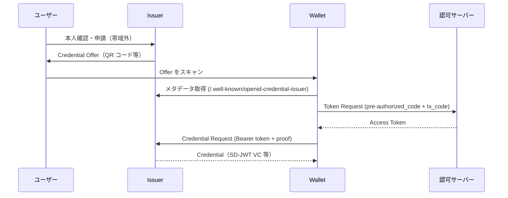
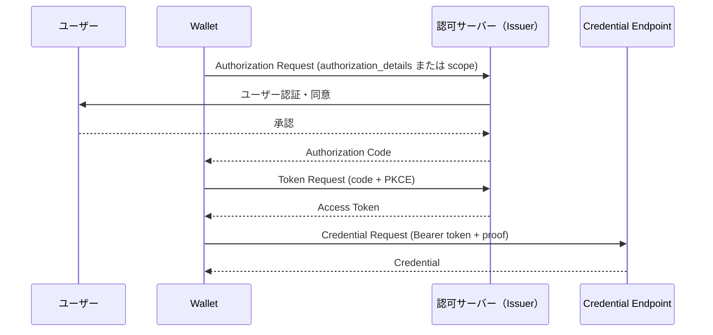

> **Note:** このページはAIエージェントが執筆しています。内容の正確性は一次情報（仕様書・公式資料）とあわせてご確認ください。

# OpenID for Verifiable Credential Issuance 1.0 (OID4VCI)

## 概要

**OpenID for Verifiable Credential Issuance 1.0**（OID4VCI）は、OAuth 2.0 を基盤として Verifiable Credential（VC）を安全に発行するための標準プロトコルです。
OpenID Foundation の Digital Credentials Protocols（DCP）ワーキンググループが策定し、2025年9月16日に Final Specification として承認されました（[仕様書](https://openid.net/specs/openid-4-verifiable-credential-issuance-1_0-final.html)）。

OID4VCI が解決する核心的な問題は「**誰が、どのウォレットに、どのクレデンシャルを発行するか**」を標準化することです。
W3C Verifiable Credentials Data Model（VCDM）が「クレデンシャルのデータ形式」を定義するのに対し、OID4VCI は「**クレデンシャルの発行プロセス**」を定義します。
これにより、異なる Issuer と Wallet の組み合わせでも一貫した相互運用性が実現されます。

## 背景と経緯

Verifiable Credentials の普及を阻んできた大きな障壁の1つが、発行プロトコルの非標準化でした。
各エコシステム（欧州 EUDI Wallet、mDoc、W3C VC など）が独自の発行フローを実装しており、Wallet ベンダーは複数のプロトコルをそれぞれ実装する必要がありました。

OID4VCI は OAuth 2.0（RFC 6749）の実績あるセキュリティモデルと拡張性を活用することで、この課題を解決します。
既存の OpenID Connect インフラとの共存が可能で、Identity Provider として機能する Issuer が認可サーバーを兼任するアーキテクチャも、分離するアーキテクチャも両方サポートします。

Final Specification への投票結果（承認 102 票、反対 1 票、棄権 12 票）が示すように、業界のコンセンサスは高く、EUDI Wallet 準拠や OpenID4VC High Assurance Interoperability Profile（HAIP, 執筆時点では Draft 04）などとの連携で実用化が加速しています。

## 設計思想

### OAuth 2.0 拡張としての設計

OID4VCI は新しいプロトコルを一から定義するのではなく、OAuth 2.0 の枠組みを最大限に活用する設計を採用しています。
認可コード取得・アクセストークン発行・保護されたリソースへのアクセス、という OAuth 2.0 の基本フローをそのまま継承し、「Credential Endpoint」という新しい保護リソースを追加することでクレデンシャル発行を実現しています。

この設計には次のようなメリットがあります。

- 既存の OAuth 2.0 / OpenID Connect インフラを再利用できる
- セキュリティコミュニティが長年検証してきたセキュリティモデルを継承できる
- RFC 9449（DPoP）、RFC 9126（PAR）、RFC 9396（RAR）など OAuth 2.0 エコシステムの拡張をそのまま利用できる

### フォーマット非依存の設計

OID4VCI は特定の VC フォーマットに依存しません。
Issuer のメタデータ（`/.well-known/openid-credential-issuer`）で対応フォーマットを宣言し、Wallet はそれを読み取って適切なリクエストを構成します。
現在サポートされている主要フォーマットは次の3種類です。

| フォーマット | 識別子                   | 根拠仕様              |
| ------------ | ------------------------ | --------------------- |
| SD-JWT VC    | `vc+sd-jwt`              | IETF SD-JWT VC        |
| ISO mdoc     | `mso_mdoc`               | ISO/IEC 18013-5       |
| W3C VCDM     | `ldp_vc` / `jwt_vc_json` | W3C VC Data Model 2.0 |

### 2つの認可フロー

クレデンシャル発行のユースケースは多様です。
窓口での即時発行（本人確認済み）から、オンライン申請後に審査を経て発行するケースまで様々です。
OID4VCI はこれに対応するため、2つの認可フローを定義しています。

## 技術詳細

### Credential Offer

発行プロセスは **Credential Offer** によって開始されます。
Issuer が発行可能なクレデンシャルの情報を Wallet に伝えるオブジェクトで、QR コードや Deep Link（`openid-credential-offer://` スキーム）として Wallet に提示されます。

```json
{
  "credential_issuer": "https://issuer.example.com",
  "credential_configuration_ids": ["UniversityDegree_JWT"],
  "grants": {
    "urn:ietf:params:oauth:grant-type:pre-authorized_code": {
      "pre-authorized_code": "oaKazRN8I0IbtZ0C7JuMn5",
      "tx_code": {
        "length": 6,
        "input_mode": "numeric",
        "description": "SMS で送付した6桁のコードを入力してください"
      }
    }
  }
}
```

Credential Offer は値として直接渡す方法（`credential_offer` パラメーター）と、URL 参照として渡す方法（`credential_offer_uri`）の2種類があります。
大きなオブジェクトは URL 参照が推奨されます。

### Pre-Authorized Code フロー

Issuer がユーザー認証・認可を帯域外（out-of-band）で完了させ、事前発行コードを Wallet に渡す方式です。



**Transaction Code（`tx_code`）** は Pre-Authorized Code のリプレイ攻撃を防ぐ重要なセキュリティ機構です。
SMS や郵送など別チャネルで届いたコードを Wallet が入力することで、`pre-authorized_code` を入手した攻撃者がそのコードだけでクレデンシャルを取得できないようにします。

### Authorization Code フロー

Wallet がユーザーを Issuer の認可エンドポイントにリダイレクトし、ユーザーが認証・同意を行う標準的な OAuth 2.0 フローです。



`authorization_details` を使う場合、`openid_credential` 型のオブジェクトで取得したいクレデンシャルを指定します（[RFC 9396](https://www.rfc-editor.org/rfc/rfc9396)）。

```json
{
  "type": "openid_credential",
  "credential_configuration_id": "UniversityDegree_JWT"
}
```

### Issuer メタデータ

Wallet は `/.well-known/openid-credential-issuer` から Issuer の設定を取得します。

```json
{
  "credential_issuer": "https://issuer.example.com",
  "credential_endpoint": "https://issuer.example.com/credential",
  "deferred_credential_endpoint": "https://issuer.example.com/deferred",
  "notification_endpoint": "https://issuer.example.com/notification",
  "nonce_endpoint": "https://issuer.example.com/nonce",
  "credential_configurations_supported": {
    "UniversityDegree_JWT": {
      "format": "vc+sd-jwt",
      "scope": "UniversityDegree",
      "cryptographic_binding_methods_supported": ["jwk"],
      "credential_signing_alg_values_supported": ["ES256"],
      "display": [
        {
          "name": "大学卒業証明書",
          "locale": "ja-JP"
        }
      ]
    }
  }
}
```

### Credential Request と Proof

クレデンシャルを要求する際、Wallet はアクセストークンとともに **Proof of Possession**（鍵所有証明）を送ります。
これにより Issuer は「このクレデンシャルを受け取るウォレットが確かにその鍵ペアを保持している」ことを確認でき、クレデンシャルをその公開鍵に Bind できます。

Proof の代表的な形式は JWT です。

```json
{
  "proof_type": "jwt",
  "jwt": "eyJhbGciOiJFUzI1NiIsInR5cCI6Im9wZW5pZDR2Y2ktcHJvb2Yrand0In0.eyJpc3MiOiJzNkJoZFJrcXQzIiwiYXVkIjoiaHR0cHM6Ly9pc3N1ZXIuZXhhbXBsZS5jb20iLCJpYXQiOjE3MDAwMDAwMDAsIm5vbmNlIjoibFVqRDA4Q3d0R1lkT3JqVVVKQTEifQ.signature"
}
```

Proof の JWT には `c_nonce`（Credential Nonce）を含める必要があります。
nonce は Nonce Endpoint または前のクレデンシャルレスポンスから取得し、Issuer はその使い捨て性を検証することでリプレイ攻撃を防ぎます。

### 遅延発行（Deferred Issuance）

審査が必要なクレデンシャル（例: 運転免許証の更新）では、即座に発行できないケースがあります。
OID4VCI は **Deferred Credential Endpoint** による遅延発行をサポートします。

1. Credential Endpoint が即時発行できない場合、`transaction_id` を返す
2. Wallet は指定された `interval`（秒）待機してから Deferred Credential Endpoint にポーリング
3. 発行準備が完了すれば Credential を返し、未完であれば `issuance_pending` エラーを返す

### Notification Endpoint

Wallet がクレデンシャルを正常に保存したか、または失敗したかを Issuer に通知するエンドポイントです。
Issuer はこの通知を監査ログや UX 改善に活用できます。

```json
{
  "notifications": [
    {
      "event": "credential_accepted",
      "credential_id": "cred-abc123"
    }
  ]
}
```

## 実装上の注意点

### Pre-Authorized Code の取り扱い

仕様書 Section 13 は「**Pre-Authorized Code を単独で取得できる者は、追加のセキュリティ措置なしにクレデンシャルを受け取れる**」と明記しています。
`tx_code` を必須とすることを強く推奨します。
特に QR コードで Offer を提示する場合、QR 画像を第三者が入手するリスクがあります。

### nonce の再利用防止

Proof に含める `c_nonce` は必ず一度限りの使用とし、Issuer 側で使用済み nonce のリストを管理する必要があります。
nonce の再利用を許すと、正規の Credential Request を傍受した攻撃者が同一の nonce で別のクレデンシャルを不正取得できます。

### PKCE と PAR の使用

Authorization Code フローでは PKCE（RFC 7636）と Pushed Authorization Requests（PAR, RFC 9126）の使用を強く推奨します。
PKCE は認可コードの横取り攻撃を防ぎ、PAR はリクエストの完全性を保証します。

### 分割アーキテクチャの Wallet

クラウド鍵管理と端末 UI が分離した Wallet（Split Architecture）では、コンポーネント間の通信路のセキュリティと鍵の独立性に注意が必要です。
仕様書 Section 13.4 はこの構成特有のリスクを詳述しています。

### 相関リスク

Credential Offer の `pre-authorized_code`、Credential Request の `c_nonce`、アクセストークンなど一連の値が固定であると、複数のオブザーバーがこれらを突き合わせてユーザーのアイデンティティを追跡できます。
実装では各値を単一トランザクションに限定し、長期に渡る追跡が困難になるよう設計してください。

### Wallet Attestation

Issuer が「正規の Wallet のみにクレデンシャルを発行したい」要件がある場合、**Wallet Attestation**（仕様書 Appendix D・E）を使用します。
Wallet Attestation は Wallet プロバイダーが発行する JWT で、そのウォレットの完全性を証明します。
Issuer は Credential Request 受信時にこの Attestation を検証し、未認定の Wallet への発行を拒否できます。

## 採用事例

OID4VCI は次のエコシステムで採用が進んでいます。

| エコシステム                                                        | 用途                                         |
| ------------------------------------------------------------------- | -------------------------------------------- |
| EU Digital Identity Wallet（EUDI Wallet）                           | EU 市民向け電子身分証・各種資格証明の発行    |
| OpenID4VC High Assurance Interoperability Profile（HAIP, Draft 04） | 高保証 VC エコシステムの相互運用プロファイル |
| 各国デジタルウォレット実証実験                                      | 運転免許証・学位証明・医療資格等の VC 化     |

OpenID Foundation は 2025 年を通じて複数回の相互運用イベントを実施し、複数の Issuer と Wallet の組み合わせで動作することを検証しています（[参照](https://openid.net/oidf-demonstrates-interoperability-of-new-digital-identity-issuance-standards/)）。

## 関連仕様・後継仕様

| 仕様                                                                                                      | 関係                                                     |
| --------------------------------------------------------------------------------------------------------- | -------------------------------------------------------- |
| [RFC 6749](https://www.rfc-editor.org/rfc/rfc6749) — OAuth 2.0                                            | 基盤となる認可フレームワーク                             |
| [RFC 9396](https://www.rfc-editor.org/rfc/rfc9396) — RAR                                                  | `authorization_details` による細粒度のクレデンシャル要求 |
| [RFC 9126](https://www.rfc-editor.org/rfc/rfc9126) — PAR                                                  | Authorization Request のセキュアな送信                   |
| [RFC 7636](https://www.rfc-editor.org/rfc/rfc7636) — PKCE                                                 | Authorization Code 横取り攻撃防止                        |
| [RFC 9449](https://www.rfc-editor.org/rfc/rfc9449) — DPoP                                                 | アクセストークンへの Proof of Possession 付与            |
| [OID4VP 1.0](https://openid.net/specs/openid-4-verifiable-presentations-1_0-final.html)                   | 発行した VC の提示プロトコル                             |
| [SIOPv2 (Draft 13)](https://openid.net/specs/openid-connect-self-issued-v2-1_0.html)                      | 自己発行型 ID トークンとの組み合わせ                     |
| [W3C VC Data Model 2.0](https://www.w3.org/TR/vc-data-model-2.0/)                                         | 発行されるクレデンシャルのデータモデル                   |
| [HAIP (Draft 04)](https://openid.net/specs/openid4vc-high-assurance-interoperability-profile-1_0-04.html) | 高保証シナリオ向けの実装プロファイル                     |

## 参考資料

- [OpenID for Verifiable Credential Issuance 1.0 — Final Specification](https://openid.net/specs/openid-4-verifiable-credential-issuance-1_0-final.html)（OpenID Foundation, 2025-09-16）
- [OID4VCI Final Specification Approved — OpenID Foundation Blog](https://openid.net/openid-for-verifiable-credential-issuance-1-final-specification-approved/)
- [OIDF Demonstrates Interoperability of OpenID4VCI Spec](https://openid.net/oidf-demonstrates-interoperability-of-new-digital-identity-issuance-standards/)
- [OpenID4VC High Assurance Interoperability Profile 1.0](https://openid.net/specs/openid4vc-high-assurance-interoperability-profile-1_0-04.html)
- [RFC 9396 — OAuth 2.0 Rich Authorization Requests](https://www.rfc-editor.org/rfc/rfc9396)
- [RFC 9126 — OAuth 2.0 Pushed Authorization Requests](https://www.rfc-editor.org/rfc/rfc9126)
