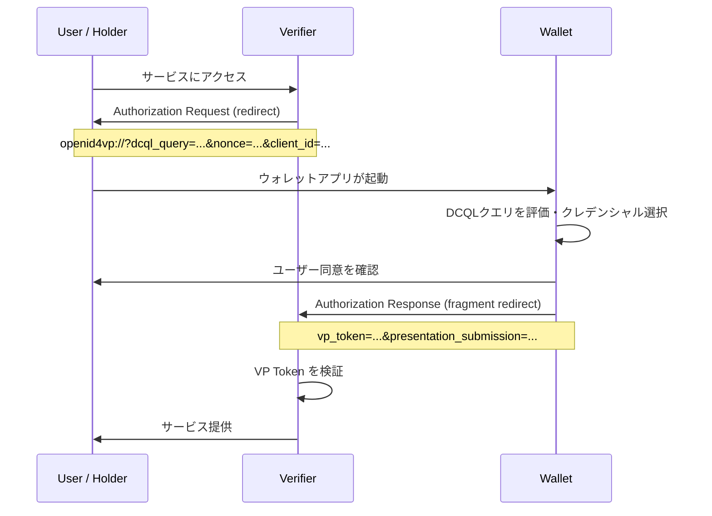
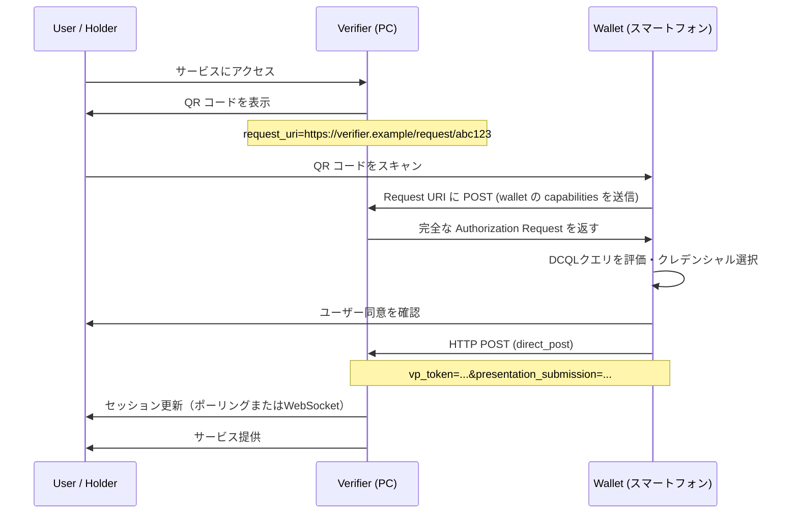

> **Note:** このページはAIエージェントが執筆しています。内容の正確性は一次情報（仕様書・公式資料）とあわせてご確認ください。

# OpenID for Verifiable Presentations (OID4VP) 1.0

## 概要

OpenID for Verifiable Presentations（OID4VP）は、OAuth 2.0 を基盤として Verifiable Credential のプレゼンテーション（提示）を標準化するプロトコルです。検証者（Verifier）がウォレット（Wallet）に対してクレデンシャルの提示を要求し、保有者（Holder）が同意した上で暗号学的に検証可能な形式で応答する仕組みを定義します。

2025年7月10日に OpenID Foundation の最終仕様（Final Specification）として承認されており、W3C Verifiable Credentials Data Model・ISO/IEC 18013-5（mdoc）・IETF SD-JWT VC の3つのクレデンシャルフォーマットをサポートします。EUDI Wallet をはじめとする主要なデジタルアイデンティティエコシステムの中核プロトコルとして採用されています。

**正式名称**: OpenID for Verifiable Presentations 1.0
**公式 URL**: <https://openid.net/specs/openid-4-verifiable-presentations-1_0-final.html>
**ステータス**: Final Specification（2025年7月10日承認）
**策定組織**: OpenID Digital Credentials Protocols (DCP) Working Group

## 背景と経緯

Verifiable Credential の発行フローを定義した OID4VCI に対して、OID4VP はその「提示」側を担います。OAuth 2.0 には本来、クレデンシャルの提示という概念は存在しませんでした。既存の `id_token` や `userinfo` による属性伝達は発行者（IdP）が仲介する中央集権的なモデルであり、保有者がクレデンシャルをウォレットに保管して任意の検証者に提示するという自己主権型のユースケースには対応できていませんでした。

Draft 段階では `presentation_definition`（Presentation Exchange 仕様）を用いてクレデンシャル要件を表現していましたが、Draft 22 以降は独自のクエリ言語 **DCQL（Digital Credentials Query Language）** が導入され、Draft 26 で Presentation Exchange のサポートが廃止されました。最終仕様は DCQL を唯一の要件記述方式として採用しています。

OID4VCI と OID4VP は相補的な関係にあります。OID4VCI が「どのように発行するか」を定めるのに対し、OID4VP は「どのように提示・検証するか」を定めます。両仕様を組み合わせることで、発行から検証までの完全なライフサイクルをカバーします。

## 設計思想

### OAuth 2.0 の拡張としての位置づけ

OID4VP は OAuth 2.0 の Authorization Request/Response の仕組みをそのまま活用します。検証者は OAuth クライアントとして動作し、認可リクエストにクレデンシャル要件を追加します。これにより、既存の OAuth インフラと互換性を保ちながら、クレデンシャル提示という新しい用途を実現できます。

一方で、従来の OAuth と異なるのは「認可サーバー = ウォレット」という点です。リソースオーナー（ユーザー）がクレデンシャルを保管するウォレットが認可サーバーとして機能し、ユーザーの同意を得た上でプレゼンテーションを返します。アクセストークンではなく VP Token がレスポンスとして返される点が特徴的です。

### フォーマット非依存の設計

クレデンシャルフォーマットは W3C VC・mdoc・SD-JWT VC と異なるバイナリ/テキスト形式を持ちますが、OID4VP はフォーマット固有の処理を Appendix に切り出し、コアプロトコルをフォーマット非依存に保っています。この設計により、新しいクレデンシャルフォーマットが登場しても Appendix を追加するだけでプロトコル本体を変更せずに対応できます。

### 最小開示原則の実装

DCQL のクレームクエリを使うことで、検証者は必要なクレームのみを宣言的に指定できます。ウォレットは要求されたクレームのみを選択的に開示した Verifiable Presentation を作成し、余分な情報をプレゼンテーションから除外します。SD-JWT VC の選択的開示機能と組み合わせることで、データ最小化の原則を技術レベルで実現します。

## 技術詳細

### 登場人物

OID4VP では以下の3つのエンティティが相互作用します。

| エンティティ         | 役割                                                                 |
| -------------------- | -------------------------------------------------------------------- |
| Holder（保有者）     | クレデンシャルの所有者。ウォレットを操作して提示に同意する           |
| Verifier（検証者）   | クレデンシャルの提示を要求する OAuth クライアント                    |
| Wallet（ウォレット） | Holder のクレデンシャルを管理し、OID4VP の認可サーバーとして機能する |

### プロトコルフロー

OID4VP は2つの基本フローを定義します。

#### 同一デバイスフロー（Same-Device Flow）

検証者とウォレットが同一デバイス上で動作するケースです。ブラウザからウォレットアプリへのリダイレクトが典型例です。



デフォルトの `response_mode` は `fragment` です。VP Token は URL フラグメントに含まれてリダイレクトされるため、ブラウザ履歴には残りません。

#### クロスデバイスフロー（Cross-Device Flow）

検証者（例: PC 上のウェブサイト）とウォレット（例: スマートフォン）が異なるデバイスにある場合です。QR コードを使ってデバイス間のブリッジを実現します。



クロスデバイスフローでは `response_mode=direct_post` を使用します。ウォレットがリダイレクトではなく HTTP POST でレスポンスを送信するため、大きなペイロードを扱えます。また、`request_uri_method=post` を使うことでウォレットが自身のサポートするフォーマット情報を検証者に事前に通知し、適切なクレデンシャルフォーマットでの要求を受け取れます。

### Authorization Request

検証者が送信する認可リクエストの主要パラメーターは以下のとおりです。

| パラメーター      | 必須                 | 説明                                              |
| ----------------- | -------------------- | ------------------------------------------------- |
| `response_type`   | 必須                 | `vp_token`（SIOPv2 統合時は `vp_token id_token`） |
| `client_id`       | 必須                 | 検証者の識別子。プレフィックス付き                |
| `nonce`           | 必須                 | リプレイ攻撃防止用のランダム値（128ビット以上）   |
| `dcql_query`      | 条件付き必須         | クレデンシャル要件の DCQL クエリ                  |
| `response_mode`   | 推奨                 | `fragment`（デフォルト）/ `direct_post`           |
| `response_uri`    | `direct_post` 時必須 | VP Token の送信先 URL                             |
| `state`           | 推奨                 | セッション状態の管理・CSRF 防止                   |
| `request_uri`     | 推奨                 | JAR（RFC 9101）による Request Object の URL       |
| `client_metadata` | 任意                 | 検証者のメタデータ（JWK・サポートフォーマット等） |

### DCQL（Digital Credentials Query Language）

DCQL は検証者がどのクレデンシャルのどのクレームを必要とするかを JSON で記述するクエリ言語です。Presentation Exchange に代わって OID4VP 1.0 の標準クエリ方式となりました。

#### 基本構造

```json
{
  "credentials": [
    {
      "id": "pid",
      "format": "dc+sd-jwt",
      "meta": {
        "vct_values": ["https://credentials.example.com/identity_credential"]
      },
      "claims": [{ "path": ["given_name"] }, { "path": ["family_name"] }, { "path": ["birthdate"] }]
    }
  ]
}
```

- `credentials`: 要求するクレデンシャルのリスト（必須）
- `id`: トランザクション内でのクレデンシャルの識別子
- `format`: クレデンシャルのフォーマット（`dc+sd-jwt`・`mso_mdoc`・`jwt_vc_json` 等）
- `meta`: フォーマット固有のフィルター（発行者・クレデンシャルタイプ等）
- `claims`: 開示を要求するクレームのパスリスト

#### credential_sets による論理制約

複数のクレデンシャルを組み合わせた複雑な要件は `credential_sets` で表現できます。

```json
{
  "credentials": [
    { "id": "pid", "format": "dc+sd-jwt", ... },
    { "id": "pid_mdoc", "format": "mso_mdoc", ... },
    { "id": "photo_id", "format": "dc+sd-jwt", ... }
  ],
  "credential_sets": [
    {
      "purpose": "Identity Verification",
      "required": true,
      "options": [["pid"], ["pid_mdoc"]]
    }
  ]
}
```

この例では、PID（SD-JWT 形式）または PID（mdoc 形式）のいずれか一方を提示すれば要件を満たします。

### Client Identifier Prefix

OID4VP では、`client_id` にプレフィックスを付けることで検証者の認証方式を指定します。ウォレットはプレフィックスに基づいて適切な検証処理を実行します。

| プレフィックス              | 認証方式                             | 用途                         |
| --------------------------- | ------------------------------------ | ---------------------------- |
| `redirect_uri:`             | 署名なし（client_metadata のみ）     | 低リスクな環境               |
| `x509_san_dns:`             | X.509 証明書（DNS SAN 検証）         | 企業システム・一般的なウェブ |
| `x509_hash:`                | X.509 証明書（ハッシュ検証）         | 証明書ピンニング             |
| `verifier_attestation:`     | JWT アテステーション（PoP 署名付き） | 規制対応エコシステム         |
| `openid_federation:`        | OpenID Federation トラストチェーン   | 連合ベースのエコシステム     |
| `decentralized_identifier:` | DID 解決による公開鍵取得             | 分散型アイデンティティ       |

例えば `x509_san_dns:verifier.example.com` という `client_id` は、DNS 名 `verifier.example.com` を持つ X.509 証明書で要求に署名する検証者であることを示します。ウォレットは証明書チェーンとリクエスト署名の両方を検証します。

### VP Token

検証者へのレスポンスに含まれる `vp_token` は、一つ以上の Verifiable Presentation を格納するコンテナです。フォーマットによって内部構造が異なります。

**SD-JWT VC の場合**: キーバインディング（KB-JWT）付きの SD-JWT が返されます。

```
eyJhbGciOiJFUzI1NiIsInR5cCI6InZjK3NkLWp3dCJ9.eyJzdWIiOiJ1c2VyX2lkIiwi...~eyJhbGciOiJFUzI1NiJ9.eyJub25jZSI6InJhbmRvbV9ub25jZSIsImF1ZCI6Imh0dHBzOi8vdmVyaWZpZXIuZXhhbXBsZSJ9.signature
```

KB-JWT の `nonce` クレームにリクエストの `nonce` が含まれ、リプレイ攻撃を防ぎます。

**mdoc の場合**: `DeviceResponse` 構造が返されます。`SessionTranscript` に `nonce` と検証者の公開鍵が含まれ、デバイスバインディングを実現します。

`presentation_submission` は提示したクレデンシャルが DCQL クエリのどの要件を満たすかのマッピングを示します。

## 実装上の注意点

### nonce の適切な生成と検証

`nonce` はリプレイ攻撃を防ぐ最重要パラメーターです。以下の点を守る必要があります。

- **生成**: 暗号学的に安全な乱数生成器（CSPRNG）を使用し、128ビット以上のエントロピーを確保
- **保存**: 検証者側でリクエストに紐づけて保存（セッション or データベース）
- **検証**: レスポンスの VP Token 内の KB-JWT / DeviceResponse から `nonce` を抽出し、送信値と一致することを確認
- **一回限り**: 同一 `nonce` を2度使用しない

ホルダーバインディングなし（Holder Binding なし）のプレゼンテーションを要求する場合は、代わりに `state` パラメーター（128ビット以上）を使ってリプレイ防止を実現します。

### レスポンス URI の検証

`direct_post` モードでは、ウォレットが検証者の `response_uri` に VP Token を HTTP POST します。悪意ある検証者が `response_uri` に任意のエンドポイントを指定してトークンを横取りする攻撃を防ぐため、ウォレットは以下を確認します。

- `response_uri` が `client_id` または登録済みのエンドポイントに一致すること
- Client Identifier Prefix に対応した認証（証明書・DID・アテステーション）が有効であること

### Presentation Exchange との互換性の喪失

Draft 26 以前の実装が `presentation_definition` を使用している場合、OID4VP 1.0 Final との相互運用性がありません。既存システムをアップグレードする際は DCQL への移行が必要です。移行期間中は `scope` パラメーターを使ったスコープベースの要求（事前定義されたプレゼンテーション要件を URI で参照）が橋渡しになることがあります。

### Verifier のトラスト検証

ウォレットは検証者の身元を適切に検証しなければなりません。特に `verifier_attestation` や `openid_federation` を使う場合は、アテステーション JWT の署名検証・有効期限確認・信頼アンカーからのチェーン検証が必要です。検証が不十分だと、フィッシングウォレットが正規の検証者を装ってクレデンシャルを詐取できます。

### transaction_data の型検証

OID4VP は `transaction_data` パラメーターで取引固有の情報（例: 支払い承認・同意内容）をリクエストに含める仕組みを定義しています。ウォレットは未知の `transaction_data` 型を拒否しなければなりません。未知の型を無視してプレゼンテーションを続けると、ユーザーが内容を理解していない取引に同意させられるリスクがあります。

## 採用事例

### EUDI Wallet（欧州デジタルアイデンティティウォレット）

EU の eIDAS 2.0 規制に基づく EUDI Wallet の Architecture and Reference Framework（ARF）では、OID4VP を遠隔提示（Remote Presentation）の標準プロトコルとして採用しています。PID（Person Identification Data）の提示、(Q)EAA（電子的属性認証）の検証のすべてに OID4VP が使われます。

### OpenWallet Foundation

OpenWallet Foundation では、OID4VC（OID4VCI + OID4VP）・DCQL・OpenID Federation の TypeScript 実装プロジェクトを孵化させており（2025年2月）、オープンソースのウォレット実装のリファレンスとなっています。

### 適合性試験

OpenID Foundation は 2026年2月から OID4VP 1.0 の自己認証プログラムを開始しており、SD-JWT VC 形式のクレデンシャルを対象とした適合性テストが利用可能です（mdoc のテストは順次追加予定）。

## 関連仕様・後継仕様

| 仕様                                 | 関係                                                                              |
| ------------------------------------ | --------------------------------------------------------------------------------- |
| [OID4VCI](./oid4vci.md)              | 相補的：クレデンシャルの発行フロー                                                |
| SIOPv2                               | 統合可能：`id_token` と `vp_token` を組み合わせた OIDC 互換フロー                 |
| [RFC 6749 — OAuth 2.0](./rfc6749.md) | 基盤：認可リクエスト・レスポンスの仕組み                                          |
| RFC 9101 — JAR                       | 依存：署名済み Request Object による要求の完全性保護                              |
| [RFC 7519 — JWT](./rfc7519.md)       | 依存：JWT ベースのトークン・クレームの基盤                                        |
| OpenID Federation 1.0                | 関連：Client Identifier Prefix のひとつとして利用可能                             |
| W3C Digital Credentials API          | 関連：ブラウザ/OS レベルのウォレット呼び出しインターフェース（Appendix A で定義） |
| SD-JWT VC                            | 関連：OID4VP で最も広く使われるクレデンシャルフォーマット                         |
| ISO 18013-5 — mdoc                   | 関連：mDL（モバイル運転免許証）フォーマットのサポート                             |

## 参考資料

- [OpenID for Verifiable Presentations 1.0 — Final Specification](https://openid.net/specs/openid-4-verifiable-presentations-1_0-final.html)
- [OpenID Foundation: OID4VP 1.0 Final Specification Approved](https://openid.net/openid-for-verifiable-presentations-1-0-final-specification-approved/)
- [OpenID Foundation: OpenID Developers — Specs](https://openid.net/developers/specs/)
- [RFC 9101 — JWT-Secured Authorization Request (JAR)](https://www.rfc-editor.org/rfc/rfc9101)
- [RFC 6749 — OAuth 2.0 Authorization Framework](https://www.rfc-editor.org/rfc/rfc6749)
- [EUDI Wallet Architecture and Reference Framework](https://eu-digital-identity-wallet.github.io/eudi-doc-architecture-and-reference-framework/)
- [OpenWallet Foundation: OID4VC TypeScript プロジェクト](https://openwallet.foundation/2025/02/25/openid4vc-dcql-and-openid-federation-three-new-fundamental-typescript-projects-incubated-at-openwallet-foundation/)
- [OpenID Foundation: OID4VP 自己認証プログラム](https://openid.net/openid-for-verifiable-credential-self-certification-to-launch-feb-2026/)
