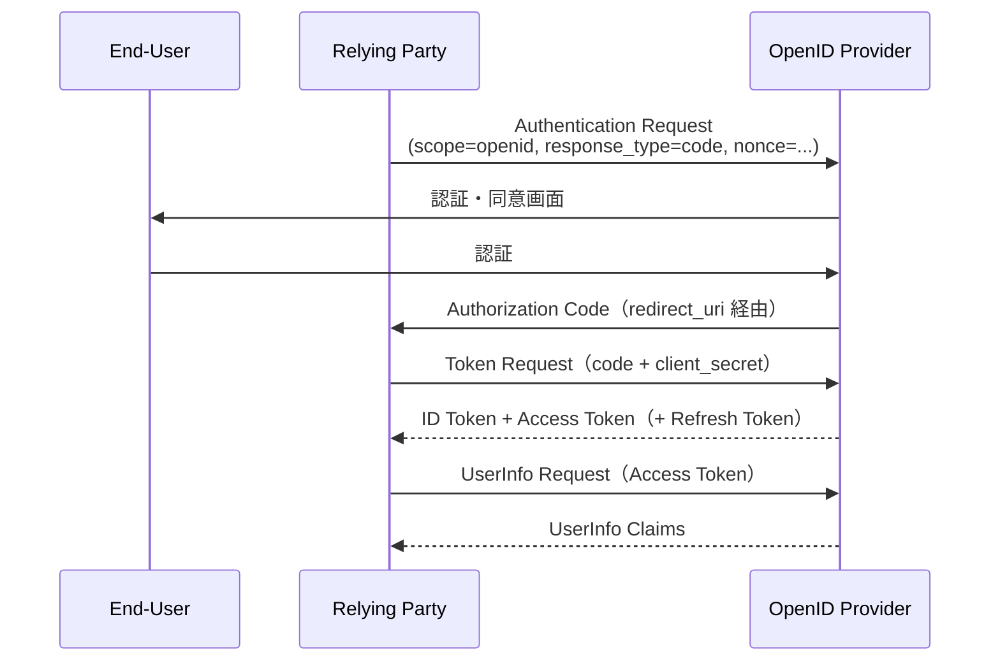

> **Note:** このページはAIエージェントが執筆しています。内容の正確性は一次情報（仕様書・公式資料）とあわせてご確認ください。

# OpenID Connect Core 1.0

## 概要

[OpenID Connect Core 1.0](https://openid.net/specs/openid-connect-core-1_0.html)（以下 OIDC Core）は、OAuth 2.0 の認可フレームワークの上に **認証（Authentication）** レイヤーを追加する仕様です。2014 年 2 月に Final として公開され、2023 年 12 月に Errata Set 2 が適用された現行バージョンが最新です。

OAuth 2.0（RFC 6749）は「誰がどのリソースにアクセスできるか」という認可を扱いますが、「今ログインしているのは誰か」という認証は定義していません。OIDC Core はこのギャップを埋め、クライアント（Relying Party、RP）が認可サーバー（OpenID Provider、OP）によって実施された認証を検証できるようにします。具体的には、**ID Token**（認証結果を含む JWT）と **UserInfo エンドポイント**（プロフィール情報を返す保護リソース）を新たに導入します。

現在、Google、Microsoft、Apple、LINE などほぼすべての主要な SSO 基盤がこの仕様に準拠しており、OID4VCI / OID4VP（Verifiable Credentials）や FAPI 2.0 などの発展的仕様の基盤にもなっています。

## 背景と経緯

### OAuth 2.0 だけでは認証できない理由

OAuth 2.0 のアクセストークンは「何に」アクセスできるかを表しますが、「誰が認証されたか」を直接伝えません。そのため、OAuth 2.0 が普及した 2010 年代前半には、独自の認証プロトコル（Facebook Connect、Google OpenID 2.0 など）が乱立しました。

OpenID 2.0（旧世代の OpenID）は SAML に似たリダイレクトベースのプロトコルで、OAuth 2.0 との統合が難しく、モバイルアプリへの対応も困難でした。OIDC はこの反省から、OAuth 2.0 のフローを最大限に再利用しつつ、最小限の拡張で認証を実現するよう設計されました。

### 仕様の位置付け

OIDC は単一の仕様ではなく、Core を中心とした仕様ファミリーを形成しています。

| 仕様                                           | 用途                                 |
| ---------------------------------------------- | ------------------------------------ |
| OpenID Connect Core 1.0                        | 認証フロー・ID Token・UserInfo       |
| OpenID Connect Discovery 1.0                   | OP のメタデータ自動探索              |
| OpenID Connect Dynamic Client Registration 1.0 | クライアントの動的登録               |
| OpenID Connect Session Management 1.0          | セッション管理（postMessage ベース） |
| OpenID Connect Front-Channel Logout 1.0        | フロントチャネルログアウト           |
| OpenID Connect Back-Channel Logout 1.0         | バックチャネルログアウト             |
| OpenID Connect RP-Initiated Logout 1.0         | RP 起点のログアウト                  |

## 設計思想

### OAuth 2.0 の最小拡張

OIDC Core の最大の特徴は、OAuth 2.0 のフローをほぼそのまま使い、**最小限の変更**で認証を実現している点です。必須の変更は以下の3点のみです。

1. `scope` パラメーターに `openid` を追加する
2. トークンレスポンスに `id_token` フィールドを追加する
3. `nonce` パラメーターでリプレイ攻撃を防ぐ

これにより、OAuth 2.0 に対応した既存のインフラを大幅な変更なしに OIDC に対応させられます。

### ID Token による改ざん防止

ID Token は JWT（RFC 7519）形式の署名付きトークンです。RP はトークンを受け取った後に OP の公開鍵で署名を検証でき、仲介者による改ざんを検出できます。アクセストークンとは異なり、ID Token はリソースサーバーへのアクセスには使わず、あくまで「認証の証明」として機能します。

### 3 フローの住み分け

OIDC Core は用途に応じた 3 つのフローを定義しています（詳細は後述）。ただし、セキュリティ上の問題から現在は Authorization Code Flow + PKCE（RFC 7636）の組み合わせが強く推奨されており、Implicit Flow は事実上非推奨です。

## 技術詳細

### 認証フロー

#### Authorization Code Flow（推奨）

`response_type=code` を使う最も安全なフローです。すべてのトークンはフロントチャネル（ブラウザ）を経由せず、バックチャネル（サーバー間 HTTP）を通じて取得します。



**メリット**: トークンがブラウザの URL に露出しない。リフレッシュトークンが使える。PKCE と組み合わせることでパブリッククライアントでも安全に使える。

#### Implicit Flow（非推奨）

`response_type=id_token` または `response_type=id_token token`。ID Token が Authorization エンドポイントのフラグメント（`#`）として直接返されます。Token エンドポイントを使わないため実装は単純ですが、以下の理由から現在は非推奨です。

- トークンがブラウザ履歴・サーバーログに残る可能性がある
- Access Token の有効性検証（`at_hash`）が必須だが見落とされやすい
- トークン置換攻撃（Token Substitution Attack）のリスク
- OAuth Security BCP（RFC 9700）では明示的に非推奨とされている

#### Hybrid Flow

`response_type` に `code id_token`、`code token`、`code id_token token` を指定するフロー。Authorization エンドポイントから一部のトークンを即座に取得しつつ、Token エンドポイントでも取得できます。特定の UI 要件がある場合に使われますが、一般的な用途では Authorization Code Flow で十分です。

### Authentication Request

OIDC の認証リクエストは OAuth 2.0 の認可リクエストを拡張したものです。

```
GET /authorize?
  response_type=code
  &scope=openid%20profile%20email
  &client_id=s6BhdRkqt3
  &redirect_uri=https%3A%2F%2Fclient.example.org%2Fcb
  &state=af0ifjsldkj
  &nonce=n-0S6_WzA2Mj HTTP/1.1
```

| パラメーター    | 必須/任意    | 説明                                                                               |
| --------------- | ------------ | ---------------------------------------------------------------------------------- |
| `scope`         | 必須         | `openid` を含むこと。`profile`・`email`・`address`・`phone` で追加クレームを要求可 |
| `response_type` | 必須         | フローを決定（`code`、`id_token`、`token` の組み合わせ）                           |
| `client_id`     | 必須         | RP の識別子                                                                        |
| `redirect_uri`  | 必須         | 事前登録した URI と完全一致が必要                                                  |
| `state`         | 推奨         | CSRF 対策。ランダム値をブラウザのセッションと紐付ける                              |
| `nonce`         | 条件付き必須 | Implicit/Hybrid Flow では必須。リプレイ攻撃対策                                    |
| `max_age`       | 任意         | 最後の認証からの最大経過時間（秒）。超過時は再認証を強制                           |
| `prompt`        | 任意         | `none`（インタラクションなし）、`login`（再認証強制）、`consent`（同意要求）など   |
| `acr_values`    | 任意         | 要求する認証コンテキストクラス（例: `urn:mace:incommon:iap:silver`）               |

### ID Token

ID Token は OIDC の中核です。認証結果を JWT として表現し、RP が OP の公開鍵で署名を検証できます。

```json
{
  "iss": "https://server.example.com",
  "sub": "248289761001",
  "aud": "s6BhdRkqt3",
  "nonce": "n-0S6_WzA2Mj",
  "exp": 1311281970,
  "iat": 1311280970,
  "auth_time": 1311280969,
  "acr": "urn:mace:incommon:iap:silver",
  "amr": ["pwd", "totp"],
  "at_hash": "77QmUPtjPfzWtF2AnpK9RQ"
}
```

**必須クレーム:**

| クレーム | 説明                                                              |
| -------- | ----------------------------------------------------------------- |
| `iss`    | 発行者の URL（`https` スキーム必須）                              |
| `sub`    | ユーザーのサブジェクト識別子（発行者内でユニーク、最大 255 文字） |
| `aud`    | 対象クライアント（`client_id` を含むこと）                        |
| `exp`    | 有効期限（Unix 時刻）。この時刻を過ぎた ID Token は拒否する       |
| `iat`    | 発行時刻                                                          |

**重要な任意クレーム:**

| クレーム    | 説明                                                               |
| ----------- | ------------------------------------------------------------------ |
| `nonce`     | リクエストの `nonce` と同一値（リプレイ攻撃対策）                  |
| `auth_time` | 実際に認証が行われた時刻。`max_age` 指定時は必須                   |
| `acr`       | 認証コンテキストクラス（多要素認証レベルなど）                     |
| `amr`       | 使用した認証方式の配列（例: `["pwd", "totp"]`）                    |
| `at_hash`   | Access Token のハッシュ。Implicit/Hybrid Flow でのトークン置換対策 |
| `azp`       | 認可された当事者（複数 audience がある場合）                       |

### ID Token の検証

RP は受け取った ID Token を以下の手順で検証しなければなりません（[Section 3.1.3.7](https://openid.net/specs/openid-connect-core-1_0.html#IDTokenValidation)）。仕様では 13 のステップが定義されており、以下は主要なものの抜粋です。

1. ID Token が暗号化されている場合は復号する
2. `iss` が期待する OP と完全一致することを確認
3. `aud` に自分の `client_id` が含まれることを確認
4. `azp` クレームがある場合、その値が `client_id` と一致することを確認
5. JWT 署名を OP の公開鍵（JWK）で検証する。Authorization Code Flow の場合、Token エンドポイントとの直接通信（TLS）が担保されていれば、署名検証の代わりに TLS サーバー検証を使ってもよい
6. `alg` ヘッダーが登録時に指定した値と一致することを確認。`none` は Token エンドポイント経由の ID Token では原則禁止
7. `exp` が現在時刻より未来であることを確認
8. `iat` が現在時刻から極端に離れていないことを確認（許容範囲は実装に依存）
9. `nonce` がリクエスト時の値と一致することを確認（リクエスト時に `nonce` を送った場合）
10. `acr` が要求したクラスを満たすことを確認（`acr_values` を指定した場合）
11. `auth_time` が `max_age` の制約内であることを確認（`max_age` を指定した場合）

### UserInfo エンドポイント

UserInfo エンドポイントは、Access Token を Bearer トークンとして提示することで、追加のユーザー属性を取得できる保護リソースです。

```http
GET /userinfo HTTP/1.1
Host: server.example.com
Authorization: Bearer SlAV32hkKG
```

レスポンス:

```json
{
  "sub": "248289761001",
  "name": "Jane Doe",
  "given_name": "Jane",
  "family_name": "Doe",
  "preferred_username": "j.doe",
  "email": "janedoe@example.com",
  "email_verified": true,
  "picture": "http://example.com/janedoe/me.jpg"
}
```

`sub` クレームは必須で、ID Token の `sub` と一致しなければなりません。RP は `sub` の一致確認を怠ると、認証済みユーザーとは異なるユーザーのクレームを誤って処理するリスクがあります。

### 標準クレームとスコープ

OIDC Core Section 5.1 では、プロフィール情報を表す標準クレームを定義しています。スコープ値によってクレームのグループを要求できます。

| スコープ  | 含まれるクレーム                                                                                                                                                                 |
| --------- | -------------------------------------------------------------------------------------------------------------------------------------------------------------------------------- |
| `profile` | `name`, `family_name`, `given_name`, `middle_name`, `nickname`, `preferred_username`, `profile`, `picture`, `website`, `gender`, `birthdate`, `zoneinfo`, `locale`, `updated_at` |
| `email`   | `email`, `email_verified`                                                                                                                                                        |
| `address` | `address`（`street_address`, `locality`, `region`, `postal_code`, `country` を含む構造体）                                                                                       |
| `phone`   | `phone_number`, `phone_number_verified`                                                                                                                                          |

## 実装上の注意点

### 1. Implicit Flow は使わない

上述のとおり、Implicit Flow はトークンをフラグメント（ブラウザ URL の `#` 以降）として返すため、ブラウザ履歴・ログ・Referer ヘッダーを通じたトークン漏洩リスクがあります。SPA（Single Page Application）を含むすべての用途で Authorization Code Flow + PKCE を使ってください。

### 2. nonce の適切な実装

nonce の目的は「このレスポンスが自分のリクエストに対するものである」ことの確認です。実装時の注意点:

- **十分なエントロピー**: 予測不能な暗号論的乱数を使う（例: 128 ビット以上）
- **保存と検証**: セッションストレージに保存し、レスポンスの `nonce` クレームと照合する
- **使い捨て**: 一度使用した nonce は再利用しない
- **Implicit Flow では必須**: Authorization Code Flow でも強く推奨

### 3. state による CSRF 対策

`state` パラメーターは OAuth 2.0 で推奨される CSRF 対策です。OIDC でも `nonce` と並んで必ず実装してください。ランダム値を HTTP セッションまたはクッキーと紐付け、コールバック時に照合します。

### 4. redirect_uri の厳密な検証

OP は `redirect_uri` を**事前登録した URI と完全一致**で検証しなければなりません。部分一致やワイルドカードを許可すると、Open Redirect を通じたトークン窃取につながります。

### 5. at_hash による Access Token の整合性確認

Hybrid Flow や Implicit Flow で Access Token を受け取る場合、ID Token 内の `at_hash` クレームと照合してトークン置換攻撃を防いでください。`at_hash` は Access Token の SHA-256 ハッシュの左半分を Base64URL エンコードした値です。

### 6. sub クレームの取り扱い

`sub` はユーザーを識別する一意の識別子ですが、**発行者（OP）ごとに異なる**可能性があります。複数の OP を使う場合は `iss + sub` の組み合わせでユーザーを識別してください。同一ユーザーでも OP が異なれば `sub` は異なります。

### 7. ID Token の署名アルゴリズム

デフォルトは `RS256`（RSA + SHA-256）です。`HS256`（HMAC-SHA256）は対称鍵を使うため、単一クライアントとの間でのみ使えます。複数の RP に対して ID Token を発行する OP では、`RS256` または `ES256` などの非対称アルゴリズムを使用してください。

また、`alg: none`（署名なし）の JWT を受け入れる実装は深刻な脆弱性をもたらします。仕様では Token エンドポイント経由で受け取る ID Token に `none` を使うことを原則禁止しています。ライブラリ側での明示的な拒否設定も確認してください。

## 採用事例

- **Google Identity Platform**: Google Sign-In は OIDC Core に完全準拠しており、`https://accounts.google.com` を Issuer とした ID Token を発行します
- **Microsoft Entra ID（旧 Azure AD）**: Microsoft 365 / Azure のすべての認証で OIDC Core を使用
- **Apple Sign In**: Apple ID によるサードパーティログインで OIDC を採用
- **LINE Login**: LINE プラットフォームの認証 API
- **Keycloak / Auth0 / Okta**: 主要な IdP/IAM 製品はすべて OIDC Core に対応
- **EUDI Wallet（European Digital Identity Wallet）**: OIDC4VP 経由で OIDC Core のフローを利用
- **FAPI 2.0**: 金融グレードの API セキュリティプロファイルの基盤として OIDC Core を使用

## 関連仕様・後継仕様

OIDC Core には後継仕様はなく、現在も主仕様として有効です（2026 年時点）。ただし、以下の点に注意してください。

- **Implicit Flow**: OAuth Security BCP（[RFC 9700](https://www.rfc-editor.org/rfc/rfc9700)）により非推奨
- **PKCE（RFC 7636）**: パブリッククライアントでは事実上必須
- **PAR（RFC 9126）**: セキュリティ向上のため推奨される拡張

| 関連仕様                                                                             | 関係                                             |
| ------------------------------------------------------------------------------------ | ------------------------------------------------ |
| [RFC 6749](https://www.rfc-editor.org/rfc/rfc6749)                                   | 基盤（OAuth 2.0）                                |
| [RFC 7519](https://www.rfc-editor.org/rfc/rfc7519)                                   | ID Token のフォーマット（JWT）                   |
| [RFC 7517](https://www.rfc-editor.org/rfc/rfc7517)                                   | OP の公開鍵配布（JWK）                           |
| [RFC 7636](https://www.rfc-editor.org/rfc/rfc7636)                                   | PKCE（Authorization Code Flow の強化）           |
| [RFC 9126](https://www.rfc-editor.org/rfc/rfc9126)                                   | PAR（Pushed Authorization Requests）             |
| [RFC 9700](https://www.rfc-editor.org/rfc/rfc9700)                                   | OAuth Security BCP                               |
| [OID4VCI](https://openid.net/specs/openid-4-verifiable-credential-issuance-1_0.html) | Verifiable Credentials の発行（OIDC 上位仕様）   |
| [OID4VP](https://openid.net/specs/openid-4-verifiable-presentations-1_0.html)        | Verifiable Presentations の提示（OIDC 上位仕様） |
| [FAPI 2.0](https://openid.net/specs/fapi-2_0-security-profile.html)                  | 金融グレードセキュリティプロファイル             |

## 参考資料

- [OpenID Connect Core 1.0 incorporating errata set 2 (Final, 2023-12-15)](https://openid.net/specs/openid-connect-core-1_0.html) — 一次仕様書
- [OpenID Connect Basic Client Implementer's Guide 1.0](https://openid.net/specs/openid-connect-basic-1_0.html) — Authorization Code Flow の実装ガイド（Draft）
- [OpenID Connect Implicit Client Implementer's Guide 1.0](https://openid.net/specs/openid-connect-implicit-1_0.html) — Implicit Flow の実装ガイド（Draft、現在は非推奨）
- [RFC 6749 — The OAuth 2.0 Authorization Framework](https://www.rfc-editor.org/rfc/rfc6749)
- [RFC 7519 — JSON Web Token (JWT)](https://www.rfc-editor.org/rfc/rfc7519)
- [RFC 7636 — Proof Key for Code Exchange (PKCE)](https://www.rfc-editor.org/rfc/rfc7636)
- [RFC 9700 — Best Current Practice for OAuth 2.0 Security](https://www.rfc-editor.org/rfc/rfc9700)
- [OpenID Foundation — 仕様一覧](https://openid.net/developers/specs/)
