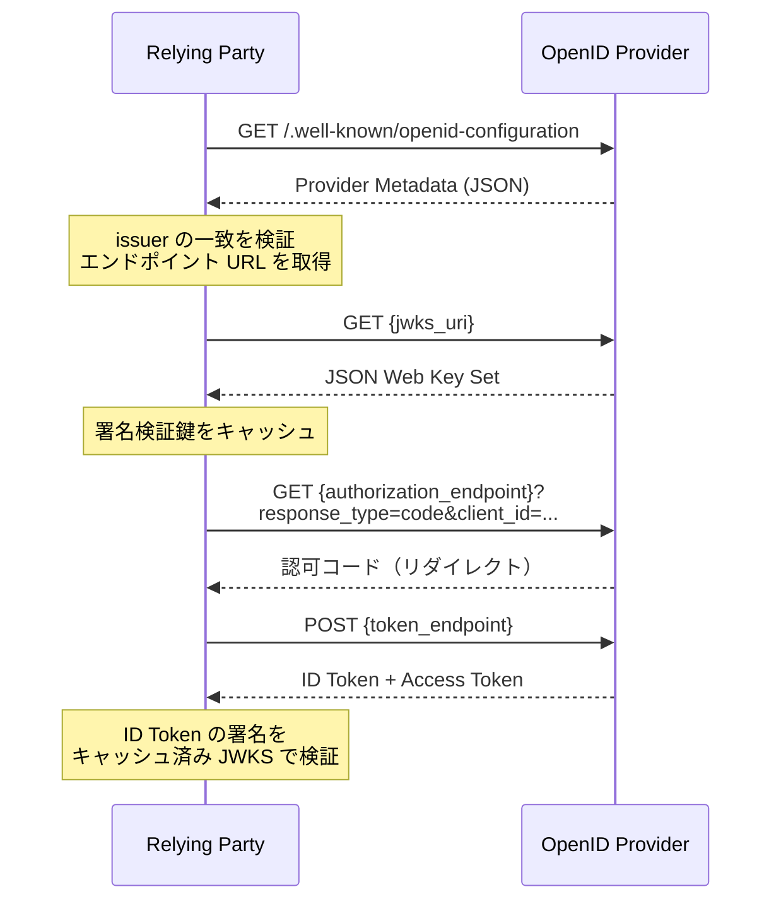

> **Note:** このページはAIエージェントが執筆しています。内容の正確性は一次情報（仕様書・公式資料）とあわせてご確認ください。

# OpenID Connect Discovery 1.0

## 概要

OpenID Connect Discovery 1.0 は、Relying Party（RP）が OpenID Provider（OP）の設定情報を自動取得するメカニズムを定義する仕様です。2014 年に OpenID Foundation の Final Specification として公開され、2023 年 12 月に Errata Set 2 を統合した最新版が公開されています ([OpenID Connect Discovery 1.0](https://openid.net/specs/openid-connect-discovery-1_0.html))。

この仕様がなければ、RP は各 OP のエンドポイント URL・署名鍵・対応する認可フロー・クレームなどをすべて静的に設定しなければなりません。Discovery を使うことで、RP は `/.well-known/openid-configuration` という標準 URL から JSON メタデータを取得するだけで OP との通信に必要な情報を得られます。Google、Microsoft Entra ID、日本デジタル庁の認証基盤など、主要な OpenID Provider はすべてこのエンドポイントを公開しています。

## 背景と経緯

### 静的設定の限界

OAuth 2.0 と OpenID Connect Core 1.0 は認証・認可プロトコルを定義しましたが、RP が OP のエンドポイントをどう知るかは仕様外でした。結果として、各 RP は各 OP に固有の設定値をハードコーディングしていました。

この設計には 2 つの問題があります。第一に、OP が鍵のローテーションやエンドポイントの変更を行うたびに、すべての RP が設定を更新しなければなりません。第二に、エンタープライズ環境のように多数の OP と連携する場合、管理コストが膨大になります。

### WebFinger ベースの 2 段階発見

仕様はもともと RFC 7033 WebFinger プロトコルを利用した 2 段階の発見プロセスを定義していました。ユーザー識別子（メールアドレスや URL）から OP のホストを特定し、WebFinger エンドポイントへクエリして OP の URL を取得、次いでその URL から設定メタデータを取得するフローです。

しかし実際の展開では、OP が既知または事前に設定されているケースが多く、WebFinger ステップを省略して直接 `/.well-known/openid-configuration` を取得するパターンが主流になっています。後に RFC 8414（OAuth 2.0 Authorization Server Metadata）が OIDC Discovery のメタデータ構造を OAuth 2.0 全体に一般化しましたが、OpenID Connect を使用する実装では今も OIDC Discovery の URL 形式が標準です。

## 設計思想

### issuer 中心の設計

OIDC Discovery の中核概念は **issuer**（発行者）です。OP は自身を識別する HTTPS URL（issuer）を持ち、RP はその URL をもとに `/.well-known/openid-configuration` を取得します。取得したメタデータの `issuer` フィールドは、リクエスト時の URL と完全に一致しなければなりません。この厳密な一致要件がなりすまし攻撃への防御線となっています。

### 静的型付きメタデータ

メタデータ内の各フィールドは仕様で型と意味が定義されており、RP は取得した値を解釈するだけで OP の機能を把握できます。`response_types_supported` には OP が対応する認可フロー、`id_token_signing_alg_values_supported` には ID トークンの署名アルゴリズムが列挙されます。必須フィールドとオプショナルフィールドが明確に区別されているため、RP は基本機能だけ要求するか拡張機能も確認するかを選択できます。

### RFC 8414 との関係

RFC 8414（2018 年）は OIDC Discovery のメタデータ構造を OAuth 2.0 一般に拡張した仕様です。URL の構成規則が異なります。

- OIDC Discovery: `https://example.com/.well-known/openid-configuration`
- RFC 8414: `https://example.com/.well-known/oauth-authorization-server`

両仕様のメタデータフィールドには多くの共通点があり、RFC 8414 は OIDC Discovery を事実上の基盤としています。OpenID Connect を使用する実装では OIDC Discovery の URL 形式が標準で、RFC 8414 はピュア OAuth 2.0 の実装向けという住み分けになっています ([RFC 8414](https://www.rfc-editor.org/rfc/rfc8414.html))。

## 技術詳細

### Provider Configuration エンドポイント

OP は以下の URL で JSON メタデータを公開します ([OpenID Connect Discovery 1.0 Section 4](https://openid.net/specs/openid-connect-discovery-1_0.html#ProviderConfig))。

```
GET /.well-known/openid-configuration HTTP/1.1
Host: accounts.example.com
```

issuer が `https://accounts.example.com` であれば、メタデータ URL は `https://accounts.example.com/.well-known/openid-configuration` です。issuer にパスが含まれる場合（例: `https://example.com/tenant1`）は、`https://example.com/tenant1/.well-known/openid-configuration` となります。

### 必須メタデータフィールド

仕様が必須（REQUIRED）と定めるフィールドを以下に示します ([OpenID Connect Discovery 1.0 Section 3](https://openid.net/specs/openid-connect-discovery-1_0.html#ProviderMetadata))。

| フィールド                              | 型         | 説明                                                      |
| --------------------------------------- | ---------- | --------------------------------------------------------- |
| `issuer`                                | 文字列     | OP の識別子 URL（HTTPS、フラグメントなし）                |
| `authorization_endpoint`                | URL        | OAuth 2.0 認可エンドポイント                              |
| `jwks_uri`                              | URL        | 署名検証用 JSON Web Key Set エンドポイント                |
| `response_types_supported`              | 文字列配列 | 対応する `response_type` 値（例: `["code", "id_token"]`） |
| `subject_types_supported`               | 文字列配列 | 対応するサブジェクト識別子型（`public` / `pairwise`）     |
| `id_token_signing_alg_values_supported` | 文字列配列 | ID トークン署名に対応する JWS アルゴリズム（例: `RS256`） |

### 条件付き必須・オプショナルフィールド

| フィールド                              | 説明                                                                                                                         |
| --------------------------------------- | ---------------------------------------------------------------------------------------------------------------------------- |
| `token_endpoint`                        | OAuth 2.0 トークンエンドポイント（現代的なフローでは必須。Implicit Flow のみの場合は省略可だが、Implicit Flow は現在非推奨） |
| `userinfo_endpoint`                     | UserInfo エンドポイント                                                                                                      |
| `registration_endpoint`                 | 動的クライアント登録エンドポイント（RFC 7591）                                                                               |
| `scopes_supported`                      | 対応するスコープ（例: `["openid", "profile", "email"]`）                                                                     |
| `claims_supported`                      | 返却可能なクレーム一覧                                                                                                       |
| `request_parameter_supported`           | Request Object（JAR）のサポート有無                                                                                          |
| `pushed_authorization_request_endpoint` | PAR エンドポイント（RFC 9126）                                                                                               |
| `authorization_details_types_supported` | RAR で使用可能な type 値一覧（RFC 9396）                                                                                     |

Google の実際の OpenID Configuration を例として示します（主要フィールドを抜粋）。

```json
{
  "issuer": "https://accounts.google.com",
  "authorization_endpoint": "https://accounts.google.com/o/oauth2/v2/auth",
  "token_endpoint": "https://oauth2.googleapis.com/token",
  "userinfo_endpoint": "https://openidconnect.googleapis.com/v1/userinfo",
  "jwks_uri": "https://www.googleapis.com/oauth2/v3/certs",
  "response_types_supported": [
    "code",
    "token",
    "id_token",
    "code token",
    "code id_token",
    "token id_token",
    "code token id_token",
    "none"
  ],
  "subject_types_supported": ["public"],
  "id_token_signing_alg_values_supported": ["RS256"],
  "scopes_supported": ["openid", "email", "profile"],
  "claims_supported": [
    "sub",
    "iss",
    "aud",
    "iat",
    "exp",
    "email",
    "email_verified",
    "name",
    "given_name",
    "family_name",
    "picture",
    "locale"
  ]
}
```

### RP の動的設定フロー

RP が OP を発見し認証を開始するまでの流れを示します。



### WebFinger による発見（上級ユースケース）

エンタープライズフェデレーションなどでユーザー識別子から OP を動的に特定する場合、RFC 7033 WebFinger を使用します ([OpenID Connect Discovery 1.0 Section 2](https://openid.net/specs/openid-connect-discovery-1_0.html#IssuerDiscovery))。

```
GET /.well-known/webfinger
  ?resource=acct:user@example.com
  &rel=http://openid.net/specs/connect/1.0/issuer
Host: example.com
```

レスポンスから OP の issuer URL を取得し、その後に `/.well-known/openid-configuration` へアクセスします。ただし WebFinger は多くの実装で省略されており、実用上は `/.well-known/openid-configuration` への直接アクセスが一般的です。

## 実装上の注意点

### issuer の厳密一致検証

取得したメタデータの `issuer` フィールドが、設定リクエスト時の URL と文字列として完全に一致することを必ず検証してください。大文字小文字・末尾スラッシュ・パスの違いも区別します。この検証を省略すると、攻撃者が細工した設定情報を返す中間者攻撃が成立します ([OpenID Connect Discovery 1.0 Section 4.3](https://openid.net/specs/openid-connect-discovery-1_0.html#ProviderConfigurationValidation))。

```python
# 正しい検証例（Python）
metadata = fetch_json(f"{issuer}/.well-known/openid-configuration")
assert metadata["issuer"] == issuer, "Issuer mismatch — potential attack"
```

### JWKS のキャッシュと鍵ローテーション

OP は定期的に署名鍵をローテーションします。毎回の ID トークン検証で `jwks_uri` にアクセスするとパフォーマンスが低下するため、JWKS はキャッシュすべきですが、未知の `kid` を受け取ったときはキャッシュを更新する実装が必要です。キャッシュ期限は HTTP の `Cache-Control` ヘッダーに従うか、数時間〜1 日程度が適切です。

### TLS 検証の徹底

メタデータ取得・JWKS 取得・トークンエンドポイント通信はすべて HTTPS かつ証明書検証必須です。証明書検証をスキップした実装は、DNS スプーフィングや中間者攻撃によって偽の設定情報を受け入れるリスクがあります。

### SSRF リスク（ユーザー指定 OP URL）

ユーザーが OP の issuer URL を入力できる実装（マルチテナント SaaS や "Bring Your Own IdP" パターン）では、Server-Side Request Forgery（SSRF）に注意が必要です。攻撃者が `http://169.254.169.254/` などの内部 URL を issuer として入力すると、サーバーが内部ネットワークへリクエストを発行してしまいます。対策として、issuer URL を HTTPS スキームに限定し、プライベート IP アドレス範囲・ループバック・リンクローカルアドレスへのアクセスを禁止するブロックリストまたは DNS 解決後の IP 検証を実装してください。

### RFC 9207 による認可レスポンスの issuer 検証

RFC 9207（OAuth 2.0 Authorization Server Issuer Identification）は、認可レスポンスに `iss` パラメーターを付与して RP が応答の発信元 OP を検証できるようにします ([RFC 9207](https://www.rfc-editor.org/rfc/rfc9207.html))。これは Discovery と直交する仕様ですが、OP が Discovery メタデータに `authorization_response_iss_parameter_supported: true` を含めることで対応を表明します。複数の OP と連携する環境では、この仕様をあわせて採用することで Mix-Up Attack を防止できます。

### メタデータのキャッシュ TTL

Provider Metadata 自体も変更される可能性があります。パスの追加・鍵の追加・エンドポイントの変更などが発生した際、古いキャッシュを持つ RP が影響を受けます。アプリケーション起動時に毎回取得するか、数時間ごとにリフレッシュする設計が安全です。

### Pairwise Subject Identifier

`subject_types_supported` に `pairwise` が含まれる場合、同一ユーザーでも RP ごとに異なる `sub` 値が返ります。複数のサービス間でユーザーを突合する処理はこの動作を考慮する必要があります。

### 動的クライアント登録との組み合わせ

`registration_endpoint` が存在する場合、RP は RFC 7591 動的クライアント登録を使って自動的に `client_id` を取得できます。OpenID Federation 1.0 のような大規模フェデレーション環境では、この組み合わせにより RP の手動登録が不要になります。

## 採用事例

### 主要 OpenID Provider

実質的にすべての主要な OpenID Provider が Discovery を実装しています。

- **Google**: `https://accounts.google.com/.well-known/openid-configuration`
- **Microsoft Entra ID**: `https://login.microsoftonline.com/{tenant}/v2.0/.well-known/openid-configuration`
- **日本デジタル庁 デジタル認証アプリ**: OIDC Discovery に準拠した JWKS URI 公開 ([実装ガイドライン](https://developers.digital.go.jp/documents/auth-and-sign/implement-guideline/))

### FAPI 2.0 での採用

金融グレード API プロファイル FAPI 2.0 は、OP が OIDC Discovery 準拠のメタデータを公開することを要件としています。PAR エンドポイント URL や DPoP サポートの有無も Provider Metadata に含まれ、RP はこれを参照して動的に接続設定を構成します ([FAPI 2.0 Security Profile](https://openid.net/specs/fapi-security-profile-2_0.html))。

### OpenID4VCI / OpenID4VP

OpenID for Verifiable Credential Issuance（OID4VCI）と OpenID for Verifiable Presentations（OID4VP）は、Credential Issuer および Verifier のメタデータを OIDC Discovery の拡張として公開します。Wallet アプリケーションはこれを使用して、どのクレデンシャル形式をサポートしているかを動的に確認します。

## 関連仕様・後継仕様

| 仕様                                                                                 | 関係                                                              |
| ------------------------------------------------------------------------------------ | ----------------------------------------------------------------- |
| [OpenID Connect Core 1.0](https://openid.net/specs/openid-connect-core-1_0.html)     | 基盤プロトコル。Discovery が補完する形で設定取得を定義            |
| [RFC 8414](https://www.rfc-editor.org/rfc/rfc8414)                                   | OAuth 2.0 Authorization Server Metadata — OIDC Discovery を一般化 |
| [RFC 7033](https://www.rfc-editor.org/rfc/rfc7033)                                   | WebFinger — Discovery の第一段階で使用されるプロトコル            |
| [RFC 7591](https://www.rfc-editor.org/rfc/rfc7591)                                   | OAuth 2.0 動的クライアント登録 — Discovery と組み合わせて自動化   |
| [OpenID Federation 1.0](https://openid.net/specs/openid-federation-1_0.html)         | Discovery を大規模フェデレーションに拡張                          |
| [FAPI 2.0](https://openid.net/specs/fapi-security-profile-2_0.html)                  | Discovery の利用を必須要件として規定                              |
| [OID4VCI](https://openid.net/specs/openid-4-verifiable-credential-issuance-1_0.html) | Credential Issuer Metadata として Discovery パターンを拡張        |
| [RFC 9207](https://www.rfc-editor.org/rfc/rfc9207.html)                              | 認可レスポンスへの `iss` 付与で Mix-Up Attack を防止              |

## 参考資料

- [OpenID Connect Discovery 1.0](https://openid.net/specs/openid-connect-discovery-1_0.html)
- [RFC 8414 — OAuth 2.0 Authorization Server Metadata](https://www.rfc-editor.org/rfc/rfc8414.html)
- [RFC 7033 — WebFinger](https://www.rfc-editor.org/rfc/rfc7033.html)
- [RFC 9207 — OAuth 2.0 Authorization Server Issuer Identification](https://www.rfc-editor.org/rfc/rfc9207.html)
- [OpenID Connect Core 1.0](https://openid.net/specs/openid-connect-core-1_0.html)
- [FAPI 2.0 Security Profile](https://openid.net/specs/fapi-security-profile-2_0.html)
