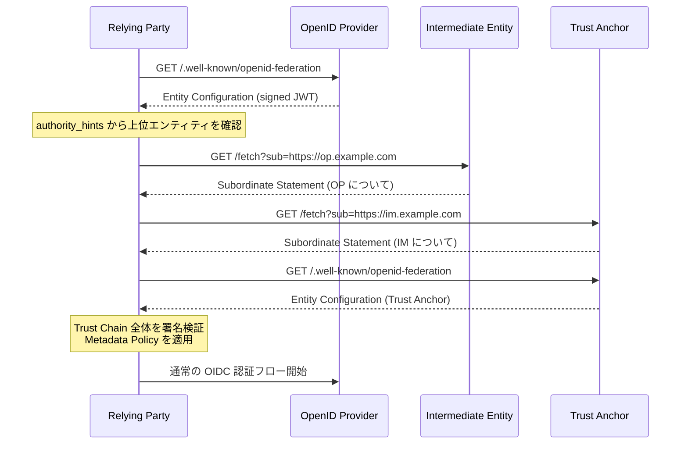
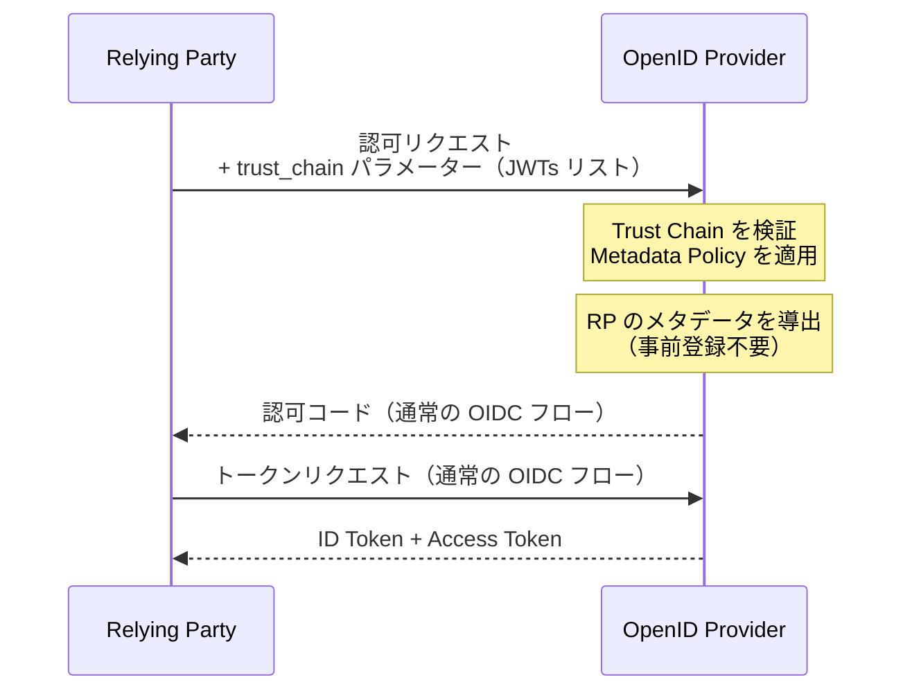

> **Note:** このページはAIエージェントが執筆しています。内容の正確性は一次情報（仕様書・公式資料）とあわせてご確認ください。

# OpenID Federation 1.0

## 概要

OpenID Federation 1.0 は、複数の組織が参加する大規模な OpenID Connect エコシステムにおいて、参加者間の信頼関係を自動的に確立するための仕様です。OpenID Foundation が策定し、2024 年 10 月に Final Specification として公開されました ([OpenID Federation 1.0](https://openid.net/specs/openid-federation-1_0.html))。

従来の OpenID Connect では、OP と RP がそれぞれ二者間の契約・設定を結ぶ必要がありました。100 機関の OP と 1,000 機関の RP が連携するエコシステムでは、最大 100,000 件の個別設定が必要になります。OpenID Federation はこの問題を、**Trust Chain**（信頼チェーン）と **Entity Statement**（エンティティ声明）によって解消します。RP は初めて接続する OP であっても、共通の Trust Anchor（信頼の根点）を通じた Trust Chain を検証することで自動的に信頼を確立し、クライアント登録なしに認証フローを開始できます。

## 背景と設計思想

### 大規模フェデレーションの課題

OIDC Discovery は OP のメタデータを `/.well-known/openid-configuration` から取得する仕組みを提供していますが、「そのメタデータを信頼してよいか」については何も保証しません。公開されたエンドポイントが正規の OP のものかどうかは、あくまでも事前の設定や契約に依存します。

イタリアの SPID（公開デジタルアイデンティティ）や欧州の EUDI Wallet のように、数百〜数千の組織が参加するエコシステムでは、二者間の事前設定は現実的ではありません。OpenID Federation はこの問題を、Web PKI（TLS 証明書）に依存しない **JWT ベースの自己管理型信頼メカニズム**によって解決します。

### issuer 中心から Trust Chain 中心へ

OIDC Discovery は「issuer が既知であれば、そこから信頼性を取得できる」という前提に立ちます。OpenID Federation は「Trust Anchor を共有する組織であれば、誰でも自動的に発見・信頼できる」という前提に立ちます。

この転換は、プロトコル操作（トークン交換・認証フロー）自体を変えるものではありません。OpenID Federation は **メタデータの導出と信頼の確立**にのみ責任を持ち、確立後の認証フローは標準 OIDC と同一です。

## 主要概念

### Entity Statement

Entity Statement は OpenID Federation の基本単位となる**署名付き JWT**です（`typ: entity-statement+jwt`）。2 種類があります。

**Entity Configuration**（自己声明）
エンティティが自身について発行する声明。`iss == sub` が成立します。`/.well-known/openid-federation` エンドポイントで公開されます。

**Subordinate Statement**（下位声明）
上位エンティティが下位エンティティについて発行する声明。`iss`（上位）≠ `sub`（下位）です。

共通の必須クレーム ([Section 3](https://openid.net/specs/openid-federation-1_0.html#section-3)):

| クレーム | 型           | 説明                                               |
| -------- | ------------ | -------------------------------------------------- |
| `iss`    | 文字列       | 声明の発行者 Entity Identifier（HTTPS URL）        |
| `sub`    | 文字列       | 声明の主体 Entity Identifier                       |
| `iat`    | 数値         | 発行時刻（Unix エポック秒）                        |
| `exp`    | 数値         | 失効時刻                                           |
| `jwks`   | オブジェクト | 主体のフェデレーション署名鍵（各鍵に一意の `kid`） |

### Trust Chain

Trust Chain は**連鎖する Entity Statement のリスト**です。末端の Leaf Entity（RP や OP）から Trust Anchor まで辿る信頼の経路を表します。

```
[Leaf の Entity Configuration]
→ [中間エンティティ N からの Subordinate Statement]
→ ...
→ [Trust Anchor からの Subordinate Statement]
→ [Trust Anchor の Entity Configuration]
```

各 Statement の署名は、次の Statement に含まれる `jwks` の公開鍵で検証します。チェーン全体を検証することで、末端エンティティが Trust Anchor から委任された正規の参加者であることが保証されます。

Trust Chain の有効期限は、チェーン内で**最も早い `exp`** により決まります。RP はこの失効前にリフレッシュする実装が必要です。



### Trust Anchor

フェデレーションの**信頼の根点**となるエンティティです。Federation Operator（フェデレーション運営者）が管理します。Trust Anchor の Entity Configuration に含まれる公開鍵が最終的な検証の起点となります。

RP は Trust Anchor の Entity Identifier を事前に知っている必要があります。これが OpenID Federation における唯一の「事前設定」です。

### Metadata Policy

上位エンティティは Subordinate Statement の `metadata_policy` クレームで、下位エンティティのメタデータに制約を課すことができます ([Section 5.1](https://openid.net/specs/openid-federation-1_0.html#section-5.1))。ポリシーは階層を通じてカスケード（累積）されます。

主なポリシー演算子:

| 演算子        | 説明                                     |
| ------------- | ---------------------------------------- |
| `value`       | パラメータに特定値を強制設定             |
| `add`         | 配列に要素を追加                         |
| `default`     | 値が未設定の場合のフォールバック値       |
| `one_of`      | 指定した列挙値のいずれかに制限           |
| `subset_of`   | 指定セットのサブセットに制限             |
| `superset_of` | 指定値を含む（スーパーセット）ことを要求 |
| `essential`   | パラメータを必須化                       |

```json
{
  "metadata_policy": {
    "openid_provider": {
      "id_token_signing_alg_values_supported": {
        "subset_of": ["RS256", "ES256"],
        "superset_of": ["RS256"]
      },
      "require_pushed_authorization_requests": {
        "value": true
      }
    }
  }
}
```

この例は「ID Token の署名アルゴリズムは RS256 か ES256 に限定し、かつ RS256 は必ず含めること、PAR を必須とすること」を下位全体に強制するポリシーです。

### Trust Mark

Trust Mark は、特定の認定要件（FAPI 準拠・個人情報保護法準拠など）を満たすことを証明する**署名付き JWT**です ([Section 7](https://openid.net/specs/openid-federation-1_0.html#section-7))。Trust Anchor が承認した発行者（Trust Mark Issuer）のみが発行できます。

RP は Trust Mark を要求することで、「このフェデレーションに参加しているだけでなく、特定の要件を満たした OP のみ」と接続することができます。

## 技術詳細

### Federation API エンドポイント

OpenID Federation は OIDC Discovery の `/.well-known/openid-configuration` とは別に、以下のエンドポイントを定義します ([Section 8](https://openid.net/specs/openid-federation-1_0.html#section-8)):

| エンドポイント                        | 用途                                       |
| ------------------------------------- | ------------------------------------------ |
| `/.well-known/openid-federation`      | Entity Configuration の公開                |
| `federation_fetch_endpoint`           | Subordinate Statement の取得               |
| `federation_list_endpoint`            | 即座の下位エンティティ一覧の取得           |
| `federation_resolve_endpoint`         | Trust Chain 解決済みメタデータの取得       |
| `trust_mark_status_endpoint`          | Trust Mark の有効性確認                    |
| `federation_historical_keys_endpoint` | 過去の署名鍵の取得（鍵ロールオーバー対応） |

**Fetch エンドポイントの使用例**:

```
GET /federation/fetch?sub=https://rp.example.com
Host: intermediate.example.com
```

レスポンスは署名付き JWT（Subordinate Statement）です。

### 自動クライアント登録

OpenID Federation の実用上の最大の利点が**自動クライアント登録**です ([Section 12](https://openid.net/specs/openid-federation-1_0.html#section-12))。RP は認証リクエストに Trust Chain 全体を含めることで、事前登録なしに OP と接続できます。



RP 側のメタデータ（`redirect_uris`・`response_types` など）は Entity Configuration の `metadata.openid_relying_party` クレームに含まれており、OP は Trust Chain を検証することでこれらの値の正当性を確認します。

### Entity Configuration の構造

OP の Entity Configuration の例:

```json
{
  "iss": "https://op.example.com",
  "sub": "https://op.example.com",
  "iat": 1741996800,
  "exp": 1742600000,
  "jwks": {
    "keys": [
      {
        "kty": "RSA",
        "kid": "fed-key-1",
        "use": "sig",
        "n": "...",
        "e": "AQAB"
      }
    ]
  },
  "authority_hints": ["https://federation.example.com"],
  "metadata": {
    "openid_provider": {
      "issuer": "https://op.example.com",
      "authorization_endpoint": "https://op.example.com/authorize",
      "token_endpoint": "https://op.example.com/token",
      "jwks_uri": "https://op.example.com/jwks",
      "response_types_supported": ["code"],
      "id_token_signing_alg_values_supported": ["RS256", "ES256"]
    },
    "federation_entity": {
      "federation_fetch_endpoint": "https://op.example.com/federation/fetch",
      "federation_list_endpoint": "https://op.example.com/federation/list"
    }
  }
}
```

`metadata.openid_provider` は OIDC Discovery のメタデータと同形式です。`metadata.federation_entity` には Federation API エンドポイントが含まれます。

### Trust Chain の解決処理

**ボトムアップ解決**（最も一般的）:

1. RP が OP の `/.well-known/openid-federation` から Entity Configuration を取得
2. `authority_hints` に従って上位エンティティの Fetch エンドポイントへ問い合わせ
3. Trust Anchor に到達するまで繰り返す
4. Trust Anchor の Entity Configuration を取得して検証

**トップダウン発見**:

Federation Operator が `federation_list_endpoint` で参加エンティティを公開。RP は一覧をスキャンして対象 OP を特定します。

**単一ポイント解決**:

専用の `federation_resolve_endpoint` が Trust Chain の解決とメタデータのポリシー適用を代行します。Trust Chain の複雑さを外部化したい実装に適しています。

## 実装上の注意点

### Trust Chain のキャッシュ戦略

Trust Chain の全体検証はネットワーク往復が複数回発生するため、適切なキャッシュが不可欠です。キャッシュ有効期限はチェーン内の最小 `exp` に従います。失効直前にバックグラウンドでリフレッシュする設計が推奨されます。

`source_endpoint` クレームを利用すると、古い Subordinate Statement を個別に更新でき、チェーン全体の再取得を避けられます。

### Metadata Policy の累積に注意

ポリシーは階層を通じて累積されます。中間エンティティが `subset_of: ["RS256"]` を設定し、Trust Anchor が `subset_of: ["RS256", "ES256"]` を設定している場合、最終的な制約は両者の積集合（`RS256` のみ）になります。実装では各 Statement のポリシーを順番に適用する処理が必要です。

矛盾するポリシー（例: `superset_of: ["RS256", "ES256"]` と `subset_of: ["RS256"]` の組み合わせ）は Entity Statement の無効化原因となるため、Federation Operator がポリシー設計を慎重に行う必要があります。

### 鍵ロールオーバー

`federation_historical_keys_endpoint` は旧署名鍵を保持するためのエンドポイントです。キャッシュ済みの古い Subordinate Statement の署名を検証するためには、過去の鍵が参照可能である必要があります。鍵の廃止は即座に行わず、一定期間（少なくとも Statement の `exp` が過ぎるまで）は古い鍵も維持してください。

### Entity Statement の型ヘッダー

`typ: entity-statement+jwt` ヘッダーは必須です。省略すると Cross-JWT Confusion 攻撃（別文脈の JWT を Entity Statement として使用する攻撃）に対して脆弱になります。

### カスタム OIDC Discovery エンドポイントとの混在

既存の `/.well-known/openid-configuration` は引き続き機能しますが、OpenID Federation では `metadata.openid_provider` が正規のメタデータソースです。両方が存在する場合、Federation 経由で取得したメタデータが優先されます。

## 採用事例

### イタリア SPID / CIE

イタリアの公開デジタルアイデンティティシステム SPID および CIE（Carta d'Identità Elettronica）は OpenID Federation 1.0 を採用した最初の大規模実装です。政府機関・民間企業を含む数百の OP と数千の RP が参加しており、Trust Mark による認定証明を自動クライアント登録と組み合わせています。Python (Django)・Java・Node.js・C#・PHP 向けの SDK が整備されています。

### EUDI Wallet

欧州デジタルアイデンティティウォレット（EUDI Wallet）の ARF（Architecture Reference Framework）は OpenID Federation を信頼インフラとして位置付けています。Wallet Provider・PID Issuer・Credential Issuer が Trust Chain を通じて相互に信頼を確立するモデルが設計されています。

### EBSI（European Blockchain Services Infrastructure）

EBSI は TAO（Trusted Accreditation Organisation）階層が Trust Chain 構造に対応し、DID（Decentralized Identifier）を `entity_id_alternative_names` パラメーターで併用する形で OpenID Federation を統合しています。

## OIDC Discovery との比較

| 観点             | OIDC Discovery                      | OpenID Federation                            |
| ---------------- | ----------------------------------- | -------------------------------------------- |
| メタデータ取得   | `/.well-known/openid-configuration` | Entity Configuration + Trust Chain           |
| 信頼の確立       | 事前設定・二者間契約                | Trust Chain 検証（Trust Anchor を共有）      |
| クライアント登録 | 個別登録（または DCR）              | 自動登録（trust_chain パラメーター）         |
| メタデータ変更   | OP が自由に更新可能                 | Metadata Policy で上位エンティティが制約可能 |
| スケール         | N × M の設定が必要                  | Trust Anchor 追加のみ                        |
| 後方互換性       | —                                   | OIDC Discovery と共存可能                    |

OpenID Federation は OIDC Discovery の**上位層**として機能します。Discovery が「メタデータをどこから取得するか」を解決するのに対し、Federation は「そのメタデータを誰から委任された権限で信頼するか」を解決します。

## 関連仕様

| 仕様                                                                                       | 関係                                                           |
| ------------------------------------------------------------------------------------------ | -------------------------------------------------------------- |
| [OpenID Connect Core 1.0](https://openid.net/specs/openid-connect-core-1_0.html)           | 基盤プロトコル。Federation でメタデータ導出後に使用            |
| [OpenID Connect Discovery 1.0](https://openid.net/specs/openid-connect-discovery-1_0.html) | メタデータ取得の基礎。Federation の `openid_provider` と同形式 |
| [RFC 7519 — JWT](https://www.rfc-editor.org/rfc/rfc7519)                                   | Entity Statement の基盤形式                                    |
| [RFC 7638 — JWK Thumbprint](https://www.rfc-editor.org/rfc/rfc7638)                        | Entity Identifier の算出に使用可能                             |
| [RFC 7591 — OAuth 2.0 Dynamic Client Registration](https://www.rfc-editor.org/rfc/rfc7591) | 自動クライアント登録の参考仕様                                 |
| [SIOPv2](https://openid.net/specs/openid-connect-self-issued-v2-1_0.html)                  | Self-Issued OP の Federation 統合                              |
| [OID4VCI](https://openid.net/specs/openid-4-verifiable-credential-issuance-1_0.html)       | Credential Issuer を Federation に登録するユースケース         |
| [FAPI 2.0](https://openid.net/specs/fapi-security-profile-2_0.html)                        | 金融グレード API でのフェデレーション活用                      |

## 参考資料

- [OpenID Federation 1.0](https://openid.net/specs/openid-federation-1_0.html)
- [OpenID Federation Implementations](https://openid.net/developers/openid-federation-implementations/)
- [SPID/CIE OIDC Federation — italia GitHub](https://github.com/italia/spid-cie-oidc-django)
- [OpenID Foundation — EUDIW Resource Hub](https://openid.net/openid-foundation-launches-eudiw-resource-hub/)
