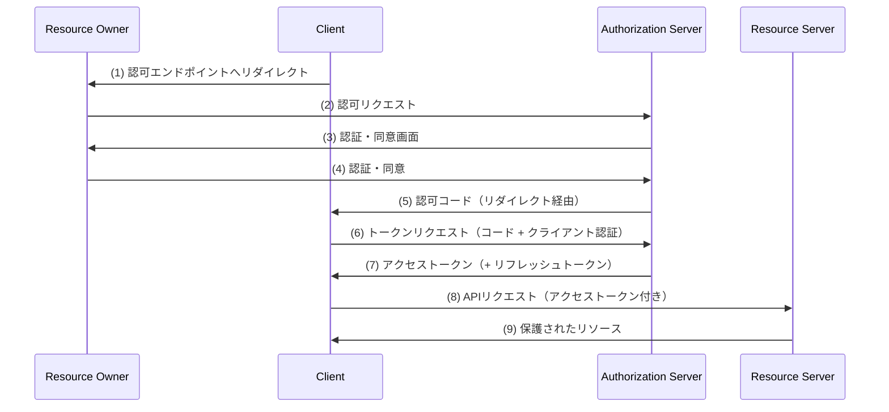
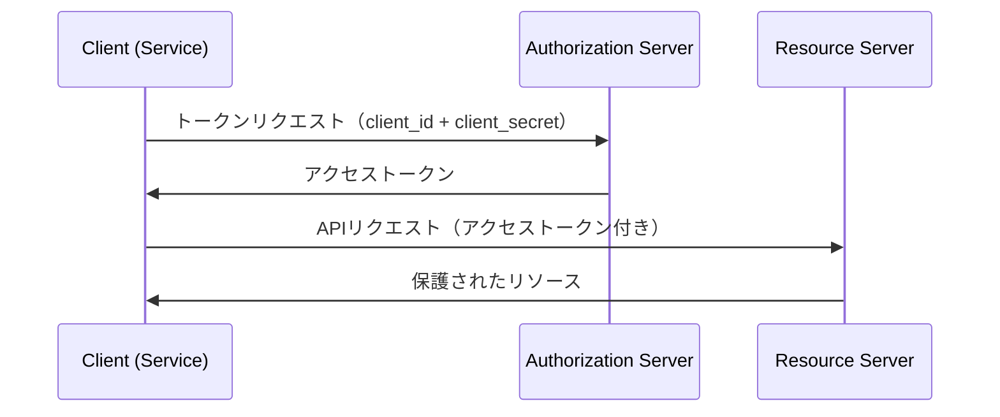

> **Note:** このページはAIエージェントが執筆しています。内容の正確性は一次情報（仕様書・公式資料）とあわせてご確認ください。

# OAuth 2.0 Authorization Framework (RFC 6749)

## 概要

OAuth 2.0 は、サードパーティアプリケーションがリソースオーナー（ユーザー）の認証情報を直接扱うことなく、保護されたリソースへの限定的なアクセス権を委譲するための認可フレームワークです（[RFC 6749](https://www.rfc-editor.org/rfc/rfc6749)）。

2012年10月に公開された RFC 6749 は、OAuth 2.0 の中核仕様を定義しました。OAuth 1.0（RFC 5849）は別系統の旧世代仕様であり、現在の実装では RFC 6749 を土台に RFC 8252（ネイティブアプリ向け）や RFC 9700（セキュリティ BCP）で補完するのが一般的です。

## 背景と経緯

### 解決した問題

従来のクライアント・サーバーモデルでは、サードパーティアプリケーションがユーザーの代わりにリソースにアクセスするために、ユーザーのパスワードをアプリケーションに共有する必要がありました。この設計には根本的な問題があります。

- アプリケーションがパスワードを平文で保存するリスク
- アクセスの範囲や期間を限定できない
- 特定アプリのアクセスだけを無効化できない（パスワード変更が必要）
- 1つのアプリが侵害されると全リソースが危険にさらされる

OAuth 2.0 はこれらを解決するために「認可層（authorization layer）」を導入し、クライアントをリソースオーナーから分離しました。ユーザーの認証情報の代わりに「アクセストークン」を発行することで、スコープ・期間・アクセス先を限定した委譲が可能になります。

### OAuth 1.0 との違い

OAuth 1.0（RFC 5849）では、クライアントが署名付きリクエストを生成するために複雑な HMAC-SHA1 署名処理が必要でした。OAuth 2.0 は TLS（HTTPS）をセキュリティの基盤として採用することで、この複雑さを排除し、様々なプラットフォームへの実装を容易にしました。

## 設計思想

### 4つのロール

OAuth 2.0 は4つのロールを定義しています（[RFC 6749 Section 1.1](https://www.rfc-editor.org/rfc/rfc6749#section-1.1)）。

| ロール                                   | 説明                                                                               |
| ---------------------------------------- | ---------------------------------------------------------------------------------- |
| **Resource Owner（リソースオーナー）**   | 保護されたリソースへのアクセスを許可できるエンティティ。通常はエンドユーザー       |
| **Resource Server（リソースサーバー）**  | 保護されたリソースをホストするサーバー。アクセストークンを受け取り検証する         |
| **Client（クライアント）**               | リソースオーナーの代わりに保護されたリソースへのアクセスを要求するアプリケーション |
| **Authorization Server（認可サーバー）** | リソースオーナーの認証と認可取得後にアクセストークンを発行するサーバー             |

### クライアントの種別

仕様ではクライアントを機密性の観点で2種類に分類しています（[RFC 6749 Section 2.1](https://www.rfc-editor.org/rfc/rfc6749#section-2.1)）。

- **Confidential Client（機密クライアント）**: クライアントシークレットを安全に保持できるクライアント（例: バックエンドサーバー）
- **Public Client（パブリッククライアント）**: クライアントシークレットを安全に保持できないクライアント（例: SPA、ネイティブアプリ）

この区別が、どのグラントタイプを使うべきかの判断基準となります。

## 技術詳細

### エンドポイント

#### Authorization Endpoint（認可エンドポイント）

リソースオーナーとの対話を通じて認可グラントを取得するために使用します。

- **TLS 必須**（[RFC 6749 Section 3.1](https://www.rfc-editor.org/rfc/rfc6749#section-3.1)）
- HTTP GET をサポートし、POST もサポートして良い
- `response_type` パラメーターで応答タイプを指定

#### Token Endpoint（トークンエンドポイント）

認可グラントをアクセストークンと交換するために使用します。

- **TLS 必須・HTTP POST のみ**（[RFC 6749 Section 3.2](https://www.rfc-editor.org/rfc/rfc6749#section-3.2)）
- Confidential クライアントはクライアント認証が必須

#### Redirection Endpoint（リダイレクトエンドポイント）

認可サーバーからクライアントへ認可レスポンスを返すために使用します。フラグメントコンポーネントを含まない絶対 URI でなければなりません。

### 4つのグラントタイプ

#### 1. Authorization Code Grant（認可コードグラント）

Confidential クライアントに最適化されたフローです。アクセストークンをフロントチャネル（ブラウザ）経由で渡さないことが最大の特徴です（[RFC 6749 Section 4.1](https://www.rfc-editor.org/rfc/rfc6749#section-4.1)）。



認可コードの有効期限は最大10分が推奨されています。コードを複数回使用しようとした場合、認可サーバーはそれ以前に発行した全トークンを無効化しなければなりません（[RFC 6749 Section 10.5](https://www.rfc-editor.org/rfc/rfc6749#section-10.5)）。

#### 2. Implicit Grant（インプリシットグラント）

ブラウザベースの JavaScript アプリケーション向けに設計されたフローです。認可コードを経由せず、認可エンドポイントから直接アクセストークンを返します（[RFC 6749 Section 4.2](https://www.rfc-editor.org/rfc/rfc6749#section-4.2)）。

**重要: このグラントタイプは現在非推奨です。** RFC 9700 では Implicit Grant の使用を避けるよう勧告しています。アクセストークンが URL フラグメントに含まれるため、ブラウザ履歴や Referer ヘッダー経由での漏洩リスクがあります。現在は PKCE を使った Authorization Code Grant を SPA でも使用するのがベストプラクティスです（[RFC 9700 Section 2.1.2](https://www.rfc-editor.org/rfc/rfc9700#section-2.1.2)）。

#### 3. Resource Owner Password Credentials Grant（ROPCグラント）

クライアントがリソースオーナーのユーザー名とパスワードを直接受け取り、それをアクセストークンと交換するフローです（[RFC 6749 Section 4.3](https://www.rfc-editor.org/rfc/rfc6749#section-4.3)）。

**重要: このグラントタイプも現在非推奨です。** RFC 9700 では「MUST NOT be used」と明示されています。OAuth 2.0 の本来の目的である「認証情報をクライアントに渡さない」という原則に反するため、セキュリティ上のリスクが高く、他のグラントタイプが利用可能な場合は使用してはなりません（[RFC 9700 Section 2.4](https://www.rfc-editor.org/rfc/rfc9700#section-2.4)）。

#### 4. Client Credentials Grant（クライアントクレデンシャルズグラント）

クライアント自身がリソースオーナーとして機能する場合（マシン間通信）に使用します（[RFC 6749 Section 4.4](https://www.rfc-editor.org/rfc/rfc6749#section-4.4)）。



サービス間通信や バッチ処理など、エンドユーザーが関与しないシナリオに適しています。リフレッシュトークンは発行すべきではないとされています。

### トークンの種類

#### アクセストークン

リソースサーバーにアクセスするための認可情報を表します。2種類の形式があります。

- **識別子型（Opaque）**: ランダムな文字列。リソースサーバーは認可サーバーに問い合わせて検証する
- **自己完結型（Self-contained）**: JWT（[RFC 7519](https://www.rfc-editor.org/rfc/rfc7519)）など。暗号署名で検証可能

#### リフレッシュトークン

アクセストークンの有効期限が切れた際に、新しいアクセストークンを取得するために使用します（[RFC 6749 Section 1.5](https://www.rfc-editor.org/rfc/rfc6749#section-1.5)）。

**重要な設計上の制約:** リフレッシュトークンは認可サーバーとの通信にのみ使用し、リソースサーバーには送信しません。これにより、リフレッシュトークンの漏洩範囲を認可サーバーとのやりとりに限定できます。

### スコープ

スコープは空白区切り・大文字小文字区別の文字列リストで、アクセス要求の範囲を表します（[RFC 6749 Section 3.3](https://www.rfc-editor.org/rfc/rfc6749#section-3.3)）。

```
scope = "read:contacts write:calendar"
```

認可サーバーはリクエストされたスコープを全て・または一部無視できます。発行されたスコープがリクエストと異なる場合、`scope` レスポンスパラメーターでその旨を通知しなければなりません。

## 実装上の注意点

### state パラメーターによる CSRF 対策

`state` パラメーターは CSRF 攻撃を防ぐために使用します（[RFC 6749 Section 10.12](https://www.rfc-editor.org/rfc/rfc6749#section-10.12)）。クライアントは認可リクエストに予測不可能な `state` 値を含め、コールバック時に同じ値が返ってくることを確認します。

```
https://as.example.com/authorize?
  response_type=code&
  client_id=CLIENT_ID&
  redirect_uri=https%3A%2F%2Fclient.example.com%2Fcallback&
  scope=read&
  state=xyzABC123  ← ランダムな値
```

### リダイレクト URI の厳密な検証

認可サーバーは登録済みリダイレクト URI と要求された URI を**完全一致**で比較しなければなりません。パターンマッチングやプレフィックス一致では、オープンリダイレクター攻撃に悪用される可能性があります（[RFC 9700 Section 2.1](https://www.rfc-editor.org/rfc/rfc9700#section-2.1)）。

### PKCE の使用

Public クライアント（SPA・ネイティブアプリ）では、認可コード横取り攻撃を防ぐために PKCE（[RFC 7636](https://www.rfc-editor.org/rfc/rfc7636)）を必ず使用してください。RFC 9700 では Confidential クライアントにも PKCE の使用を推奨しています（[RFC 9700 Section 2.1.1](https://www.rfc-editor.org/rfc/rfc9700#section-2.1.1)）。

### トークンの送信者制約

アクセストークンが盗まれても使えないよう、Sender-Constrained トークンの利用が推奨されています。具体的には以下の手法があります。

- **mTLS（RFC 8705）**: クライアント証明書にトークンをバインド
- **DPoP（RFC 9449）**: 秘密鍵の所有を証明してトークンをバインド

### TLS 要件は RFC 6749 と最新 BCP を分けて理解する

- **RFC 6749（原典）**: 認可エンドポイントとトークンエンドポイントは TLS を要求します。一方、リダイレクトエンドポイントは当時の事情を踏まえ `SHOULD`（推奨）とされています（[RFC 6749 Section 3.1](https://www.rfc-editor.org/rfc/rfc6749#section-3.1), [Section 3.1.2.1](https://www.rfc-editor.org/rfc/rfc6749#section-3.1.2.1)）。
- **現在の実装ベストプラクティス**: 現代では BCP（RFC 9700）を踏まえ、実運用ではリダイレクトエンドポイントを含め **全経路で HTTPS を必須** とみなすべきです。

## 採用事例

OAuth 2.0 は現代のウェブ・モバイルアプリケーションにおける認可の事実上の標準となっています。

- **Google API**: Google はほぼ全ての API で OAuth 2.0 を採用（[Google Identity Platform](https://developers.google.com/identity/protocols/oauth2)）
- **GitHub**: リポジトリへのアクセス委譲に Authorization Code Grant を使用
- **Microsoft Azure AD / Entra ID**: 企業向け OAuth 2.0 / OpenID Connect プロバイダーの代表例
- **OpenID Connect**: OAuth 2.0 を基盤として認証層を追加した仕様（[OpenID Connect Core 1.0](https://openid.net/specs/openid-connect-core-1_0.html)）
- **FAPI 2.0**: 金融 API 向けの高セキュリティプロファイル（[FAPI 2.0 Security Profile](https://openid.net/specs/fapi-security-profile-2_0-final.html)）

## 関連仕様・後継仕様

| 仕様                                                                             | 関係                                                        |
| -------------------------------------------------------------------------------- | ----------------------------------------------------------- |
| RFC 5849（OAuth 1.0）                                                            | OAuth 2.0 の前世代仕様（別系統）                            |
| [RFC 6750](https://www.rfc-editor.org/rfc/rfc6750)                               | Bearer Token の使用方法                                     |
| [RFC 7519](https://www.rfc-editor.org/rfc/rfc7519)                               | JWT（アクセストークン形式として広く使用）                   |
| [RFC 7636](https://www.rfc-editor.org/rfc/rfc7636)                               | PKCE（Public クライアントへの拡張）                         |
| [RFC 8252](https://www.rfc-editor.org/rfc/rfc8252)                               | ネイティブアプリ向け OAuth 2.0 のベストプラクティス         |
| [RFC 9449](https://www.rfc-editor.org/rfc/rfc9449)                               | DPoP（Sender-Constrained トークン）                         |
| [RFC 9700](https://www.rfc-editor.org/rfc/rfc9700)                               | OAuth 2.0 セキュリティベストプラクティス（RFC 6749 を更新） |
| [OpenID Connect Core 1.0](https://openid.net/specs/openid-connect-core-1_0.html) | OAuth 2.0 に認証層を追加                                    |

## 参考資料

- [RFC 6749 — The OAuth 2.0 Authorization Framework](https://www.rfc-editor.org/rfc/rfc6749)
- [RFC 9700 — Best Current Practice for OAuth 2.0 Security](https://www.rfc-editor.org/rfc/rfc9700)
- [RFC 8252 — OAuth 2.0 for Native Apps](https://www.rfc-editor.org/rfc/rfc8252)
- [RFC 7636 — Proof Key for Code Exchange by OAuth Public Clients](https://www.rfc-editor.org/rfc/rfc7636)
- [RFC 6750 — The OAuth 2.0 Authorization Framework: Bearer Token Usage](https://www.rfc-editor.org/rfc/rfc6750)
- [OAuth 2.0 Threat Model and Security Considerations (RFC 6819)](https://www.rfc-editor.org/rfc/rfc6819)
