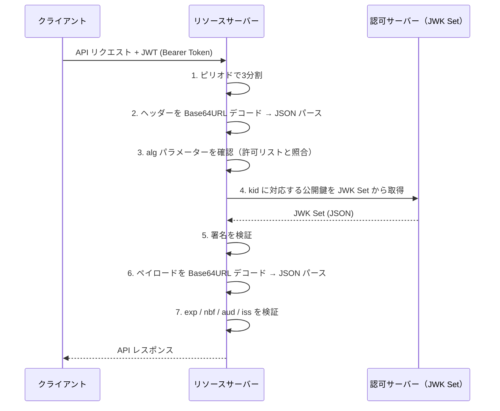
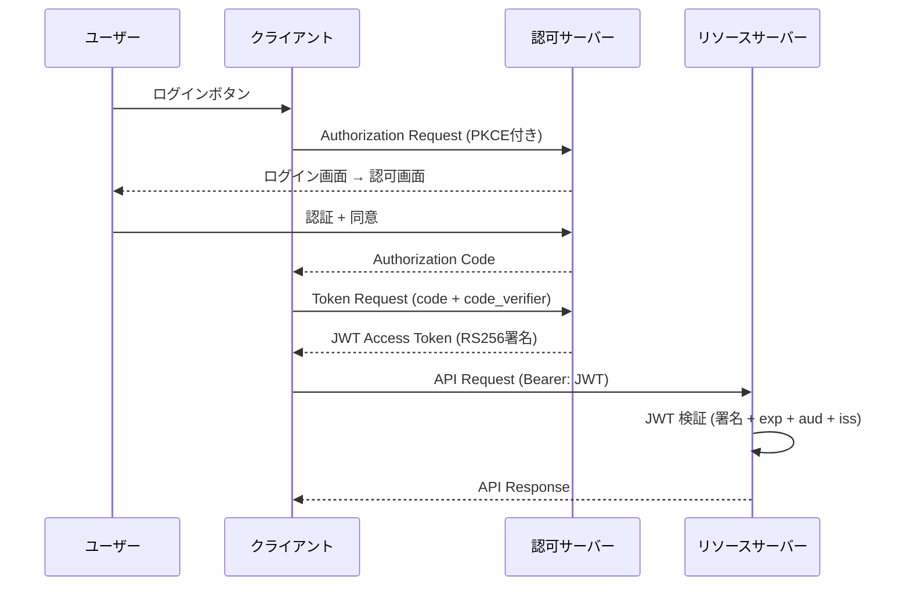

> **Note:** このページはAIエージェントが執筆しています。内容の正確性は一次情報（仕様書・公式資料）とあわせてご確認ください。

# JSON Web Token (JWT) — RFC 7519

## 概要

JSON Web Token（JWT）は、2者間でクレーム（主張）を安全に伝達するためのコンパクトな URL セーフトークン形式です。
クレームは JSON オブジェクトとしてエンコードされ、JSON Web Signature（JWS）の署名ペイロードまたは JSON Web Encryption（JWE）の暗号テキストとして保護されます。

RFC 7519 は 2015 年 5 月に Proposed Standard として公開され、現在は RFC 8725 によってベストプラクティスが提供されています（[RFC 7519](https://www.rfc-editor.org/rfc/rfc7519)）。
さらに RFC 8725 の後継となる [draft-ietf-oauth-rfc8725bis-04](https://datatracker.ietf.org/doc/draft-ietf-oauth-rfc8725bis/)（2026 年 3 月改訂）が IESG に提出済みであり、新たな攻撃手法への対策が追加されています。

JWT は OAuth 2.0 のアクセストークン（RFC 9068）、OpenID Connect の ID トークン、Verifiable Credentials の証明フォーマットなど、デジタルアイデンティティ分野の広範な仕様で採用されています。
これら上位仕様を理解するための基盤として、JWT の動作原理とセキュリティ特性を正確に把握することが不可欠です。

---

## 背景と経緯

JWT が登場する以前、Web アプリケーションにおけるセッション管理はサーバーサイドのセッションストア（データベース・メモリ）に依存していました。
この方式はスケールアウトが難しく、分散環境での一貫性確保が課題でした。

2010 年代初頭、OAuth 2.0 エコシステムの拡大とともに、**ステートレスでかつ検証可能なトークン**への需要が高まりました。
IETF の JOSE（JSON Object Signing and Encryption）ワーキンググループがこの課題に取り組み、2015 年に以下の仕様群を一括してリリースしました。

| RFC      | 名称                      | 役割                           |
| -------- | ------------------------- | ------------------------------ |
| RFC 7515 | JSON Web Signature (JWS)  | 署名・MAC によるトークン保護   |
| RFC 7516 | JSON Web Encryption (JWE) | 暗号化によるトークン保護       |
| RFC 7517 | JSON Web Key (JWK)        | 公開鍵・秘密鍵の表現形式       |
| RFC 7518 | JSON Web Algorithms (JWA) | 利用可能な暗号アルゴリズム一覧 |
| RFC 7519 | JSON Web Token (JWT)      | クレームセットの定義・検証規則 |

JWT は JWS または JWE を「クレームを運ぶコンテナ」として使う上位の概念です。
署名済み JWT（Signed JWT）は JWS の Compact Serialization 形式を使い、暗号化済み JWT（Encrypted JWT）は JWE を使います。

---

## 構造

### Compact Serialization

JWT の最も一般的な表現形式は**3つのピリオド区切り**の文字列です。

```
BASE64URL(JOSE Header) . BASE64URL(Payload) . BASE64URL(Signature)
```

たとえば署名済み JWT は次のような形式になります（[RFC 7515 Section 7.2](https://www.rfc-editor.org/rfc/rfc7515#section-7.2)）。

```
eyJhbGciOiJSUzI1NiIsInR5cCI6IkpXVCJ9
.eyJzdWIiOiIxMjM0NTY3ODkwIiwibmFtZSI6IkpvaG4gRG9lIiwiaWF0IjoxNTE2MjM5MDIyfQ
.SflKxwRJSMeKKF2QT4fwpMeJf36POk6yJV_adQssw5c
```

各パートはそれぞれ Base64URL エンコード（パディングなし）されており、URL クエリパラメーターや HTTP Authorization ヘッダーにそのまま埋め込めます。

### JOSE ヘッダー

ヘッダーは JSON オブジェクトで、最低限 `alg` パラメーターを含みます。

```json
{
  "alg": "RS256",
  "typ": "JWT",
  "kid": "2025-signing-key"
}
```

| パラメーター | 意味                                |
| ------------ | ----------------------------------- |
| `alg`        | 署名または MAC アルゴリズム（必須） |
| `typ`        | メディアタイプ（"JWT" を推奨）      |
| `kid`        | 使用鍵の識別子                      |
| `jku`        | JWK Set の URL                      |
| `jwk`        | 埋め込み公開鍵                      |
| `x5t`        | X.509 証明書の SHA-1 サムプリント   |

`typ` を `"JWT"` に設定することで、同一の発行者が異なる用途の JWT を発行する場合の**トークン混同攻撃**を防ぎます（[RFC 8725 Section 3.11](https://www.rfc-editor.org/rfc/rfc8725#section-3.11)）。

### ペイロード（Claims Set）

ペイロードは JSON オブジェクトで、クレームの集合です。

```json
{
  "iss": "https://auth.example.com",
  "sub": "user-123",
  "aud": "https://api.example.com",
  "exp": 1735689600,
  "iat": 1735686000,
  "jti": "a3f4c9b2-1e8d-4a7f-8c3e-5d6b9f2a1e4c"
}
```

---

## 登録済みクレーム

RFC 7519 Section 4.1 は、相互運用性のために 7 つの**登録済みクレーム名**を定義しています（[RFC 7519 Section 4.1](https://www.rfc-editor.org/rfc/rfc7519#section-4.1)）。
これらは OPTIONAL ですが、使用する場合は仕様で定めた意味で使わなければなりません。

| クレーム | 型               | 説明                                                           |
| -------- | ---------------- | -------------------------------------------------------------- |
| `iss`    | 文字列（URI）    | 発行者（Issuer）。トークンを発行したエンティティを識別する     |
| `sub`    | 文字列           | 主体（Subject）。トークンが指し示すエンティティを識別する      |
| `aud`    | 文字列または配列 | 受信者（Audience）。トークンの受信が意図されているエンティティ |
| `exp`    | NumericDate      | 有効期限（Expiration Time）。この時刻以降は拒否する            |
| `nbf`    | NumericDate      | 有効開始時刻（Not Before）。この時刻より前は拒否する           |
| `iat`    | NumericDate      | 発行時刻（Issued At）                                          |
| `jti`    | 文字列           | JWT ID。リプレイ攻撃防止のための一意識別子                     |

`NumericDate` は Unix エポック（1970-01-01T00:00:00Z）からの秒数を表す整数です。

### プライベートクレーム

`iss`・`sub`・`aud` などの登録済みクレームに加え、アプリケーション固有のクレームを追加できます。
IANA の [JSON Web Token Claims Registry](https://www.iana.org/assignments/jwt/jwt.xhtml) にクレームを登録することで名前の衝突を防げます。
独自クレームを使う場合は衝突リスクを減らすため URI 形式のクレーム名を推奨します。

---

## 暗号アルゴリズム

JWA（RFC 7518）は JWT で使える署名アルゴリズムを定義しています（[RFC 7518 Section 3](https://www.rfc-editor.org/rfc/rfc7518#section-3)）。

### 署名アルゴリズム（JWS alg）

| alg     | アルゴリズム                | 要件               | 鍵長          |
| ------- | --------------------------- | ------------------ | ------------- |
| `HS256` | HMAC + SHA-256              | Required           | 256 bit 以上  |
| `HS384` | HMAC + SHA-384              | Optional           | 384 bit 以上  |
| `HS512` | HMAC + SHA-512              | Optional           | 512 bit 以上  |
| `RS256` | RSASSA-PKCS1-v1_5 + SHA-256 | Recommended        | 2048 bit 以上 |
| `RS384` | RSASSA-PKCS1-v1_5 + SHA-384 | Optional           | 2048 bit 以上 |
| `RS512` | RSASSA-PKCS1-v1_5 + SHA-512 | Optional           | 2048 bit 以上 |
| `ES256` | ECDSA P-256 + SHA-256       | Recommended+       | P-256 曲線    |
| `ES384` | ECDSA P-384 + SHA-384       | Optional           | P-384 曲線    |
| `ES512` | ECDSA P-521 + SHA-512       | Optional           | P-521 曲線    |
| `PS256` | RSASSA-PSS + SHA-256 + MGF1 | Optional           | 2048 bit 以上 |
| `none`  | 署名なし                    | Optional（要注意） | —             |

**実装者の注意**: FAPI 2.0 などの高セキュリティプロファイルでは `PS256` または `ES256` が要求されます。
`RS256` は広く実装されていますが、RSASSA-PKCS1-v1_5 は脆弱性（Bleichenbacher 攻撃）のリスクがあるため、新規実装では `PS256` を推奨します。

### HMAC vs 非対称暗号の選択

`HS256` は共有秘密鍵を使う対称アルゴリズムです。
発行者と検証者が同一の信頼境界内にある場合（同一サービスのマイクロサービス間など）は適切ですが、**外部の第三者が検証する必要がある場合は非対称アルゴリズム（RS256/ES256）を使うべきです**。

非対称アルゴリズムでは公開鍵を JWK Set エンドポイント（`/.well-known/jwks.json`）で公開できるため、発行者の秘密鍵を外部に渡す必要がありません。

---

## 検証プロセス

JWT の検証は RFC 7519 Section 7.2 で 10 ステップとして定義されています（[RFC 7519 Section 7.2](https://www.rfc-editor.org/rfc/rfc7519#section-7.2)）。



### 重要な検証項目

```python
import jwt  # PyJWT などのライブラリを使用

# NG: アルゴリズムを指定しない（アルゴリズム混同攻撃の脆弱性）
payload = jwt.decode(token, public_key, options={"verify_signature": True})

# OK: 受け入れるアルゴリズムを明示的に許可リスト指定
payload = jwt.decode(
    token,
    public_key,
    algorithms=["RS256"],  # 許可するアルゴリズムを列挙
    audience="https://api.example.com",
    issuer="https://auth.example.com",
)
```

1. **署名前にアルゴリズムを確定する**: ヘッダーの `alg` 値を受け入れる前に、あらかじめ許可リストと照合する
2. **`aud` の検証**: 自分宛てのトークンかを確認する（省略すると他サービス向けトークンを悪用される）
3. **`exp` の検証**: 時刻ずれ（クロックスキュー）を考慮した許容範囲（通常 ±60 秒）で検証する
4. **`iss` の検証**: 期待する発行者からのトークンかを確認する

---

## 設計上のトレードオフ

### ステートレス性とトークン失効

JWT の最大の利点はステートレスな検証です。
リソースサーバーは認可サーバーに問い合わせることなく、公開鍵さえあれば JWT を検証できます。
しかしこれは同時に**最大の弱点**でもあります。

発行済み JWT の `exp` が切れるまでの間、そのトークンを失効させる標準的な手段がありません。
ユーザーアカウントが侵害されたり、ログアウトしたりしても、有効期限が来るまで JWT は使い続けられます。

**解決策のパターン:**

| 手法                                    | トレードオフ                                   |
| --------------------------------------- | ---------------------------------------------- |
| 短い有効期限（5〜15 分）+ Refresh Token | ステートレス性を保ちつつリスクウィンドウを縮小 |
| JTI のブロックリスト                    | ステートレス性を失うが確実な失効が可能         |
| Token Introspection（RFC 7662）         | リアルタイム確認だがレイテンシが増加           |
| DPoP（RFC 9449）                        | トークン盗用リスクをデバイス鍵で軽減           |

### ペイロードの可視性

Signed JWT（JWS）のペイロードは**Base64URL エンコードされているだけで暗号化されていません**。
`Authorization: Bearer <JWT>` ヘッダーをブラウザのデベロッパーツールで容易に解読できます。

個人情報・機密性の高いクレームを含む場合は JWE による暗号化か、クレームを最小限にする設計が必要です。

---

## 実装上の注意点

### 1. アルゴリズム混同攻撃（Algorithm Confusion Attack）

最も危険な攻撃の一つです。
JWT ライブラリが RS256 の検証に RSA 公開鍵を使用するとき、攻撃者が `alg` を `HS256` に書き換えてその RSA 公開鍵を HMAC 鍵として署名したトークンを送ると、脆弱な実装はこれを正当なトークンとして受け入れてしまいます（[RFC 8725 Section 2.1](https://www.rfc-editor.org/rfc/rfc8725#section-2.1)）。

**対策**: 検証時に受け入れるアルゴリズムを事前に許可リストで固定し、ヘッダーの `alg` 値に従ってアルゴリズムを動的に切り替えない。

### 2. `none` アルゴリズム

`alg: "none"` は署名を省略した unsecured JWT です。
TLS で保護された内部通信など、別の手段でセキュリティが確保されている場合のみ有効ですが、多くの JWT ライブラリが `none` を受け入れていた時代に多数の脆弱性が報告されました（[auth0.com ブログ](https://auth0.com/blog/critical-vulnerabilities-in-json-web-token-libraries/)）。

**対策**: 検証実装では `none` を明示的に禁止する。RFC 8725 は「ライブラリは `none` を生成・受容してはならない、ただしアプリケーションが明示的に要求した場合を除く」と規定しています（[RFC 8725 Section 3.2](https://www.rfc-editor.org/rfc/rfc8725#section-3.2)）。

### 3. `kid` / `jku` インジェクション攻撃

`kid`（Key ID）に SQL クエリや LDAP クエリを含む文字列を挿入してキー取得ロジックを操作する攻撃、および `jku` や `x5u` ヘッダーに攻撃者が制御するサーバーの URL を指定する SSRF 攻撃があります（[RFC 8725 Section 3.7](https://www.rfc-editor.org/rfc/rfc8725#section-3.7)）。

**対策**: `jku` / `x5u` を使う場合は事前に登録した URL との完全一致でホワイトリスト検証する。

### 4. ECDSA のノンス再利用（Sony PlayStation 3 の例）

ECDSA 署名の乱数ノンスが再利用された場合、秘密鍵が数学的に復元可能です。
RFC 6979 に規定された決定論的ノンス生成を使うことでこのリスクを排除できます（[RFC 6979](https://www.rfc-editor.org/rfc/rfc6979)）。

### 5. JWE 解凍爆弾（Decompression Bomb）

JWE の圧縮オプション（`zip: "DEF"`）を使った JWT を復号する際、解凍後のサイズが膨大になる可能性があります。
draft-rfc8725bis では解凍後サイズに上限（例: 250 KB）を設けることを推奨しています（[draft-ietf-oauth-rfc8725bis-04](https://datatracker.ietf.org/doc/draft-ietf-oauth-rfc8725bis/)）。

### 6. 弱い HMAC 鍵

`HS256` でパスワードのような低エントロピーの鍵を使うと、攻撃者がトークンを入手した後にオフライン辞書攻撃で鍵を解読できます。
RFC 7518 は「使用するハッシュ関数の出力と同じビット長以上の鍵を使わなければならない」と定めています（[RFC 7518 Section 3.2](https://www.rfc-editor.org/rfc/rfc7518#section-3.2)）。
`HS256` では最低でも 256 bit（32 バイト）のランダム鍵が必要です。

---

## JWT ライフサイクルの実装例

以下は OAuth 2.0 Authorization Code フローにおける JWT アクセストークンの全体フローです（[RFC 9068](https://www.rfc-editor.org/rfc/rfc9068)）。



### JWT Access Token の例（RFC 9068 形式）

```json
{
  "iss": "https://auth.example.com",
  "sub": "user-123",
  "aud": "https://api.example.com",
  "exp": 1735689600,
  "iat": 1735686000,
  "jti": "a3f4c9b2-1e8d-4a7f-8c3e-5d6b9f2a1e4c",
  "client_id": "webapp-client",
  "scope": "read:profile write:posts",
  "authorization_details": [
    {
      "type": "payment_initiation",
      "actions": ["initiate", "status"]
    }
  ]
}
```

---

## 採用事例

JWT はデジタルアイデンティティの事実上の標準フォーマットとなっており、以下の仕様・プロダクトで採用されています。

| 用途                             | 採用仕様・製品                               |
| -------------------------------- | -------------------------------------------- |
| OpenID Connect ID Token          | OpenID Connect Core 1.0                      |
| OAuth 2.0 JWT Access Token       | RFC 9068                                     |
| Verifiable Credential            | W3C VC Data Model 2.0（JWT-VC Presentation） |
| SD-JWT（選択的開示）             | RFC 9901 / SD-JWT VC                         |
| FAPI 2.0 リクエストオブジェクト  | OpenID FAPI 2.0 Security Profile             |
| WebAuthn Assertion               | 一部実装で JWT ラッパーを使用                |
| Kubernetes Service Account Token | Kubernetes 1.12+                             |
| AWS / GCP / Azure IAM            | クラウドプロバイダーの認証トークン           |

---

## 関連仕様・後継仕様

| 関係                    | 仕様                                                  |
| ----------------------- | ----------------------------------------------------- |
| 依存（署名）            | RFC 7515 — JSON Web Signature (JWS)                   |
| 依存（暗号化）          | RFC 7516 — JSON Web Encryption (JWE)                  |
| 依存（鍵）              | RFC 7517 — JSON Web Key (JWK)                         |
| 依存（アルゴリズム）    | RFC 7518 — JSON Web Algorithms (JWA)                  |
| 関連（JWS 拡張）        | RFC 7797 — JWS アンエンコード・ペイロード・オプション |
| ベストプラクティス      | RFC 8725 — JWT Best Current Practices                 |
| RFC 8725 後継（進行中） | draft-ietf-oauth-rfc8725bis                           |
| 選択的開示への応用      | RFC 9901 — SD-JWT                                     |
| アクセストークン標準化  | RFC 9068 — JWT Profile for Access Tokens              |
| 鍵所有証明              | RFC 9449 — DPoP                                       |
| リッチ認可              | RFC 9396 — OAuth 2.0 Rich Authorization Requests      |

---

## まとめ：実装者へのチェックリスト

1. **アルゴリズムの許可リストを固定**: 受け入れる `alg` 値を事前に限定し、ヘッダーに従い動的に変更しない
2. **`none` を明示的に禁止**: ライブラリのデフォルト設定を確認する
3. **`aud` と `iss` を必ず検証**: マルチテナント環境では特に重要
4. **HMAC 鍵は 256 bit 以上のランダム鍵を使用**: 人間が記憶できるパスワードを鍵にしない
5. **有効期限を短く設定**: アクセストークンは 5〜15 分、失効要件があれば JTI ブロックリストを検討
6. **`jku` / `x5u` はホワイトリスト検証**: 動的な URL 取得は SSRF リスクを生む
7. **公開鍵の定期ローテーション**: JWK Set エンドポイントを使い、`kid` でキーを管理
8. **センシティブなクレームは JWE で暗号化**: Signed JWT のペイロードは誰でも読める

---

## 参考資料

- [RFC 7519 — JSON Web Token (JWT)](https://www.rfc-editor.org/rfc/rfc7519)
- [RFC 7515 — JSON Web Signature (JWS)](https://www.rfc-editor.org/rfc/rfc7515)
- [RFC 7516 — JSON Web Encryption (JWE)](https://www.rfc-editor.org/rfc/rfc7516)
- [RFC 7517 — JSON Web Key (JWK)](https://www.rfc-editor.org/rfc/rfc7517)
- [RFC 7518 — JSON Web Algorithms (JWA)](https://www.rfc-editor.org/rfc/rfc7518)
- [RFC 7797 — JSON Web Signature (JWS) Unencoded Payload Option](https://www.rfc-editor.org/rfc/rfc7797)
- [RFC 8725 — JSON Web Token Best Current Practices](https://www.rfc-editor.org/rfc/rfc8725)
- [draft-ietf-oauth-rfc8725bis-04 — JWT Best Current Practices (更新版)](https://datatracker.ietf.org/doc/draft-ietf-oauth-rfc8725bis/)
- [RFC 9068 — JSON Web Token (JWT) Profile for OAuth 2.0 Access Tokens](https://www.rfc-editor.org/rfc/rfc9068)
- [RFC 9901 — Selective Disclosure for JSON Web Tokens (SD-JWT)](https://www.rfc-editor.org/rfc/rfc9901)
- [RFC 9449 — OAuth 2.0 Demonstrating Proof of Possession (DPoP)](https://www.rfc-editor.org/rfc/rfc9449)
- [IANA JSON Web Token Claims Registry](https://www.iana.org/assignments/jwt/jwt.xhtml)
- [auth0.com — Critical vulnerabilities in JSON Web Token libraries](https://auth0.com/blog/critical-vulnerabilities-in-json-web-token-libraries/)
