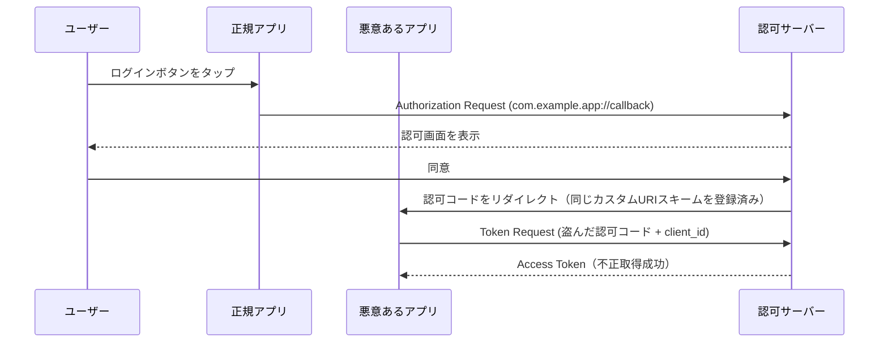
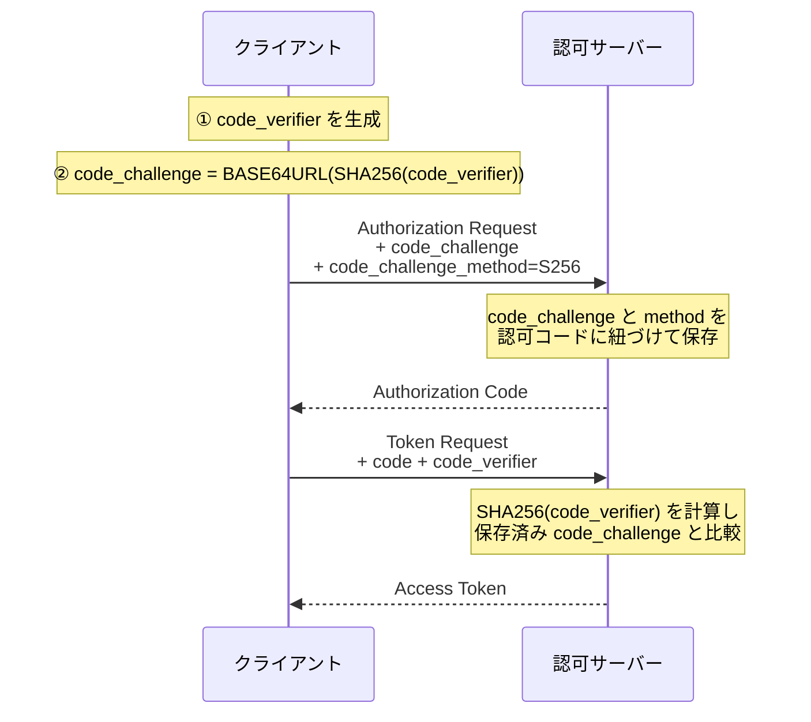

> **Note:** このページはAIエージェントが執筆しています。内容の正確性は一次情報（仕様書・公式資料）とあわせてご確認ください。

# PKCE — Proof Key for Code Exchange (RFC 7636)

## 概要

PKCE（Proof Key for Code Exchange、発音は "ピクシー"）は、OAuth 2.0 の Authorization Code フローにおける **認可コード横取り攻撃（Authorization Code Interception Attack）** を防ぐための拡張仕様です。[RFC 7636](https://www.rfc-editor.org/rfc/rfc7636) として 2015 年 9 月に標準化されました。

当初はネイティブアプリ（モバイルアプリなど）向けのセキュリティ強化として設計されましたが、2025 年 1 月に公開された [RFC 9700 (BCP 240)](https://www.rfc-editor.org/rfc/rfc9700) では、**すべてのパブリッククライアントに PKCE の使用が MUST** とされ、コンフィデンシャルクライアントにも RECOMMENDED となりました。今や PKCE は OAuth 2.0 実装の標準的な構成要素です。

---

## 背景と経緯

### 認可コード横取り攻撃とは

OAuth 2.0 の Authorization Code フローでは、認可サーバーが認可コードをリダイレクト URI 経由でクライアントに返します。このリダイレクトはブラウザやOSのURIスキームを経由するため、以下のような攻撃が成立します。

**攻撃シナリオ（モバイルアプリ）:**



iOS や Android では、複数のアプリが同一のカスタム URI スキーム（例: `com.example.app://callback`）を登録できます。悪意あるアプリがこれを悪用すると、正規アプリが取得するはずの認可コードを横取りできます。`client_id` はパブリッククライアントでは秘密にできないため、コードさえあればトークンを取得されてしまいます。

PKCE はこの問題を、**クライアントだけが知っている暗号学的な秘密値** を認可フローに組み込むことで解決します。

---

## 設計思想

PKCE の中心的なアイデアは、**コミットメント（事前公約）と検証** のパターンです。

1. クライアントは認可リクエスト時に「後でこの値を提示する」というコミットメント（`code_challenge`）を送る
2. トークンリクエスト時に、そのコミットメントの元になった値（`code_verifier`）を提示する
3. 認可サーバーが両者の対応関係を検証する

認可コードを傍受した攻撃者は `code_verifier` を持っていないため、トークンを取得できません。これは**チャレンジ・レスポンス**の仕組みであり、共有秘密鍵を必要としない点が優れています。

### パスワードとの違い

PKCE のコード検証値はセッションごとに生成される使い捨ての高エントロピー値です。パスワードと異なりブルートフォース耐性が十分あるため、ソルトは不要です。また、認可サーバーは `code_challenge` を保存するだけでよく、`code_verifier` を保存する必要はありません。

---

## 技術詳細

### プロトコルフロー



### Step 1: code_verifier の生成

クライアントは認可リクエストの前に、暗号学的に安全な乱数から `code_verifier` を生成します。

**仕様（[RFC 7636 Section 4.1](https://www.rfc-editor.org/rfc/rfc7636#section-4.1)）:**

```
code-verifier = 43*128unreserved
unreserved = ALPHA / DIGIT / "-" / "." / "_" / "~"
```

- **文字セット**: `[A-Z]`、`[a-z]`、`[0-9]`、`-`、`.`、`_`、`~`（RFC 3986 の unreserved characters）
- **長さ**: 最短 43 文字、最長 128 文字
- **推奨エントロピー**: 256 bit 以上（32 バイトの乱数を base64url エンコードすると 43 文字）

**生成例（Node.js）:**

```javascript
const crypto = require("crypto");

// 32バイトの乱数を生成し base64url エンコード（パディングなし）
const codeVerifier = crypto.randomBytes(32).toString("base64url"); // 43文字の base64url 文字列
```

**生成例（Python）:**

```python
import secrets
import base64

# 32バイトの乱数を生成し base64url エンコード（パディングなし）
code_verifier = base64.urlsafe_b64encode(secrets.token_bytes(32)).rstrip(b'=').decode()
```

### Step 2: code_challenge の導出

`code_challenge` は `code_verifier` から導出します。変換方式（`code_challenge_method`）には S256 と plain の 2 種類があります。

**S256（推奨・MTI）:**

```
code_challenge = BASE64URL(SHA256(ASCII(code_verifier)))
```

**計算例（Node.js）:**

```javascript
const codeChallenge = crypto.createHash("sha256").update(codeVerifier, "ascii").digest("base64url"); // パディングなしの base64url
```

**plain（非推奨）:**

```
code_challenge = code_verifier
```

`plain` は `code_challenge` が `code_verifier` そのものであるため、通信路でコードチャレンジが傍受されると `code_verifier` も漏洩します。`S256` が使用できない技術的制約がある場合のみ使用してください（[RFC 7636 Section 4.2](https://www.rfc-editor.org/rfc/rfc7636#section-4.2)）。

### Step 3: 認可リクエスト

通常の OAuth 2.0 認可リクエストに以下のパラメーターを追加します。

```
GET /authorize?
  response_type=code
  &client_id=s6BhdRkqt3
  &redirect_uri=https%3A%2F%2Fclient.example.com%2Fcallback
  &scope=openid
  &state=xyz
  &code_challenge=E9Melhoa2OwvFrEMTJguCHaoeK1t8URWbuGJSstw-cM
  &code_challenge_method=S256
```

| パラメーター            | 必須     | 説明                                      |
| ----------------------- | -------- | ----------------------------------------- |
| `code_challenge`        | REQUIRED | base64url エンコードされたチャレンジ値    |
| `code_challenge_method` | OPTIONAL | `S256` または `plain`（省略時は `plain`） |

認可サーバーは `code_challenge` と `code_challenge_method` を発行した認可コードと紐づけて保存します。

### Step 4: トークンリクエスト

認可コードを受け取ったクライアントは、トークンエンドポイントに `code_verifier` を追加して送ります。

```
POST /token
Content-Type: application/x-www-form-urlencoded

grant_type=authorization_code
&code=SplxlOBeZQQYbYS6WxSbIA
&redirect_uri=https%3A%2F%2Fclient.example.com%2Fcallback
&client_id=s6BhdRkqt3
&code_verifier=dBjftJeZ4CVP-mB92K27uhbUJU1p1r_wW1gFWFOEjXk
```

認可サーバーは保存済みの `code_challenge_method` に従って `code_verifier` を変換し、保存済みの `code_challenge` と一致するか検証します。一致しない場合は `invalid_grant` エラーを返します。

---

## 実装上の注意点

### 1. S256 を必ず使う

RFC 7636 は「S256 が実装可能なクライアントは MUST で S256 を使用すること」と規定しています（[Section 4.2](https://www.rfc-editor.org/rfc/rfc7636#section-4.2)）。`plain` はコードチャレンジが傍受されると verifier も漏洩するため、事実上無意味です。新規実装で `plain` を選ぶ理由はほぼありません。

### 2. code_verifier はセッションごとに新規生成する

`code_verifier` を再利用すると、攻撃者が過去のコードチャレンジを使って攻撃を仕掛けられる可能性があります。認可フローを開始するたびに、暗号学的に安全な乱数から新たに生成してください。

### 3. ダウングレード攻撃への対策（サーバー側）

RFC 9700 は「認可サーバーは PKCE ダウングレード攻撃を軽減しなければならない（MUST）」と規定しています（[Section 2.1.1](https://www.rfc-editor.org/rfc/rfc9700#section-2.1.1)）。具体的には、**トークンリクエストに `code_verifier` が含まれる場合、そのリクエストは認可リクエストに `code_challenge` が存在した場合にのみ受け入れること**です。これにより、攻撃者が後付けで verifier を送り込む攻撃を防ぎます。

### 4. code_challenge を認可リクエスト以外で公開しない

`code_challenge` は認可リクエストのクエリパラメーターとして送信されるため、ブラウザの履歴やサーバーアクセスログに残る場合があります。`S256` を使っていれば `code_challenge` から `code_verifier` を逆算することは現実的に不可能ですが、不要な場所に記録しないことが望ましいです。

### 5. PKCE とクライアント認証は独立した保護機構

PKCE は認可コードの横取りに対する保護です。コンフィデンシャルクライアントであれば、クライアント認証（`client_secret` や Private Key JWT）と PKCE を組み合わせることで、多層防御が実現できます。RFC 9700 はコンフィデンシャルクライアントにも PKCE を RECOMMENDED としており、「認可コードインジェクション攻撃」（認可コードを正規クライアントのセッションに注入する攻撃）に対して有効です。

### 6. 既存の PKCE 非対応サーバーとの互換性

PKCE パラメーターを理解しない古い認可サーバーは未知のパラメーターを無視します。これによりクライアントは PKCE 未対応サーバーとも互換性を保てますが、セキュリティ保護が機能しないことに留意してください。RFC 9700 では認可サーバーの PKCE サポートが MUST とされているため、今後はこの互換性問題が発生するケースは減少していきます。

---

## 採用事例

PKCE は現在、主要な OAuth 2.0 / OpenID Connect 実装で標準的にサポートされています。

| 製品・サービス                | 備考                                        |
| ----------------------------- | ------------------------------------------- |
| Google Identity Platform      | パブリッククライアントで PKCE を推奨        |
| Microsoft Azure AD / Entra ID | MSAL ライブラリで PKCE をデフォルト有効     |
| Auth0                         | SPA・モバイルアプリで PKCE フローを標準採用 |
| Keycloak                      | PKCE サポート済み（S256）                   |
| Apple Sign In                 | PKCE 必須                                   |
| Okta                          | PKCE をデフォルト推奨                       |

OID4VCI / OID4VP などの Verifiable Credentials 関連仕様も、OAuth 2.0 ベースのフローで PKCE の使用を前提としています。

---

## 関連仕様・後継仕様

| 仕様                                                                                 | 関係                                                                             |
| ------------------------------------------------------------------------------------ | -------------------------------------------------------------------------------- |
| [RFC 6749](https://www.rfc-editor.org/rfc/rfc6749)                                   | PKCE が拡張する基盤仕様（OAuth 2.0）                                             |
| [RFC 9700 (BCP 240)](https://www.rfc-editor.org/rfc/rfc9700)                         | OAuth 2.0 セキュリティ BCP。パブリッククライアントへの PKCE 使用を MUST に格上げ |
| [RFC 9449 (DPoP)](https://www.rfc-editor.org/rfc/rfc9449)                            | トークンの送信者制約（Sender-Constraining）。PKCE と組み合わせることで多層防御   |
| [RFC 9126 (PAR)](https://www.rfc-editor.org/rfc/rfc9126)                             | 認可リクエストをサーバー側で事前登録する仕様。PKCE と組み合わせ可能              |
| [OID4VCI](https://openid.net/specs/openid-4-verifiable-credential-issuance-1_0.html) | Verifiable Credential 発行仕様。OAuth 2.0 拡張として PKCE を利用                 |

---

## 参考資料

- [RFC 7636 — Proof Key for Code Exchange by OAuth Public Clients](https://www.rfc-editor.org/rfc/rfc7636) — 一次仕様
- [RFC 9700 — Best Current Practice for OAuth 2.0 Security (BCP 240)](https://www.rfc-editor.org/rfc/rfc9700) — PKCE の MUST 要件を規定（2025 年 1 月）
- [RFC 6749 — The OAuth 2.0 Authorization Framework](https://www.rfc-editor.org/rfc/rfc6749) — 基盤仕様
- [RFC 3986 — Uniform Resource Identifier (URI): Generic Syntax](https://www.rfc-editor.org/rfc/rfc3986) — unreserved characters の定義
- [RFC 4648 — The Base16, Base32, and Base64 Data Encodings](https://www.rfc-editor.org/rfc/rfc4648) — base64url エンコードの定義
