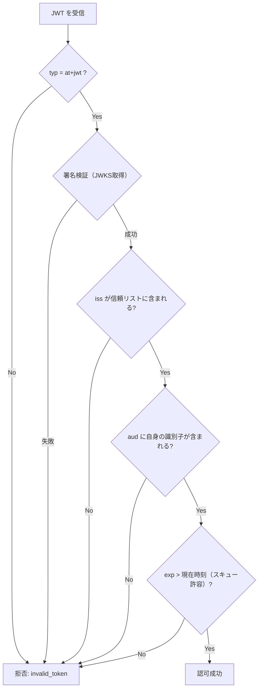

> **Note:** このページはAIエージェントが執筆しています。内容の正確性は一次情報（仕様書・公式資料）とあわせてご確認ください。

# JWT Profile for OAuth 2.0 Access Tokens (RFC 9068)

## 概要

[RFC 9068](https://www.rfc-editor.org/rfc/rfc9068.html) は、OAuth 2.0 のアクセストークンを JSON Web Token（JWT）形式で発行・検証するための標準プロファイルです。2021年10月にIETF OAuth Working Groupが発行しました。

従来の OAuth 2.0 では、アクセストークンは「不透明な文字列（opaque token）」として扱われていました。リソースサーバーがトークンを検証するには、毎回認可サーバーのイントロスペクションエンドポイント（RFC 7662）に問い合わせる必要がありました。この設計では認可サーバーが単一障害点となり、マイクロサービス環境でのスケールアウトにも課題がありました。

RFC 9068 は、トークン情報を暗号署名付き JWT に埋め込むことで、リソースサーバーが**認可サーバーへの追加呼び出しなしにローカル検証**できるようにします。RFC 9068 で標準化された JWT 形式アクセストークンは、DPoP（RFC 9449）や PAR（RFC 9126）など現代の高セキュリティ OAuth 実装と組み合わせて広く採用されています。

## 背景と経緯

OAuth 2.0（RFC 6749）はアクセストークンの形式を意図的に未定義にしていました。この柔軟性により各実装が独自の JWT プロファイルを採用し、相互運用性の欠如が生じていました。Auth0、Azure AD、Okta、Keycloak はそれぞれ異なるクレーム構造を持ち、特定ベンダーへの依存を招いていました。

RFC 9068 はこの状況を解決するために、以下を標準化します:

- JWT ヘッダの `typ` 値（`at+jwt`）
- 必須クレームの集合と意味論
- リソースサーバー側の検証手順
- プライバシー・セキュリティ要件

著者は Auth0 の Vittorio Bertocci で、長年の OAuth エコシステムへの貢献を結晶化した仕様です。

## 設計思想

### ステートレス自己完結型トークン

RFC 9068 の根幹は**ステートレス・自己完結型（self-contained）**設計です。

```
従来設計（不透明トークン）:
Client → Token → ResourceServer → IntrospectionEndpoint → AuthServer
                                    ↑ 毎リクエストで呼び出し

RFC 9068 設計（JWT）:
Client → JWT → ResourceServer（ローカル署名検証）
               ↑ 初回のみ: JWKS endpoint → AuthServer から公開鍵取得
```

認可サーバーへのラウンドトリップが不要になることで、高トラフィック環境でのレイテンシ削減とスケーラビリティ向上を実現します。

### ID Token との明確な分離

RFC 9068 以前の大きな問題として **Token Confusion Attack** がありました。OpenID Connect の ID Token と OAuth 2.0 の Access Token はどちらも JWT であり、`typ` ヘッダ値が標準化されていなかったため、リソースサーバーがトークン種別を確実に検証できず、ID Token を Access Token として受け入れてしまう可能性がありました。

RFC 9068 はこれを `typ: "at+jwt"` の標準化によって解決します。発行者はこの値を設定することが**推奨**（SHOULD）され、リソースサーバーはこの値を**検証しなければなりません**（MUST）:

```
ID Token（OpenID Connect）:
  Header: {"typ": "JWT", ...}   ← IDトークン

Access Token（RFC 9068）:
  Header: {"typ": "at+jwt", ...} ← アクセストークンであることを明示
```

### スケーラビリティ vs. リアルタイム制御のトレードオフ

ステートレス設計には本質的なトレードオフがあります。有効期限前のトークン失効が困難です。これは設計上の欠陥ではなく、意図的な選択です。RFC 9068 はこれを短寿命トークン（5〜15分）と JTI ブロックリストの組み合わせで緩和することを想定しています。

## 技術詳細

### トークン構造

RFC 9068 準拠のアクセストークンは、標準的な JWT 構造（ヘッダ.ペイロード.署名）を持ちます。

**ヘッダ:**

```json
{
  "typ": "at+jwt",
  "alg": "RS256",
  "kid": "2024-01"
}
```

発行者は `typ` に `"at+jwt"` または `"application/at+jwt"` を設定することが**推奨**されます（SHOULD）。リソースサーバーはこの値を**検証しなければなりません**（MUST）。`alg: "none"` は絶対に禁止されています（MUST NOT）。非対称署名（RS256, ES256 など）が推奨されます。

**ペイロード（必須クレーム）:**

| クレーム    | 型           | 説明                                            |
| ----------- | ------------ | ----------------------------------------------- |
| `iss`       | String       | 認可サーバーの識別子（通常はベース URL）        |
| `sub`       | String       | 主体識別子（ユーザー ID またはクライアント ID） |
| `aud`       | String/Array | 対象リソースサーバーの識別子                    |
| `exp`       | NumericDate  | 有効期限（Unix 秒）                             |
| `iat`       | NumericDate  | 発行時刻（Unix 秒）                             |
| `client_id` | String       | トークンを要求した OAuth 2.0 クライアント ID    |
| `jti`       | String       | JWT 固有識別子（リプレイ攻撃対策）              |

`client_id` と `jti` は RFC 7519 ではオプションでしたが、RFC 9068 で必須（MUST）に格上げされています。

**ペイロード（主要オプションクレーム）:**

```json
{
  "iss": "https://auth.example.com",
  "sub": "user-123",
  "aud": "https://api.example.com",
  "exp": 1634567890,
  "iat": 1634564290,
  "client_id": "my-app",
  "jti": "550e8400-e29b-41d4-a716-446655440000",
  "scope": "read write",
  "auth_time": 1634564200,
  "acr": "urn:mace:incommon:iap:silver",
  "amr": ["pwd", "otp"],
  "groups": ["editors"],
  "roles": ["admin"],
  "entitlements": ["premium"]
}
```

`groups`、`roles`、`entitlements` は RFC 7643（SCIM User Schema）に由来し、RFC 9068 が IANA クレームレジストリに登録したクレームです。

### `aud` クレームのセキュリティ設計

`aud` クレームは RFC 9068 のセキュリティの要石です。いくつかの重要な制約があります。

**一意性原則**: 同一の認可サーバーが発行する異なるリソース向けトークンは、**異なる `aud` 値を持たなければなりません**。これは Cross-Resource Token Substitution Attack を防ぎます。

**曖昧性禁止**: 複数リソース向けトークンで、スコープがどのリソースに対応するか曖昧な場合、認可サーバーはトークン発行を**拒否しなければなりません**（MUST NOT issue）。

```json
// 問題のある設計（曖昧）
{
  "aud": ["https://api1.example.com", "https://api2.example.com"],
  "scope": "write:payment read:documents"
  // どちらのAPIのどの権限か判別不能
}

// 正しい設計（リソース毎に別トークン）
// api1 向けトークン
{
  "aud": "https://api1.example.com",
  "scope": "write:payment"
}

// api2 向けトークン
{
  "aud": "https://api2.example.com",
  "scope": "read:documents"
}
```

### `scope` クレーム

リソース所有者が関与する認可フロー（Authorization Code Flow など）で、リクエストに `scope` パラメータが含まれる場合、発行するアクセストークンは `scope` クレームを含む**べきです**（SHOULD）。

`scope` 値は、当該トークンの `aud` で識別されるリソースに対してのみ有効であることが前提です。

### RAR との連携（`authorization_details`）

RFC 9396（Rich Authorization Requests）と組み合わせると、従来の `scope` では表現できない細粒度の権限をトークンに埋め込めます。

```json
{
  "authorization_details": [
    {
      "type": "payment_initiation",
      "currency": "EUR",
      "amount": 500,
      "creditor_account": { "iban": "DE..." }
    }
  ]
}
```

金融 API（FAPI 2.0、PSD2）での採用が進んでいます。

### リソースサーバー側の検証手順

RFC 9068 Section 4 が規定する検証アルゴリズム:



実装例（TypeScript 風疑似コード）:

```typescript
async function validateAccessToken(jwt: string): Promise<JWTPayload> {
  const header = decodeHeader(jwt);

  // 1. typ ヘッダ検証
  if (header.typ !== "at+jwt" && header.typ !== "application/at+jwt") {
    throw new InvalidTokenError("Invalid typ header");
  }

  // 2. 公開鍵取得（キャッシュ推奨）
  const publicKey = await getPublicKey(header.kid);

  // 3. 署名検証
  const payload = await verify(jwt, publicKey, { algorithms: ["RS256"] });

  // 4. 発行者検証
  if (!TRUSTED_ISSUERS.includes(payload.iss)) {
    throw new InvalidTokenError("Untrusted issuer");
  }

  // 5. 受信者検証
  if (!includesAudience(payload.aud, RESOURCE_SERVER_IDENTIFIER)) {
    throw new InvalidTokenError("Invalid audience");
  }

  // 6. 有効期限（クロックスキュー 60 秒を許容）
  const now = Math.floor(Date.now() / 1000);
  if (payload.exp < now - 60) {
    throw new InvalidTokenError("Token expired");
  }

  return payload;
}
```

### JWT vs. イントロスペクション

| 特性                     | RFC 9068 JWT           | RFC 7662 イントロスペクション  |
| ------------------------ | ---------------------- | ------------------------------ |
| 検証方式                 | ローカル・オフライン   | オンライン（認可サーバー照会） |
| 追加ネットワーク呼び出し | 不要                   | 毎リクエスト必要               |
| レイテンシ               | 低（数 ms）            | 高（ネットワーク RTT）         |
| スケーラビリティ         | 優秀（分散検証可能）   | 認可サーバーがボトルネック     |
| リアルタイム失効         | 困難（期限まで有効）   | 即座に失効可能                 |
| トークン内容の可視性     | クライアント・RSに可視 | サーバー側に隠蔽可能           |
| 推奨用途                 | 高トラフィック・低遅延 | セキュリティ重視・即座失効必須 |

実際の運用では、RFC 9068 を基本としつつ、緊急失効が必要なシナリオ（セッション強制終了など）では JTI ブロックリストと組み合わせるハイブリッド方式が一般的です。

## 実装上の注意点

### 1. `aud` と `scope` の混同

最もよく見られる実装ミスです。`aud` はリソースサーバーの識別子、`scope` はそのリソースに対する権限です。`aud` にロール名や任意の文字列を設定してはいけません。

```json
// 誤り
{
  "aud": "admin",
  "scope": "read"
}

// 正しい
{
  "aud": "https://api.example.com",
  "scope": "read",
  "roles": ["admin"]
}
```

### 2. `typ` ヘッダの検証省略

Token Confusion Attack を防ぐために、リソースサーバーは必ず `typ: "at+jwt"` を確認しなければなりません（MUST）。RFC 9068 Section 4 の要件です。多くの既存ライブラリはデフォルトでこのチェックを行わないため、明示的に実装する必要があります。

### 3. クライアントがトークン内容を参照

RFC 9068 は「**クライアントはアクセストークンの内容を検査してはならない**」と明示しています。トークンフォーマットは将来変更される可能性があり、クライアントはトークンを API へ転送するだけの存在として実装すべきです。

アクセス制御の判断はリソースサーバー側で行います。

### 4. 有効期限前失効の管理

JWT はステートレスであるため、発行後の失効が困難です。対策の組み合わせ:

- **短寿命トークン**: 有効期限を 5〜15 分に設定
- **JTI ブロックリスト**: 緊急失効が必要な場合は `jti` を Redis 等にキャッシュして検査
- **リフレッシュトークン分離**: ログアウト時はリフレッシュトークンのみ失効させ、アクセストークンは有効期限切れを待つ設計

```typescript
// ログアウト時
async function logout(accessTokenJti: string, refreshToken: string) {
  // リフレッシュトークンは即座に失効
  await db.revokeRefreshToken(refreshToken);

  // アクセストークンは JTI でブロックリスト管理
  const ttl = computeTtl(accessToken.exp);
  await redis.set(`blocked_jti:${accessTokenJti}`, "1", "EX", ttl);
}

// 検証時に追加チェック
if (await redis.exists(`blocked_jti:${payload.jti}`)) {
  throw new InvalidTokenError("Token has been revoked");
}
```

### 5. プライバシー: 機密情報の混入防止

JWT は署名のみで暗号化ではないため、Base64 デコードによりペイロードが平文で読めます。`email`、氏名、役職などの個人情報（PII）をアクセストークンに含めることは避け、必要であれば JSON Web Encryption（JWE）によるペイロード暗号化を検討します。

### 6. 鍵管理とローテーション

署名鍵が漏洩すると任意のトークンが偽造可能になります。

- 定期的な鍵ローテーション（90 日ごと推奨）
- JWKS エンドポイントで複数鍵を同時公開し、移行期間を設ける
- `kid` ヘッダを使ったバージョン管理

```json
// JWKS エンドポイントの例（移行中）
{
  "keys": [
    { "kid": "2024-01", "use": "sig", "alg": "RS256", ... },
    { "kid": "2023-10", "use": "sig", "alg": "RS256", ... }
  ]
}
```

## 採用事例

RFC 9068 は 2021 年の RFC 化以降、主要な認可サーバー実装に採用されています。

| 製品            | 対応状況                                                        |
| --------------- | --------------------------------------------------------------- |
| Keycloak        | 14.x 以降で RFC 9068 標準準拠（`typ: "at+jwt"` 検証含む）       |
| Auth0           | RFC 9068 Token Profile を提供（従来プロファイルとの選択が可能） |
| Okta / Entra ID | JWT 形式アクセストークンを発行（段階的に RFC 9068 準拠に移行）  |
| Amazon Cognito  | JWT 形式トークン・JWKS エンドポイント対応                       |

**業界標準での採用**: FAPI 2.0 Security Profile は DPoP（RFC 9449）と PAR（RFC 9126）を必須要件として採用し、JWT 形式アクセストークン（RFC 9068）と組み合わせて使用されます。英国 OpenBanking 標準や EU PSD2 対応 API はこの組み合わせを採用しています。

## 関連仕様・後継仕様

| 仕様                                                                                       | 関係                                                                                                              |
| ------------------------------------------------------------------------------------------ | ----------------------------------------------------------------------------------------------------------------- |
| [RFC 7519](https://www.rfc-editor.org/rfc/rfc7519.html) (JWT)                              | 基盤。クレーム定義・署名検証の基本                                                                                |
| [RFC 6749](https://www.rfc-editor.org/rfc/rfc6749.html) (OAuth 2.0)                        | アクセストークンの「形式」を RFC 9068 が補完                                                                      |
| [RFC 7662](https://www.rfc-editor.org/rfc/rfc7662.html) (Introspection)                    | 代替検証方式。ハイブリッド運用で併用                                                                              |
| [RFC 8414](https://www.rfc-editor.org/rfc/rfc8414.html) (AS Metadata)                      | JWKS エンドポイントの公開に使用                                                                                   |
| [RFC 9449](https://www.rfc-editor.org/rfc/rfc9449.html) (DPoP)                             | JWT アクセストークンを Sender Constraining で保護                                                                 |
| [RFC 9396](https://www.rfc-editor.org/rfc/rfc9396.html) (RAR)                              | `authorization_details` クレームで細粒度権限を表現                                                                |
| [RFC 9126](https://www.rfc-editor.org/rfc/rfc9126.html) (PAR)                              | 認可リクエストの事前送信。FAPI 2.0 で RFC 9068 と併用                                                             |
| [RFC 8707](https://www.rfc-editor.org/rfc/rfc8707.html) (Resource Indicators)              | `resource` パラメータ使用時の `aud` 設定方法を規定                                                                |
| [RFC 7643](https://www.rfc-editor.org/rfc/rfc7643.html) (SCIM User Schema)                 | `groups`・`roles`・`entitlements` クレームの出典                                                                  |
| [FAPI 2.0 Security Profile](https://openid.net/specs/fapi-security-profile-2_0-final.html) | DPoP・PAR を必須要件とする高セキュリティ API プロファイル。JWT 形式アクセストークン（RFC 9068）と組み合わせて使用 |

## 参考資料

- [RFC 9068 — JSON Web Token (JWT) Profile for OAuth 2.0 Access Tokens](https://www.rfc-editor.org/rfc/rfc9068.html)（公式仕様）
- [IETF Datatracker — RFC 9068](https://datatracker.ietf.org/doc/html/rfc9068)
- [Auth0 — RFC 9068 Access Token Profiles](https://auth0.com/docs/secure/tokens/access-tokens/access-token-profiles)
- [Authlib Documentation — RFC 9068](https://docs.authlib.org/en/latest/specs/rfc9068.html)
- [OAuth 2.0 Security BCP (RFC 9700)](https://www.rfc-editor.org/rfc/rfc9700.html)
