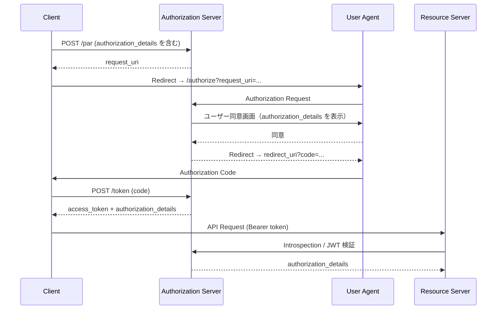

> **Note:** このページはAIエージェントが執筆しています。内容の正確性は一次情報（仕様書・公式資料）とあわせてご確認ください。

# OAuth 2.0 Rich Authorization Requests (RFC 9396)

## 概要

OAuth 2.0 の `scope` パラメーターは、`read`・`write` のような粗粒度な権限を文字列で表現するには十分ですが、「123.50 EUR を特定の銀行口座へ送金する権限」や「特定患者の観察記録を参照する権限」のような複雑な認可要件を表現するには力不足でした。

**Rich Authorization Requests（RAR）**は、この問題を解決するために RFC 9396 として 2023 年 5 月に IETF Standards Track で標準化されました。新たに導入した `authorization_details` パラメーターにより、JSON 構造化データとして細粒度の認可要件を表現できます ([RFC 9396](https://www.rfc-editor.org/rfc/rfc9396.html))。

RAR は既存の OAuth 2.0 フローを拡張する形で設計されており、Authorization Code フロー・デバイス認可フロー・CIBA（バックチャネル認証）のいずれでも利用できます。また `scope` パラメーターとの共存も可能で、既存システムからの段階的な移行を支援します。

## 背景と経緯

### scope の限界

RFC 6749 で定義された `scope` パラメーターは、`openid profile email` のようにスペース区切りの文字列でアクセス権限を指定します。この設計はシンプルさと相互運用性に優れますが、次のような制約があります。

- **型情報の欠如**: `amount`（金額）や `recipient`（送金先）のような構造化データを表現できない
- **コンテキスト依存の意味**: `payment` という scope の具体的な意味は API ごとに異なり、標準的な解釈が困難
- **複数リソースの識別**: 複数のリソースサーバーに対して異なる権限セットを指定できない

Open Banking（PSD2 準拠の API）やヘルスケア（HL7 FHIR）などのドメインでは、こうした制約がセキュリティ上のリスクにもなっていました。過大なスコープを付与して後からリソースサーバー側で絞り込む設計は、最小権限の原則に反します。

### 標準化の経緯

RAR は IETF OAuth Working Group で `draft-ietf-oauth-rar` として長期間議論され、v23 のドラフトを経て 2023 年 5 月に RFC 9396 として正式に公開されました。仕様の主著者は Torsten Lodderstedt（yes.com）、Justin Richer（Bespoke Engineering）、Brian Campbell（Ping Identity）です。

標準化と前後して RFC 9126（PAR）、RFC 9101（JAR）が整備されたことで、RAR を安全に送信するためのエコシステムが確立されました。

## 設計思想

### authorization_details パラメーターの導入

RAR の中核は `authorization_details` パラメーターです。値は JSON 配列で、各要素が「1つの認可オブジェクト」を表します ([RFC 9396 Section 2](https://www.rfc-editor.org/rfc/rfc9396.html#section-2))。

```json
[
  {
    "type": "payment_initiation",
    "currency": "EUR",
    "amount": "123.50",
    "recipient": "DE75512108001234567890"
  }
]
```

唯一の必須フィールドは `type` で、認可オブジェクトの種類を一意に識別します。それ以外のフィールドは `type` 値によって定義される API 固有のスキーマに従います。これにより、各 API は自身のドメインに最適化した認可スキーマを定義できます。

### 共通データフィールド

API 間の相互運用性を高めるため、RFC 9396 は再利用可能な 5 つの共通フィールドを定義しています ([RFC 9396 Section 2.2](https://www.rfc-editor.org/rfc/rfc9396.html#section-2.2))。

| フィールド   | 型         | 説明                                            |
| ------------ | ---------- | ----------------------------------------------- |
| `locations`  | 文字列配列 | アクセス先リソースサーバーの URI                |
| `actions`    | 文字列配列 | 実行可能なアクション（例: `["read", "write"]`） |
| `datatypes`  | 文字列配列 | アクセス対象のデータ種別                        |
| `identifier` | 文字列     | 特定リソースの識別子                            |
| `privileges` | 文字列配列 | 要求するアクセスレベル                          |

複数のフィールドを組み合わせた場合、許可は全値の積集合（AND）で評価されます。これは最小権限の原則に沿った設計です。

### scope との共存設計

`authorization_details` と `scope` は同一リクエストで独立した認可要件として併用できます ([RFC 9396 Section 3.1](https://www.rfc-editor.org/rfc/rfc9396.html#section-3.1))。既存の `scope` ベースの実装への影響を最小化しながら、新しい API から段階的に RAR を採用できます。

## 技術詳細

### 認可リクエストへの組み込み

`authorization_details` は Authorization Code フローの認可リクエストに追加します。

```
GET /authorize?
  response_type=code
  &client_id=s6BhdRkqt3
  &redirect_uri=https%3A%2F%2Fclient.example.org%2Fcb
  &authorization_details=%5B%7B%22type%22%3A%22payment_initiation%22%2C...%7D%5D
```

URL エンコードされた JSON は非常に長くなるため、実装では PAR（Pushed Authorization Requests, RFC 9126）との組み合わせが強く推奨されます。

### PAR との組み合わせ（推奨パターン）



### トークンレスポンスへの反映

認可サーバーは承認された `authorization_details` をトークンレスポンスに含めなければなりません ([RFC 9396 Section 7](https://www.rfc-editor.org/rfc/rfc9396.html#section-7))。ここで返却される値は、ユーザーが同意した内容のみを反映した（リクエストより制限された可能性のある）実際に付与された認可です。

```json
{
  "access_token": "2YotnFZFEjr1zCsicMWpAA",
  "token_type": "Bearer",
  "expires_in": 3600,
  "authorization_details": [
    {
      "type": "payment_initiation",
      "currency": "EUR",
      "amount": "123.50",
      "recipient": "DE75512108001234567890"
    }
  ]
}
```

### JWT アクセストークンへの埋め込み

JWT アクセストークンを使用する場合、`authorization_details` クレームとして JWT ペイロードに含めることが推奨されます（RECOMMENDED）([RFC 9396 Section 9](https://www.rfc-editor.org/rfc/rfc9396.html#section-9))。これは MUST ではなく、トークンイントロスペクション（RFC 7662）経由で詳細情報を取得する設計も認められています。

```json
{
  "iss": "https://as.example.com",
  "sub": "user123",
  "aud": "https://rs.example.com",
  "exp": 1735000000,
  "authorization_details": [
    {
      "type": "medical_record",
      "locations": ["https://hospital.example/fhir"],
      "actions": ["read"],
      "datatypes": ["observation", "medication"],
      "identifier": "patient/98765"
    }
  ]
}
```

なお、認可サーバーは `authorization_details` の一部の値を省略して返すことも許可されています（"The AS MAY omit values"）。リソースサーバーはトークンイントロスペクション（RFC 7662）レスポンスからも `authorization_details` を取得できます。

### 認可サーバーのメタデータ

認可サーバーは `authorization_details_types_supported` メタデータでサポートする `type` 値を公開します ([RFC 9396 Section 10](https://www.rfc-editor.org/rfc/rfc9396.html#section-10))。

```json
{
  "issuer": "https://as.example.com",
  "authorization_details_types_supported": [
    "payment_initiation",
    "account_information",
    "openid_credential"
  ]
}
```

### エラーレスポンス

不正な `authorization_details` に対しては `invalid_authorization_details` エラーを返します ([RFC 9396 Section 5](https://www.rfc-editor.org/rfc/rfc9396.html#section-5))。

```json
{
  "error": "invalid_authorization_details",
  "error_description": "Unknown authorization details type 'unknown_type'"
}
```

### OpenID4VCI との統合

OpenID for Verifiable Credential Issuance (OID4VCI) では RAR を活用し、`type=openid_credential` で発行を要求するクレデンシャルを指定します。

```json
[
  {
    "type": "openid_credential",
    "credential_configuration_id": "org.iso.18013.5.1.mDL",
    "format": "mso_mdoc"
  }
]
```

これにより、Wallet は発行者（Credential Issuer）に対して、どのフォーマットのどのクレデンシャルが必要かを型安全に伝えられます。

## 実装上の注意点

### リクエストサイズの増大

`authorization_details` は `scope` より冗長です。URL クエリパラメーターとして送信すると、2,000〜8,000 文字程度のブラウザ URL 長制限に抵触するリスクがあります ([RFC 9396 Section 11](https://www.rfc-editor.org/rfc/rfc9396.html#section-11))。

**推奨対策**: RFC 9126（PAR）を使用し、POST リクエストで認可サーバーに直接送信して `request_uri` を取得する。FAPI 2.0 では PAR が必須要件となっています。

### 改ざんリスクとリクエスト保護

クエリパラメーターで送信した `authorization_details` はブラウザやプロキシ経由で改ざんされる可能性があります。

**推奨対策**: RFC 9101（JAR）でリクエスト全体を署名付き JWT として送信する。PAR との組み合わせで TLS による通信路保護も加わります。

### アクセストークンサイズの肥大化

`authorization_details` を JWT に含めると、トークンサイズが増加します。Cookie に Bearer トークンを保存する実装では、Cookie サイズ制限（4,096 バイト）に抵触する場合があります。

**推奨対策**: 詳細情報はトークンイントロスペクション（RFC 7662）で取得する設計とし、JWT には参照情報のみを含める。

### セマンティック比較の複雑性

`authorization_details` フィールドのセマンティクスは `type` ごとに異なるため、2 つの認可オブジェクトが「同等か否か」を判定する標準的なメカニズムは RFC 9396 では提供されていません ([RFC 9396 Section 11](https://www.rfc-editor.org/rfc/rfc9396.html#section-11))。

**推奨対策**: 認可サーバーは各 `type` のセマンティクスを理解した上で、API 固有の比較ロジックを実装する。

### プライバシーへの配慮

`authorization_details` には機密性の高い情報（金額、口座番号、患者 ID など）が含まれます。認可サーバーがこれをログに記録したり、クライアントやリソースサーバーと共有する際は、「必要性の原則（need to know）」に基づいて開示範囲を制限する必要があります ([RFC 9396 Section 13](https://www.rfc-editor.org/rfc/rfc9396.html#section-13))。

## 採用事例

### Open Banking・決済

RAR が最も早く採用されたドメインです。欧州の PSD2 準拠 API では支払い開始（Payment Initiation）のリクエストに `type: payment_initiation` を使用し、金額・通貨・送金先をリクエスト時点で明示できます。

### Verifiable Credentials

OpenID for Verifiable Credential Issuance（OID4VCI）が `authorization_details` を採用したことで、デジタルウォレットと Credential Issuer の間の標準的な交渉プロトコルに RAR が組み込まれました。ISO 18013-5 に基づく mDL（モバイル運転免許証）の発行フローなどで利用されています。

### 実装ライブラリ

- **Authlete**: OAuth/OpenID Connect サーバーライブラリ。RAR をネイティブサポート
- **Nimbus OAuth OpenID Connect SDK**（Java）: RFC 9396 完全対応
- **Auth0**: エンタープライズ IAM サービスとして RAR サポートを実装

## 関連仕様・後継仕様

| 仕様                                                                                 | 関係                                                            |
| ------------------------------------------------------------------------------------ | --------------------------------------------------------------- |
| [RFC 6749](https://www.rfc-editor.org/rfc/rfc6749)                                   | 基盤となる OAuth 2.0 フレームワーク                             |
| [RFC 9126](https://www.rfc-editor.org/rfc/rfc9126)                                   | PAR — 大きなリクエストペイロードを安全に送信                    |
| [RFC 9101](https://www.rfc-editor.org/rfc/rfc9101)                                   | JAR — リクエスト全体を署名付き JWT にする                       |
| [RFC 8707](https://www.rfc-editor.org/rfc/rfc8707)                                   | Resource Indicators — `locations` と補完的な関係                |
| [RFC 9068](https://www.rfc-editor.org/rfc/rfc9068)                                   | JWT アクセストークン — `authorization_details` クレームの配置先 |
| [OID4VCI](https://openid.net/specs/openid-4-verifiable-credential-issuance-1_0.html) | RAR を Verifiable Credential 発行リクエストに活用               |
| [FAPI 2.0](https://openid.net/specs/fapi-security-profile-2_0.html)                  | 金融グレード API プロファイル — PAR + JAR + RAR の組み合わせ    |

## 参考資料

- [RFC 9396 — OAuth 2.0 Rich Authorization Requests](https://www.rfc-editor.org/rfc/rfc9396.html)
- [IETF Datatracker — draft-ietf-oauth-rar](https://datatracker.ietf.org/doc/draft-ietf-oauth-rar/)
- [RFC 9126 — OAuth 2.0 Pushed Authorization Requests](https://www.rfc-editor.org/rfc/rfc9126.html)
- [RFC 9101 — JWT-Secured Authorization Request (JAR)](https://www.rfc-editor.org/rfc/rfc9101.html)
- [OpenID for Verifiable Credential Issuance 1.0](https://openid.net/specs/openid-4-verifiable-credential-issuance-1_0.html)
- [FAPI 2.0 Security Profile](https://openid.net/specs/fapi-security-profile-2_0.html)
