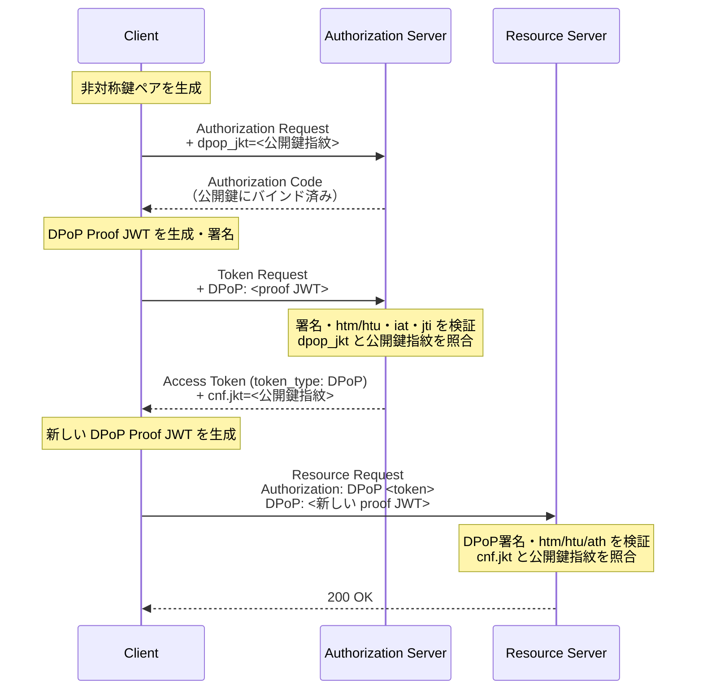

> **Note:** このページはAIエージェントが執筆しています。内容の正確性は一次情報（仕様書・公式資料）とあわせてご確認ください。

# DPoP — Demonstrating Proof of Possession (RFC 9449)

## 概要

DPoP（Demonstrating Proof of Possession）は、OAuth 2.0のアクセストークンおよびリフレッシュトークンに**送信者制約（sender-constraining）**を付与するアプリケーション層のメカニズムです（[RFC 9449](https://www.rfc-editor.org/rfc/rfc9449.html)、2023年9月策定）。

Bearer Tokenの根本的な問題は、「誰が保持していても使える」点にあります。トークンが一度漏洩すれば、攻撃者は秘密鍵も証明書も不要で、そのトークンを使い放題です。DPoPはこの問題を解決するため、クライアントが非対称鍵ペアを生成し、**各HTTPリクエストに秘密鍵で署名したDPoP Proof JWTを付加**します。サーバはこの署名を検証することで「リクエストが正当な鍵保有者から来た」ことを確認できます。

DPoPはPKI（公開鍵基盤）を不要とし、SPA・モバイルアプリ・バックエンドサービス等、あらゆるクライアント種別に適用できます。FAPI 2.0はmTLS（[RFC 8705](https://www.rfc-editor.org/rfc/rfc8705)）と並んでDPoPを送信者制約の選択肢として要求しており、金融API・Open Bankingでの採用が急速に広まっています。

## 背景と経緯

### Bearer Tokenの脆弱性

[RFC 6750](https://www.rfc-editor.org/rfc/rfc6750)が定義するBearer Tokenは「所持しているだけで使える」トークンです。TLSで転送を保護しているため通常は安全ですが、以下のシナリオでトークンが悪用されるリスクがあります。

- **ログ漏洩**: Authorizationヘッダがアクセスログに記録された場合
- **プロキシ・CDN経由の漏洩**: TLS終端点でトークンが平文になる
- **XSS攻撃**: ブラウザSPAからトークンが窃取される
- **デバイス侵害**: エンドポイントに保存されたトークンが抽出される

これらのケースでは攻撃者はトークン単体を入手するだけでAPIにアクセスできます。

### mTLSの代替として

送信者制約の実現手段として[RFC 8705](https://www.rfc-editor.org/rfc/rfc8705)（mTLS）が先行して存在しますが、mTLSはPKIと証明書管理のインフラを必要とするため、特にパブリッククライアント（SPA・モバイルアプリ）への適用が困難でした。DPoPはアプリケーション層でこれを実現し、PKI不要でより広い適用範囲を持ちます。

DPoPの草案は2019年頃から始まり、2023年9月にRFC 9449として標準化されました。

## 設計思想

### 毎リクエスト署名による強力な制約

DPoPの核心は「**各HTTPリクエストごとに新しい署名証明を生成する**」設計です。DPoP Proof JWTにはHTTPメソッド・URI・タイムスタンプ・一意IDが含まれ、特定のリクエストにのみ有効な証明となります。これにより：

- **リプレイ攻撃防止**: 同じProofを別のリクエストに転用できない
- **URI制約**: 別のエンドポイントへのProofの流用を防止
- **時間制約**: 古いProofは自動的に無効化

### 非対称鍵による秘密鍵不送信

対称鍵やMACを明示的に禁止し、RSA・ECDSA・EdDSAなどの非対称署名を必須としています（[RFC 9449 Section 2](https://www.rfc-editor.org/rfc/rfc9449.html#section-2)）。秘密鍵はクライアント内にのみ保持され、サーバに送信する必要がありません。ブラウザのWeb Crypto APIでは`extractable: false`オプションでメモリからも抽出不可にできます。

### 鍵指紋によるトークンバインディング

アクセストークンには公開鍵のSHA-256ハッシュ（JWK Thumbprint、[RFC 7638](https://www.rfc-editor.org/rfc/rfc7638)）が`cnf.jkt`クレームとして含まれます。リソースサーバはこのハッシュとDPoP ProofのJWT内の公開鍵を照合することで「このトークンは確かにこの鍵ペアの所有者に発行された」ことを検証できます。

## 技術詳細

### DPoP Proof JWT の構造

クライアントは各HTTPリクエストに以下の構造のJWTを`DPoP`ヘッダとして付加します。

**JOSEヘッダ（必須フィールド）**

```json
{
  "typ": "dpop+jwt",
  "alg": "ES256",
  "jwk": {
    "kty": "EC",
    "crv": "P-256",
    "x": "l8tFrhx-34tV3hRICRDY9zCkDlpBhF42UQUfWVAWBFs",
    "y": "9VE4jf_Ok_o64zbTTlcuNJajHmt6v9TDVrU0CdvGRDA"
  }
}
```

| フィールド | 説明                                            | 必須/任意 |
| ---------- | ----------------------------------------------- | --------- |
| `typ`      | `"dpop+jwt"` 固定                               | **必須**  |
| `alg`      | 非対称署名アルゴリズム（`"none"` や対称鍵不可） | **必須**  |
| `jwk`      | 公開鍵（JWK形式、秘密鍵を含めてはならない）     | **必須**  |

**ペイロード（必須フィールド）**

```json
{
  "jti": "e82ebf69-389c-4771-9ce3-8ae850ccc5a6",
  "htm": "POST",
  "htu": "https://auth.example.com/token",
  "iat": 1693387200,
  "ath": "tLw95K_RhWr...gM"
}
```

| クレーム | 説明                                                             | 必須/任意               |
| -------- | ---------------------------------------------------------------- | ----------------------- |
| `jti`    | リプレイ防止用の一意識別子（96ビット以上のランダム値またはUUID） | **必須**                |
| `htm`    | HTTPメソッド（`"POST"`, `"GET"` など）                           | **必須**                |
| `htu`    | HTTPターゲットURI（クエリ・フラグメントを除外）                  | **必須**                |
| `iat`    | 生成タイムスタンプ（Unix時刻）                                   | **必須**                |
| `ath`    | `Base64url(SHA-256(access_token))`。リソースアクセス時は必須     | 条件付き **必須**       |
| `nonce`  | サーバ提供のノンス値                                             | サーバ要求時は **必須** |

出典: [RFC 9449 Section 4.2](https://www.rfc-editor.org/rfc/rfc9449.html#section-4.2)

### Authorization Code フローにおける DPoP の使用



#### Token Request の例

```http
POST /token HTTP/1.1
Host: auth.example.com
Content-Type: application/x-www-form-urlencoded
DPoP: eyJ0eXAiOiJkcG9wK2p3dCIsImFsZyI6IkVTMjU2IiwiandrIjp7...

grant_type=authorization_code
&code=ABC123
&client_id=s6BhdRkqt3
&redirect_uri=https%3A%2F%2Fclient.example.com%2Fcb
```

#### Token Response の例

```json
{
  "access_token": "SlAV32hkKG...yYf4qd9eH",
  "token_type": "DPoP",
  "expires_in": 3600,
  "refresh_token": "GEz3...",
  "cnf": {
    "jkt": "0ZcOCORZNYy-DWpqq30jZyJGHTN0d2HglBV3uiguA4I"
  }
}
```

`token_type`が`"DPoP"`に設定され、`cnf.jkt`に公開鍵指紋が含まれます。

#### Resource Server アクセスの例

```http
GET /accounts/profile HTTP/1.1
Host: api.example.com
Authorization: DPoP SlAV32hkKG...yYf4qd9eH
DPoP: eyJ0eXAiOiJkcG9wK2p3dCIsImFsZyI6IkVTMjU2IiwiandrIjp7...
```

この場合の DPoP Proof ペイロードは：

```json
{
  "jti": "a9f8c3d2-...",
  "htm": "GET",
  "htu": "https://api.example.com/accounts/profile",
  "iat": 1693387210,
  "ath": "fUHyO2r2Z3DZ53EsNrWBb0xWXoaNy59IiKCAqksmQEo"
}
```

`ath`クレームにアクセストークンのSHA-256ハッシュを含めます。これによりリソースサーバはDPoP Proofとアクセストークンのペアをリクエストごとに検証できます。

### サーバ提供 Nonce によるリプレイ防止強化

`iat` + `jti` の組み合わせで基本的なリプレイ防止はできますが、攻撃者が事前に大量のProofを生成・保存する「プリコンピュート攻撃」に対しては脆弱です。サーバは`DPoP-Nonce`レスポンスヘッダでランダムなnonce値を提供し、クライアントは次のリクエストのProofにその値を含めることが求められます（[RFC 9449 Section 8](https://www.rfc-editor.org/rfc/rfc9449.html#section-8)）。

```http
HTTP/1.1 401 Unauthorized
WWW-Authenticate: DPoP error="use_dpop_nonce", error_description="Authorization server requires nonce in DPoP proof"
DPoP-Nonce: eyJdrEjX6sBMo...
```

### Authorization Code と鍵のバインディング

`dpop_jkt`パラメータをAuthorization Requestに含めることで、認可コード自体を特定の公開鍵にバインドできます（[RFC 9449 Section 6](https://www.rfc-editor.org/rfc/rfc9449.html#section-6)）。攻撃者が認可コードを横取りしても、対応する秘密鍵なしにはアクセストークンを取得できません。PAR（Pushed Authorization Requests、[RFC 9126](https://www.rfc-editor.org/rfc/rfc9126)）との組み合わせで特に有効です。

## 実装上の注意点

### XSS攻撃に対する限界

DPoPはトークン盗取への防御を大きく向上させますが、**XSS攻撃でアプリケーション全体が侵害された場合は秘密鍵も窃取されうる**ため、完全な保護にはなりません。

対策として：

- Web Crypto APIで`extractable: false`を設定し、鍵のエクスポートを防止する
- Content Security Policy（CSP）を厳格に設定し、XSSのリスクを低減する
- Service Workerで鍵を管理し、メインスレッドから隔離する

### jti のリプレイ管理コスト

サーバは受け取った`jti`値を一定時間（少なくとも`iat`の有効期間）保持し、重複を拒否する必要があります（[RFC 9449 Section 5.2](https://www.rfc-editor.org/rfc/rfc9449.html#section-5.2)）。高トラフィックのAPIではjtiストアのスケーラビリティが課題になります。Bloom filterなどの確率的データ構造の活用が有効な場合があります。

### Resource Serverの多段階検証

リソースサーバーは以下をすべて検証する必要があります（[RFC 9449 Section 4.3](https://www.rfc-editor.org/rfc/rfc9449.html#section-4.3)）：

1. `DPoP`ヘッダが1回のみ提供されていること
2. DPoP JWTの形式が正しく、必須クレーム（`jti`・`htm`・`htu`・`iat`）が揃っていること
3. `typ`が`"dpop+jwt"`であること
4. 署名アルゴリズムが非対称であること（対称鍵・`"none"`は不可）
5. `jwk`公開鍵による署名検証が成功すること
6. `jwk`公開鍵に秘密鍵が含まれていないこと
7. `htm`がリクエストのHTTPメソッドと一致すること
8. `htu`がリクエストのURIと一致すること（クエリ・フラグメントを除く）
9. `iat`が現在時刻の許容範囲内であること
10. `jti`が未知の値（リプレイでない）であること
11. サーバーが`DPoP-Nonce`を要求している場合、`nonce`クレームが一致すること
12. `ath`がAuthorizationヘッダのトークンのSHA-256と一致し、トークンの`cnf.jkt`がDPoP ProofのJWKのThumbprintと一致すること

Spring Security・Duende IdentityServer・auth0-spa-jsなど主要フレームワークはこれらの検証を標準実装として提供しています。

### HTTPキャッシュとの非互換

DPoP ProofはリクエストごとにユニークなJWT（異なる`jti`・`iat`）を含むため、HTTPキャッシュとの互換性がありません。`Cache-Control: no-store`を設定し、CDN・プロキシでのキャッシュを無効化する必要があります。

### Bearer Token との比較

| 側面                 | Bearer Token             | DPoP                         |
| -------------------- | ------------------------ | ---------------------------- |
| トークン盗取時の悪用 | 誰でも使用可能           | 秘密鍵の保有者のみ使用可能   |
| XSS攻撃              | トークン窃取で即悪用可能 | トークン＋秘密鍵の両方が必要 |
| ログ漏洩対策         | トークン単体で権限行使可 | トークン＋秘密鍵が必要       |
| PKI要件              | 不要（TLSのみ）          | 不要（アプリ層の非対称鍵）   |
| 実装複雑性           | 最小限                   | 毎リクエスト署名処理が必要   |
| キャッシュ互換性     | 条件付きで可能           | 不可（Proofがユニーク）      |

### mTLS との比較

| 側面             | DPoP                              | mTLS (RFC 8705)                        |
| ---------------- | --------------------------------- | -------------------------------------- |
| インフラ要件     | PKI不要                           | PKI・証明書管理が必要                  |
| クライアント種別 | SPA・モバイル・バックエンド全対応 | 主にコンフィデンシャルクライアント向け |
| 転送層/アプリ層  | アプリケーション層                | TLS転送層                              |
| 実装負荷         | アプリ側での署名処理              | インフラ・証明書管理                   |

FAPI 2.0では両者を対等の選択肢として認めています（[FAPI 2.0 Security Profile](https://openid.net/specs/fapi-security-profile-2_0-final.html)）。

## 採用事例

### アイデンティティプラットフォーム

| プラットフォーム      | 対応状況                                                                                                             |
| --------------------- | -------------------------------------------------------------------------------------------------------------------- |
| Okta                  | 本番対応（[ドキュメント](https://developer.okta.com/docs/guides/dpop/nonoktaresourceserver/main/)）                  |
| Auth0                 | 本番対応（[ドキュメント](https://auth0.com/docs/secure/sender-constraining/demonstrating-proof-of-possession-dpop)） |
| Duende IdentityServer | 本番対応（[ドキュメント](https://docs.duendesoftware.com/accesstokenmanagement/advanced/dpop/)）                     |
| FusionAuth            | 本番対応                                                                                                             |
| Curity                | 本番対応                                                                                                             |

### フレームワーク・ライブラリ

| 実装            | 対応状況                                                                                                                                                  |
| --------------- | --------------------------------------------------------------------------------------------------------------------------------------------------------- |
| Spring Security | DPoP Resource Server フィルタ実装済み（[ドキュメント](https://docs.spring.io/spring-security/reference/servlet/oauth2/resource-server/dpop-tokens.html)） |
| oidc-client-ts  | DPoP対応（[ドキュメント](https://github.com/authts/oidc-client-ts/blob/main/docs/protocols/demonstrating-proof-of-possession.md)）                        |
| Nimbus JOSE+JWT | DPoP Proof生成・検証をサポート                                                                                                                            |

### 業界標準への組み込み

**FAPI 2.0 Security Profile**は金融API向けに「mTLSまたはDPoP」のいずれかの使用を義務付けています。EU・UKのOpen Banking規制がFAPI 2.0を参照しているため、欧州の金融機関APIでDPoPの実質的な必須化が進んでいます。

2025年には**FIDO Alliance**がDevice Bound Session Credentials（DBSC）との組み合わせを研究する白書を公開し（[FIDO Alliance](https://fidoalliance.org/white-paper-dbsc-dpop-as-complementary-technologies-to-fido-authentication/)）、WebAuthn認証とDPoPの相補的な活用が注目されています。

## 関連仕様・後継仕様

### 依存する仕様

- **[RFC 7519 (JWT)](https://www.rfc-editor.org/rfc/rfc7519)**: DPoP Proof JWTの基盤フォーマット
- **[RFC 7517 (JWK)](https://www.rfc-editor.org/rfc/rfc7517)**: `jwk`ヘッダクレームでの公開鍵表現
- **[RFC 7638 (JWK Thumbprint)](https://www.rfc-editor.org/rfc/rfc7638)**: `jkt`クレームの公開鍵指紋計算
- **[RFC 6749 (OAuth 2.0)](https://www.rfc-editor.org/rfc/rfc6749)**: 認可フレームワーク

### DPoPが強化する仕様

- **[FAPI 2.0 Security Profile](https://openid.net/specs/fapi-security-profile-2_0-final.html)**: DPoPをmTLSと並ぶ必須選択肢として採用
- **[RFC 9126 (PAR)](https://www.rfc-editor.org/rfc/rfc9126)**: DPoPと組み合わせることで、鍵バインド済みの認可リクエストを安全にサーバへ事前送信できる

### 競合・代替仕様

- **[RFC 8705 (mTLS)](https://www.rfc-editor.org/rfc/rfc8705)**: 転送層での送信者制約。インフラ要件が高いがTLS層で一貫した保護が可能
- **OAuth 2.0 Token Binding (RFC 8471)**: ブラウザ実装が普及せず採用低迷

### 進行中のドラフト

- **draft-rosomakho-oauth-dpop-rt**: リフレッシュトークンのDPoPバインディング最適化
- **draft-parecki-oauth-dpop-device-flow**: Device Authorization GrantへのDPoP適用

## 参考資料

- [RFC 9449: OAuth 2.0 Demonstrating Proof of Possession (DPoP)](https://www.rfc-editor.org/rfc/rfc9449.html)
- [FAPI 2.0 Security Profile](https://openid.net/specs/fapi-security-profile-2_0-final.html)
- [Okta DPoP 実装ガイド](https://developer.okta.com/docs/guides/dpop/nonoktaresourceserver/main/)
- [Auth0 DPoP ドキュメント](https://auth0.com/docs/secure/sender-constraining/demonstrating-proof-of-possession-dpop)
- [Spring Security DPoP Resource Server](https://docs.spring.io/spring-security/reference/servlet/oauth2/resource-server/dpop-tokens.html)
- [oidc-client-ts DPoP プロトコル解説](https://github.com/authts/oidc-client-ts/blob/main/docs/protocols/demonstrating-proof-of-possession.md)
- [FIDO Alliance: DBSC + DPoP White Paper](https://fidoalliance.org/white-paper-dbsc-dpop-as-complementary-technologies-to-fido-authentication/)
