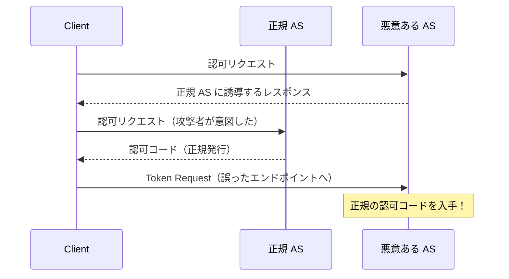

> **Note:** このページはAIエージェントが執筆しています。内容の正確性は一次情報（仕様書・公式資料）とあわせてご確認ください。

# OAuth 2.0 Security Best Current Practice (RFC 9700)

## 概要

RFC 9700（OAuth 2.0 Security Best Current Practice）は、[RFC 6749](https://www.rfc-editor.org/rfc/rfc6749)（OAuth 2.0）を現代のセキュリティ脅威に対して安全に実装するための総合ガイドラインです（[RFC 9700](https://www.rfc-editor.org/rfc/rfc9700.html)、2025年1月策定）。著者は Torsten Lodderstedt・John Bradley・Andrey Labunets・Daniel Fett。

RFC 6749が発行された2012年以降、OAuth 2.0 は膨大なデプロイ実績から多くのセキュリティ脆弱性パターンが蓄積されてきました。RFC 9700はこれらの攻撃手法を分析し、**何を使うべきか・何を避けるべきか**を明確に定めます。特筆すべき点として：

- **Implicit Grant・Password Grant を実質廃止**
- **PKCE をすべてのクライアントで必須化**
- **Mix-Up 攻撃対策として `iss` パラメーターを要求**
- **DPoP・mTLS によるトークンバインディングを推奨**

RFC 9700 は単独で読む仕様ではなく、[RFC 7636](./rfc7636.md)（PKCE）・[RFC 9449](./rfc9449.md)（DPoP）・[RFC 9126](./rfc9126.md)（PAR）・[RFC 9101](./rfc9101.md)（JAR）など多くの拡張仕様と組み合わせることで完全な効力を発揮する「セキュリティプロファイルの設計図」といえます。

## 背景と経緯

### OAuth 2.0 のセキュリティ問題の蓄積

RFC 6749 は汎用性を重視した設計であり、セキュリティ要件はアプリケーション固有の判断に委ねる部分が多くありました。しかし 2010 年代を通じて以下の問題が顕在化しました。

**Implicit Flow の構造的欠陥**: Implicit Flow はブラウザ環境での SPA 向けに設計されましたが、アクセストークンがフラグメント（`#`）経由でフロントチャネルに露出するため、トークン漏洩・リプレイ攻撃のリスクが高く、現在は非推奨です。

**Authorization Code インジェクション**: 攻撃者が別セッションで取得した認可コードを被害者のリクエストに差し込むことで、任意のセッションに認証させる攻撃。PKCE がなければ有効です。

**Mix-Up 攻撃**: 複数の認可サーバーを扱うクライアントが、悪意ある認可サーバーから誘導されて正規の認可サーバーへ認証コードを送信してしまう攻撃。これはプロトコル設計上の盲点でした。

**Open Redirector**: 攻撃者が `redirect_uri` を利用して認可サーバーをリダイレクターとして悪用するフィッシング手法。

これらの脅威を網羅的に分析・対処するため、OAuth Security Working Group は 2016 年頃から `draft-ietf-oauth-security-topics` として BCP の起草を開始し、2025 年 1 月に RFC 9700 として正式公開されました。

## 主要な推奨事項

### 1. グラントタイプの選択

RFC 9700 は Authorization Code Flow with PKCE を唯一推奨するインタラクティブフローとして位置づけています。

| グラントタイプ                              | 推奨状況           | 理由                                           |
| ------------------------------------------- | ------------------ | ---------------------------------------------- |
| Authorization Code + PKCE                   | **推奨**           | すべてのクライアント種別で安全                 |
| Client Credentials                          | **推奨**（M2M）    | ユーザー不在のサーバー間通信に適切             |
| Implicit Grant                              | **非推奨（廃止）** | フロントチャネルでのトークン露出               |
| Resource Owner Password Credentials（ROPC） | **非推奨（廃止）** | クライアントが認証情報を直接扱う設計上の欠陥   |
| Device Authorization Grant（RFC 8628）      | **条件付き推奨**   | 入力制約デバイス向け、適切なユースケースに限定 |

#### Implicit Flow の廃止

Implicit Flow では、アクセストークンが URL フラグメントに含まれてリダイレクトされます。これは以下のリスクを内在します。

```
# Implicit Flow の危険なレスポンス
https://app.example.com/callback
  #access_token=SENSITIVE_TOKEN  ← フロントチャネルに露出
  &token_type=bearer
  &expires_in=3600
```

- **参照ログへの記録**: ブラウザが Referer ヘッダーでトークンを別サイトに送信する可能性
- **ブラウザ履歴への保存**: フラグメントを含む URL がブラウザ履歴に残る
- **JavaScript からのアクセス**: XSS 脆弱性があればトークンを窃取可能

現代のブラウザは Authorization Code + PKCE + `response_mode=fragment` または `response_mode=query` が利用可能であり、Implicit Flow の代替として問題なく機能します（[RFC 9700 Section 2.1.2](https://www.rfc-editor.org/rfc/rfc9700.html#section-2.1.2)）。

### 2. PKCE（Proof Key for Code Exchange）の必須化

[RFC 7636](https://www.rfc-editor.org/rfc/rfc7636)（PKCE）は元来パブリッククライアント向けに設計されましたが、RFC 9700 は**コンフィデンシャルクライアントを含むすべてのクライアントで PKCE を必須**とします（[RFC 9700 Section 2.1.1](https://www.rfc-editor.org/rfc/rfc9700.html#section-2.1.1)）。

```
# Authorization Request に必須パラメーター
code_challenge=BASE64URL(SHA256(code_verifier))
code_challenge_method=S256
```

PKCE のメリットはパブリッククライアントの保護だけに留まりません。

**Authorization Code インジェクション対策**: `code_verifier` は認可コードと暗号学的に結びついているため、攻撃者が別セッションのコードを注入しても検証に失敗します。

**コンフィデンシャルクライアントでも有効**: クライアントシークレットが漏洩した環境でも、PKCE がなければコードインジェクションが成立してしまいます。

### 3. redirect_uri の厳格な検証

RFC 9700 は redirect_uri の検証を以下のように厳格化します（[RFC 9700 Section 2.1](https://www.rfc-editor.org/rfc/rfc9700.html#section-2.1)）。

- **完全一致（exact match）のみ許可**: パターンマッチや前方一致は禁止
- **事前登録必須**: すべての redirect_uri は事前登録が必要
- **ループバックアドレスの例外**: モバイルアプリ向けに `127.0.0.1` のポート番号は柔軟に扱う（RFC 8252 準拠）

```
# 良い実装: 完全一致チェック
registered: "https://app.example.com/callback"
received:   "https://app.example.com/callback"  → OK

# 危険な実装: 前方一致
registered: "https://app.example.com/"
received:   "https://app.example.com.attacker.com/"  → 攻撃成立
```

### 4. クライアント認証

RFC 9700 はコンフィデンシャルクライアントの認証方式に優先順位を設けます（[RFC 9700 Section 2.4](https://www.rfc-editor.org/rfc/rfc9700.html#section-2.4)）。

| 認証方式              | 推奨度   | 概要                                                                                  |
| --------------------- | -------- | ------------------------------------------------------------------------------------- |
| `private_key_jwt`     | **推奨** | 非対称鍵による JWT アサーション（[RFC 7523](https://www.rfc-editor.org/rfc/rfc7523)） |
| mTLS（RFC 8705）      | **推奨** | クライアント証明書による TLS 相互認証                                                 |
| `client_secret_jwt`   | 可       | HMAC による JWT アサーション                                                          |
| `client_secret_post`  | 可       | リクエストボディでの送信                                                              |
| `client_secret_basic` | 非推奨   | HTTP Basic 認証（TLS 終端後に平文）                                                   |
| なし（パブリック）    | 可       | PKCE 必須、DPoP 推奨                                                                  |

`private_key_jwt` が推奨される理由は、クライアントの秘密鍵が認可サーバーに送信されない点にあります。各アサーション JWT は `jti`（JWT ID）により一度しか使えないため、リプレイ攻撃も防止されます。

### 5. Mix-Up 攻撃対策

Mix-Up 攻撃は、複数の認可サーバーを登録したクライアントに対する攻撃です（[RFC 9700 Section 4.4](https://www.rfc-editor.org/rfc/rfc9700.html#section-4.4)）。



対策として RFC 9700 は以下を要求します。

1. **`iss` パラメーター（RFC 9207）**: 認可レスポンスに発行者識別子を含め、クライアントが想定した AS と一致するか検証する
2. **PAR（Pushed Authorization Requests、RFC 9126）**: フロントチャネルではなくバックチャネルで認可リクエストを送信することで、悪意ある AS がリクエストを傍受する余地を排除する

### 6. アクセストークンの管理

#### ライフタイムの短縮

RFC 9700 はアクセストークンのライフタイムを最小限に抑えることを推奨します（[RFC 9700 Section 4.9](https://www.rfc-editor.org/rfc/rfc9700.html#section-4.9)）。

- **インタラクティブな操作**: 数分〜15 分程度
- **バックグラウンド処理**: タスク完了に必要な最小時間
- **長期アクセス**: リフレッシュトークンによる再取得を基本とする

#### トークンバインディング（送信者制約）

Bearer Token は盗まれると誰でも使えますが、以下の方式でクライアント所有の鍵に縛ることができます。

- **DPoP（[RFC 9449](./rfc9449.md)）**: アプリケーション層で各リクエストに署名。PKI 不要でパブリッククライアントにも適用可能
- **mTLS（RFC 8705）**: TLS 層でのクライアント証明書バインディング。PKI 環境に適する

FAPI 2.0 などハイセキュリティプロファイルでは DPoP または mTLS が必須です。

### 7. リフレッシュトークンの管理

RFC 9700 はリフレッシュトークンに対して以下を要求します（[RFC 9700 Section 4.13](https://www.rfc-editor.org/rfc/rfc9700.html#section-4.13)）。

**Refresh Token Rotation（回転）**: リフレッシュトークンを使用するたびに新しいトークンを発行し、古いトークンを無効化します。これにより漏洩したリフレッシュトークンが使われた際に検知できます。

```
1回目: refresh_token=AAA → 新 access_token + 新 refresh_token=BBB
2回目: refresh_token=BBB → 新 access_token + 新 refresh_token=CCC

# 攻撃者が古い AAA を使おうとすると
攻撃者: refresh_token=AAA → エラー + セッション無効化（漏洩検知）
```

**パブリッククライアントへのリフレッシュトークン発行に注意**: パブリッククライアントのリフレッシュトークンは、送信者制約（DPoP バインディング等）なしには発行すべきでないと RFC 9700 は述べています。

### 8. オープンリダイレクター対策

認可サーバー自体がオープンリダイレクターになると、フィッシングに悪用されます。

```
# 攻撃URL（認可サーバーを信頼できるリダイレクターとして悪用）
https://auth.example.com/authorize
  ?redirect_uri=https://attacker.com/steal_token
  &response_type=code
  &client_id=trusted_client
```

対策は「redirect_uri の完全一致検証」です。登録された URI にのみリダイレクトすることで、このリスクを排除できます（[RFC 9700 Section 4.11](https://www.rfc-editor.org/rfc/rfc9700.html#section-4.11)）。

### 9. クリックジャッキング対策

認可エンドポイントを iframe 内に埋め込まれ、ユーザーが意図せず認可操作を行わされる攻撃です（[RFC 9700 Section 4.12](https://www.rfc-editor.org/rfc/rfc9700.html#section-4.12)）。

対策として認可サーバーは `X-Frame-Options: DENY` または CSP `frame-ancestors 'none'` ヘッダーを送出すべきです。

### 10. 307 リダイレクト問題

認可サーバーがトークンエンドポイントへのリクエストを 307（Temporary Redirect）でリダイレクトすると、ブラウザはリクエストボディ（`client_secret` 等）を含めたまま転送します（[RFC 9700 Section 4.13](https://www.rfc-editor.org/rfc/rfc9700.html#section-4.13)）。

認可サーバーは POST リクエストを受ける際に 307 リダイレクトを使用すべきではありません。リダイレクトが必要な場合は 303（See Other）または 301 を使用してください。

## 廃止フローからの移行

### Implicit Flow → Authorization Code + PKCE

```
# Implicit (廃止)
GET /authorize?response_type=token&...

# Authorization Code + PKCE (推奨)
GET /authorize?response_type=code
  &code_challenge=<challenge>
  &code_challenge_method=S256
  &...
```

SPA 向けには `response_type=code` と PKCE で十分です。ブラウザの `history.replaceState()` でリダイレクト後に URL から `code` を除去することが推奨されます。

### Resource Owner Password Credentials → Device Flow / Auth Code

ROPC は以下の理由で廃止すべきです。

- クライアントアプリケーションが ユーザーの認証情報（パスワード）を直接扱う
- MFA（多要素認証）に対応できない
- ブラウザへのシングルサインオン（SSO）セッションが確立されない

入力制約デバイス向けには RFC 8628（Device Authorization Grant）を、その他は Auth Code + PKCE を使用してください。

## 他の仕様との関係

RFC 9700 は単体では機能しない「ポリシー文書」であり、以下の仕様群と組み合わせて使います。

```
RFC 9700（BCP）
├── RFC 7636（PKCE）          ← Section 2.1.1 で必須化
├── RFC 9126（PAR）            ← Mix-Up 攻撃対策として推奨
├── RFC 9449（DPoP）           ← トークンバインディングとして推奨
├── RFC 9101（JAR）            ← 認可リクエストの署名・暗号化
├── RFC 9207（iss パラメーター） ← Mix-Up 攻撃対策
└── RFC 8705（mTLS）           ← トークンバインディング代替
```

[FAPI 2.0](./fapi2.md) はこれらをさらに絞り込んで「PAR + DPoP + PKCE + JAR 必須」というプロファイルを形成しており、RFC 9700 の上位互換セキュリティプロファイルとして機能します。

## 実装者向けチェックリスト

認可サーバー（AS）実装者向け：

- [ ] PKCE（`S256` のみ）を全クライアントに強制
- [ ] redirect_uri の完全一致検証を実装
- [ ] Implicit Grant・ROPC を無効化（または新規クライアントへの発行禁止）
- [ ] リフレッシュトークンのローテーション実装
- [ ] Authorization Code を一度しか使えない（one-time use）ように実装
- [ ] `iss` パラメーター（RFC 9207）のサポート
- [ ] 認可エンドポイントに `X-Frame-Options: DENY` ヘッダー送出
- [ ] DPoP または mTLS によるトークンバインディングのサポート

クライアント実装者向け：

- [ ] 認可リクエストに PKCE パラメーターを常に含める
- [ ] `state` または PKCE で CSRF 対策
- [ ] Authorization Code の `iss` パラメーターを検証
- [ ] アクセストークンをセキュアなストレージに保存（Web: `HttpOnly` Cookie 推奨）
- [ ] リフレッシュトークンの安全な保管と定期的な更新
- [ ] redirect_uri の完全一致を意識した登録

## 設計上のトレードオフ

### セキュリティ強化と後方互換性の緊張

RFC 9700 の勧告（特に PKCE 必須化・Implicit 廃止）は、既存の OAuth 2.0 実装との後方互換性を壊す場合があります。多くの企業では Implicit Flow や ROPC を大量のクライアントで使っており、移行コストが課題です。

RFC 9700 は「新規実装への適用」から始め、既存クライアントの段階的移行を現実的なアプローチとして認めています。

### リフレッシュトークンとパブリッククライアントの制約

RFC 9700 がパブリッククライアントのリフレッシュトークンに送信者制約を求める一方、DPoP のサポートは 2025 年時点でもすべてのリソースサーバーに普及しているわけではありません。

このギャップへの現実的な対処として、**短命のリフレッシュトークン**（数時間〜1 日）と、**厳格なローテーション**の組み合わせがあります。

### 「何でもできる」設計 vs 「正しいことだけを許す」設計

RFC 6749 の設計思想は汎用性・拡張性を最優先とし、セキュリティはアプリケーション固有の判断に委ねる部分が多くありました。RFC 9700 はその哲学を修正し、「デフォルトで安全であるべき」という立場を明確にしています。

この転換は OAuth エコシステムの成熟を示していますが、同時にOAuth 2.0 を超えた新たな設計（OAuth 2.1 草案など）への布石とも読めます。

## まとめ

RFC 9700 は「OAuth を安全に使うための知識」を一冊にまとめたリファレンスです。主要なポイントは以下の通りです。

1. **Authorization Code + PKCE** がすべてのインタラクティブフローの標準
2. **Implicit Flow と ROPC は廃止**—新規実装では使用しない
3. **redirect_uri は完全一致**—パターンマッチは禁止
4. **Mix-Up 攻撃対策として `iss` 検証と PAR を活用**
5. **トークンバインディング（DPoP/mTLS）でトークン漏洩の影響を限定**
6. **リフレッシュトークンはローテーションし、送信者制約を付与**

OAuth 2.0 は 2012 年以来のデファクト認可プロトコルですが、RFC 9700 によって「正しい使い方」が明確に定義されました。実装者は本仕様と FAPI 2.0 プロファイルを組み合わせることで、現代のセキュリティ要件を満たした OAuth 実装を実現できます。

## 参考資料

- [RFC 9700 — OAuth 2.0 Security Best Current Practice](https://www.rfc-editor.org/rfc/rfc9700.html)
- [RFC 6749 — OAuth 2.0 Authorization Framework](https://www.rfc-editor.org/rfc/rfc6749)
- [RFC 7636 — PKCE](https://www.rfc-editor.org/rfc/rfc7636)
- [RFC 9449 — DPoP](https://www.rfc-editor.org/rfc/rfc9449.html)
- [RFC 9126 — PAR](https://www.rfc-editor.org/rfc/rfc9126.html)
- [RFC 9101 — JAR](https://www.rfc-editor.org/rfc/rfc9101.html)
- [RFC 9207 — OAuth 2.0 Authorization Server Issuer Identification](https://www.rfc-editor.org/rfc/rfc9207.html)
- [RFC 8705 — OAuth 2.0 Mutual-TLS Client Authentication and Certificate-Bound Access Tokens](https://www.rfc-editor.org/rfc/rfc8705)
- [RFC 8628 — OAuth 2.0 Device Authorization Grant](https://www.rfc-editor.org/rfc/rfc8628)
- [draft-ietf-oauth-v2-1 — OAuth 2.1 Authorization Framework](https://datatracker.ietf.org/doc/draft-ietf-oauth-v2-1/)
