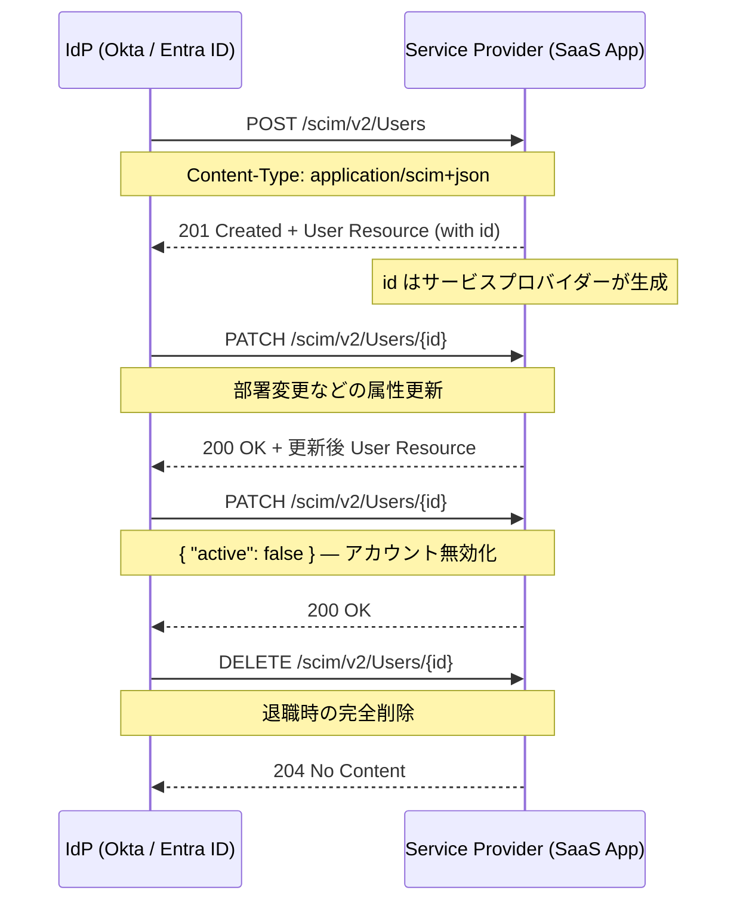

> **Note:** このページはAIエージェントが執筆しています。内容の正確性は一次情報（仕様書・公式資料）とあわせてご確認ください。

# SCIM 2.0 — System for Cross-domain Identity Management

## 概要

SCIM（System for Cross-domain Identity Management）は、異なるドメイン間でユーザーやグループのアイデンティティ情報を自動的にプロビジョニング・管理するための HTTP ベースのプロトコルです。RFC 7643（Core Schema）と RFC 7644（Protocol）として 2015 年 9 月に IETF Proposed Standard として策定されました。

エンタープライズ IT 環境では、従業員の入社・異動・退職に伴い、Slack・GitHub・Salesforce・Box など多数の SaaS サービスへのアカウント管理が発生します。SCIM を使うと、Okta・Microsoft Entra ID・OneLogin などの IdP（Identity Provider）が各 SaaS のユーザー台帳を自動同期できるため、手動プロビジョニングに起因するセキュリティリスク（退職者アカウントの残存など）を大幅に低減できます。

2025 年 10 月には RFC 9865 が発行され、カーソルベースのページネーションサポートが追加されました。

## 背景と経緯

### SCIM 1.1 から 2.0 へ

SCIM の前身は 2011 年に登場した SCIM 1.1 です。XML と JSON の両方をサポートしていましたが、設計の一貫性に課題がありました。SCIM 2.0 は JSON に統一し、REST API の設計原則に忠実な実装を実現しています。策定には Oracle・SailPoint・Salesforce・Cisco・Nexus Technology が参加しました。

### 解決する問題

SCIM 以前、SaaS ごとに独自の API や CSV インポートなどでユーザー管理を行う必要がありました。この問題は以下の形で顕在化していました。

- **孤立アカウント（Orphaned Accounts）**: SailPoint の 2023 年 Identity Security Report によると、手動プロビジョニングを行っている組織の 71% が監査で孤立アカウントを発見しています。
- **プロビジョニング遅延**: 新入社員が業務開始当日にアプリへアクセスできない問題。
- **各システムとの個別連携コスト**: アプリベンダーが独自 API を実装・維持しなければならない問題。

SCIM はこれらを標準化されたスキーマと HTTP エンドポイントで解決します。

## 仕様メタデータ

| 項目                         | 内容                                                                |
| ---------------------------- | ------------------------------------------------------------------- |
| 正式名称                     | System for Cross-domain Identity Management                         |
| バージョン                   | 2.0                                                                 |
| Core Schema RFC              | [RFC 7643](https://www.rfc-editor.org/rfc/rfc7643)                  |
| Protocol RFC                 | [RFC 7644](https://www.rfc-editor.org/rfc/rfc7644)                  |
| 概要 RFC                     | [RFC 7642](https://www.rfc-editor.org/rfc/rfc7642)                  |
| カーソルページネーション拡張 | [RFC 9865](https://www.rfc-editor.org/rfc/rfc9865)（2025 年 10 月） |
| ステータス                   | Proposed Standard（Standards Track）                                |
| 公式サイト                   | [scim.cloud](https://scim.cloud/)                                   |

## 設計思想

### HTTP ネイティブ設計

SCIM はファイアウォール越しの通信を前提として設計されており、HTTP の動詞・ステータスコード・メディアタイプを標準通りに使います。プロプライエタリなトランスポートや独自ヘッダーに依存しません。

### スキーマ拡張モデル

SCIM のコアスキーマ（User・Group）は最小限に定義されており、Enterprise User Extension や独自拡張スキーマを追加することで要件に応じて拡張できます。拡張属性は URN で名前空間を分離するため、異なるベンダーの拡張同士が衝突しません。

```json
{
  "schemas": [
    "urn:ietf:params:scim:schemas:core:2.0:User",
    "urn:ietf:params:scim:schemas:extension:enterprise:2.0:User"
  ],
  "userName": "alice@example.com",
  "name": {
    "givenName": "Alice",
    "familyName": "Smith"
  },
  "urn:ietf:params:scim:schemas:extension:enterprise:2.0:User": {
    "department": "Engineering",
    "manager": {
      "value": "26118915-6090-4610-87e4-49d8ca9f808d",
      "$ref": "https://example.com/scim/v2/Users/26118915-6090-4610-87e4-49d8ca9f808d",
      "displayName": "Bob Jones"
    }
  }
}
```

### 認証は外部委任

SCIM 自体は認証メカニズムを定義しておらず、OAuth 2.0 Bearer Token（[RFC 6750](https://www.rfc-editor.org/rfc/rfc6750)）や mTLS などの既存標準に委ねています。これにより認証レイヤーの進化に追従できますが、実装者が適切な認証を選択しなければ脆弱性につながります。

## 技術詳細

### コアスキーマ（RFC 7643）

#### User リソース

SCIM の `User` スキーマは以下の属性で構成されます。

| 属性         | 型           | 説明                                                         |
| ------------ | ------------ | ------------------------------------------------------------ |
| `id`         | String       | サービスプロバイダーが割り当てる一意な識別子（読み取り専用） |
| `externalId` | String       | クライアントが割り当てる外部識別子（IdP 側の ID）            |
| `userName`   | String       | ログイン名（必須・一意）                                     |
| `name`       | Complex      | 氏名（familyName, givenName など）                           |
| `emails`     | Multi-valued | メールアドレスのリスト                                       |
| `active`     | Boolean      | アカウントが有効かどうか                                     |
| `groups`     | Multi-valued | 所属グループ（読み取り専用）                                 |

属性の可変性（mutability）は `readOnly`・`readWrite`・`immutable`・`writeOnly` の 4 種類で制御されます（[RFC 7643 Section 2.2](https://www.rfc-editor.org/rfc/rfc7643#section-2.2)）。

#### 属性データ型

SCIM は以下の 8 種類のデータ型を定義しています（[RFC 7643 Section 2.3](https://www.rfc-editor.org/rfc/rfc7643#section-2.3)）。

| 型        | 説明                                   |
| --------- | -------------------------------------- |
| String    | UTF-8 文字列                           |
| Boolean   | `true` / `false`                       |
| Decimal   | 小数点数                               |
| Integer   | 整数                                   |
| DateTime  | ISO 8601 形式の日時                    |
| Binary    | Base64 エンコードされたバイナリ        |
| Reference | リソースへの URI 参照                  |
| Complex   | サブ属性を持つネストされたオブジェクト |

### プロトコル（RFC 7644）

#### エンドポイント一覧

| エンドポイント           | メソッド                | 目的                                 |
| ------------------------ | ----------------------- | ------------------------------------ |
| `/Users`                 | GET, POST               | ユーザー一覧取得・作成               |
| `/Users/{id}`            | GET, PUT, PATCH, DELETE | 個別ユーザーの取得・更新・削除       |
| `/Groups`                | GET, POST               | グループ管理                         |
| `/Me`                    | GET, PUT, PATCH, DELETE | 認証済みユーザー自身の操作           |
| `/ServiceProviderConfig` | GET                     | サービスプロバイダーの設定・機能情報 |
| `/ResourceTypes`         | GET                     | 対応リソースタイプの一覧             |
| `/Schemas`               | GET                     | スキーマ定義の取得                   |
| `/Bulk`                  | POST                    | 一括操作                             |
| `/.search`               | POST                    | 複雑なクエリ                         |

#### ユーザー作成のフロー



#### PUT と PATCH の違い

SCIM では更新に PUT と PATCH の 2 つを使い分けます。

- **PUT**: リソース全体を置換します。クライアントが把握していない属性が消える危険があります。
- **PATCH**: 差分のみを適用します。`add`・`remove`・`replace` の 3 操作を指定できます。PATCH の実行はアトミックで、途中で失敗した場合は変更前の状態に戻ります（[RFC 7644 Section 3.5.2](https://www.rfc-editor.org/rfc/rfc7644#section-3.5.2)）。

```json
{
  "schemas": ["urn:ietf:params:scim:api:messages:2.0:PatchOp"],
  "Operations": [
    {
      "op": "replace",
      "path": "active",
      "value": false
    },
    {
      "op": "replace",
      "path": "urn:ietf:params:scim:schemas:extension:enterprise:2.0:User:department",
      "value": "Sales"
    }
  ]
}
```

実際には Okta は HTTP PATCH のみでアクティベーション・無効化を実装しており、Microsoft Entra ID は PUT を一切サポートしていません（PATCH のみ）。相互運用性の確保には `/ServiceProviderConfig` による機能確認が重要です。

#### フィルタリングとページネーション

SCIM のフィルタリングは SQL に近い表記で属性を絞り込めます（[RFC 7644 Section 3.4.2.2](https://www.rfc-editor.org/rfc/rfc7644#section-3.4.2.2)）。

```
GET /scim/v2/Users?filter=emails.value eq "alice@example.com"
GET /scim/v2/Users?filter=active eq true and meta.lastModified gt "2025-01-01T00:00:00Z"
GET /scim/v2/Users?filter=name.familyName sw "田"
```

ページネーションはインデックスベース（`startIndex` / `count`）と、RFC 9865 で追加されたカーソルベース（`cursor` / `nextCursor`）の 2 種類があります。大規模なユーザーリポジトリではカーソルベースの方が DB 側の実装と相性が良く、パフォーマンス上の利点があります。

#### Bulk 操作

`/Bulk` エンドポイントを使うと、複数のリソース操作を 1 回の HTTP リクエストで送信できます。操作順に実行され、`bulkId` を使って同一バッチ内で新規作成リソースを参照できます（[RFC 7644 Section 3.7](https://www.rfc-editor.org/rfc/rfc7644#section-3.7)）。

```json
{
  "schemas": ["urn:ietf:params:scim:api:messages:2.0:BulkRequest"],
  "Operations": [
    {
      "method": "POST",
      "path": "/Users",
      "bulkId": "qwerty",
      "data": {
        "schemas": ["urn:ietf:params:scim:schemas:core:2.0:User"],
        "userName": "bob@example.com"
      }
    },
    {
      "method": "POST",
      "path": "/Groups",
      "data": {
        "schemas": ["urn:ietf:params:scim:schemas:core:2.0:Group"],
        "displayName": "Engineering",
        "members": [{ "type": "User", "value": "bulkId:qwerty" }]
      }
    }
  ]
}
```

## 実装上の注意点

### 1. `id` と `externalId` の混同

最も典型的な実装バグです。`id` はサービスプロバイダーが管理する内部識別子（不変）であり、`externalId` は IdP 側の識別子です。2025 年に発覚した Grafana Enterprise の CVE-2025-41115（CVSS 10.0）は、SCIM エンドポイントが `externalId` を整数型内部 ID として誤ってマッピングしていたため、任意のユーザーに成りすませる権限昇格を許してしまいました。`id` は必ずサービスプロバイダー側で生成・管理してください。

### 2. `active: false` でのデプロビジョニング設計

`DELETE` を使うか `active: false` にするかは要件によって異なります。Delete は完全にリソースを削除し監査証跡に影響することがあるため、多くの実装では論理削除（`active: false`）を優先します。しかし、非アクティブユーザーへの PATCH が「再プロビジョニング」として扱われるバグも報告されています。デプロビジョニングのシナリオを入念にテストしてください。

### 3. IdP ごとの実装差異

SCIM 仕様はオプション機能が多く、各 IdP の実装には差異があります。

| 機能                | Okta         | Microsoft Entra ID |
| ------------------- | ------------ | ------------------ |
| PUT サポート        | あり         | なし（PATCH のみ） |
| Bulk 操作           | 一部サポート | サポートなし       |
| `externalId` の扱い | 対応         | 対応               |
| フィルター構文      | 標準準拠     | 一部方言あり       |

`/ServiceProviderConfig` エンドポイントで機能を確認してから処理を分岐させることを推奨します。

### 4. TLS と認証の設定

SCIM は認証メカニズムを仕様として規定しておらず、設定ミスが攻撃面を広げます。Bearer Token を使う場合は OAuth 2.0 のスコープを適切に絞り、SCIM エンドポイントが認証なしでアクセスできないよう注意してください（[RFC 7644 Section 2](https://www.rfc-editor.org/rfc/rfc7644#section-2)）。

### 5. `/Schemas` エンドポイントの実装

`/Schemas` と `/ServiceProviderConfig` を正しく実装することで、クライアントが動的に機能を発見できます。これらを省略すると、ハードコードされた前提に基づく脆弱な統合が生まれます。

### 6. 属性 `returned` 特性

スキーマ属性には `returned` 特性（`always`・`never`・`default`・`request`）があり、いつ属性をレスポンスに含めるかを制御します（[RFC 7643 Section 7](https://www.rfc-editor.org/rfc/rfc7643#section-7)）。`password` は `writeOnly` かつ `returned: never` が標準であり、これを誤って返すことは重大なセキュリティ違反です。

## 採用事例

SCIM 2.0 は 2025 年現在、エンタープライズ SaaS の事実上の標準となっています。

| 組織・製品         | 役割                                                            |
| ------------------ | --------------------------------------------------------------- |
| Microsoft Entra ID | SCIM クライアント（IdP 側）として数千のアプリへプロビジョニング |
| Okta               | SCIM クライアント兼サーバーとして提供                           |
| Salesforce         | Enterprise/Unlimited エディションで SCIM サーバーを提供         |
| GitHub Enterprise  | SCIM を使った組織メンバー管理                                   |
| Slack              | IdP からの SCIM プロビジョニングに対応                          |
| Box                | SCIM 2.0 によるユーザー管理                                     |

## 関連仕様・後継仕様

| 仕様                                                                    | 関係                                                                     |
| ----------------------------------------------------------------------- | ------------------------------------------------------------------------ |
| [RFC 7642](https://www.rfc-editor.org/rfc/rfc7642)                      | SCIM 2.0 の概要・定義・ユースケース                                      |
| [RFC 9865](https://www.rfc-editor.org/rfc/rfc9865)                      | RFC 7644 を更新：カーソルベースページネーションを追加（2025 年 10 月）   |
| [RFC 6750](https://www.rfc-editor.org/rfc/rfc6750)                      | Bearer Token（SCIM の認証手段として推奨）                                |
| [OpenID Connect](https://openid.net/specs/openid-connect-core-1_0.html) | 認証（SCIM はプロビジョニング専用で認証は扱わない）                      |
| SAML JIT Provisioning                                                   | SCIM の代替手段。ログイン時のみ同期されるため、デプロビジョニングが弱い  |
| IPSIE                                                                   | エンタープライズ向けセキュリティ強化のための SCIM プロファイル（策定中） |

## まとめ

SCIM 2.0 はシンプルな HTTP + JSON 設計により、エンタープライズ規模でのユーザーライフサイクル管理の自動化を実現します。仕様として完成度が高い一方、オプション機能の多さから各 IdP・SaaS の実装には差異があります。実装時は以下の点に注意してください。

1. `id` と `externalId` を厳密に区別する
2. `/ServiceProviderConfig` で相手の機能を動的に確認する
3. PATCH を中心に設計し、デプロビジョニングのシナリオを網羅的にテストする
4. OAuth 2.0 Bearer Token + TLS で認証を確実に実施する

IETF SCIM ワーキンググループは現在も RFC 7643/7644 の改訂作業を継続しており、より高い標準ステータス（Internet Standard）への昇格が見込まれています。

## 参考資料

- [RFC 7643 — System for Cross-domain Identity Management: Core Schema](https://www.rfc-editor.org/rfc/rfc7643)
- [RFC 7644 — System for Cross-domain Identity Management: Protocol](https://www.rfc-editor.org/rfc/rfc7644)
- [RFC 7642 — System for Cross-domain Identity Management: Definitions, Overview, Concepts, and Requirements](https://www.rfc-editor.org/rfc/rfc7642)
- [RFC 9865 — Cursor-based Pagination in SCIM](https://www.rfc-editor.org/rfc/rfc9865)
- [SCIM 公式サイト — scim.cloud](https://scim.cloud/)
- [Okta — Understanding SCIM](https://developer.okta.com/docs/concepts/scim/)
- [Microsoft — SCIM を使用してアプリへのユーザープロビジョニングを開発する](https://learn.microsoft.com/en-us/entra/identity/app-provisioning/use-scim-to-provision-users-and-groups)
- [CVE-2025-41115 — Grafana Enterprise SCIM Privilege Escalation](https://zeropath.com/blog/grafana-enterprise-cve-2025-41115-summary)
