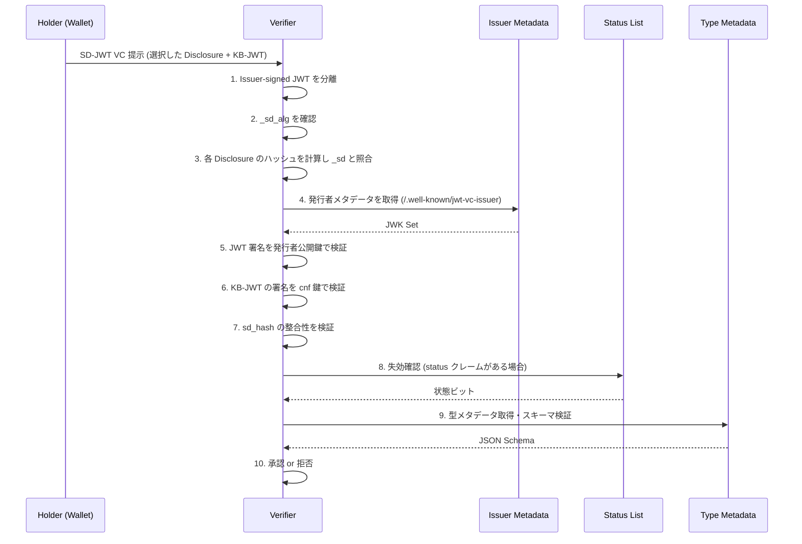

> **Note:** このページはAIエージェントが執筆しています。内容の正確性は一次情報（仕様書・公式資料）とあわせてご確認ください。

# SD-JWT-based Verifiable Digital Credentials (SD-JWT VC)

## 概要

**SD-JWT VC**（SD-JWT-based Verifiable Digital Credentials）は、JSON Web Token（JWT）の選択的開示拡張であるSD-JWT（RFC 9901）を基盤として、Verifiable Credential を表現するためのデータ形式と処理ルールを定義する仕様です。

IETF OAuth ワーキンググループが策定中であり、2026年2月26日時点で **draft-ietf-oauth-sd-jwt-vc-15** が最新版（Standards Track を目指し、ワーキンググループレビュー中）として公開されています（[IETF Datatracker](https://datatracker.ietf.org/doc/draft-ietf-oauth-sd-jwt-vc/)）。

SD-JWT VC が解決する問題は「**W3C VCDM の複雑さを避けつつ、プライバシー保護付きクレデンシャルを JWT エコシステムで実現する**」ことです。JSON-LD や W3C Verifiable Credentials Data Model v2.0 とは独立した設計であり、既存の OAuth 2.0 / OpenID Connect インフラとの親和性を最優先に置いています。

EU の eIDAS 2.0 規制と EUDI Wallet 参照アーキテクチャ（ARF）は SD-JWT VC を標準クレデンシャル形式として採用しており、2026年以降の欧州デジタルアイデンティティ基盤の中核を担います。OID4VCI（[OpenID for Verifiable Credential Issuance](./oid4vci.md)）および OID4VP（[OpenID for Verifiable Presentations](./oid4vp.md)）と組み合わせて使用されることが前提です。

## 背景と経緯

### W3C VC エコシステムの課題

W3C の Verifiable Credentials Data Model（[VCDM 2.0](./vc-data-model.md)）は汎用性が高い一方で、JSON-LD コンテキスト処理・複数の証明機構・複雑なデータモデルを要求するため、実装コストが高い課題がありました。特にモバイルウォレットや制約のある環境での実装は容易ではありません。

一方、JWT は OAuth 2.0 / OpenID Connect エコシステムで広く普及しており、既存のライブラリやインフラが豊富に存在します。しかし、標準的な JWT ではすべてのクレームが開示される問題があります。これを解決するために、まず SD-JWT（Selective Disclosure for JSON Web Tokens）が開発され、RFC 9901 として 2025年11月に標準化されました。

SD-JWT VC は SD-JWT の上に「Verifiable Credential としての構造」を追加したものです。型メタデータシステム・発行者鍵検証・状態確認（失効）などの VC に必要な要素を定義することで、JWT エコシステムで完全なデジタルクレデンシャルを実現します。

### typ ヘッダー値の変遷

2023年〜2024年にかけて、大きな仕様変更がありました。当初 `vc+sd-jwt` だった JOSE ヘッダーの `typ` 値が、**2024年11月に `dc+sd-jwt` へ変更**されました（`dc` は "digital credential" の略）。

変更の理由は W3C のメディアタイプ登録との競合回避です。`vc` という prefix が W3C Verifiable Credentials を想起させ、W3C VCDM との混同を招く可能性がありました。仕様では移行期間中は両方の値を受け入れることを推奨しています。

## 設計思想

### 1. JWT エコシステムとの親和性

SD-JWT VC は意図的に W3C VCDM から独立した設計を採っています。JSON-LD・RDF・コンテキスト処理への依存をゼロにし、OAuth 2.0 開発者が追加学習なしに使えることを優先しています。

### 2. 選択的開示によるプライバシー保護

保有者（Holder）は、発行者（Issuer）が作成したクレデンシャルから必要なクレームだけを選択して検証者（Verifier）に提示できます。たとえば、年齢確認が必要なサービスに対して誕生日を開示せず「18歳以上である」というクレームだけを提示することが可能です。

### 3. キーバインディングによる提示証明

Key Binding JWT（KB-JWT）を使用して、クレデンシャルの提示が保有者本人によるものであることを暗号学的に証明できます。これにより、窃取したクレデンシャルをそのまま転用する「リプレイ攻撃」を防御します。

### 4. 型メタデータによる意味定義の外部化

クレデンシャルの型定義（スキーマ・表示方法・クレームの意味）を `vct` URI で参照される外部メタデータに委ねる設計です。仕様本体は型の詳細を規定せず、エコシステムごとに柔軟な定義が可能です。

## 技術詳細

### 基本構造

SD-JWT VC の完全な形式（Key Binding 付き）は以下の構造を持ちます：

```
<Issuer-signed JWT>~<Disclosure 1>~<Disclosure 2>~...~<KB-JWT>
```

- `~` で区切られた各要素は base64url エンコードされた値
- Key Binding が不要な場合は KB-JWT を省略し、末尾の `~` だけが残る

**メディアタイプ**: `application/dc+sd-jwt`

### JOSE ヘッダー

```json
{
  "alg": "ES256",
  "typ": "dc+sd-jwt",
  "kid": "issuer-key-2024"
}
```

- `typ` は必須で `dc+sd-jwt` を指定（移行期間中は `vc+sd-jwt` も許容）
- `alg` は `none` を禁止
- `kid` は発行者メタデータでの鍵参照に使用

### JWT ペイロードの主要クレーム

| クレーム      | 必須/任意          | 説明                                         |
| ------------- | ------------------ | -------------------------------------------- |
| `vct`         | 必須               | クレデンシャル型識別子（URI 値）             |
| `iss`         | 必須               | 発行者識別子（URI）                          |
| `cnf`         | 条件付き           | 保有者鍵の確認メソッド（Key Binding 使用時） |
| `nbf` / `exp` | 任意               | 有効期間                                     |
| `status`      | 任意               | 失効状態確認への参照                         |
| `sub`         | 任意、選択的開示可 | サブジェクト識別子                           |
| `iat`         | 任意、選択的開示可 | 発行タイムスタンプ                           |
| `_sd_alg`     | 任意               | ハッシュアルゴリズム（既定: `sha-256`）      |

**重要な制約**: `iss`・`vct`・`_sd_alg` は選択的開示できません。発行者と型情報を隠すことは SD-JWT VC の信頼モデルと相容れないためです。

### 選択的開示の仕組み（SD-JWT から継承）

発行者はクレームを選択的開示可能にするため、クレームをプレーンに含めず、代わりにそのハッシュ値を JWT ペイロードの `_sd` 配列に埋め込みます。

**Disclosure の構造（オブジェクトプロパティの場合）**:

```json
["<ランダムなソルト値>", "claim_name", "claim_value"]
```

これを base64url エンコードしたものが Disclosure です。

**ペイロード例（パスポート番号を選択的開示可能にした場合）**:

```json
{
  "iss": "https://issuer.example.com",
  "vct": "https://credentials.example.com/passport",
  "given_name": "山田",
  "family_name": "太郎",
  "_sd": ["X9AEOJ9KJYRlrTJA8UF4MNOvWzWrqG7wFp0HkVc3Xss"],
  "_sd_alg": "sha-256",
  "cnf": {
    "jwk": {
      "kty": "EC",
      "crv": "P-256",
      "x": "...",
      "y": "..."
    }
  }
}
```

この例では `given_name` と `family_name` は常に開示されますが、`_sd` のハッシュが指すクレーム（例: `passport_number`）は保有者が選択して開示できます。

### Key Binding JWT（KB-JWT）

保有者が提示時に「このクレデンシャルは自分が提示している」ことを証明するための JWT です。

**必須ヘッダー**:

```json
{
  "typ": "kb+jwt",
  "alg": "ES256"
}
```

**必須ペイロードクレーム**:

| クレーム  | 説明                                                             |
| --------- | ---------------------------------------------------------------- |
| `iat`     | KB-JWT 発行時刻                                                  |
| `aud`     | 検証者の識別子                                                   |
| `nonce`   | 検証者が提供した nonce（リプレイ防止）                           |
| `sd_hash` | 提示する SD-JWT（選択した Disclosure 含む）の base64url ハッシュ |

`sd_hash` により、検証者は保有者が改ざんしていない特定の Disclosure セットを使ったことを確認できます。

### 型メタデータシステム（Type Metadata）

`vct` クレームの URI が指す JSON ドキュメントで、クレデンシャル型の詳細を定義します。

**メタデータドキュメントの主要プロパティ**:

```json
{
  "vct": "https://credentials.example.com/PassportCredential",
  "name": "パスポートクレデンシャル",
  "description": "政府発行のパスポート情報を含むデジタルクレデンシャル",
  "extends": "https://credentials.example.com/IdentityCredential",
  "schema_uri": "https://credentials.example.com/PassportCredential/schema.json",
  "display": [
    {
      "lang": "ja-JP",
      "name": "パスポートクレデンシャル",
      "rendering": {
        "simple": {
          "logo": {
            "uri": "https://...",
            "alt_text": "ロゴ"
          },
          "background_color": "#003399",
          "text_color": "#ffffff"
        }
      }
    }
  ],
  "claims": [
    {
      "path": ["passport_number"],
      "display": [{ "lang": "ja-JP", "label": "パスポート番号" }],
      "sd": "always"
    }
  ]
}
```

`extends` プロパティにより型の継承が可能です。子型は親型の制約を強化できますが、緩和することはできません。

**型メタデータの取得方法**:

1. `vct` が HTTPS URL の場合、そのエンドポイントから直接取得
2. `vct#integrity` ハッシュによる整合性検証
3. JWT の unprotected ヘッダーに `vctm` として埋め込む（オフライン検証が可能）
4. エコシステム独自のレジストリから取得

### 発行者メタデータ（Issuer Metadata）

発行者の公開鍵セットを取得するための Well-Known エンドポイントです。

**エンドポイント URL の構築ルール**:

`iss` が `https://issuer.example.com/tenant/1234` の場合:

```
https://issuer.example.com/.well-known/jwt-vc-issuer/tenant/1234
```

**メタデータレスポンス例**:

```json
{
  "issuer": "https://issuer.example.com/tenant/1234",
  "jwks_uri": "https://issuer.example.com/jwks"
}
```

または `jwks_uri` の代わりに `jwks` でインライン JWK Set を返すことも可能です（両方の同時指定は不可）。

### 発行者鍵の検証方法

仕様は以下の3つの鍵検証メカニズムを定義しています：

1. **JWT VC Issuer Metadata**（推奨）: 上記 Well-Known エンドポイントから JWK Set を取得
2. **X.509 証明書チェーン**: JWT ヘッダーの `x5c` パラメーターから証明書を取得し、SAN（Subject Alternative Name）と `iss` 値を照合
3. **DID ドキュメント解決**: `iss` が DID の場合、DID Document から公開鍵を解決

いずれの方法でも発行者と鍵の対応が確認できない場合、クレデンシャルを**拒否しなければなりません**。

### 状態確認と失効

`status` クレームで Token Status List（[draft-ietf-oauth-status-list](https://datatracker.ietf.org/doc/draft-ietf-oauth-status-list/)）への参照を含めることができます。

```json
{
  "status": {
    "status_list": {
      "idx": 0,
      "uri": "https://issuer.example.com/statuslists/1"
    }
  }
}
```

検証者はポリシーに従って状態確認を実施します。

## 検証フロー



## 実装上の注意点

### 1. ソルト値のエントロピー

Disclosure のソルト値は、クレームごとに**一意**でなければならず、128ビット以上の暗号学的に安全な乱数から生成した base64url 値を推奨しています（[RFC 9901 Section 11.3](https://www.rfc-editor.org/rfc/rfc9901#section-11.3)）。

ソルトが予測可能だと、検証者が同一クレームを異なる提示間で相関付けられるプライバシーリスクがあります。

### 2. デコイ Digest によるクレーム数難読化

`_sd` 配列に実際の Disclosure に対応しないハッシュ値（デコイ）を追加することで、検証者がクレーム数を統計的に推定するサイドチャネルを防げます。デコイ Digest に対応する Disclosure は存在せず、検証者には区別がつきません。

### 3. typ ヘッダー移行期間の対応

`vc+sd-jwt`（旧値）と `dc+sd-jwt`（新値）の両方を受け入れる移行期間対応が必要です。実装は両方の値を許容してください。ただし、新規発行では `dc+sd-jwt` のみを使用することを推奨します。

### 4. SSRF 攻撃への対策

発行者メタデータや型メタデータを取得する際、URL が内部ネットワークを指していないかを検証する必要があります。攻撃者が細工した `iss` 値や `vct` URL で内部サービスへのプロービングを試みる可能性があります。

### 5. 循環継承の検出

型メタデータの `extends` チェーンが循環していないかを検出するロジックが必要です。A → B → A のような循環参照は無限ループを引き起こします。

### 6. ネストされた選択的開示

JSON オブジェクトの階層構造でネストされた選択的開示を実装する際、中間層の Disclosure も必要になる場合があります。検証者は依存関係を正しく処理する必要があります。

## eIDAS 2.0 / EUDI Wallet エコシステムでの位置付け

SD-JWT VC は、欧州デジタルアイデンティティウォレット（EUDI Wallet）の中心的なクレデンシャル形式として採用されています。

**エコシステムでの役割**:

| 仕様              | 役割                                       |
| ----------------- | ------------------------------------------ |
| SD-JWT VC         | クレデンシャルのデータ形式                 |
| OID4VCI           | クレデンシャルの発行プロトコル             |
| OID4VP            | クレデンシャルの提示プロトコル             |
| ISO 18013-5 (mDL) | 代替クレデンシャル形式（CBOR/COSE ベース） |

OpenID4VC High Assurance Interoperability Profile（HAIP）は SD-JWT VC と ISO mdoc を標準クレデンシャル形式と定め、高セキュリティ・高プライバシーの相互運用シナリオを定義しています。

EUDI Wallet 大規模パイロット（LSP: Large-Scale Pilots）では 4 つのパイロット（POTENTIAL、EWC、NOBID、DC4EU）が SD-JWT VC + OID4VCI/OID4VP の組み合わせで実際の発行・提示フローを検証しました。

## W3C VCDM との比較

| 観点           | SD-JWT VC                    | W3C VCDM 2.0                |
| -------------- | ---------------------------- | --------------------------- |
| データ形式     | JWT / JSON                   | JSON-LD                     |
| 証明機構       | SD-JWT + JWS                 | Data Integrity / JWT        |
| 選択的開示     | SD-JWT により組み込み        | BBS+ 等別途必要             |
| 実装の複雑さ   | 低（JWT ライブラリで対応）   | 高（JSON-LD 処理が必要）    |
| 意味論         | 型メタデータ URI             | JSON-LD コンテキスト        |
| 標準化状況     | IETF Standards Track (Draft) | W3C Recommendation          |
| eIDAS 2.0 採用 | あり（主要形式）             | 一部 EAA プロファイルで採用 |

SD-JWT VC は「JWT エコシステムとの統合容易性」を最優先にした設計であり、既存の OAuth 2.0 / OIDC インフラを持つ組織が VC を導入するための最も低コストな経路を提供します。一方で、JSON-LD の豊富なセマンティクスは持ちません。

## 採用事例

- **walt.id**: SD-JWT VC の発行・検証エンジンを OSS 提供（[docs.walt.id](https://docs.walt.id/concepts/digital-credentials/sd-jwt-vc)）
- **EUDI Wallet 参照実装**: 欧州委員会の参照実装（GitHub: eu-digital-identity-wallet）が SD-JWT VC をサポート
- **Authlete**: OAuth 2.0 / OIDC の商用実装で SD-JWT VC 発行をサポート（著者の Daniel Fett が所属）
- **各国 EUDI Wallet パイロット**: 欧州の Large-Scale Pilots（POTENTIAL、EWC など）が SD-JWT VC を採用

## 関連仕様・後継仕様

- **依存する仕様**:
  - [SD-JWT (RFC 9901)](https://www.rfc-editor.org/rfc/rfc9901) — 選択的開示の基盤メカニズム
  - [JWT (RFC 7519)](./rfc7519.md) — ベース仕様
  - [Token Status List](https://datatracker.ietf.org/doc/draft-ietf-oauth-status-list/) — 失効確認
- **組み合わせて使用される仕様**:
  - [OID4VCI](./oid4vci.md) — 発行プロトコル
  - [OID4VP](./oid4vp.md) — 提示プロトコル
  - [WebAuthn](./webauthn.md) — デバイスバインディング
- **代替・競合仕様**:
  - [W3C VCDM 2.0](./vc-data-model.md) — JSON-LD ベースの代替アプローチ
  - [ISO 18013-5 (mDL)](https://www.iso.org/standard/69084.html) — CBOR/COSE ベースのモバイル運転免許証形式

## 参考資料

- [draft-ietf-oauth-sd-jwt-vc-15 (IETF Datatracker)](https://datatracker.ietf.org/doc/draft-ietf-oauth-sd-jwt-vc/)
- [SD-JWT (RFC 9901)](https://www.rfc-editor.org/rfc/rfc9901) — 選択的開示の基礎仕様
- [Token Status List](https://datatracker.ietf.org/doc/draft-ietf-oauth-status-list/) — 失効確認メカニズム
- [OpenID4VC High Assurance Interoperability Profile (HAIP)](https://openid.net/specs/openid4vc-high-assurance-interoperability-profile-1_0.html)
- [EUDI Wallet Architecture Reference Framework (ARF)](https://github.com/eu-digital-identity-wallet/eudi-doc-architecture-and-reference-framework)
- [walt.id SD-JWT VC 解説](https://docs.walt.id/concepts/digital-credentials/sd-jwt-vc)
