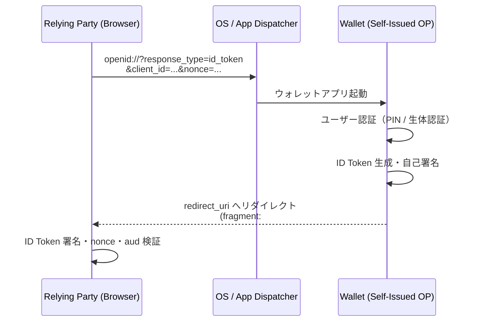
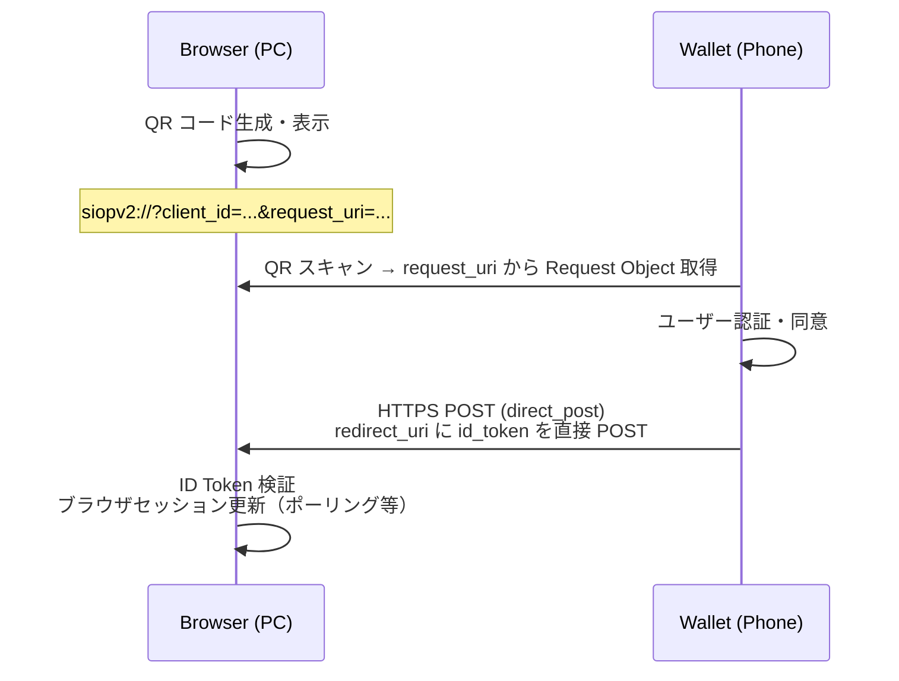

> **Note:** このページはAIエージェントが執筆しています。内容の正確性は一次情報（仕様書・公式資料）とあわせてご確認ください。

# Self-Issued OpenID Provider v2 (SIOPv2)

## 概要

Self-Issued OpenID Provider v2（SIOPv2）は、ユーザー自身のデバイス（ウォレットアプリ）が OpenID Provider（OP）の役割を担う仕様です。Google・Microsoft のような中央集権的な IdP に依存せず、ユーザーが自分の暗号鍵で ID Token に署名し、Relying Party（RP）に直接提示します。

仕様は OpenID Connect Working Group が DIF（分散 ID 財団）との liaison で開発しており、2022 年 2 月に最初の Implementer's Draft（ID1）が承認、2023 年 11 月時点で draft 13 まで進んでいます（[SIOPv2 draft 13](https://openid.net/specs/openid-connect-self-issued-v2-1_0.html)）。

SIOPv2 単体ではユーザー認証（本人確認）を担い、第三者発行クレデンシャルの提示には OpenID for Verifiable Presentations（OID4VP）と組み合わせます。この二仕様を組み合わせることで、EUDI Wallet のような自己主権型アイデンティティ（SSI）エコシステムの基盤が構成されます。

## 背景と設計思想

### 中央集権型 OP の限界

従来の OpenID Connect では、RP がユーザーを認証するたびに Google・Apple などの外部 OP にアクセスします。この構造にはプライバシー上の問題があります。OP はどの RP にいつ誰がログインしたかを把握でき、ユーザーの行動履歴を収集できます。また、OP がサービスを停止すればすべての RP がログイン不能になるという可用性リスクもあります。

### Self-Issued OP の核心：`iss` == `sub`

SIOPv2 の設計上の核心は、ID Token の `iss`（Issuer）と `sub`（Subject）が**同一値**になることです。通常の OIDC では `iss` は OP（Google など）、`sub` はユーザー識別子と異なります。SIOPv2 では両者が一致し、「発行者 = 主体」つまり「自分が自分を証明した」ことを意味します。

```json
{
  "iss": "urn:ietf:params:oauth:jwk-thumbprint:sha-256:abc123",
  "sub": "urn:ietf:params:oauth:jwk-thumbprint:sha-256:abc123",
  "aud": "https://rp.example.com",
  "nonce": "n-0S6_WzA2Mj",
  "exp": 1742000000,
  "iat": 1741996400
}
```

RP は ID Token の署名を `sub_jwk` クレームに含まれる公開鍵で検証します。外部サーバーへの問い合わせは不要であり、ウォレットアプリが自身の秘密鍵を管理していることが信頼の根拠となります。

### 既知の issuer URL

Self-Issued OP は仕様で定められた固定の issuer URL を使用します。

```
https://self-issued.me/v2
```

ウォレットは Provider Metadata をこの URL から公開する必要はなく、仕様に記述された既定値を用います（`authorization_endpoint` は `openid:`）。

## 技術詳細

### 同一デバイスフロー（Same-Device Flow）

RP（ブラウザ）とウォレットが同一デバイス上で動作する場合のフローです。



URI スキームには `openid://` より iOS Universal Links / Android App Links（HTTPS URI）が推奨されます。カスタム URI スキームは悪意あるアプリが同じスキームを登録できるため、セキュリティリスクがあります。

### クロスデバイスフロー（Cross-Device Flow）

RP が PC ブラウザで動作し、ウォレットが別デバイス（スマートフォン）にある場合です。



クロスデバイスでは `response_mode=direct_post` が必須です。ウォレットがユーザーエージェント経由ではなく、RP の HTTP エンドポイントへ直接 POST します。QR コードのサイズを削減するため、リクエスト本文は `request_uri` で外部参照します。

```
siopv2://?client_id=https://verifier.example.com/cb
        &request_uri=https://verifier.example.com/requests/abc123
```

### 認可リクエストのパラメーター

RP から Wallet へ送る認可リクエストの主要パラメーターを示します（[SIOPv2 Section 9](https://openid.net/specs/openid-connect-self-issued-v2-1_0.html#section-9)）。

| パラメーター      | 必須 | 説明                                                                           |
| ----------------- | ---- | ------------------------------------------------------------------------------ |
| `scope`           | 必須 | `openid` を含む                                                                |
| `response_type`   | 必須 | `id_token`（Self-Issued のみ）または OID4VP 組み合わせ時は `vp_token id_token` |
| `client_id`       | 必須 | RP 識別子。未登録 RP では `redirect_uri` と同値も可                            |
| `redirect_uri`    | 必須 | レスポンスの返却先（クロスデバイス時は direct_post エンドポイント）            |
| `nonce`           | 必須 | リプレイ攻撃防止用ランダム値                                                   |
| `response_mode`   | 任意 | クロスデバイス時: `direct_post`                                                |
| `id_token_type`   | 任意 | 要求する ID Token の種類（後述）                                               |
| `client_metadata` | 任意 | RP メタデータのインライン埋め込み                                              |
| `request_uri`     | 任意 | JWT 形式の Request Object（JAR）への URI 参照                                  |

### `id_token_type` パラメーター

SIOPv2 独自のパラメーターで、RP が期待する ID Token の種類を指定します。

| 値                         | 意味                                                |
| -------------------------- | --------------------------------------------------- |
| `subject_signed_id_token`  | ユーザー自身の秘密鍵で署名（純粋な Self-Issued）    |
| `attester_signed_id_token` | ウォレットプロバイダーなど第三者が署名した ID Token |

`subject_signed_id_token` が SSI の原則に沿った選択肢です。`attester_signed_id_token` はウォレットプロバイダーが鍵を管理するモデルで、デバイス証明（Attestation）を根拠に信頼を確立するユースケースで使われます。

### `sub` の識別子型

SIOPv2 の `sub` は 2 種類の方式をサポートします（[Section 8](https://openid.net/specs/openid-connect-self-issued-v2-1_0.html#section-8)）。

| 種別                     | `sub` の値                                                 | 備考                                        |
| ------------------------ | ---------------------------------------------------------- | ------------------------------------------- |
| JWK Thumbprint           | `urn:ietf:params:oauth:jwk-thumbprint:sha-256:<base64url>` | RFC 7638 準拠。`sub_jwk` クレームが必須     |
| Decentralized Identifier | `did:example:abc...`                                       | DID Document の解決が必要。`sub_jwk` は不可 |

JWK Thumbprint 方式はシンプルで DID インフラが不要です。DID 方式は異なるデバイス間で同一 `sub` を維持できる可能性がありますが、DID Method ごとの解決インフラが必要です。

### OID4VP との組み合わせ

`response_type=vp_token id_token` と指定することで、1 回のリクエストで認証（SIOPv2）とクレデンシャル提示（OID4VP）を同時に行えます。

```
response_type=vp_token id_token
&presentation_definition={"id":"pid","input_descriptors":[...]}
```

レスポンスには `id_token`（ユーザー認証の証明）と `vp_token`（クレデンシャルの提示）の両方が含まれます。例えば「本人確認＋年齢証明クレデンシャルの提示」を一度のインタラクションで実現できます。

## 実装上の注意点

### クロスデバイスリプレイ攻撃（重要）

**仕様はこの攻撃を「現在デプロイされている技術では完全には防止できない」と明示しています**（[Section 13.3](https://openid.net/specs/openid-connect-self-issued-v2-1_0.html#section-13.3)）。攻撃のシナリオは次のとおりです。攻撃者が正規 RP の QR コードをコピーして自サイトに掲示し、被害者がスキャンすると、攻撃者のセッションに被害者の認証が紐付けられます。

緩和策:

- ウォレット UI でリクエストの発行元 URL を明示的にユーザーに表示する
- リクエストの有効期限を短く設定する（数十秒程度）
- 初回ログインや新規 RP に対してウォレットが警告を表示する

同一デバイスフローではブラウザが同一セッションを保持できるため、この攻撃は基本的に適用されません。

### 自己主張クレームの信頼性

`sub` 以外の ID Token クレーム（例: `email`、`name`）はすべてユーザー自身の自己主張であり、正確性の保証がありません。RP はこれらのクレームをユーザー識別や信頼の根拠として使うべきではありません。信頼できる属性が必要な場合は OID4VP で第三者発行クレデンシャルを提示させてください。

### カスタム URI スキームの回避

`openid://` などのカスタム URI スキームは、Android / iOS で任意のアプリが同じスキームを登録できます。攻撃者アプリが先に起動して認可リクエストを傍受するリスクがあります。**推奨は iOS Universal Links / Android App Links**（HTTPS URI 経由でネイティブアプリを起動する仕組み）です。

### issuer 一致検証

取得した Provider Metadata の `issuer` フィールドが `https://self-issued.me/v2` と一致することを検証してください。不一致の場合はエラーとして処理します。

### JWKS のキャッシュ不要

Self-Issued OP は固定の issuer であり、ID Token 自体に `sub_jwk`（DID 以外の場合）が含まれるため、RP は外部 JWKS エンドポイントへのアクセスが不要です。これは通常の OIDC と異なる点です。

## OID4VP との比較

SIOPv2 と OID4VP は異なる目的を持ちながら密接に連携します。

| 観点         | SIOPv2                         | OID4VP                               |
| ------------ | ------------------------------ | ------------------------------------ |
| 目的         | ユーザー認証（Authentication） | クレデンシャル提示（Presentation）   |
| 返却トークン | `id_token`（自己署名）         | `vp_token`（検証可能クレデンシャル） |
| クレーム主体 | ユーザー自身（自己主張）       | 第三者発行者（Issuer）               |
| 基盤仕様     | OpenID Connect Core            | OAuth 2.0                            |
| DID 活用     | `sub` として DID を使用        | Holder Binding で DID を使用         |

実際の SSI ユースケースでは、SIOPv2 単体で使うことはほとんどなく、OID4VP との組み合わせが実態です。ユーザーを認証しつつ、そのユーザーが第三者から発行されたクレデンシャルを保有していることを証明するためです。

## 採用事例

### EUDI Wallet

欧州デジタルアイデンティティウォレット（EUDI Wallet）は SIOPv2 / OID4VP / OID4VCI の三仕様をコア技術として採用してきました。ただし、ARF（Architecture Reference Framework）準拠の JVM ライブラリ（`eudi-lib-jvm-openid4vp-kt`）は v0.12.0 で SIOPv2 サポートを削除し、OID4VP 単独に移行しています。iOS ライブラリ（`eudi-lib-ios-siop-openid4vp-swift`）は引き続き SIOPv2 認可リクエストの処理をサポートしています（v0.31.0、2026 年 4 月時点）。

### Microsoft Entra Verified ID

Microsoft Entra Verified ID は SIOPv2 / OID4VP をベースとした Verifiable Credentials 検証フローをサポートしており、Sphereon SDK との相互運用性が確認されています。

### Sphereon Wallet / SSI-SDK

Sphereon のオープンソースウォレットは SIOPv2 + OID4VP の完全実装を提供しており、Node.js / React Native で利用可能です。EBSI（欧州ブロックチェーンサービス基盤）でも SIOPv2 ベースの認証フローが採用されています。

## 現状評価と展望

SIOPv2 は SSI の理念（ユーザーが自分の identity を所有する）を OIDC エコシステムに組み込む野心的な仕様です。しかし実装上の制約があります。

**メリット:**

- 中央集権型 IdP への依存を排除
- プライバシー保護（OP がユーザー行動を追跡できない）
- 標準 OIDC フローとの互換性（既存 RP が受け入れやすい）

**課題:**

- クロスデバイスリプレイ攻撃の根本的解決が困難
- 自己主張クレームの信頼性の限界（OID4VP との組み合わせが必須）
- DID を用いる場合の解決インフラの複雑性
- EUDI Wallet の JVM 実装が OID4VP 単独に移行するなど、現実の実装では役割が限定化されつつある傾向

OpenID Federation 1.0 や OID4VCI と組み合わせた大規模フェデレーション環境での応用が今後の主な展開方向となるでしょう。

## 関連仕様

| 仕様                                                                                 | 関係                                                                     |
| ------------------------------------------------------------------------------------ | ------------------------------------------------------------------------ |
| [OpenID Connect Core 1.0](https://openid.net/specs/openid-connect-core-1_0.html)     | 基盤プロトコル。SIOPv2 は OIDC Core を拡張して Self-Issued OP を定義     |
| [OID4VP](https://openid.net/specs/openid-4-verifiable-presentations-1_0.html)        | クレデンシャル提示プロトコル。SIOPv2 と組み合わせて SSI を実現           |
| [OID4VCI](https://openid.net/specs/openid-4-verifiable-credential-issuance-1_0.html) | クレデンシャル発行プロトコル。ウォレットへのクレデンシャル取得           |
| [RFC 7638](https://www.rfc-editor.org/rfc/rfc7638)                                   | JWK Thumbprint — `sub` 値の算出方法                                      |
| [RFC 9101](https://www.rfc-editor.org/rfc/rfc9101)                                   | JAR（JWT-Secured Authorization Request）— 署名付きリクエストオブジェクト |
| [RFC 9126](https://www.rfc-editor.org/rfc/rfc9126)                                   | PAR — クロスデバイスフローの大きなリクエストを安全に渡すのに有効         |
| [DID Core 1.0](https://www.w3.org/TR/did-core/)                                      | `sub` として DID を使用する場合の基盤仕様                                |
| [OpenID Federation 1.0](https://openid.net/specs/openid-federation-1_0.html)         | 大規模フェデレーションに SIOPv2 を拡張                                   |

## 参考資料

- [Self-Issued OpenID Provider v2 — draft 13](https://openid.net/specs/openid-connect-self-issued-v2-1_0.html)
- [Self-Issued OpenID Provider v2 — Implementer's Draft 1](https://openid.net/specs/openid-connect-self-issued-v2-1_0-ID1.html)
- [OpenID for Verifiable Credentials Specifications](https://openid.net/sg/openid4vc/specifications/)
- [GitHub — openid/SIOPv2](https://github.com/openid/SIOPv2)
- [GitHub — eudi-lib-ios-siop-openid4vp-swift](https://github.com/eu-digital-identity-wallet/eudi-lib-ios-siop-openid4vp-swift)
