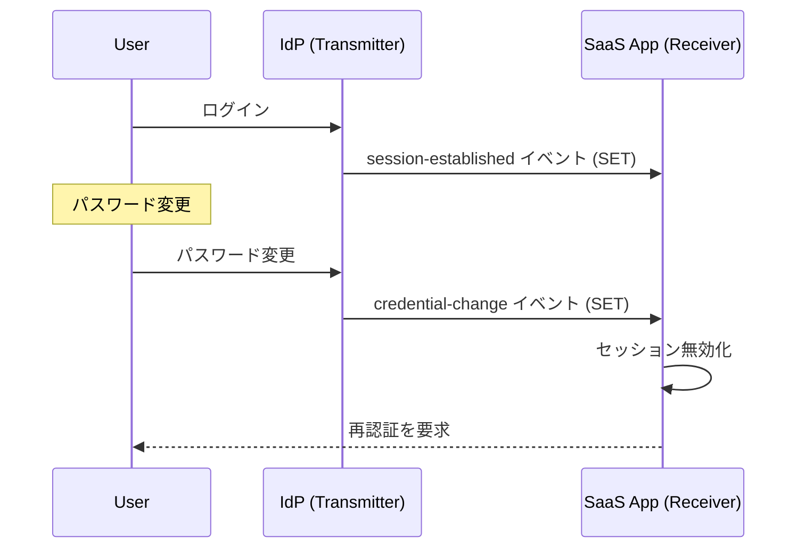
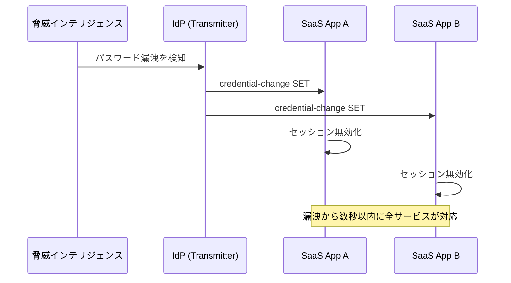

> **Note:** このページはAIエージェントが執筆しています。内容の正確性は一次情報（仕様書・公式資料）とあわせてご確認ください。

# Shared Signals Framework / CAEP — セキュリティシグナルのリアルタイム共有

## 概要

**Shared Signals Framework (SSF)** は、複数の独立したシステム間でセキュリティシグナルをリアルタイムに共有するための OpenID Foundation 仕様です。2025 年 8 月 29 日に公開され、同年 9 月 2 日に OpenID Foundation により [OpenID Shared Signals Framework 1.0](https://openid.net/specs/openid-sharedsignals-framework-1_0-final.html) として Final 仕様が正式承認されました。

従来の認証・認可モデルでは、ユーザーがサービスにログインした時点でセッションが確立され、その後の状態変化（パスワード変更、デバイス紛失、アカウント乗っ取り）がリアルタイムに他のサービスへ伝播しません。SSF はこの問題を解決するため、Security Event Token (SET) を使ったイベント配信メカニズムを標準化します。

SSF の上位アプリケーションとして 2 つのプロファイルが同時に Final 仕様となっています：

- **CAEP (Continuous Access Evaluation Profile)**: セッションの継続的評価イベント ([仕様](https://openid.net/specs/openid-caep-1_0-final.html))
- **RISC (Risk Incident Sharing and Coordination Profile)**: アカウントリスクイベント ([仕様](https://openid.net/specs/openid-risc-1_0-final.html))

## 背景と経緯

### なぜ「静的なセッション」が問題か

従来の OAuth 2.0 / OpenID Connect では、アクセストークンやセッションクッキーはその有効期限まで有効です。しかし実際の運用では：

- ユーザーが **パスワードを変更した**のに、有効なアクセストークンを持つ別セッションが継続する
- **デバイスが紛失・盗難**されたのに、そのデバイスのセッションが有効なまま
- **アカウントが侵害**されたことをIdPが検知したのに、SP（サービスプロバイダー）が知らない

これらは「ポイントインタイム認証」の限界であり、ゼロトラストアーキテクチャが求める「継続的な信頼の評価」とは相容れません。

### Google による CAEP の提案

CAEP は Google が 2020 年に提案したアイデアが発端です。Google Workspace とサードパーティサービスが Workspace のセッション状態をリアルタイムに同期する必要性から設計されました。その後、OpenID Foundation の Shared Signals Working Group に統合され、RISC と共に標準化が進みました。

### 基盤となる IETF 標準

SSF は以下の IETF 標準を基盤とします：

| 仕様                                               | 役割                              |
| -------------------------------------------------- | --------------------------------- |
| [RFC 8417](https://www.rfc-editor.org/rfc/rfc8417) | Security Event Token (SET) の定義 |
| [RFC 9493](https://www.rfc-editor.org/rfc/rfc9493) | Subject Identifiers for SETs      |
| [RFC 8935](https://www.rfc-editor.org/rfc/rfc8935) | Push-Based SET Delivery           |
| [RFC 8936](https://www.rfc-editor.org/rfc/rfc8936) | Poll-Based SET Delivery           |
| [RFC 7519](https://www.rfc-editor.org/rfc/rfc7519) | JSON Web Token (JWT)              |

## 設計思想

### Transmitter / Receiver モデル

SSF はイベントの送信者 (**Transmitter**) と受信者 (**Receiver**) の役割を明確に分離します。IdP が Transmitter となりセッション変化を送信し、SaaS サービスが Receiver として受信してアクセス制御を行うのが典型的なパターンです。



### Security Event Token (SET)

SSF のイベントは JWT 形式の **Security Event Token (SET)** として表現されます。SSF では通常の JWT と区別するため `"typ": "secevent+jwt"` の明示が必要です([仕様 Section 4.1](https://openid.net/specs/openid-sharedsignals-framework-1_0-final.html#section-4.1))。

通常の JWT と比較した重要な差異：

- `"sub"` クレームを **使用してはならない**（代わりに `sub_id` を使用）
- `"exp"` クレームを **使用してはならない**（JWT confusion 攻撃への対策）
- `"jti"` は重複排除のため必須
- `"events"` クレームでイベント種別と詳細を表現

```json
{
  "iss": "https://idp.example.com",
  "aud": "https://app.example.com",
  "iat": 1735689600,
  "jti": "4d3559ec67504aaba65d40b0363faad8",
  "typ": "secevent+jwt",
  "sub_id": {
    "format": "email",
    "email": "user@example.com"
  },
  "events": {
    "https://schemas.openid.net/secevent/caep/event-type/session-revoked": {
      "initiating_entity": "admin",
      "reason_admin": {
        "en": "Terminated due to security policy violation"
      },
      "event_timestamp": 1735689595
    }
  }
}
```

### Subject の表現

SSF では誰に関するイベントかを **Subject** で表現します。シンプルなサブジェクト（メールアドレス、電話番号など）と、複合サブジェクト（ユーザー + デバイス + セッション + テナント）の両方をサポートします。

```json
{
  "sub_id": {
    "format": "complex",
    "user": {
      "format": "email",
      "email": "user@example.com"
    },
    "device": {
      "format": "iss_sub",
      "iss": "https://idp.example.com",
      "sub": "device-001"
    },
    "session": {
      "format": "opaque",
      "id": "dMTlD|1600802906337.16|16008029063"
    }
  }
}
```

### イベント配信モデル

SSF は 2 種類の配信モデルをサポートします([仕様 Section 6](https://openid.net/specs/openid-sharedsignals-framework-1_0-final.html#section-6))：

| 方式                | 動作                                                   | 適したケース                            |
| ------------------- | ------------------------------------------------------ | --------------------------------------- |
| **Push** (RFC 8935) | Transmitter が Receiver の Webhook URL に POST         | リアルタイム性が重要な場合              |
| **Poll** (RFC 8936) | Receiver が定期的に Transmitter のエンドポイントを叩く | Receiver がファイアウォール内にある場合 |

## Stream Management API

Receiver は Transmitter が公開する REST API でストリームを管理します。Transmitter の設定情報は `.well-known/ssf-configuration` で発見できます。

### ストリーム作成

```http
POST /ssf/stream
Authorization: Bearer <token>
Content-Type: application/json

{
  "delivery": {
    "method": "https://schemas.openid.net/secevent/risc/delivery-method/push",
    "endpoint_url": "https://app.example.com/ssf/events"
  },
  "events_requested": [
    "https://schemas.openid.net/secevent/caep/event-type/session-revoked",
    "https://schemas.openid.net/secevent/caep/event-type/credential-change",
    "https://schemas.openid.net/secevent/caep/event-type/device-compliance-change"
  ]
}
```

### サブジェクト登録

特定ユーザーのイベントのみ受け取るには、サブジェクトエンドポイントで登録します：

```http
POST /ssf/subjects:add
Authorization: Bearer <token>
Content-Type: application/json

{
  "stream_id": "f67a39320f4e",
  "subject": {
    "format": "email",
    "email": "user@example.com"
  }
}
```

## CAEP イベント詳解

CAEP は 8 種類のイベントタイプを定義します。以下では主要な 6 種類を解説します。基底 URI は `https://schemas.openid.net/secevent/caep/event-type/` です([仕様](https://openid.net/specs/openid-caep-1_0-final.html))。その他 `token-claims-change`（トークンクレームの変更通知）と `risk-level-change`（リスクレベルの変化通知）も定義されています。

### session-revoked

セッションが明示的に失効したことを通知します。

```json
{
  "https://schemas.openid.net/secevent/caep/event-type/session-revoked": {
    "initiating_entity": "policy",
    "reason_admin": {
      "en": "Revoked due to location policy violation"
    },
    "reason_user": {
      "ja": "セキュリティポリシーにより、再サインインが必要です"
    },
    "event_timestamp": 1735689595
  }
}
```

### credential-change

パスワード変更・FIDO2 認証器の追加・削除など、認証情報の変更を通知します。

必須フィールド：

- `credential_type`: `password`, `fido2-platform`, `fido2-roaming`, `fido-u2f`, `x509`, `verifiable-credential`, `phone-voice`, `phone-sms`, `app` のいずれか
- `change_type`: `create`, `revoke`, `update`, `delete` のいずれか

```json
{
  "https://schemas.openid.net/secevent/caep/event-type/credential-change": {
    "credential_type": "fido2-roaming",
    "change_type": "create",
    "friendly_name": "YubiKey 5C NFC",
    "fido2_aaguid": "2fc0579f-8113-47ea-b116-bb5a8db9202a",
    "initiating_entity": "user",
    "event_timestamp": 1735689600
  }
}
```

### assurance-level-change

認証の保証レベルが変化したことを通知します。NIST AAL や eIDAS の保証レベル体系に対応します。

```json
{
  "https://schemas.openid.net/secevent/caep/event-type/assurance-level-change": {
    "namespace": "NIST-AAL",
    "previous_level": "1",
    "current_level": "2",
    "change_direction": "increase",
    "initiating_entity": "user"
  }
}
```

### device-compliance-change

デバイスのコンプライアンス状態（MDM ポリシー準拠）の変化を通知します。

```json
{
  "https://schemas.openid.net/secevent/caep/event-type/device-compliance-change": {
    "previous_status": "compliant",
    "current_status": "not-compliant",
    "initiating_entity": "policy",
    "reason_admin": {
      "en": "Device location policy violated"
    }
  }
}
```

### session-established / session-presented

それぞれ新規セッション作成と既存セッションのアクティブ確認を通知します。`fp_ua`（ユーザーエージェントのフィンガープリント）を使った不審アクセスパターンの検出に活用できます。

## RISC イベント概要

RISC はアカウントレベルのリスクイベントを扱います。CAEP がセッションの継続的評価を扱うのに対し、RISC は「アカウントがどういう状態にあるか」を通知します([仕様](https://openid.net/specs/openid-risc-1_0-final.html))。

| イベント                             | 概要                                                         |
| ------------------------------------ | ------------------------------------------------------------ |
| `account-credential-change-required` | 認証情報の変更が必要                                         |
| `account-purged`                     | アカウントの永久削除                                         |
| `account-disabled`                   | アカウントの無効化（乗っ取り・一括操作）                     |
| `account-enabled`                    | アカウントの再有効化                                         |
| `identifier-changed`                 | メール・電話番号の変更                                       |
| `identifier-recycled`                | 識別子の再利用（新しいユーザーへの割り当て）                 |
| `credential-compromise`              | 認証情報の漏洩                                               |
| `sessions-revoked`                   | 全セッション失効（非推奨、CAEP の `session-revoked` を推奨） |

## 実装上の注意点

### SET 受信時の検証手順

Receiver は受信した SET に対して以下の検証を行う必要があります：

1. **署名検証**: `jwks_uri` から公開鍵を取得し、JWT 署名を検証
2. **`iss` / `aud` の確認**: 期待する Transmitter からのイベントか確認
3. **`jti` の重複チェック**: 同じ `jti` のイベントを二重処理しない
4. **`typ` の確認**: `secevent+jwt` であることを確認

### exp クレームを使ってはならない

SSF の SET では `exp` クレームを **使用してはならない**と明記されています([仕様 Section 4.1.7](https://openid.net/specs/openid-sharedsignals-framework-1_0-final.html#section-4.1.7))。これは JWT confusion 攻撃（SET を通常の JWT として処理させる攻撃）への防御です。`exp` があると、一般的な JWT ライブラリが有効期限切れ前のセキュリティイベントを「有効なアクセス権限」として誤解釈するリスクがあります。

### Critical Subject Members

Transmitter が `critical_subject_members` を設定している場合、Receiver はその Subject メンバーを理解できなければイベントを **破棄しなければならない**とされています([仕様 Section 3.6](https://openid.net/specs/openid-sharedsignals-framework-1_0-final.html#section-3.6))。これは未知のサブジェクト識別子に基づく誤った処理を防ぐためです。

### 非同期配信とべき等性

CAEP イベントは非同期で配信されます。ネットワーク障害や再試行により、同じイベントが複数回配信される可能性があります。`jti` を使った重複排除と、処理のべき等性確保が実装上の重要な考慮点です。

### スコープの限定

セキュリティシグナルの共有は、必要最小限のスコープに限定すべきです。すべてのユーザー・デバイスのシグナルを無差別に共有するのではなく、サブジェクト登録 API でビジネス上必要なユーザーのみを明示的に登録する設計が推奨されます。

## 採用事例

SSF / CAEP は主要なエンタープライズアイデンティティベンダーに採用されています：

| ベンダー                | 役割                   | 状況                                                                |
| ----------------------- | ---------------------- | ------------------------------------------------------------------- |
| **Okta**                | Transmitter / Receiver | Identity Threat Protection (ITP) で実装。業界で最も完成度の高い実装 |
| **Microsoft Entra ID**  | Transmitter            | Conditional Access との連携で CAEP シグナルを送信                   |
| **Google Workspace**    | Transmitter            | ユーザーのセキュリティイベントを連携                                |
| **IBM Security Verify** | Transmitter / Receiver | エンタープライズ IdP として対応                                     |
| **Jamf**                | Transmitter            | デバイスコンプライアンスシグナルを送信                              |
| **SailPoint**           | Receiver               | IGA（Identity Governance）システムとして受信                        |

CAEP Interoperability Profile 1.0（Implementer's Draft）の策定を通じて、これらベンダー間の相互運用性確保が進んでいます。

## ゼロトラストとの関係

SSF / CAEP は、**ゼロトラストアーキテクチャ** (NIST SP 800-207) が求める「継続的な検証 (Never trust, always verify)」を技術的に実現する基盤です。

従来のポイントインタイム認証では、一度認証されると次の認証要求まで信頼が継続します。SSF により、IdP がリスクを検知した瞬間に依存するすべての SaaS サービスへシグナルが伝播し、セッションの即時失効・ステップアップ認証の要求が可能になります。



## 関連仕様・後継仕様

| 仕様                                                                                     | 関係                                                          |
| ---------------------------------------------------------------------------------------- | ------------------------------------------------------------- |
| [RFC 8417 — SET](https://www.rfc-editor.org/rfc/rfc8417)                                 | SSF が依存する SET の基本仕様                                 |
| [RFC 9493 — Subject Identifiers](https://www.rfc-editor.org/rfc/rfc9493)                 | Subject 識別子の標準化                                        |
| [RFC 8935 — Push Delivery](https://www.rfc-editor.org/rfc/rfc8935)                       | Push 配信の基本プロトコル                                     |
| [RFC 8936 — Poll Delivery](https://www.rfc-editor.org/rfc/rfc8936)                       | Poll 配信の基本プロトコル                                     |
| [OpenID RISC 1.0](https://openid.net/specs/openid-risc-1_0-final.html)                   | SSF のアカウントリスクプロファイル                            |
| [CAEP Interoperability Profile 1.0](https://openid.net/wg/sharedsignals/specifications/) | 実装間の相互運用性を高めるプロファイル（Implementer's Draft） |
| [NIST SP 800-207](https://csrc.nist.gov/publications/detail/sp/800/207/final)            | ゼロトラストアーキテクチャ（SSF の背景思想）                  |

## 参考資料

- [OpenID Shared Signals Framework 1.0 — Final](https://openid.net/specs/openid-sharedsignals-framework-1_0-final.html)
- [OpenID CAEP 1.0 — Final](https://openid.net/specs/openid-caep-1_0-final.html)
- [OpenID RISC 1.0 — Final](https://openid.net/specs/openid-risc-1_0-final.html)
- [OpenID Shared Signals Working Group](https://openid.net/wg/sharedsignals/)
- [Guide to Shared Signals](https://sharedsignals.guide/) — 実装者向けガイド
- [RFC 8417 — Security Event Token (SET)](https://www.rfc-editor.org/rfc/rfc8417)
- [RFC 9493 — Subject Identifiers for SETs](https://www.rfc-editor.org/rfc/rfc9493)
- [Three Shared Signals Final Specifications Approved](https://openid.net/three-shared-signals-final-specifications-approved/) — OpenID Foundation (2025-09)
