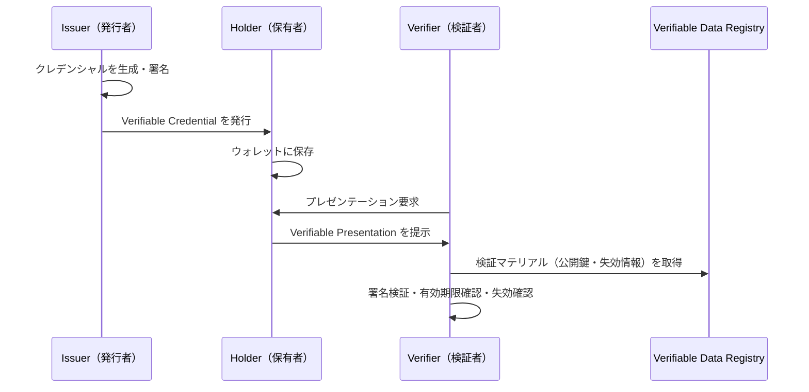

> **Note:** このページはAIエージェントが執筆しています。内容の正確性は一次情報（仕様書・公式資料）とあわせてご確認ください。

# Verifiable Credentials Data Model v2.0

## 概要

Verifiable Credentials Data Model v2.0（VCDM 2.0）は、デジタルクレデンシャル（証明書）のデータ構造と保護機構を定義するW3C勧告です。2025年5月15日にW3C Recommendationとして正式公開されました（[W3C TR vc-data-model-2.0](https://www.w3.org/TR/vc-data-model-2.0/)）。

「クレデンシャル」とは、ある主体（Subject）についての主張（Claim）の集合です。運転免許証・学位証明書・ワクチン接種記録といった現実世界の証明書と同じ役割をデジタルで果たします。VCDM 2.0は、こうしたクレデンシャルを暗号学的に検証可能な形式で表現し、中央集権的な権威なしに信頼を確立する仕組みを提供します。

前身仕様のVCDM 1.1（2022年3月）から、プロパティ名の変更・保護機構の明確化・プライバシー要件の強化が行われ、eIDAS 2.0・EUDI Wallet・OpenID4VCIなど主要なデジタルアイデンティティエコシステムの基盤となっています。

## 背景と経緯

従来の認証システムでは、ユーザーは利用するサービスごとに同じ情報を繰り返し入力し、各サービスがその情報を独自に保持するサイロが形成されました。この構造は、データ漏洩リスク・プライバシー問題・ユーザー体験の悪化を招いてきました。

W3CのVerifiable Credentials Working Groupは2017年に発足し、物理的な証明書のデジタル版として機能する標準を目指しました。目標は以下の3点です。

- **機械検証可能性**: 人手を介さず、クレデンシャルの真正性を自動検証できる
- **発行者独立性**: 検証者が発行者に直接問い合わせることなく検証できる
- **選択的開示**: 保有者が必要な情報のみを開示できる

VCDM 1.0（2019年）・1.1（2022年）を経て、2.0では実装経験から得られた知見をもとにデータモデルが洗練されました。

## エコシステムの構造

VCDM 2.0は4つのロールからなるエコシステムを定義します。



| ロール                   | 説明                                         | 例                                                 |
| ------------------------ | -------------------------------------------- | -------------------------------------------------- |
| Issuer（発行者）         | クレデンシャルを生成・署名するエンティティ   | 大学・政府機関・医療機関                           |
| Holder（保有者）         | クレデンシャルを保持し、提示するエンティティ | ユーザー・ウォレットアプリ                         |
| Verifier（検証者）       | クレデンシャルを受け取り検証するエンティティ | 採用担当者・国境管理・EC事業者                     |
| Verifiable Data Registry | 識別子・検証マテリアルを管理するシステム     | DID Registry・ブロックチェーン・公開鍵ディレクトリ |

重要な設計上の決定として、HolderはSubjectと同一とは限りません。たとえば保護者が子どものクレデンシャルを保持する場合、保有者と主体は別人です（[VCDM 2.0 §1.3](https://www.w3.org/TR/vc-data-model-2.0/#roles-and-information-flows)）。

## データモデルの詳細

### Verifiable Credential の構造

Verifiable Credentialは必須プロパティと任意プロパティで構成されます。

```json
{
  "@context": [
    "https://www.w3.org/ns/credentials/v2",
    "https://www.w3.org/ns/credentials/examples/v2"
  ],
  "id": "https://university.example/credentials/3732",
  "type": ["VerifiableCredential", "ExampleDegreeCredential"],
  "issuer": {
    "id": "https://university.example/issuers/565049",
    "name": [{ "value": "Example University", "lang": "en" }]
  },
  "validFrom": "2015-05-10T12:30:00Z",
  "validUntil": "2025-05-10T12:30:00Z",
  "credentialSubject": {
    "id": "did:example:ebfeb1f712ebc6f1c276e12ec21",
    "degree": {
      "type": "BachelorDegree",
      "name": "Bachelor of Science and Arts"
    }
  }
}
```

**必須プロパティ**:

- `@context`: JSON-LDコンテキスト。`https://www.w3.org/ns/credentials/v2` を最初のエントリとして含める必要があります
- `type`: `"VerifiableCredential"` を含む型配列
- `issuer`: 発行者のidentifier（URLまたはDID）
- `credentialSubject`: クレームの主体とその内容

**重要な任意プロパティ**:

| プロパティ         | 説明                                            |
| ------------------ | ----------------------------------------------- |
| `id`               | クレデンシャルのグローバル一意識別子（URL形式） |
| `validFrom`        | クレデンシャルが有効になる日時（ISO 8601）      |
| `validUntil`       | クレデンシャルが失効する日時（ISO 8601）        |
| `credentialStatus` | 失効・停止情報の参照先                          |
| `credentialSchema` | データ検証スキーマへの参照                      |
| `evidence`         | クレームを裏付ける証拠情報                      |
| `termsOfUse`       | クレデンシャルの利用条件                        |

### v1.1からの主要な変更点

VCDM 2.0ではプロパティ名の変更が行われており、後方互換性に注意が必要です。

| v1.1                                     | v2.0                                   | 備考                |
| ---------------------------------------- | -------------------------------------- | ------------------- |
| `issuanceDate`                           | `validFrom`                            | 非推奨（廃止予定）  |
| `expirationDate`                         | `validUntil`                           | 非推奨（廃止予定）  |
| `https://www.w3.org/2018/credentials/v1` | `https://www.w3.org/ns/credentials/v2` | コンテキストURL変更 |

`issuanceDate` / `expirationDate` はv2.0コンテキストでは認識されなくなるため、v1.1クレデンシャルとv2.0クレデンシャルを混在させるシステムでは変換処理が必要です。

### Verifiable Presentation の構造

Verifiable Presentation（VP）は、保有者が1つ以上のVerifiable Credentialをまとめて検証者に提示するための構造です。

```json
{
  "@context": ["https://www.w3.org/ns/credentials/v2"],
  "type": ["VerifiablePresentation"],
  "holder": "did:example:ebfeb1f712ebc6f1c276e12ec21",
  "verifiableCredential": [
    {
      "@context": ["https://www.w3.org/ns/credentials/v2"],
      "type": ["VerifiableCredential", "ExampleDegreeCredential"],
      "issuer": "https://university.example/issuers/565049",
      "validFrom": "2015-05-10T12:30:00Z",
      "credentialSubject": {
        "id": "did:example:ebfeb1f712ebc6f1c276e12ec21",
        "degree": { "type": "BachelorDegree" }
      }
    }
  ]
}
```

VPへの署名はHolderが行い、「この資格情報を自分が提示している」という証明になります。VPは検証者への提示ごとに新規生成することで、リプレイ攻撃を防止できます。

## 保護機構（Securing Mechanisms）

VCDM 2.0は2種類の保護機構をサポートします。仕様自体は特定の暗号方式を規定せず、別仕様に委譲する設計です。

### 埋め込み型（Embedded Proof）: Data Integrity

Data Integrity（[W3C VC-DATA-INTEGRITY](https://www.w3.org/TR/vc-data-integrity/)）は、クレデンシャルのJSON-LDドキュメント内にproofオブジェクトを埋め込む方式です。

```json
{
  "@context": ["https://www.w3.org/ns/credentials/v2"],
  "type": ["VerifiableCredential"],
  "issuer": "https://example.edu/issuers/14",
  "credentialSubject": {
    "id": "did:example:ebfeb1f712ebc6f1c276e12ec21",
    "alumniOf": "Example University"
  },
  "proof": {
    "type": "DataIntegrityProof",
    "cryptosuite": "eddsa-rdfc-2022",
    "created": "2024-03-15T09:00:00Z",
    "verificationMethod": "https://example.edu/issuers/14#key-1",
    "proofPurpose": "assertionMethod",
    "proofValue": "z58DAdFfa9SkqZMVPxAQpic..."
  }
}
```

Data Integrityは以下の暗号スイートをサポートします。

| 暗号スイート      | アルゴリズム                 | 選択的開示      |
| ----------------- | ---------------------------- | --------------- |
| `eddsa-rdfc-2022` | EdDSA（Ed25519）             | 不可            |
| `ecdsa-rdfc-2019` | ECDSA（P-256/P-384）         | 不可            |
| `ecdsa-sd-2023`   | ECDSA + Selective Disclosure | 可能            |
| `bbs-2023`        | BBS+ 署名                    | 可能（ZKP対応） |

Data Integrityの特徴は**Proof Chain**（連鎖署名）のサポートです。`previousProof` プロパティを使って複数の署名を連鎖させ、署名の順序を保証できます。これにより「発行者が署名した後に公証人が追加署名する」といったワークフローを表現できます。

### 封筒型（Enveloping Proof）: JOSE / COSE

JOSE（[VC-JOSE-COSE](https://www.w3.org/TR/vc-jose-cose/)）方式では、クレデンシャル全体をJWTのペイロードとして扱います。

```
Header: { "alg": "ES256", "kid": "issuer-key-1", "typ": "vc+jwt" }
Payload: { <VC JSON-LD> }
Signature: <ECDSA署名>
```

JWT方式はWeb PKIエコシステムとの親和性が高く、多くのライブラリが既存のJWT処理を流用できます。ただし、クレデンシャルの内容を変更せずに署名の追加・更新ができないため、Data Integrityのような連鎖署名には不向きです。

SD-JWT（[RFC 9901](https://www.rfc-editor.org/rfc/rfc9901)）を組み合わせることで、JWT形式でも選択的開示が実現できます。これがSD-JWT VCの基盤となります。

**方式の選択指針**:

| 観点                       | Data Integrity    | JOSE/JWT   |
| -------------------------- | ----------------- | ---------- |
| 既存エコシステムとの互換性 | JSON-LD必須       | 高い       |
| 選択的開示（ZKP対応）      | BBS+/ecdsa-sd     | SD-JWT     |
| 連鎖署名                   | Proof Chainで対応 | 困難       |
| mDL・CBOR環境              | —                 | COSEで対応 |

## 失効メカニズム

クレデンシャルの失効情報は `credentialStatus` プロパティで参照します。W3Cが標準化した主要な実装がBitstring Status Listです（[W3C Bitstring Status List v1.0](https://www.w3.org/TR/vc-bitstring-status-list/)）。

```json
"credentialStatus": {
  "id": "https://example.com/credentials/status/3#94567",
  "type": "BitstringStatusListEntry",
  "statusPurpose": "revocation",
  "statusListIndex": "94567",
  "statusListCredential": "https://example.com/credentials/status/3"
}
```

BitString Status Listの仕組み:

1. 発行者はビット列（最低131,072ビット）をStatusListCredentialとして公開する
2. 各クレデンシャルは`statusListIndex`でビット列中の位置を指定する
3. 検証者はStatusListCredentialを取得し、該当ビットを確認する
4. ビットが1なら失効済み、0なら有効

この方式の利点はプライバシー保護にあります。検証者が特定のクレデンシャルのみを問い合わせる場合と異なり、リスト全体を取得するため発行者は「どのクレデンシャルが検証されたか」を知ることができません。

## 設計思想とトレードオフ

### JSON-LD採用の背景と論争

VCDM 2.0はJSON-LDを基盤とするため、`@context` の処理・RDFデータモデルの理解が実装者に求められます。これはVCWGの長期的な論争点でした。

**採用理由**: セマンティックウェブの基盤として、異なるシステム間で用語の意味を機械的に一致させられます。`"degree"` という用語がどの語彙に属するかを、コンテキストURLを通じて明確に定義できます。

**実装上の課題**: JSON-LDプロセッサの実装コストが高い・外部コンテキストへのネットワーク依存が生じる・JSON-LDを扱えない環境での処理が困難、といった批判が根強くあります。

実用的な対応として、多くの実装はJSON-LDの完全なセマンティック処理を行わず、固定コンテキストのJSONとして扱います。ただしこれは仕様準拠の観点では厳密ではありません。

### 発行者独立検証の実現

従来の証明書（TLS証明書など）は発行者（CA）へのリアルタイム問い合わせを伴います。VCDM 2.0では発行者の公開鍵をDIDドキュメントや公開鍵ディレクトリに置き、検証者が発行者に問い合わせることなく署名を検証できます。

ただし失効確認は例外で、BitString Status Listの取得が必要です。完全なオフライン検証を実現するには、キャッシュ戦略と有効期限の適切な設定が重要です。

## 実装上の注意点

### コンテキストURLのキャッシュ

`https://www.w3.org/ns/credentials/v2` コンテキストへの毎回のアクセスはレイテンシとW3Cサーバーへの負荷を生じます。実装ではコンテキストドキュメントをローカルにキャッシュすることが推奨されます。

### クレデンシャルIDの管理

`id` プロパティはクレデンシャルを一意識別しますが、同一IDで複数のクレデンシャルを発行した場合に失効管理が複雑になります。また、IDを含むクレデンシャルを検証者間で提示すると、同一クレデンシャルの使用が追跡されるリスクがあります（相関可能性）。

プライバシーが重要なユースケースでは、IDを省略するか一時的なIDを使用することを検討してください。

### 選択的開示の制約

Data IntegrityのBBS+署名（`bbs-2023`）は選択的開示をZKPで実現しますが、ライブラリのエコシステムがまだ成熟していません。SD-JWTはより広い実装サポートがありますが、発行時に開示可能な要素を事前に定義する必要があり、発行後に開示粒度を変更できません。

### タイムゾーンの扱い

`validFrom` / `validUntil` はdateTimeStamp形式（タイムゾーン指定必須）です。v1.1の `issuanceDate` との違いに注意が必要です。UTCの場合は末尾に `Z` を付けてください。

## 採用事例

VCDM 2.0はデジタルアイデンティティの主要プロジェクトで採用されています。

| プロジェクト                      | 用途                                                                      |
| --------------------------------- | ------------------------------------------------------------------------- |
| EUDI Wallet（欧州）               | EU市民のデジタルアイデンティティウォレット。ARFがVCDMを基盤仕様として参照 |
| OpenID4VCI / OID4VP               | VC発行・提示プロトコルの基礎データモデルとして採用                        |
| DIF（分散型アイデンティティ財団） | Presentation Exchange等の仕様でVCDMを前提とする                           |
| W3C CCG                           | VC発行・管理API、Status List等の周辺仕様を開発中                          |

## 関連仕様・後継仕様

| 仕様                                                                                                                                    | 関係                                   |
| --------------------------------------------------------------------------------------------------------------------------------------- | -------------------------------------- |
| [DID Core 1.0](https://www.w3.org/TR/did-core/)                                                                                         | 発行者・主体の識別子として使用         |
| [VC Data Integrity 1.0](https://www.w3.org/TR/vc-data-integrity/)                                                                       | 埋め込み型プルーフの詳細仕様           |
| [VC-JOSE-COSE](https://www.w3.org/TR/vc-jose-cose/)                                                                                     | JWT/COSE形式での保護機構               |
| [SD-JWT (RFC 9901)](https://www.rfc-editor.org/rfc/rfc9901) / [SD-JWT VC](https://datatracker.ietf.org/doc/draft-ietf-oauth-sd-jwt-vc/) | JWT形式での選択的開示VC                |
| [Bitstring Status List v1.0](https://www.w3.org/TR/vc-bitstring-status-list/)                                                           | プライバシー保護型の失効リスト         |
| [OpenID4VCI](https://openid.net/specs/openid-4-verifiable-credential-issuance-1_0.html)                                                 | VCDM準拠クレデンシャルの発行プロトコル |

## 参考資料

- [Verifiable Credentials Data Model v2.0 — W3C Recommendation (2025-05-15)](https://www.w3.org/TR/vc-data-model-2.0/)
- [Verifiable Credential Data Integrity 1.0](https://www.w3.org/TR/vc-data-integrity/)
- [Securing Verifiable Credentials using JOSE and COSE](https://www.w3.org/TR/vc-jose-cose/)
- [Bitstring Status List v1.0](https://www.w3.org/TR/vc-bitstring-status-list/)
- [W3C Press Release: Verifiable Credentials 2.0 (2025)](https://www.w3.org/press-releases/2025/verifiable-credentials-2-0/)
- [Verifiable Credentials Overview — W3C](https://w3c.github.io/vc-overview/)
