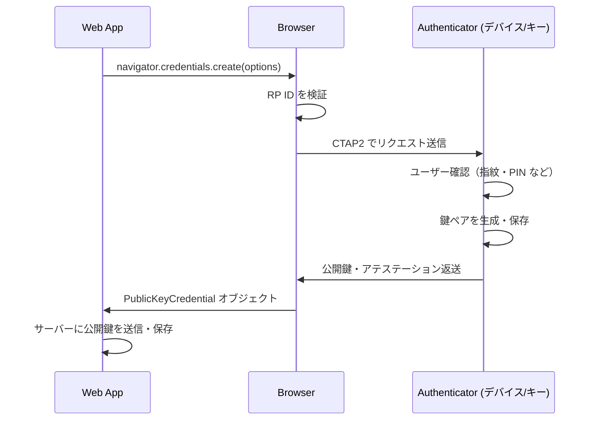

> **Note:** このページはAIエージェントが執筆しています。内容の正確性は一次情報（仕様書・公式資料）とあわせてご確認ください。

# Web Authentication (WebAuthn) Level 3

## 概要

Web Authentication（WebAuthn）は、Web アプリケーションが公開鍵暗号を使った強力な認証を行うための W3C 標準 API です。ユーザーはパスワードを入力するかわりに、デバイスに組み込まれた認証器（スマートフォンの指紋センサー・顔認識、PC の Windows Hello、ハードウェアセキュリティキーなど）を使って認証を行います。

WebAuthn の最大の特徴は **フィッシング耐性**（Phishing Resistance）です。認証器はクレデンシャルを登録時の RP ID（Relying Party Identifier、通常はドメイン名）に紐付けており、偽のサイトにクレデンシャルを提示することを技術的に防止します。これはパスワードでは実現できない性質です。

現在の最新版は **Level 3**（W3C Candidate Recommendation Snapshot、2026年1月13日付）です。

**公式 URL**: [https://www.w3.org/TR/webauthn-3/](https://www.w3.org/TR/webauthn-3/)

---

## 背景と経緯

### パスワードの限界

パスワード認証には構造的な問題があります。ユーザーはパスワードを再利用し、フィッシングで騙され、サーバー側ではハッシュ化されたパスワードが漏洩します。多要素認証（TOTP / SMS OTP）はこれを緩和しますが、フィッシング攻撃には依然として脆弱です（中間者攻撃で OTP を横取りできる）。

### FIDO Alliance と WebAuthn の誕生

FIDO（Fast IDentity Online）Alliance は 2012 年に設立され、U2F（Universal 2nd Factor）と UAF（Universal Authentication Framework）という2つのプロトコルを策定しました。U2F はハードウェアセキュリティキーを使った二要素認証、UAF はパスワードレス認証を実現しましたが、いずれも独自の API が必要でした。

W3C と FIDO Alliance は協力して、U2F / UAF の機能を Web 標準の API として統合した **FIDO2** を策定しました。FIDO2 は以下の2つのコンポーネントから構成されます。

| コンポーネント                             | 策定組織      | 役割                             |
| ------------------------------------------ | ------------- | -------------------------------- |
| WebAuthn                                   | W3C           | ブラウザ API（Web アプリ向け）   |
| CTAP2 (Client to Authenticator Protocol 2) | FIDO Alliance | ブラウザと認証器の通信プロトコル |

### Level の変遷

| バージョン | ステータス                           | 主な追加機能                                                          |
| ---------- | ------------------------------------ | --------------------------------------------------------------------- |
| Level 1    | Recommendation (2019年3月)           | 基本的な登録・認証 API                                                |
| Level 2    | Recommendation (2021年4月)           | 認証器の大規模証明（AAGUID）、BE/BS フラグ（Passkey）、拡張機能の追加 |
| Level 3    | Candidate Recommendation (2026年1月) | Conditional UI、シグナル API、`getClientCapabilities()`               |

### Passkey との関係

**Passkey** は WebAuthn のクレデンシャルのうち、複数デバイス間で同期可能なもの（multi-device credential）の通称です。Apple・Google・Microsoft が 2022 年以降に本格展開し、FIDO Alliance が「Passkey」の用語と仕様を整備しています。技術的には、認証器データ内の **BE フラグ**（Backup Eligible）が立っているクレデンシャルが Passkey に相当します。

---

## 設計思想

### 公開鍵暗号によるゼロ知識証明

WebAuthn では、サーバーに保存するのは **公開鍵のみ** です。認証時に秘密鍵はデバイスの外に出ません。サーバーが侵害されても、攻撃者は公開鍵しか得られないため、それだけでは認証できません。

```
登録:
  デバイス → 公開鍵をサーバーに送信
  サーバー → 公開鍵を保存

認証:
  サーバー → チャレンジ（乱数）を送信
  デバイス → 秘密鍵でチャレンジに署名して返送
  サーバー → 公開鍵で署名を検証
```

### RP ID によるオリジン結束

クレデンシャルは登録時の **RP ID**（通常はドメイン名、例: `example.com`）に暗号的に紐付けられます。認証時、ブラウザは現在のオリジンと RP ID の一致を検証し、不一致の場合はリクエストを拒否します。これにより、`evil-example.com` が `example.com` のクレデンシャルを使うことは技術的に不可能です。

### 認証器とブラウザの分担



---

## 技術詳細

### 登録フロー（Registration Ceremony）

#### 1. サーバーがチャレンジを生成

```javascript
// サーバー側
const challenge = crypto.randomBytes(32); // 暗号論的に安全な乱数
const options = {
  challenge: challenge,
  rp: {
    name: "Example Corp",
    id: "example.com",
  },
  user: {
    id: Buffer.from(userId), // ユーザーの一意ID（メールではない）
    name: "alice@example.com",
    displayName: "Alice",
  },
  pubKeyCredParams: [
    { type: "public-key", alg: -8 }, // EdDSA（推奨）
    { type: "public-key", alg: -7 }, // ES256 (ECDSA w/ SHA-256)
    { type: "public-key", alg: -257 }, // RS256
  ],
  authenticatorSelection: {
    residentKey: "preferred", // discoverable credential を推奨
    userVerification: "preferred", // UV（生体認証・PIN）を推奨
  },
  attestation: "direct", // アテステーション情報を要求
  timeout: 300000,
};
```

#### 2. ブラウザで認証器を呼び出す

```javascript
// クライアント側
const credential = await navigator.credentials.create({
  publicKey: options, // サーバーから受け取ったオプション（Base64url デコード済み）
});

// credential.response は AuthenticatorAttestationResponse
// credential.response.clientDataJSON - チャレンジ・オリジンを含む JSON
// credential.response.attestationObject - CBOR エンコードされた認証器データ
```

#### 3. サーバーが検証する

サーバー側の検証手順（仕様書 Section 7.1）:

1. `clientDataJSON` をパースして `challenge` が送ったものと一致するか確認
2. `origin` が RP の期待するオリジンと一致するか確認
3. `attestationObject` をデコードして `authenticatorData` を取得
4. `rpIdHash`（authenticatorData 先頭32バイト）が `SHA-256("example.com")` と一致するか確認
5. フラグの `UP`（User Present）ビットが立っているか確認
6. ポリシーに応じて `UV`（User Verified）ビットを確認
7. アテステーション署名を検証する
8. 公開鍵と credential ID を保存する

### 認証フロー（Authentication Ceremony）

#### 1. サーバーがチャレンジを生成

```javascript
// サーバー側
const options = {
  challenge: crypto.randomBytes(32),
  rpId: "example.com",
  allowCredentials: [
    // 省略すると discoverable credential（Passkey）モード
    { type: "public-key", id: credentialId },
  ],
  userVerification: "preferred",
  timeout: 300000,
};
```

#### 2. ブラウザで認証

```javascript
// クライアント側
const assertion = await navigator.credentials.get({
  publicKey: options,
});

// assertion.response は AuthenticatorAssertionResponse
// assertion.response.authenticatorData - フラグ・署名カウンターを含む
// assertion.response.clientDataJSON - チャレンジ・オリジンを含む
// assertion.response.signature - 認証器の秘密鍵による署名
// assertion.response.userHandle - ユーザーID（discoverable credential の場合）
```

#### 3. サーバーが検証する

1. `challenge` の一致確認
2. `rpIdHash` の確認
3. `UP` フラグの確認
4. 署名を保存済みの公開鍵で検証
5. `signCount` が保存値より大きいことを確認（リプレイ攻撃防止）

### authenticatorData の構造

認証器が返す `authenticatorData` は次の構造を持つバイナリデータです。

```
[0-31]   rpIdHash (32 bytes) - SHA-256("example.com")
[32]     flags (1 byte)
[33-36]  signCount (4 bytes, big-endian)
[37-...]  attestedCredentialData (登録時のみ)
         ├─ aaguid (16 bytes) - 認証器の種類を示す識別子
         ├─ credentialIdLength (2 bytes)
         ├─ credentialId (可変長)
         └─ credentialPublicKey (COSE 形式)
[...]    extensions (オプション)
```

### フラグバイトの詳細

`flags` バイトの各ビットが認証の状態を示します。

| ビット位置 | フラグ | 意味                                                       |
| ---------- | ------ | ---------------------------------------------------------- |
| 0 (LSB)    | UP     | User Present — ユーザーが物理的に存在することを確認        |
| 1          | —      | 予約済み                                                   |
| 2          | UV     | User Verified — PIN・生体認証でユーザーを確認済み          |
| 3          | BE     | Backup Eligible — 複数デバイスへの同期が可能（Passkey）    |
| 4          | BS     | Backup State — 現在バックアップ/同期されている             |
| 5          | —      | 予約済み                                                   |
| 6          | AT     | Attested Credential Data included — 登録時に公開鍵情報あり |
| 7          | ED     | Extension Data included — 拡張データあり                   |

`BE=1, BS=1` は Passkey が他のデバイスに同期されていることを示します。セキュリティ要件が高いユースケース（金融取引など）では `BE=0`（シングルデバイスクレデンシャル）を要求することでデバイス紐付け認証を実現できます。

### COSE アルゴリズム識別子

WebAuthn では公開鍵のフォーマットに COSE（CBOR Object Signing and Encryption、[RFC 9052](https://www.rfc-editor.org/rfc/rfc9052)）を使用します。

| アルゴリズム              | COSE ID | 推奨度                     |
| ------------------------- | ------- | -------------------------- |
| EdDSA (Ed25519)           | -8      | 推奨（性能・安全性が高い） |
| ES256 (ECDSA w/ SHA-256)  | -7      | 広くサポートされる         |
| RS256 (RSASSA-PKCS1-v1_5) | -257    | 後方互換性のために含める   |

### アテステーション（Attestation）

アテステーションは「この認証器は信頼できるメーカーのものである」ことを証明する仕組みです。7種類のアテステーション形式が定義されています。

| 形式                | 説明                                                                 |
| ------------------- | -------------------------------------------------------------------- |
| `packed`            | FIDO 標準。自己署名または証明書チェーンによる                        |
| `tpm`               | Trusted Platform Module によるハードウェア証明                       |
| `android-key`       | Android ハードウェアキーストアによる証明                             |
| `android-safetynet` | Android SafetyNet API による証明（非推奨。`android-key` に移行済み） |
| `fido-u2f`          | 旧世代 U2F 形式との後方互換                                          |
| `none`              | アテステーションなし（プライバシー優先）                             |
| `apple`             | Apple デバイスのプライバシー保護アテステーション                     |

実装上の注意: アテステーションの要求（`attestation: "direct"`）はユーザーの匿名性を低下させる可能性があります。一般的なサービスでは `attestation: "none"` が推奨されます。FIDO MDS（Metadata Service）を使ってアテステーション証明書を検証する実装も可能ですが、複雑さが増します。

### Level 3 の新機能: シグナル API

WebAuthn Level 3 では、RP が認証器に対してクレデンシャルの状態変化を通知する **シグナル API** が追加されました。

```javascript
// 未知のクレデンシャルを通知（例: ユーザーがアカウント削除後にログイン試行）
await PublicKeyCredential.signalUnknownCredential({
  rpId: "example.com",
  credentialId: "base64url-encoded-credential-id",
});

// 現在有効なクレデンシャル一覧を通知（認証器が古いエントリを削除できる）
await PublicKeyCredential.signalAllAcceptedCredentials({
  rpId: "example.com",
  userId: "base64url-user-id",
  allAcceptedCredentialIds: ["id1", "id2"],
});

// ユーザー情報の更新を通知（Passkey の表示名更新など）
await PublicKeyCredential.signalCurrentUserDetails({
  rpId: "example.com",
  userId: "base64url-user-id",
  name: "alice@example.com",
  displayName: "Alice Smith",
});
```

これにより、Passkey マネージャー（OS のキーチェーンなど）内の古いクレデンシャルが自動クリーンアップされ、ユーザー体験が改善されます。

### Level 3 の新機能: Conditional UI（条件付き表示）

**Conditional Mediation**（条件付き表示、別名 Conditional UI）は Level 3 で導入されたもう一つの主要機能です。ユーザーがフォームのユーザー名入力欄をタップすると、ブラウザが自動的に利用可能な Passkey の一覧を autofill ドロップダウンで表示します。ユーザーは「パスキーでログイン」ボタンを意識せず、通常のフォーム入力の延長でパスキー認証を完了できます。

HTML 側では `autocomplete` 属性に `"webauthn"` を追加します。

```html
<input
  type="text"
  name="username"
  autocomplete="username webauthn"
  placeholder="メールアドレスまたはパスキーでログイン"
/>
```

JavaScript 側では `mediation: "conditional"` を指定して `get()` を呼び出します。

```javascript
// Conditional UI のサポート確認
if (await PublicKeyCredential.isConditionalMediationAvailable?.()) {
  const assertion = await navigator.credentials.get({
    mediation: "conditional",
    publicKey: {
      challenge: serverChallenge,
      rpId: "example.com",
      userVerification: "preferred",
      // allowCredentials は省略（discoverable credential を使用）
    },
  });
  // assertion を通常の WebAuthn 認証と同様にサーバーへ送信
}
```

Conditional UI は現在 Chrome 108+, Safari 16+, Edge 108+ でサポートされています。パスワードからパスキーへの段階的移行を進めるサービスに特に有効です。

### Level 3 の新機能: getClientCapabilities()

`PublicKeyCredential.getClientCapabilities()` はクライアントが対応している WebAuthn 機能の一覧を取得する静的メソッドです。RP はこの情報をもとに UI を分岐させることができます。

```javascript
const caps = await PublicKeyCredential.getClientCapabilities();
// 例:
// {
//   "conditionalCreate": true,
//   "conditionalGet": true,
//   "hybridTransport": true,
//   "passkeyPlatformAuthenticator": true,
//   "userVerifyingPlatformAuthenticator": true,
//   "relatedOrigins": false,
//   "signalAllAcceptedCredentials": true,
//   "signalCurrentUserDetails": true,
//   "signalUnknownCredential": true,
// }

if (caps.passkeyPlatformAuthenticator) {
  // パスキー登録フローを表示
} else {
  // ハードウェアセキュリティキーフローにフォールバック
}
```

#### Related Origins（関連オリジン）

Level 3 で追加されたもう一つの機能が **Related Origins** です。`getClientCapabilities()` の `relatedOrigins` フラグが `true` の環境では、RP は `/.well-known/webauthn` に JSON を配置することで、関連ドメイン間でのクレデンシャル共有を宣言できます。

```json
{
  "origins": ["https://app.example.com", "https://accounts.example.com"]
}
```

これにより `example.com` で登録したクレデンシャルを `app.example.com` からも利用できるようになります。異なるドメインを持つ同一企業のサービス（例: `shop.example.com` と `id.example.com`）で Passkey を統一管理する際に有効です。ただし、許可するオリジンは同一エンティティが管理するドメインに限定し、広範な許可設定はフィッシングリスクを高める点に注意が必要です。

---

## 実装上の注意点

### チャレンジは必ず新鮮なランダム値を使う

チャレンジは登録・認証ごとに暗号論的に安全なランダム値（最低 16 バイト）を生成してください。予測可能な値やインクリメンタルな値は使わないでください。チャレンジを使い捨てにしないとリプレイ攻撃が成立します。

### signCount の検証

`signCount` は認証のたびに増加する署名カウンターです。サーバーが保存している値より小さいまたは同じ値が返ってきた場合、クレデンシャルの複製（クローン）が疑われます。ただし Passkey（multi-device credential）は同期の都合上 `signCount=0` を返すことがあります（仕様書 Section 7.2 step 17）。BE フラグと合わせて判断してください。

### origin と rpId の整合性

`rpId` はブラウザが呼び出された `origin` のドメインまたはそのサフィックスでなければなりません。`example.com` の `rpId` は `login.example.com` から呼び出すことができますが、`evil.com` からは呼び出せません。

### userHandle の適切な設計

`user.id` は人間が読める値（メールアドレスなど）を使わないでください。ランダムなバイト列を使い、PII を含めないことを推奨します。`user.id` は後からの変更が難しく、認証器内に保存されます。

### UV フラグの要件を明確にする

高セキュリティな操作（送金・設定変更など）では `userVerification: "required"` を使って `UV` フラグを必須にしてください。`userVerification: "preferred"`（デフォルト）では UV のない認証も受け入れます。

### Passkey（multi-device credential）の扱い

BE フラグが立っているクレデンシャル（Passkey）は複数デバイスに同期されます。

- **セキュリティリスク**: 同期先デバイスが侵害されると全デバイスで不正利用が可能
- **利便性**: デバイス紛失時もアカウントにアクセス可能
- **推奨**: 一般ユーザー向けサービスでは Passkey を主認証として採用し、アカウント回復フローを整備する

シングルデバイスに限定する（`BE=0` を要求する）ことも可能ですが、現時点では WebAuthn API から直接制御する方法はなく、サーバー側の検証で BE フラグを確認することになります。

---

## 実装ライブラリ

WebAuthn の実装は複雑なため、実績あるライブラリを活用することを強く推奨します。

| 言語       | ライブラリ                                                           | 特徴                                 |
| ---------- | -------------------------------------------------------------------- | ------------------------------------ |
| JavaScript | [SimpleWebAuthn](https://github.com/MasterKale/SimpleWebAuthn)       | クライアント・サーバー両対応。型安全 |
| Python     | [py_webauthn](https://github.com/duo-labs/py_webauthn)               | Duo Labs 製。シンプルな API          |
| Java       | [webauthn4j](https://github.com/webauthn4j/webauthn4j)               | Spring Boot 統合あり                 |
| Go         | [go-webauthn](https://github.com/go-webauthn/webauthn)               | 標準的な Go ライブラリ               |
| Ruby       | [webauthn-ruby](https://github.com/cedarcode/webauthn-ruby)          | Rails との相性が良い                 |
| PHP        | [webauthn-framework](https://github.com/web-auth/webauthn-framework) | Symfony 対応                         |
| Rust       | [webauthn-rs](https://github.com/kanidm/webauthn-rs)                 | 厳密な型システムで安全性が高い       |

FIDO Alliance の開発者向けポータル [passkeys.dev](https://passkeys.dev) では、デバイスサポートマトリクス・実装ガイド・UX ガイドラインが公開されています。

---

## 採用事例

- **Google**: Chrome と Android の Passkey ネイティブサポート。Google アカウントログインで Passkey 対応済み
- **Apple**: Safari と iOS/macOS のキーチェーンによる Passkey 同期（iCloud Keychain）
- **Microsoft**: Windows Hello および Microsoft Authenticator による Passkey サポート
- **1Password / Dashlane**: サードパーティ Passkey マネージャーとして CTAP2 経由でサポート
- **GitHub**: 2023年よりパスキーによるログインをサポート
- **Yahoo! JAPAN**: 国内主要サービスで早期に Passkey を本番導入
- **NTT ドコモ・楽天**: FIDO2 ベースの認証をモバイルアプリで採用

---

## 関連仕様・後継仕様

### 依存する仕様

| 仕様                                                                                                                      | 役割                            |
| ------------------------------------------------------------------------------------------------------------------------- | ------------------------------- |
| [CTAP2](https://fidoalliance.org/specs/fido-v2.2-rd-20230321/fido-client-to-authenticator-protocol-v2.2-rd-20230321.html) | ブラウザ‐認証器間通信プロトコル |
| [RFC 9052](https://www.rfc-editor.org/rfc/rfc9052) COSE                                                                   | 公開鍵・署名のフォーマット      |
| [RFC 8949](https://www.rfc-editor.org/rfc/rfc8949) CBOR                                                                   | バイナリデータのシリアライズ    |
| [Credential Management API](https://www.w3.org/TR/credential-management-1/)                                               | WebAuthn の基底 API             |

### FIDO Alliance 関連仕様

| 仕様                                                              | 概要                               |
| ----------------------------------------------------------------- | ---------------------------------- |
| [FIDO2 Overview](https://fidoalliance.org/fido2/)                 | FIDO2 エコシステム全体の概要       |
| [Passkey 仕様](https://fidoalliance.org/passkeys/)                | マルチデバイスクレデンシャルの定義 |
| [FIDO MDS (Metadata Service)](https://fidoalliance.org/metadata/) | 認証器のメタデータ・証明書管理     |

---

## 参考資料

- [Web Authentication Level 3 — W3C Candidate Recommendation (2026-01-13)](https://www.w3.org/TR/webauthn-3/)
- [FIDO Alliance — FIDO2 Specifications](https://fidoalliance.org/specifications/)
- [FIDO Alliance — Passkey Overview](https://fidoalliance.org/passkeys/)
- [W3C WebAuthn Level 2 — Recommendation (2021-04-08)](https://www.w3.org/TR/webauthn-2/)
- [RFC 9052 — CBOR Object Signing and Encryption (COSE)](https://www.rfc-editor.org/rfc/rfc9052)
- [passkeys.dev — FIDO Alliance 開発者向けポータル](https://passkeys.dev)
- [WebAuthn Guide (webauthn.guide)](https://webauthn.guide)
