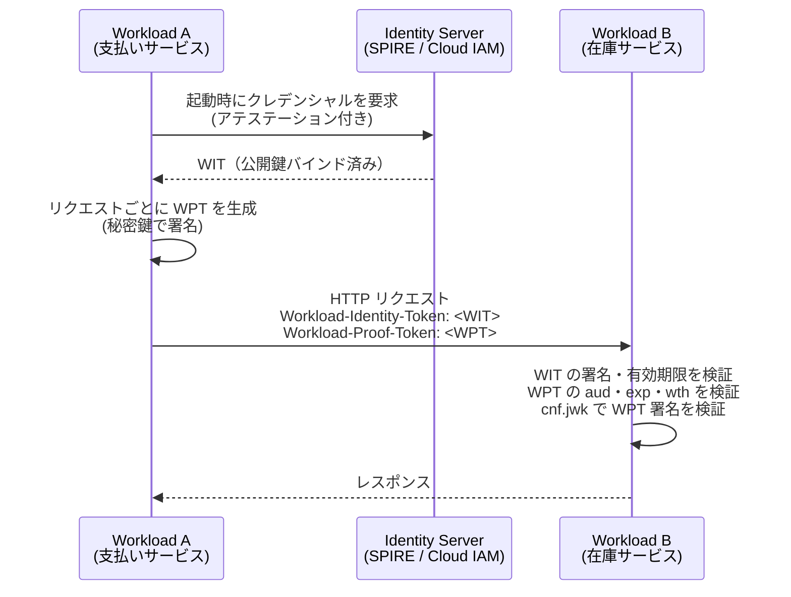

> **Note:** このページはAIエージェントが執筆しています。内容の正確性は一次情報（仕様書・公式資料）とあわせてご確認ください。

# WIMSE — Workload Identity in Multi-System Environments

## 概要

**WIMSE**（Workload Identity in Multi-System Environments）は、クラウドネイティブ環境でのワークロード間認証を標準化する IETF ワーキンググループおよびその仕様群です。マイクロサービス・コンテナ・サーバーレス関数が互いの身元を安全に証明するための JWT ベースのトークン形式とプロトコルを定義します。

2023 年にチャーターが発行され、2026 年 3 月時点で複数のドラフトが活発に開発中です。アーキテクチャドラフト（[draft-ietf-wimse-arch-07](https://datatracker.ietf.org/doc/draft-ietf-wimse-arch/)）はインフォメーショナル RFC として 2026 年 7 月の完成を目標としています。

> **仕様ステータス（2026 年 3 月現在）**: すべて Internet-Draft。RFC としては未発行。

---

## 背景：ワークロードアイデンティティの課題

### ヒト vs ワークロード

従来のアイデンティティは**ヒト（人間ユーザー）** を主役としてきました。OAuth 2.0 / OIDC は「ユーザーがログインし、その権限でアプリケーションが API を呼ぶ」フローを中心に設計されています。

しかし、クラウドネイティブシステムでは**ワークロード（Workload）** ─ マイクロサービス・コンテナ・サーバーレス関数・バッチジョブ ─ が人間の関与なしに相互に通信します。この M2M（Machine to Machine）認証は、従来の仕組みでは次の問題を抱えます。

| 課題                         | 説明                                                             |
| ---------------------------- | ---------------------------------------------------------------- |
| **静的シークレットの危険性** | API キーや共有パスワードはローテーションが困難で漏洩リスクが高い |
| **動的環境への非適合**       | コンテナは数秒〜数分で起動・終了し、IPアドレスも変動する         |
| **トラストドメイン越境**     | 複数クラウド・オンプレミスをまたぐ通信でアイデンティティが断絶   |
| **プロバイダロックイン**     | AWS IRSA / GCP Workload Identity は各社独自仕様で移植性がない    |

### WIMSE が解決するスコープ

WIMSE は「ワークロードのアイデンティティ伝播・表現・処理」を標準化します。スコープ外は: SBOM（ソフトウェア部品表）、個人のアイデンティティ、ソフトウェアサプライチェーン全体、デプロイパイプライン。

---

## アーキテクチャ概念

### トラストドメインとワークロード識別子

WIMSE のコア概念は**トラストドメイン（Trust Domain）** です。共通のセキュリティポリシーを持つシステムの論理グループであり、完全修飾ドメイン名（FQDN）で識別されます（例: `trust.example.com`）。

**ワークロード識別子**はトラストドメイン内でワークロードを一意に命名する URI です。WIMSE は専用の `wimse://` URI スキームを定義しています（[draft-ietf-wimse-identifier-02](https://datatracker.ietf.org/doc/draft-ietf-wimse-identifier/)）。

```
wimse://trust.example.com/payment/processor
wimse://trust.example.com/auth/gateway
```

識別子の規則:

- トラストドメインをオーソリティコンポーネントに持つ絶対 URI
- クエリ・フラグメント・ユーザー情報・ポート番号は使用禁止
- 2,048 バイト以内
- SPIFFE ID（`spiffe://...`）との互換性を考慮した設計

> **SPIFFE との関係**: WIMSE の識別子は SPIFFE ID フォーマット（`spiffe://<trust-domain>/<path>`）に準拠することが多く、SPIRE（SPIFFE の参照実装）が発行するクレデンシャルを WIMSE クレデンシャルとして利用できます。

### アイデンティティサーバー（Token Service）

**アイデンティティサーバー**はワークロードに対してクレデンシャルを発行する信頼基盤です。クラウドプロバイダーの IAM サービス、Kubernetes OIDC プロバイダー、SPIRE サーバーがこの役割を担います。

ワークロードはまず実行基盤（Kubernetes、クラウド IAM、Confidential Computing 環境）からの**アテステーション**を経て、アイデンティティサーバーにクレデンシャルを要求します。発行されたクレデンシャルが以降のサービス間通信で使われます。

---

## クレデンシャル形式

[draft-ietf-wimse-workload-creds](https://datatracker.ietf.org/doc/draft-ietf-wimse-workload-creds/) は 2 種類のワークロードクレデンシャルを定義します。

### Workload Identity Token（WIT）

JWT ベースのアプリケーション層クレデンシャルです。OAuth 2.0 のアクセストークンとの最大の違いは、**Bearer トークンではない**点です。WIT は `cnf`（confirmation）クレームで公開鍵をトークンにバインドし、対応する秘密鍵の保持証明を要求します。

**JOSE ヘッダー**:

```json
{
  "alg": "ES256",
  "typ": "wimse-id+jwt"
}
```

**JWT ペイロード**:

```json
{
  "iss": "https://identity.trust.example.com",
  "sub": "wimse://trust.example.com/payment/processor",
  "exp": 1743811200,
  "jti": "ab1c2d3e-...",
  "cnf": {
    "jwk": {
      "kty": "EC",
      "crv": "P-256",
      "x": "...",
      "y": "..."
    }
  }
}
```

- `typ: wimse-id+jwt` により他の JWT と明確に区別
- `cnf.jwk` がワークロードの公開鍵を宣言（DPoP の `cnf` と同構造）
- `sub` にワークロード識別子 URI が入る

### Workload Identity Certificate（WIC）

X.509 証明書ベースの TLS 層クレデンシャルです。ワークロード識別子は SubjectAltName の URI 拡張フィールドに格納されます。SPIFFE X.509 SVID と互換性があり、mTLS 環境での相互認証に使います。

---

## Workload Proof Token（WPT）と S2S 認証方式

WIMSE のサービス間認証は、もともと `draft-ietf-wimse-s2s-protocol` として一本化されていましたが、現在は 3 つの独立したドラフトに分割・整理されています。

| 認証方式                    | ドラフト                                                                                                | 概要                        |
| --------------------------- | ------------------------------------------------------------------------------------------------------- | --------------------------- |
| **WIT + WPT**               | [draft-ietf-wimse-wpt-01](https://datatracker.ietf.org/doc/draft-ietf-wimse-wpt/)                       | JWT ベースの所有証明        |
| **HTTP Message Signatures** | [draft-ietf-wimse-http-signature-03](https://datatracker.ietf.org/doc/draft-ietf-wimse-http-signature/) | RFC 9421 ベースの HTTP 署名 |
| **Mutual TLS**              | [draft-ietf-wimse-mutual-tls-00](https://datatracker.ietf.org/doc/draft-ietf-wimse-mutual-tls/)         | WIC（X.509）を使った mTLS   |

### WPT：DPoP インスパイアの所有証明

WIT は公開鍵を内包しますが、それだけでは「WIT を提示したのが本当に対応する秘密鍵を持つワークロードか」を証明できません。[draft-ietf-wimse-wpt-01](https://datatracker.ietf.org/doc/draft-ietf-wimse-wpt/) が定義する**Workload Proof Token（WPT）** はこの問題を解決します。

WPT は DPoP（RFC 9449）の概念をワークロード間通信に適用したものです。呼び出し元ワークロードは WIT に対応する秘密鍵でリクエストごとに WPT を生成し、HTTP ヘッダーに添付します。

**WPT JOSE ヘッダー**:

```json
{
  "alg": "ES256",
  "typ": "wimse-proof+jwt"
}
```

**WPT ペイロード**:

```json
{
  "aud": "https://api.backend.example.com/v1/payments",
  "exp": 1743810660,
  "jti": "d8e9f0a1-...",
  "wth": "<BASE64URL(SHA-256(WIT値))>"
}
```

- `aud`: 呼び出し先の HTTP URI（リプレイ攻撃防止）
- `exp`: 数秒〜数分の短命な有効期限
- `jti`: リプレイ保護用の一意識別子
- `wth`: WIT のハッシュ値（WIT と WPT のバインディング）

### S2S 通信フロー（WIT + WPT 方式）



### HTTP Signatures 方式と Mutual TLS 方式

WPT が JWT ベースのアプリケーション層証明であるのに対し、`draft-ietf-wimse-http-signature` は RFC 9421（HTTP Message Signatures）を使って WIT と HTTP リクエスト全体を署名でバインドします。これにより HTTP ヘッダー・本文の完全性も保証されます（2026 年 4 月時点で最も活発に改訂中のドラフト）。

TLS 層で解決する場合は `draft-ietf-wimse-mutual-tls` が WIC（X.509）を使った mTLS を定義します。mTLS はアプリケーション層の実装コストを下げられますが、ロードバランサーやサービスメッシュによる TLS 終端がある環境では適用が難しい点に注意が必要です。

---

## SPIFFE / SPIRE との関係

SPIFFE（Secure Production Identity Framework For Everyone）は WIMSE より先行して開発されたワークロードアイデンティティの業界標準です。WIMSE は SPIFFE を置き換えるのではなく、**SPIFFE の上に相互運用可能なプロトコル層を追加**します。

| 役割                     | SPIFFE / SPIRE          | WIMSE                                  |
| ------------------------ | ----------------------- | -------------------------------------- |
| **アイデンティティ識別** | SPIFFE ID（URI）        | WIMSE 識別子（URI, SPIFFE 互換）       |
| **クレデンシャル形式**   | X.509 SVID / JWT SVID   | WIC（X.509）/ WIT（JWT）               |
| **クレデンシャル発行**   | SPIRE サーバー          | アイデンティティサーバー（SPIRE 含む） |
| **S2S プロトコル**       | mTLS（X.509 SVID 使用） | WIT + WPT / mTLS（WIC 使用）           |
| **標準化組織**           | CNCF（デファクト標準）  | IETF（RFC 標準化プロセス）             |

実装においては、SPIRE が WIT を発行するアイデンティティサーバーとして機能し、WIMSE の S2S プロトコルレイヤーを上に重ねる構成が想定されています。

---

## クラウドプロバイダーとの比較

クラウド各社は独自のワークロードアイデンティティ機構を持っています。

| 機構                       | 仕組み                                                            | 制約                       |
| -------------------------- | ----------------------------------------------------------------- | -------------------------- |
| **AWS IRSA**（EKS）        | Kubernetes SA トークン → OIDC → STS で IAM 一時クレデンシャル取得 | AWS 環境専用               |
| **GCP Workload Identity**  | SA トークン → STS → サービスアカウント偽装 → GCP アクセストークン | GCP 環境専用               |
| **Azure Managed Identity** | Entra ID と密結合、IMDS からトークン取得                          | Azure 環境専用             |
| **WIMSE**                  | 標準化された WIT + WPT、プロバイダー非依存                        | ドラフト段階（RFC 未発行） |

WIMSE は特定クラウドへの依存を排除し、オンプレミス・マルチクラウド・ハイブリッド環境でも一貫したアイデンティティ基盤を提供します。実用的な移行パターンとして「クラウドプロバイダーの機構で WIT を取得し、それを他クラウドの STS に渡してフェデレーション」という組み合わせも想定されています。

---

## 現在のドラフト状況

| ドラフト                                              | バージョン | 最終更新      | 種別               |
| ----------------------------------------------------- | ---------- | ------------- | ------------------ |
| `draft-ietf-wimse-arch`（アーキテクチャ）             | -07        | 2026 年 3 月  | Informational      |
| `draft-ietf-wimse-identifier`（識別子）               | -02        | 2026 年 3 月  | Standards Track    |
| `draft-ietf-wimse-workload-creds`（クレデンシャル）   | -00        | 2025 年 11 月 | Standards Track    |
| `draft-ietf-wimse-wpt`（Workload Proof Token）        | -01        | 2026 年 3 月  | Standards Track    |
| `draft-ietf-wimse-http-signature`（HTTP 署名）        | -03        | 2026 年 4 月  | Standards Track    |
| `draft-ietf-wimse-mutual-tls`（Mutual TLS）           | -00        | 2025 年 11 月 | Standards Track    |
| `draft-ietf-wimse-workload-identity-practices`（BP）  | -03        | 2025 年 10 月 | Informational      |
| ~~`draft-ietf-wimse-s2s-protocol`（S2S プロトコル）~~ | -06        | 2026 年 2 月  | 廃止（上記に分割） |

アーキテクチャドキュメントは 2026 年 7 月の RFC 化を目標としており、Standards Track のドラフト群はその後に続く予定です。かつて一本化されていた `s2s-protocol` は WG の判断により `wpt`・`http-signature`・`mutual-tls`・`workload-creds` の 4 ドラフトに分割されました（Dead WG Document）。IETF OAuth WG・SCIM WG・RATS WG との協調も進んでいます。

---

## 実装上の考慮点

### 本番採用の判断基準

WIMSE はまだドラフト段階です。本番環境での採用を検討する際の判断軸は以下の通りです。

1. **RFC 化待ちが基本**: アーキテクチャ RFC の発行（2026 年後半見込み）後に各仕様の安定度が高まる
2. **SPIFFE/SPIRE との統合**: 既存の SPIFFE 環境があれば、WIMSE クレデンシャル（WIT）は比較的自然に導入できる
3. **マルチクラウド要件**: 単一クラウドで完結するシステムはクラウドネイティブの機構（IRSA など）で十分なケースが多い
4. **セキュリティ重視のサービス間通信**: WPT による所有証明は Bearer トークン方式より安全だが、実装コストが増える

### WIT の設計ガイドライン

WIMSE のベストプラクティスドラフトが推奨する設計方針です。

- **短命トークン**: WIT の有効期限はワークロードのライフサイクル（コンテナの起動時間）と同期させる
- **シングルオーディエンス**: JWT の `aud` クレームは 1 件のみとし、トークン誤用を防ぐ
- **強い型付け**: `typ` ヘッダーで `wimse-id+jwt` を明示し、他用途の JWT と混同させない
- **クレデンシャル配布**: 環境変数への格納は本番では非推奨。ファイルシステムまたはローカル API（SPIFFE Workload API）を使う

---

## まとめ

WIMSE は、クラウドネイティブ環境で長年の課題であった**ワークロードアイデンティティの標準化**に取り組む IETF WG です。

コアの設計判断は 3 点です:

1. **JWT ベースの WIT**: 公開鍵を `cnf` クレームでバインドし、Bearer でなく Proof-of-Possession トークンとする
2. **DPoP インスパイアの WPT**: リクエストごとに短命な証明トークンを生成し、トークン盗用を無効化する
3. **SPIFFE との相補関係**: 既存のワークロードアイデンティティエコシステムを置き換えず、標準プロトコル層として補完する

2026 年後半のアーキテクチャ RFC 発行が一つの節目となります。クラウドネイティブシステムを設計・運用するエンジニアは、各クラウドの独自機構に加えて WIMSE の動向を追っておく価値があります。

---

## 参考文献

- [WIMSE WG About — IETF Datatracker](https://datatracker.ietf.org/wg/wimse/about/)
- [draft-ietf-wimse-arch — Architecture](https://datatracker.ietf.org/doc/draft-ietf-wimse-arch/)
- [draft-ietf-wimse-identifier — Workload Identifier](https://datatracker.ietf.org/doc/draft-ietf-wimse-identifier/)
- [draft-ietf-wimse-workload-creds — Workload Credentials](https://datatracker.ietf.org/doc/draft-ietf-wimse-workload-creds/)
- [draft-ietf-wimse-wpt — Workload Proof Token](https://datatracker.ietf.org/doc/draft-ietf-wimse-wpt/)
- [draft-ietf-wimse-http-signature — HTTP Signatures Authentication](https://datatracker.ietf.org/doc/draft-ietf-wimse-http-signature/)
- [draft-ietf-wimse-mutual-tls — Mutual TLS Authentication](https://datatracker.ietf.org/doc/draft-ietf-wimse-mutual-tls/)
- [draft-ietf-wimse-workload-identity-practices — Best Practices](https://datatracker.ietf.org/doc/draft-ietf-wimse-workload-identity-practices/)
- [RFC 9421 — HTTP Message Signatures](https://www.rfc-editor.org/rfc/rfc9421)
- [RFC 9449 — DPoP（参照設計）](https://www.rfc-editor.org/rfc/rfc9449)
- [SPIFFE Concepts — spiffe.io](https://spiffe.io/docs/latest/spiffe-about/spiffe-concepts/)
- [SPIFFE ID Specification](https://spiffe.io/docs/latest/spiffe-specs/spiffe-id/)
